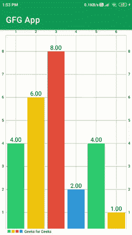

# 如何在安卓中创建条形图？

> 原文:[https://www . geeksforgeeks . org/如何在安卓中创建条形图/](https://www.geeksforgeeks.org/how-to-create-a-barchart-in-android/)

如果您正在寻找一个用户界面组件来以易于阅读的格式表示大量数据，那么您可以考虑以条形图或条形图的形式显示这些大量数据。借助条形图，可以轻松分析和读取数据。在本文中，我们将看一下条形图在 Android 中的实现。

### 我们将在本文中构建什么？

我们将构建一个简单的应用程序，其中我们将显示一个带有一些样本数据的条形图。下面给出了一个 GIF 示例，来了解一下我们将在本文中做什么。注意，我们将使用 **Java** 语言来实现这个项目。



### **条形图的重要属性**

<figure class="table">

| 

属性

 | 

描述

 |
| --- | --- |
| 设置数据 | 在我们的条形图中设置条形图数据。 |
| 设置颜色 | 为我们的条形图设置颜色。 |
| setValueTextColor | 设置条形图中文本的颜色。 |
| setValueTextSize | 为我们的值设置文本大小 |
| getDescription | 获取我们条形图的描述。 |

</figure>

### **分步实施**

**第一步:创建新项目**

要在安卓工作室创建新项目，请参考[如何在安卓工作室创建/启动新项目](https://www.geeksforgeeks.org/android-how-to-create-start-a-new-project-in-android-studio/)。注意选择 **Java** 作为编程语言。

**第二步:添加依赖和 JitPack 存储库**

导航到**渐变脚本>构建.渐变(模块:应用)**，并在依赖项部分添加以下依赖项。

> 实现' com . github . philjay:MPAndroidChart:v 3 . 1 . 0 '

将 JitPack 存储库添加到构建文件中。将其添加到 allprojects{ }部分内存储库末尾的 root build.gradle 中。

> *所有项目{*
> 
> *存储库{*
> 
> *……*
> 
> *maven { URL " https://jitpack . io " }*
> 
> *}*
> 
> *}*

添加这个依赖项后，同步您的项目，现在我们将开始实现它。

**步骤 3:使用 activity_main.xml 文件**

导航到**应用程序> res >布局> activity_main.xml** 并将下面的代码添加到该文件中。下面是 **activity_main.xml** 文件的代码。

## 可扩展标记语言

```java
<?xml version="1.0" encoding="utf-8"?>
<RelativeLayout 
    xmlns:android="http://schemas.android.com/apk/res/android"
    xmlns:tools="http://schemas.android.com/tools"
    android:layout_width="match_parent"
    android:layout_height="match_parent"
    tools:context=".MainActivity">

    <!--Ui component for our bar chart-->
    <com.github.mikephil.charting.charts.BarChart
        android:id="@+id/idBarChart"
        android:layout_width="match_parent"
        android:layout_height="match_parent" />

</RelativeLayout>
```

**第四步:使用****MainActivity.java 文件**

转到**MainActivity.java**文件，参考以下代码。以下是**MainActivity.java**文件的代码。代码中添加了注释，以更详细地理解代码。

## Java 语言(一种计算机语言，尤用于创建网站)

```java
import android.graphics.Color;
import android.os.Bundle;

import androidx.appcompat.app.AppCompatActivity;

import com.github.mikephil.charting.charts.BarChart;
import com.github.mikephil.charting.data.BarData;
import com.github.mikephil.charting.data.BarDataSet;
import com.github.mikephil.charting.data.BarEntry;
import com.github.mikephil.charting.utils.ColorTemplate;

import java.util.ArrayList;

public class MainActivity extends AppCompatActivity {

    // variable for our bar chart
    BarChart barChart;

    // variable for our bar data.
    BarData barData;

    // variable for our bar data set.
    BarDataSet barDataSet;

    // array list for storing entries.
    ArrayList barEntriesArrayList;

    @Override
    protected void onCreate(Bundle savedInstanceState) {
        super.onCreate(savedInstanceState);
        setContentView(R.layout.activity_main);

        // initializing variable for bar chart.
        barChart = findViewById(R.id.idBarChart);

        // calling method to get bar entries.
        getBarEntries();

        // creating a new bar data set.
        barDataSet = new BarDataSet(barEntriesArrayList, "Geeks for Geeks");

        // creating a new bar data and 
        // passing our bar data set.
        barData = new BarData(barDataSet);

        // below line is to set data 
        // to our bar chart.
        barChart.setData(barData);

        // adding color to our bar data set.
        barDataSet.setColors(ColorTemplate.MATERIAL_COLORS);

        // setting text color.
        barDataSet.setValueTextColor(Color.BLACK);

        // setting text size
        barDataSet.setValueTextSize(16f);
        barChart.getDescription().setEnabled(false);
    }

    private void getBarEntries() {
        // creating a new array list
        barEntriesArrayList = new ArrayList<>();

        // adding new entry to our array list with bar 
        // entry and passing x and y axis value to it.
        barEntriesArrayList.add(new BarEntry(1f, 4));
        barEntriesArrayList.add(new BarEntry(2f, 6));
        barEntriesArrayList.add(new BarEntry(3f, 8));
        barEntriesArrayList.add(new BarEntry(4f, 2));
        barEntriesArrayList.add(new BarEntry(5f, 4));
        barEntriesArrayList.add(new BarEntry(6f, 1));
    }
}
```

现在运行您的应用程序，并查看应用程序的输出。

### **输出:**

<video class="wp-video-shortcode" id="video-550631-1" width="640" height="360" preload="metadata" controls=""><source type="video/mp4" src="https://media.geeksforgeeks.org/wp-content/uploads/20210124140406/Screenrecorder-2021-01-24-13-53-04-722.mp4?_=1">[https://media.geeksforgeeks.org/wp-content/uploads/20210124140406/Screenrecorder-2021-01-24-13-53-04-722.mp4](https://media.geeksforgeeks.org/wp-content/uploads/20210124140406/Screenrecorder-2021-01-24-13-53-04-722.mp4)</video>