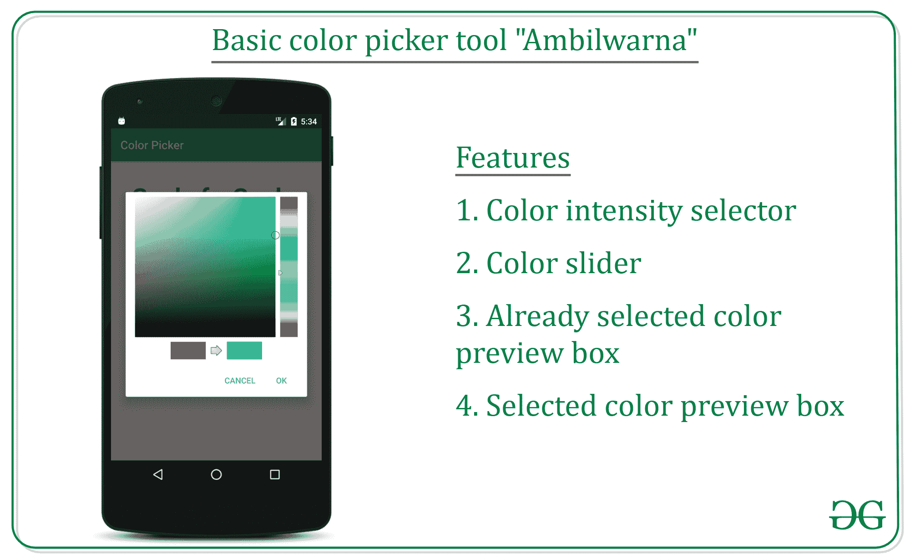
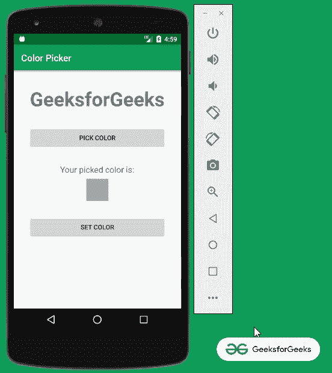
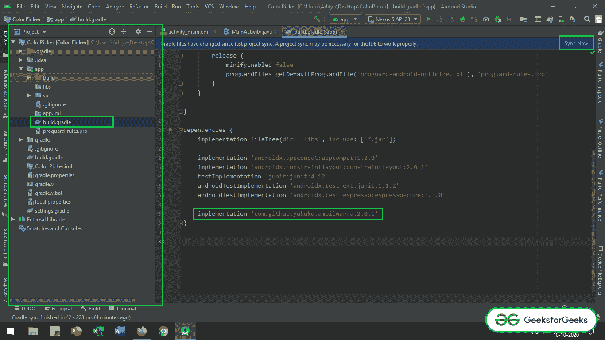
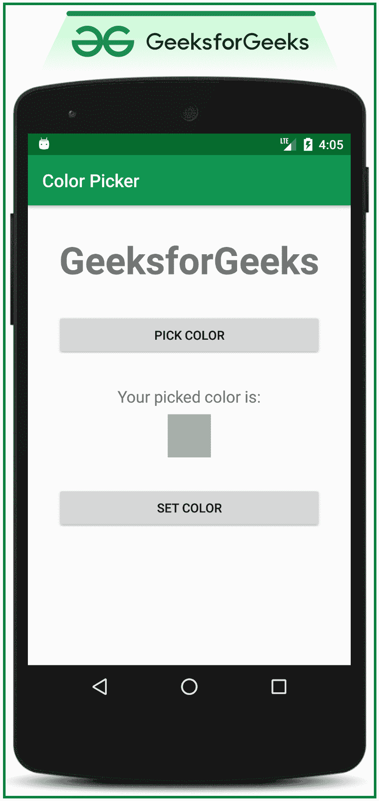
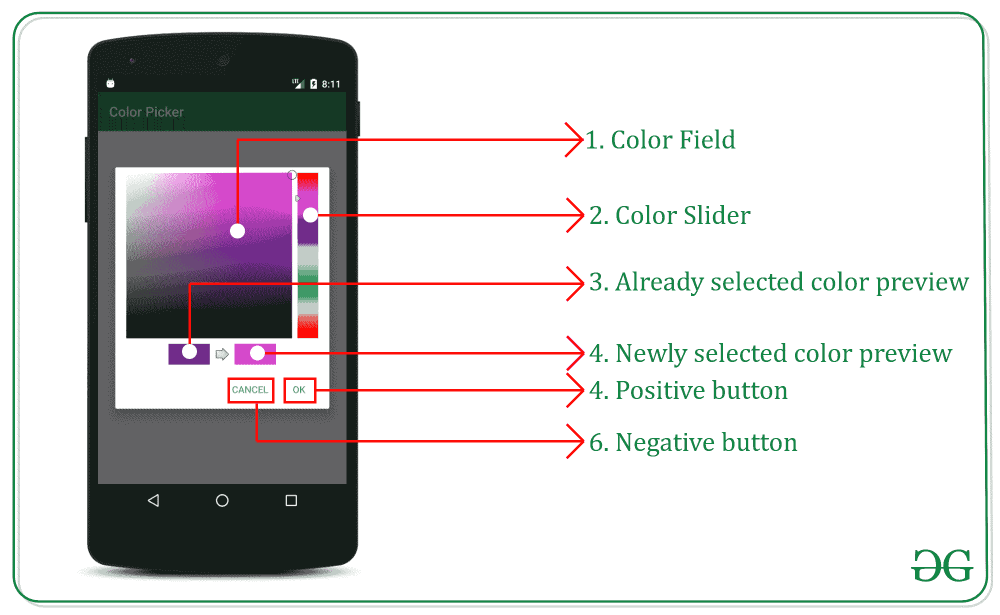

# 如何在安卓中创建一个基本的拾色器工具？

> 原文:[https://www . geeksforgeeks . org/如何创建基本颜色选择器-安卓工具/](https://www.geeksforgeeks.org/how-to-create-a-basic-color-picker-tool-in-android/)

安卓应用程序有很多开源的颜色选择器工具可供选择。在这篇讨论中，在本文的最后，我们将能够在 android 应用程序中实现拾色器工具，请看下面的图片以获得讨论的概述。在本文中，我们讨论了如何实现最基本的颜色选择器工具。



下面给出一个 GIF 示例，来了解一下在本文 中我们要做什么。 注意，我们要用 **Java** 语言实现这个项目。



### **实施** C **或**拾色器工具的步骤

**第一步:创建新项目**

*   要在安卓工作室创建新项目，请参考[如何在安卓工作室创建/启动新项目](https://www.geeksforgeeks.org/android-how-to-create-start-a-new-project-in-android-studio/)。
*   注意选择 **Java** 作为编程语言。

**第二步:添加 AmbilWarna 颜色选择器库依赖项**

*   AmbilWarna 是一个开源的颜色选择器库，可以在这里找到。它只有一个版本，这是最后的版本之一。
*   现在将其依赖关系添加到[应用级渐变](https://www.geeksforgeeks.org/android-build-gradle/)文件中。

> 实现' com . github . yukuku:ambilwarna:2 . 0 . 1 '

*   确保系统应连接到网络(以便下载所需的文件)，并在调用依赖关系后单击“**立即同步**”按钮。
*   请参考下图，找到应用程序级别的渐变文件并调用依赖关系。



**步骤 3:使用 actvity _ main.xml 文件**

*   接下来进入 **activity_main.xml 文件** ，代表项目的 UI。
*   下面是**activity _ main . XML**文件的代码。代码中添加了注释，以更详细地理解代码。

## 可扩展标记语言

```java
<?xml version="1.0" encoding="utf-8"?>
<LinearLayout 
    xmlns:android="http://schemas.android.com/apk/res/android"
    xmlns:tools="http://schemas.android.com/tools"
    android:layout_width="match_parent"
    android:layout_height="match_parent"
    android:orientation="vertical"
    tools:context=".MainActivity"
    tools:ignore="HardcodedText">

    <!--Give all widgets, the proper id to handle
         them in MainActivity.java-->

    <!--GeeksforGeeks Text-->
    <TextView
        android:id="@+id/gfg_heading"
        android:layout_width="wrap_content"
        android:layout_height="wrap_content"
        android:layout_gravity="center"
        android:layout_marginTop="32dp"
        android:text="GeeksforGeeks"
        android:textSize="42sp"
        android:textStyle="bold" />

    <!--Pick color Button-->
    <Button
        android:id="@+id/pick_color_button"
        android:layout_width="match_parent"
        android:layout_height="wrap_content"
        android:layout_gravity="center"
        android:layout_marginTop="32dp"
        android:layout_marginStart="32dp"
        android:layout_marginEnd="32dp"
        android:text="Pick Color" />

    <TextView
        android:layout_width="wrap_content"
        android:layout_height="wrap_content"
        android:layout_gravity="center"
        android:layout_marginTop="32dp"
        android:textSize="18sp"
        android:text="Your picked color is:" />

    <!--sample view to preview selected color by user-->
    <!--by default this has been set to darker gery-->
    <!--this can be overridden after user chose the
         color from color picker-->
    <!--which has been handled in the MainActivity.java-->
    <View
        android:id="@+id/preview_selected_color"
        android:layout_width="48dp"
        android:layout_height="48dp"
        android:layout_gravity="center"
        android:background="@android:color/darker_gray"
        android:layout_marginTop="8dp" />

    <!--set color button to overwrite the 
        color for GeeksforGeeks text-->
    <Button
        android:id="@+id/set_color_button"
        android:layout_width="match_parent"
        android:layout_height="wrap_content"
        android:layout_gravity="center"
        android:layout_marginTop="32dp"
        android:layout_marginStart="32dp"
        android:layout_marginEnd="32dp"
        android:text="Set Color" />

</LinearLayout>
```

**输出 UI:**



在开始处理颜色选择器工具对话框功能之前，理解对话框的各个部分是必要的，这样在用 java 代码处理对话框的各个部分时会变得更容易。



**步骤 4:使用 MainActivity.java 文件**

*   最后，转到**文件，参考以下代码。**
*   **下面是**文件的代码。代码中添加了注释，以更详细地理解代码。****

## ****Java 语言(一种计算机语言，尤用于创建网站)****

```java
**import android.os.Bundle;
import android.view.View;
import android.widget.Button;
import android.widget.TextView;
import androidx.appcompat.app.AppCompatActivity;
import yuku.ambilwarna.AmbilWarnaDialog;

public class MainActivity extends AppCompatActivity {

    // text view variable to set the color for GFG text
    private TextView gfgTextView;

    // two buttons to open color picker dialog and one to
    // set the color for GFG text
    private Button mSetColorButton, mPickColorButton;

    // view box to preview the selected color
    private View mColorPreview;

    // this is the default color of the preview box
    private int mDefaultColor;

    @Override
    protected void onCreate(Bundle savedInstanceState) {
        super.onCreate(savedInstanceState);
        setContentView(R.layout.activity_main);

        // register the GFG text with appropriate ID
        gfgTextView = findViewById(R.id.gfg_heading);

        // register two of the buttons with their
        // appropriate IDs
        mPickColorButton = findViewById(R.id.pick_color_button);
        mSetColorButton = findViewById(R.id.set_color_button);

        // and also register the view which shows the
        // preview of the color chosen by the user
        mColorPreview = findViewById(R.id.preview_selected_color);

        // set the default color to 0 as it is black
        mDefaultColor = 0;

        // button open the AmbilWanra color picker dialog.
        mPickColorButton.setOnClickListener(
                new View.OnClickListener() {
                    @Override
                    public void onClick(View v) {
                        // to make code look cleaner the color
                        // picker dialog functionality are
                        // handled in openColorPickerDialogue()
                        // function
                        openColorPickerDialogue();
                    }
                });

        // button to set the color GFG text
        mSetColorButton.setOnClickListener(
                new View.OnClickListener() {
                    @Override
                    public void onClick(View v) {
                        // as the mDefaultColor is the global
                        // variable its value will be changed as
                        // soon as ok button is clicked from the
                        // color picker dialog.
                        gfgTextView.setTextColor(mDefaultColor);
                    }
                });
    }

    // the dialog functionality is handled separately
    // using openColorPickerDialog this is triggered as
    // soon as the user clicks on the Pick Color button And
    // the AmbilWarnaDialog has 2 methods to be overridden
    // those are onCancel and onOk which handle the "Cancel"
    // and "OK" button of color picker dialog
    public void openColorPickerDialogue() {

        // the AmbilWarnaDialog callback needs 3 parameters
        // one is the context, second is default color,
        final AmbilWarnaDialog colorPickerDialogue = new AmbilWarnaDialog(this, mDefaultColor,
                new AmbilWarnaDialog.OnAmbilWarnaListener() {
                    @Override
                    public void onCancel(AmbilWarnaDialog dialog) {
                        // leave this function body as
                        // blank, as the dialog
                        // automatically closes when
                        // clicked on cancel button
                    }

                    @Override
                    public void onOk(AmbilWarnaDialog dialog, int color) {
                        // change the mDefaultColor to
                        // change the GFG text color as
                        // it is returned when the OK
                        // button is clicked from the
                        // color picker dialog
                        mDefaultColor = color;

                        // now change the picked color
                        // preview box to mDefaultColor
                        mColorPreview.setBackgroundColor(mDefaultColor);
                    }
                });
        colorPickerDialogue.show();
    }
}**
```

### ******输出:在仿真器上运行******

****<video class="wp-video-shortcode" id="video-499123-1" width="640" height="360" preload="metadata" controls=""><source type="video/mp4" src="https://media.geeksforgeeks.org/wp-content/uploads/20201009170207/Untitled-Project.mp4?_=1">[https://media.geeksforgeeks.org/wp-content/uploads/20201009170207/Untitled-Project.mp4](https://media.geeksforgeeks.org/wp-content/uploads/20201009170207/Untitled-Project.mp4)</video>****