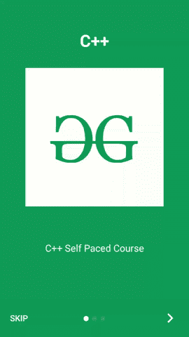

# 如何创建安卓应用的基本介绍滑块？

> 原文:[https://www . geeksforgeeks . org/如何创建一个基本的安卓应用程序介绍滑块/](https://www.geeksforgeeks.org/how-to-create-a-basic-intro-slider-of-an-android-app/)

当我们下载任何应用程序并第一次使用该应用程序时。然后我们将看到我们的应用程序中的介绍滑块。在这个滑块的帮助下，我们教育我们的用户如何使用这个应用程序，它详细地讲述了这个应用程序。在这篇文章中，我们将看看我们的应用程序中 Intro Slider 的实现。现在，让我们开始在我们的应用程序中实现这一功能。

### 我们将在本文中构建什么？

我们将构建一个简单的应用程序，其中我们将添加一个介绍滑块，该滑块将讲述 [GeeksforGeeks](https://www.geeksforgeeks.org/) 上提供的不同课程。下面给出了一个 GIF 示例，来了解一下我们将在本文中做什么。注意，我们将使用 **Java** 语言来实现这个项目。



### **逐步实现介绍滑块**

**第一步:创建新项目**

要在安卓工作室创建新项目，请参考[如何在安卓工作室创建/启动新项目](https://www.geeksforgeeks.org/android-how-to-create-start-a-new-project-in-android-studio/)。注意选择 **Java** 作为编程语言。

**第二步:在 build.gradle 文件中添加 Intro Slider 的依赖项。**

导航到 **gradle 脚本> build.gradle (app)** 文件，并在依赖项部分添加下面的依赖项。

> 实现' com . github . AppIntro:AppIntro:6 . 0 . 0 '

现在导航到(项目)的**渐变脚本>构建.渐变文件，并在存储库部分添加下面的代码。**

> 所有项目{
> 
> 存储库{
> 
> //添加到存储库部分的下面一行
> 
> maven { URL https://jitpack . I }
> 
> 谷歌()
> 
> jcenter()
> 
> }
> 
> }

**第 3 步:创建一个新的 Java 类来显示我们的滑块**的幻灯片

要创建一个新的 java 类，导航到**应用程序> java >你的应用程序的包名>右键单击它，然后单击新建> Java 类**，并将其命名为**内含子滑块**。创建此类后，向其中添加以下代码。代码中添加了注释，以更详细地理解代码。

## Java 语言(一种计算机语言，尤用于创建网站)

```java
import android.os.Bundle;

import androidx.core.content.ContextCompat;

import com.github.appintro.AppIntro;
import com.github.appintro.AppIntroFragment;

public class IntroSlider extends AppIntro {

    // we are calling on create method
    // to generate the view for our java file.
    @Override
    protected void onCreate(Bundle savedInstanceState) {
        super.onCreate(savedInstanceState);

        // below line is for adding the new slide to our app.
        // we are creating a new instance and inside that
        // we are adding the title, description, image and 
        // background color for our slide.
        // below line is use for creating first slide
        addSlide(AppIntroFragment.newInstance("C++", "C++ Self Paced Course",
                R.drawable.gfgimage, ContextCompat.getColor(getApplicationContext(), R.color.purple_200)));

        // below line is for creating second slide.
        addSlide(AppIntroFragment.newInstance("DSA", "Data Structures and Algorithms", R.drawable.gfgimage,
                ContextCompat.getColor(getApplicationContext(), R.color.purple_200)));

        // below line is use to create third slide.
        addSlide(AppIntroFragment.newInstance("Java", "Java Self Paced Course", R.drawable.gfgimage,
                ContextCompat.getColor(getApplicationContext(), R.color.purple_200)));
    }
}
```

**第 4 步:使用 AndroidManifest.xml 文件**

当我们创建一个新的活动来显示我们的介绍滑块时，我们将这个活动添加到您的 **AndroidManifest.xml** 文件中。将以下几行添加到您的**和**文件中

> 安卓:name=。内含滑动条"
> 
> 安卓:主题="@style/Theme。AppCompat.NoActionBar" />

下面是 **AndroidManifest.xml** 文件的完整代码。

## 可扩展标记语言

```java
<?xml version="1.0" encoding="utf-8"?>
<manifest xmlns:android="http://schemas.android.com/apk/res/android"
    package="com.gtappdevelopers.firebaseapp">

    <application
        android:allowBackup="true"
        android:icon="@mipmap/ic_launcher"
        android:label="@string/app_name"
        android:roundIcon="@mipmap/ic_launcher_round"
        android:supportsRtl="true"
        android:theme="@style/Theme.FirebaseApp">

        <!--adding activity for our intro slider-->
        <activity
            android:name=".IntroSlider"
            android:theme="@style/Theme.AppCompat.NoActionBar" />

        <activity android:name=".MainActivity">
            <intent-filter>
                <action android:name="android.intent.action.MAIN" />

                <category android:name="android.intent.category.LAUNCHER" />
            </intent-filter>
        </activity>
    </application>

</manifest>
```

**步骤 5:使用 MainActivity.java 文件**

转到**MainActivity.java**文件，参考以下代码。以下是**MainActivity.java**文件的代码。

## Java 语言(一种计算机语言，尤用于创建网站)

```java
import androidx.annotation.NonNull;
import androidx.appcompat.app.AppCompatActivity;

import android.content.Intent;
import android.os.Bundle;
import android.widget.GridView;
import android.widget.Toast;

import java.util.ArrayList;
import java.util.List;

public class MainActivity extends AppCompatActivity {

    @Override
    protected void onCreate(Bundle savedInstanceState) {
        super.onCreate(savedInstanceState);
        setContentView(R.layout.activity_main);

        Intent i =new Intent(getApplicationContext(),IntroSlider.class);
        startActivity(i);

    }
}
```

添加此代码后，现在运行您的应用程序并查看应用程序的输出。

### **输出:**

<video class="wp-video-shortcode" id="video-542810-1" width="640" height="360" preload="metadata" controls=""><source type="video/mp4" src="https://media.geeksforgeeks.org/wp-content/uploads/20210112222330/Screenrecorder-2021-01-12-22-20-05-653.mp4?_=1">[https://media.geeksforgeeks.org/wp-content/uploads/20210112222330/Screenrecorder-2021-01-12-22-20-05-653.mp4](https://media.geeksforgeeks.org/wp-content/uploads/20210112222330/Screenrecorder-2021-01-12-22-20-05-653.mp4)</video>