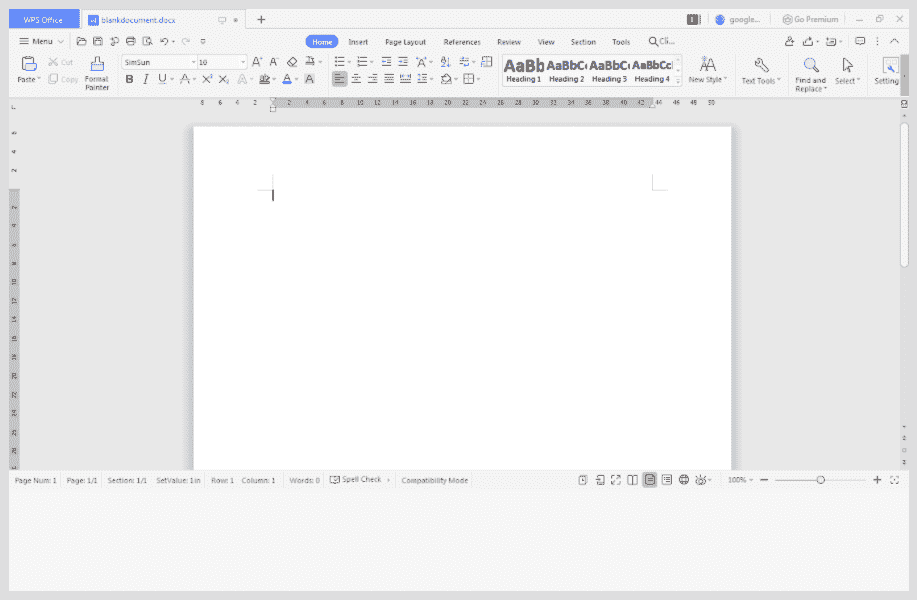

# 如何用 Java 创建空白 Word 文档？

> 原文:[https://www . geesforgeks . org/如何使用-java/](https://www.geeksforgeeks.org/how-to-create-a-blank-word-document-using-java/) 创建空白单词文档

Apache POI 和文件流是创建 Word 文档的根概念。 [Apache POI](https://www.geeksforgeeks.org/apache-poi-introduction/) 是 Apache 基金会提供的一个 API，是不同 java 库的集合。该工具使库可以读取、写入和操作不同的微软文件，如 Excel 工作表、PowerPoint 和 Word 文件。有两种类型，基本上是旧版本，包括。文档'，'。ppt '而较新版本的文件为'。docx '，'。pptx’。有两种方法可以处理 Apache POI，如下所述:

这里考虑 zip 文件，如果操作系统是 Windows，zip 文件应该是首选。这是一个简单的 java 项目，因此使用了二进制分发 API。在创建文档的过程中，将插入几个段落作为示例来显示输出，并将为段落提供样式，例如字体颜色、字体名称和字体大小。

现在，为了在不使用微软 Word 的情况下创建 Word 文件，有一个名为 Spire 的 java 界面，如果需要在不使用 Adobe Acrobat 的情况下创建 PDF 文档，那么可以使用一个名为“E-Ice blue”的界面来完成。这里' Spire.doc '必须按照问题陈述导入，因为所有交易都是 word 格式。

***【塔尖】*** ***。******Doc***for Java 是一个专业的 Java Word API，让 Java 应用程序无需使用 Microsoft Office 即可创建、转换、操作、和打印 Word 文档。将作为本程序的参考导入作为参考。

**语法:**用于导入 Spire 的 java 库

```
import Spire.Doc.jar ;
```

此外，还有另一个如上所述的用于 PDF 格式的 Java 应用编程接口“电子冰蓝”，它使开发人员能够在不使用 Adobe Acrobat 的情况下，在 Java 应用程序中读取、写入、转换、和打印 PDF 文档。同样，PowerPoint API 允许开发人员在 Java 应用程序中创建、读取、编辑、转换、和打印 PowerPoint 文件。

现在，就像任何类一样，Apache POI 包含要处理的类和方法。Apache POI 的主要组件将在下面讨论，以了解文件的内部工作，以及它是如何在没有 Word 的情况下借助类和方法生成的。Word 本身基本上有两个版本的文件。


[Java 中的文件流](https://www.geeksforgeeks.org/java-io-fileinputstream-class-java/)本身是一个抽象类，所以它有三个类 InputStreamClass、OutputStreamClass **、**和 ByteStreamClass 来执行操作。当输入/输出通过字节数据发生时，称为字节处理，当输入/输出流与字符流一起发生时，称为字节流的文件处理过程。请记住，较新版本文件的基本参考是从 Word 版开始的。


**进场:**

*   文件处理提供了如何在 Java 中读写文件。Java 为读写流提供了基本的输入/输出包。java.io 包允许用 java 做所有的输入和输出任务。此外，下面将在 java 的文件流下详细解释。
*   Java 包含一个内置包**org . Apache . poi . xwpf . user model**，它可以导入到环境中，提供与文档相关的广泛功能。这个包提供了一个类 XWPFDocument，可以用来处理。docx 文件。另一个必需的包涉及用于处理和处理文件的文件和文件输出流，以建立连接并创建相应的文件。它还刺激了将内容写入指定文件位置的过程。可以使用这些包创建一个空白文档并存储在本地存储中。写入内容后需要关闭连接。


**算法:创建空白 Word 文件**

1.  使用文件方法创建空白文档。
2.  指定要创建空白文档的路径或目录。
3.  写入文件流中的文档。
4.  将内容写入文档。
5.  关闭文件连接。

**实现:**下面的 Java 代码说明了这个过程:这里是一个简单的 Apache 实现程序，所以不需要在程序中引入 Maven 库:

## Java 语言(一种计算机语言，尤用于创建网站)

```
// Java Program to Create 
// a Blank Word file

// Importing File libraries
import java.io.File;
import java.io.FileOutputStream;

// Importing Apache libraries
import org.apache.poi.xwpf.usermodel.XWPFDocument;

public class GFG {

    // Main driver method
    public static void main(String[] args) throws Exception
    {

        // Create a blank document
        XWPFDocument xwpfdocument = new XWPFDocument();

        // Create file by specifying the path
        File file = new File("C:/blankdocument.docx");

        // Writing document in file stream
        FileOutputStream ostream
            = new FileOutputStream(file);

        // Write contents to the document
        xwpfdocument.write(ostream);

        // Close the file connection
        ostream.close();
    }
}
```

**输出:**代码按照程序员在代码中的指定，在本地目录中创建一个空白文档文件。

