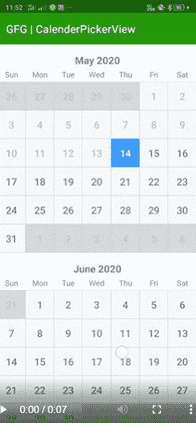

# 如何使用时间方库

创建日历点击视图

> 原文:[https://www . geeksforgeeks . org/如何创建一个-calendar pickerview-use-timesquare-library/](https://www.geeksforgeeks.org/how-to-create-a-calendarpickerview-using-timesquare-library/)

本文展示了如何使用**时代广场**库创建**日历选择视图**。我们已经在许多应用程序中看到了使用 calendarPickerView 来选择日期。在这个库的帮助下，我们可以很容易地在我们的应用程序中添加日历。
[](https://media.geeksforgeeks.org/wp-content/uploads/20200518200626/calender1.png) 
**进场:**

1.  在 **[build.gradle](https://www.geeksforgeeks.org/android-build-gradle/)** 文件中添加支持库，并在依赖项部分添加依赖项。这个库提供了内置的日历小部件和各种功能，如选择特定日期等。

    ```java
    dependencies {
      implementation 'com.squareup:android-times-square:1.6.5@aar'
    }
    ```

2.  现在在 **activity_main.xml** 文件中添加以下代码。这将在应用程序中添加**日历选择视图**布局。

    ## activity _ main . XML

    ```java
    <?xml version="1.0" encoding="utf-8"?>
    <androidx.constraintlayout.widget.ConstraintLayout

        xmlns:android="http://schemas.android.com/apk/res/android"
        xmlns:tools="http://schemas.android.com/tools"
        android:layout_width="match_parent"
        android:layout_height="match_parent"
        tools:context=".MainActivity">

        <com.squareup.timessquare.CalendarPickerView
            android:id="@+id/calendar"
            android:layout_width="match_parent"
            android:layout_height="match_parent"/>

    </androidx.constraintlayout.widget.ConstraintLayout>
    ```

3.  现在在**MainActivity.java**文件中添加以下代码。这将显示从当天开始的下一年的日历。日历中添加了一个**设置，当用户点击任何日期时就会调用该设置。功能**在屏幕上祝酒**所选日期。

    ## MainActivity.java

    ```java
    package org.geeksforgeeks.gfgcalendarPickerView;

    import androidx.appcompat
        .app.AppCompatActivity;
    import android.os.Bundle;
    import android.widget.Toast;
    import com.squareup
        .timessquare
        .CalendarPickerView;
    import java.text.DateFormat;
    import java.util.Calendar;
    import java.util.Date;

    public class MainActivity
        extends AppCompatActivity {

        @Override
        protected void onCreate(
            Bundle savedInstanceState)
        {
            super.onCreate(savedInstanceState);
            setContentView(R.layout.activity_main);

            // This will return us today date
            Date today = new Date();

            Calendar nextYear
                = Calendar.getInstance();

            // This will help us
            // to show date from
            // today to next year
            nextYear.add(Calendar.YEAR, 1);

            CalendarPickerView
                datePicker
                = findViewById(
                    R.id.calendar);

            // we have to initialize
            // our calendar picker view
            // so we select min date as today
            // max date as next year
            // we call getTime() method
            // because we want to
            // retrieve date from it.
            datePicker
                .init(today, nextYear.getTime())
                .inMode(CalendarPickerView
                            .SelectionMode
                            .RANGE)
                .withSelectedDate(today);

            // when the user select
            // or un select any date then
            // this method called automatically.
            datePicker
                .setOnDateSelectedListener(
                    new CalendarPickerView
                        .OnDateSelectedListener() {

                            @Override
                            public void onDateSelected(Date date)
                            {
                                // we have to format our date
                                // object that's why we are
                                // using DateFormat class.
                                String selectedDate
                                    = DateFormat
                                          .getDateInstance(
                                              DateFormat.FULL)
                                          .format(date);
                                Toast
                                    .makeText(
                                        MainActivity.this,
                                        selectedDate,
                                        Toast.LENGTH_SHORT)
                                    .show();
                            }

                            @Override
                            public void onDateUnselected(
                                Date date)
                            {
                            }
                        });
        }
    }
    ```** 

**输出:**

<video class="wp-video-shortcode" id="video-414079-1" width="320" height="540" preload="metadata" controls=""><source type="video/mp4" src="https://media.geeksforgeeks.org/wp-content/uploads/20200515000436/Record_2020-05-14-23-52-32_2591d69f2e664f991fcb831072e2b5cd1.mp4?_=1">[https://media.geeksforgeeks.org/wp-content/uploads/20200515000436/Record_2020-05-14-23-52-32_2591d69f2e664f991fcb831072e2b5cd1.mp4](https://media.geeksforgeeks.org/wp-content/uploads/20200515000436/Record_2020-05-14-23-52-32_2591d69f2e664f991fcb831072e2b5cd1.mp4)</video>