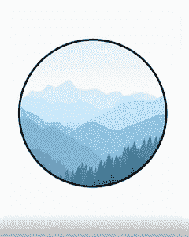
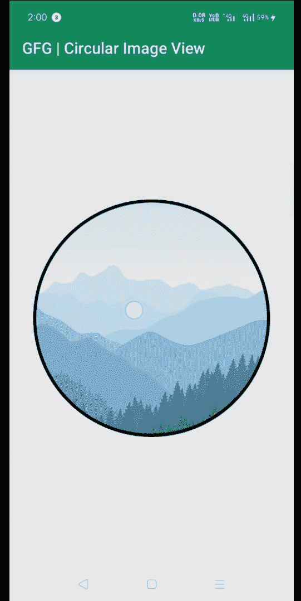

# 如何使用 hdodenhof 库在安卓系统中创建一个圆形图像视图？

> 原文:[https://www . geesforgeks . org/how-create-a-circuitimageview-in-Android-using-hdodenhof-library/](https://www.geeksforgeeks.org/how-to-create-a-circularimageview-in-android-using-hdodenhof-library/)

可以看到，很多[安卓](https://www.geeksforgeeks.org/introduction-to-android-development/)应用都使用 CircularImageView 来展示个人资料图片、状态、故事等很多东西，但是用一个普通的[T3ImageView](https://www.geeksforgeeks.org/imageview-in-kotlin/)**来做这个有点难。为此，请使用 [hdodenhof CircleImageView](https://github.com/hdodenhof/CircleImageView) 库。这是一个快速圆形图像视图，非常适合侧面图像。这是基于 [圆的 dImageView 来自文斯米](https://github.com/vinc3m1/RoundedImageView) 。S o 在本文中，让我们在安卓应用中添加一个 CircleImageView。下面给出了一个示例图像，以了解我们将在本文中做什么。**

****

> ****注意:**不使用任何库在安卓中创建圆形图像视图请参考[如何在不使用任何库的情况下在安卓中创建圆形图像视图？](https://www.geeksforgeeks.org/how-to-create-a-circular-image-view-in-android-without-using-any-library/)**

### **创建圆形图像视图的步骤**

****步骤 1:创建新项目****

**在安卓工作室创建新项目请参考 [**【如何在安卓工作室创建/启动新项目】**](https://www.geeksforgeeks.org/android-how-to-create-start-a-new-project-in-android-studio/) 。请注意，选择 [Java](https://www.geeksforgeeks.org/java/) 作为语言，尽管我们要用 Java 语言实现这个项目。**

****第二步:去编码区之前先做一些前置任务****

*   **转到 Gradle **脚本->**[**build . Gradle**(模块:app)](https://www.geeksforgeeks.org/android-build-gradle/) 部分，导入以下依赖项，点击上方弹出的**立即同步**。**

> **实现' de . hdodenhof:circleimageview:3 . 1 . 0 '**

****第三步:设计 UI****

*   **在 **activity_main.xml** 文件中创建**CircleImageView****，设置**安卓:src = " @ drawing able/mountain "**。****activity _ main . XML**文件的完整代码如下。******

## ****可扩展标记语言****

```
**<?xml version="1.0" encoding="utf-8"?>
<RelativeLayout 
    xmlns:android="http://schemas.android.com/apk/res/android"
    xmlns:tools="http://schemas.android.com/tools"
    android:layout_width="match_parent"
    android:layout_height="match_parent"
    xmlns:app="http://schemas.android.com/apk/res-auto"
    tools:context=".MainActivity">

    <!-- Circular Image View  -->
    <de.hdodenhof.circleimageview.CircleImageView
        app:civ_border_width="4dp"
        android:layout_centerInParent="true"
        android:src="@drawable/mountain"
        app:civ_border_color="#FF000000"
        android:layout_width="300dp"
        android:layout_height="300dp"/>

</RelativeLayout>**
```

******第四步:MainActivity.java 文件******

****在这个项目中，与 MainActivity.java 文件无关，所以保持原样。****

## ****Java 语言(一种计算机语言，尤用于创建网站)****

```
**import androidx.appcompat.app.AppCompatActivity;
import android.os.Bundle;

public class MainActivity extends AppCompatActivity {

    @Override
    protected void onCreate(Bundle savedInstanceState) {
        super.onCreate(savedInstanceState);
        setContentView(R.layout.activity_main);

    }
}**
```

### ******输出:******

********

### ****限制****

*   ****在这个库中， **ScaleType** 始终是 **CENTER_CROP** ，如果您尝试更改它，将会得到一个例外。****
*   ****不支持启用调整视图边界，因为这需要不支持的缩放类型。****
*   ****使用带有**循环图像视图**的**过渡可绘制的**无法正常工作，导致图像混乱。****

******资源:******

*   ****从 [Github](https://github.com/olyklohan/Circle-Image-View-Android-studio/) 下载完整项目****
*   ****下载 [Apk 文件](https://github.com/olyklohan/Circle-Image-View-Android-studio/blob/master/geeksforgeeks_circle_image_view_onlyK_Lohan/circular%20image%20view%20android%20studio%20onlyk%20lohan.apk)****