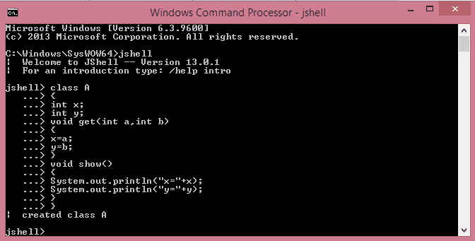
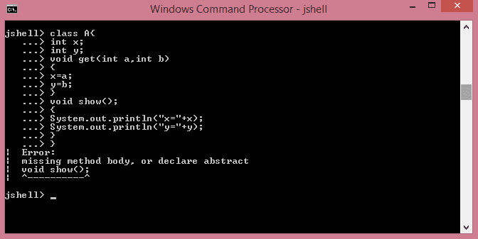
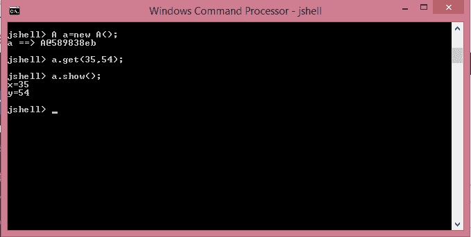

# 如何在 Java 9 的 JShell 中创建类

> 原文:[https://www . geesforgeks . org/how-to-create-a-class-in-jshell-of-Java-9/](https://www.geeksforgeeks.org/how-to-create-a-class-in-jshell-of-java-9/)

[JShell](https://www.geeksforgeeks.org/jshell-java-9-new-feature/) 是一个交互式的 Java Shell 工具，它允许我们从 Shell 中执行 Java 代码并立即显示输出。JShell 是一个 **REPL(读取评估打印循环)工具**，从命令行运行。 [Jshell](https://www.geeksforgeeks.org/jshell-java-9-new-feature/) 有能力创建一个类，通过这个类可以减少所有的工作来编写一个完整的 Java 代码来检查这个类是否正常工作。

A [类](https://www.geeksforgeeks.org/classes-objects-java/)根据用户需求包含不同的方法和变量，但由于一些错误程序无法工作。但是在 JShell 的帮助下，这可以更有效地解决，并且耗时更少。

**示例:**

1.  In this example, **class A is created** successfully and one can call the class methods by creating an object of class A.

    ```java
    C:\Windows\SysWOW64>jshell
    |  Welcome to JShell -- Version 13.0.1
    |  For an introduction type: /help intro
    jshell> class A{
       ...> int x;
       ...> int y;
       ...> void get(int a, int b)
       ...> {
       ...> x=a;
       ...> y=b;
       ...> }
       ...> void show()
       ...> {
       ...> System.out.println("sum="+(x+y));
       ...> }
       ...> }

    |  created class A
    ```

    [](https://media.geeksforgeeks.org/wp-content/uploads/20200206213707/Screenshot-5815.png)

2.  In this example, **due to ‘;’, an error occurs** and this **can be solved** it easily because the line of code is small and easy.

    ```java
    jshell> class A{
       ...> int x;
       ...> int y;
       ...> void get(int a, int b)
       ...> {
       ...> x=a;
       ...> y=b;
       ...> }
       ...> void show();
       ...> {
       ...> System.out.println("sum="+(x+y));
       ...> }
       ...> }
    |  Error:
    |  missing method body, or declare abstract
    |  void show();
    |  ^----------^
    ```

    [](https://media.geeksforgeeks.org/wp-content/uploads/20200210204816/Screenshot-7310.png)

3.  Example to **access the methods of the class**:

    ```java
    jshell>A a=new A();
    a ==> A@42dafa95
    jshell>a.get(10, 20);
    jshell>a.show();
    sum=30
    ```

    [](https://media.geeksforgeeks.org/wp-content/uploads/20200206214359/Screenshot-607.png)

4.  In the above examples, the objects of class A is created and denoted by ‘a’ and we call the get and show methods. We can also **override the methods of class** A. After overriding the methods, a message will be displayed that “the method is modified” and now we can call the modified methods and get the answers.

    ```java
    jshell> void show();
       ...> {
       ...> System.out.println("sum="+(x-y));
       ...> }
    |  modified method show(int, int)
    ```

    [](https://media.geeksforgeeks.org/wp-content/uploads/20200206215903/Screenshot-635.png)