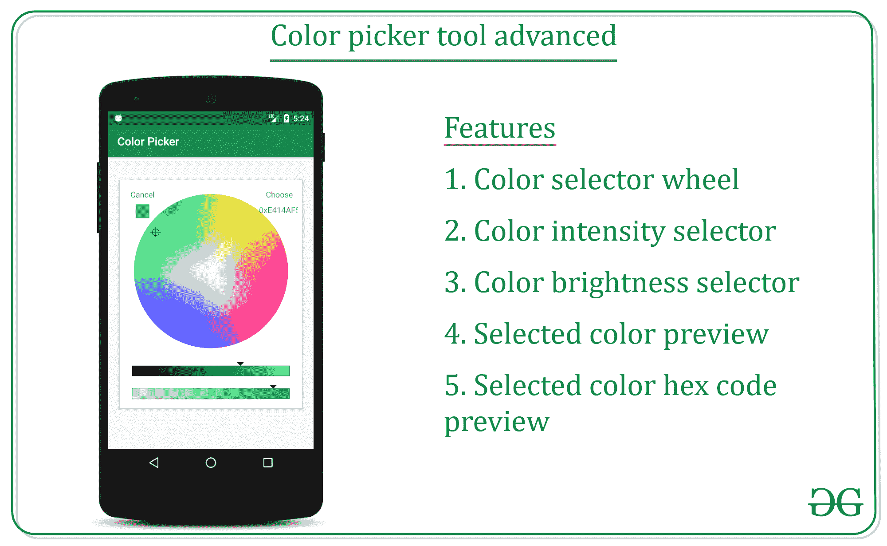
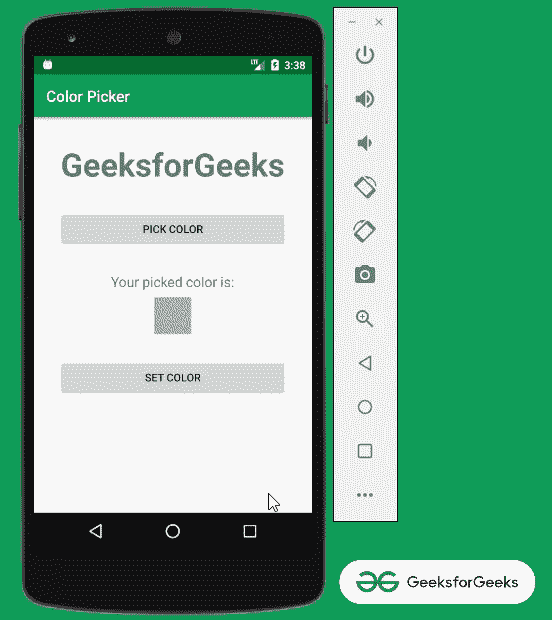
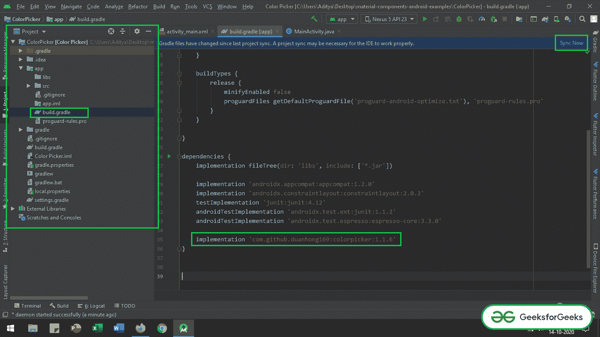
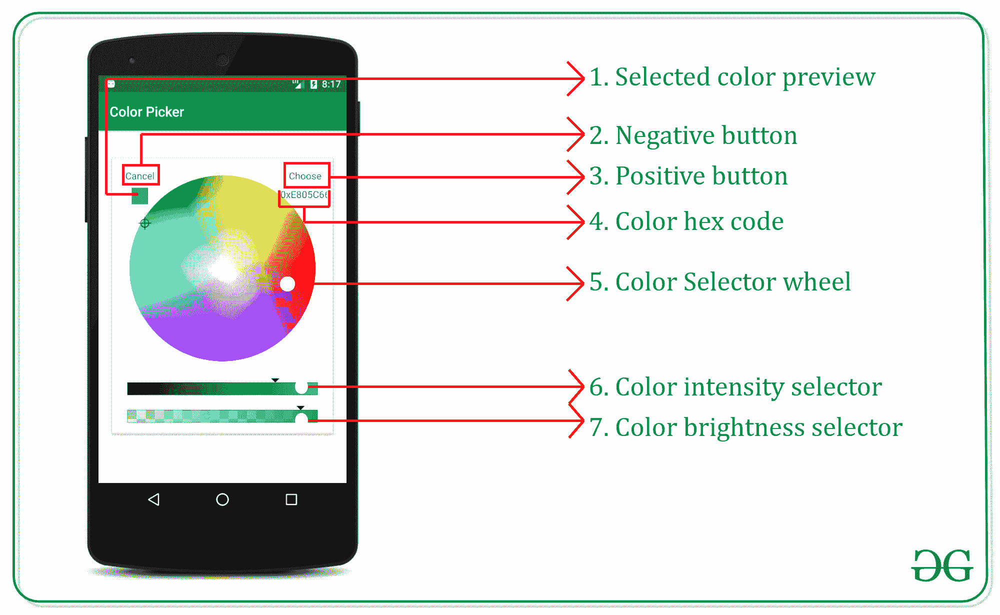

# 如何使用色轮和滑块在安卓系统中创建拾色器工具？

> 原文:[https://www . geesforgeks . org/如何使用色轮和滑块在安卓中创建颜色选择器工具/](https://www.geeksforgeeks.org/how-to-create-a-color-picker-tool-in-android-using-color-wheel-and-slider/)

在之前的文章 **[如何在安卓](https://www.geeksforgeeks.org/how-to-create-a-basic-color-picker-tool-in-android/)** 中创建一个基本的拾色器工具，我们已经讨论过如何创建一个基本的拾色器工具。在本文中，我们将创建相同的颜色选择器工具，但是使用**色轮和滑块**。这是另一种颜色选择器，允许用户选择颜色的亮度和颜色强度。这也是开源库之一。因此，在本文中，我们将讨论如何实现以下类型的颜色选择器工具。



下面给出一个 GIF 示例，来了解一下在本文 中我们要做什么。 注意，我们要用 **Java** 语言实现这个项目。



### **实现颜色选择器工具的步骤**

**第一步:创建新项目**

*   要在安卓工作室创建新项目，请参考[如何在安卓工作室创建/启动新项目](https://www.geeksforgeeks.org/android-how-to-create-start-a-new-project-in-android-studio/)。
*   注意选择 **Java** 作为编程语言。

**第二步:添加颜色选择器库依赖项**

*   现在将颜色选择器库的依赖项添加为(添加到[应用程序级渐变文件](https://www.geeksforgeeks.org/android-build-gradle/)):

> *实现‘com . github . duanhong 169:color picker:1 . 1 . 6’*

*   确保系统已连接到网络(以便下载所需文件)，并在调用依赖关系后单击“ ***【立即同步】*** ”按钮。
*   如果找不到应用程序级渐变文件并调用依赖关系，请参考下图。



**步骤 3:使用 activity_main.xml 文件**

*   接下来进入 **activity_main.xml 文件** ，代表项目的 UI。
*   下面是**activity _ main . XML**文件的代码。代码中添加了注释，以更详细地理解代码。

## 可扩展标记语言

```
<?xml version="1.0" encoding="utf-8"?>
<LinearLayout 
    xmlns:android="http://schemas.android.com/apk/res/android"
    xmlns:tools="http://schemas.android.com/tools"
    android:layout_width="match_parent"
    android:layout_height="match_parent"
    android:orientation="vertical"
    tools:context=".MainActivity"
    tools:ignore="HardcodedText">

    <!--Give all widgets, the proper id to 
        handle them in MainActivity.java-->

    <!--GeeksforGeeks Text-->
    <TextView
        android:id="@+id/gfg_heading"
        android:layout_width="wrap_content"
        android:layout_height="wrap_content"
        android:layout_gravity="center"
        android:layout_marginTop="32dp"
        android:text="GeeksforGeeks"
        android:textSize="42sp"
        android:textStyle="bold" />

    <!--Pick color Button-->
    <Button
        android:id="@+id/pick_color_button"
        android:layout_width="match_parent"
        android:layout_height="wrap_content"
        android:layout_gravity="center"
        android:layout_marginTop="32dp"
        android:layout_marginStart="32dp"
        android:layout_marginEnd="32dp"
        android:text="Pick Color" />

    <TextView
        android:layout_width="wrap_content"
        android:layout_height="wrap_content"
        android:layout_gravity="center"
        android:layout_marginTop="32dp"
        android:textSize="18sp"
        android:text="Your picked color is:" />

    <!--sample view to preview selected color by user-->
    <!--by default this has been set to darker gery-->
    <!--this can be overridden after user chose the 
        color from color picker-->
    <!--which has been handled in the MainActivity.java-->
    <View
        android:id="@+id/preview_selected_color"
        android:layout_width="48dp"
        android:layout_height="48dp"
        android:layout_gravity="center"
        android:background="@android:color/darker_gray"
        android:layout_marginTop="8dp" />

    <!--set color button to overwrite the 
        color for GeeksforGeeks text-->
    <Button
        android:id="@+id/set_color_button"
        android:layout_width="match_parent"
        android:layout_height="wrap_content"
        android:layout_gravity="center"
        android:layout_marginTop="32dp"
        android:layout_marginStart="32dp"
        android:layout_marginEnd="32dp"
        android:text="Set Color" />

</LinearLayout>
```

**输出 UI:**


在开始处理颜色选择器工具对话框功能之前，理解对话框的各个部分是必要的，这样在用 java 代码处理对话框的各个部分时会变得更容易。



**步骤 4:使用 MainActivity.java 文件**

*   最后，转到**文件，参考以下代码。**
*   **下面是**文件的代码。代码中添加了注释，以更详细地理解代码。****

## ****Java 语言(一种计算机语言，尤用于创建网站)****

```
**import android.graphics.Color;
import android.os.Bundle;
import android.view.View;
import android.widget.Button;
import android.widget.TextView;
import androidx.appcompat.app.AppCompatActivity;
import top.defaults.colorpicker.ColorPickerPopup;

public class MainActivity extends AppCompatActivity {

    // text view variable to set the color for GFG text
    private TextView gfgTextView;

    // two buttons to open color picker dialog and one to
    // set the color for GFG text
    private Button mSetColorButton, mPickColorButton;

    // view box to preview the selected color
    private View mColorPreview;

    // this is the default color of the preview box
    private int mDefaultColor;

    @Override
    protected void onCreate(Bundle savedInstanceState) {
        super.onCreate(savedInstanceState);
        setContentView(R.layout.activity_main);

        // register the GFG text with appropriate ID
        gfgTextView = findViewById(R.id.gfg_heading);

        // register two of the buttons with their
        // appropriate IDs
        mPickColorButton = findViewById(R.id.pick_color_button);
        mSetColorButton = findViewById(R.id.set_color_button);

        // and also register the view which shows the
        // preview of the color chosen by the user
        mColorPreview = findViewById(R.id.preview_selected_color);

        // set the default color to 0 as it is black
        mDefaultColor = 0;

        // handling the Pick Color Button to open color
        // picker dialog
        mPickColorButton.setOnClickListener(
                new View.OnClickListener() {
                    @Override
                    public void onClick(final View v) {
                        new ColorPickerPopup.Builder(MainActivity.this).initialColor(
                                Color.RED) // set initial color
                                // of the color
                                // picker dialog
                                .enableBrightness(
                                        true) // enable color brightness
                                // slider or not
                                .enableAlpha(
                                        true) // enable color alpha
                                // changer on slider or
                                // not
                                .okTitle(
                                        "Choose") // this is top right
                                // Choose button
                                .cancelTitle(
                                        "Cancel") // this is top left
                                // Cancel button which
                                // closes the
                                .showIndicator(
                                        true) // this is the small box
                                // which shows the chosen
                                // color by user at the
                                // bottom of the cancel
                                // button
                                .showValue(
                                        true) // this is the value which
                                // shows the selected
                                // color hex code
                                // the above all values can be made
                                // false to disable them on the
                                // color picker dialog.
                                .build()
                                .show(
                                        v,
                                        new ColorPickerPopup.ColorPickerObserver() {
                                            @Override
                                            public void
                                            onColorPicked(int color) {
                                                // set the color
                                                // which is returned
                                                // by the color
                                                // picker
                                                mDefaultColor = color;

                                                // now as soon as
                                                // the dialog closes
                                                // set the preview
                                                // box to returned
                                                // color
                                                mColorPreview.setBackgroundColor(mDefaultColor);
                                            }
                                        });
                    }
                });

        // handling the Set Color button to set the selected
        // color for the GFG text.
        mSetColorButton.setOnClickListener(
                new View.OnClickListener() {
                    @Override
                    public void onClick(View v) {
                        // now change the value of the GFG text
                        // as well.
                        gfgTextView.setTextColor(mDefaultColor);
                    }
                });
    }
}**
```

### ******输出:在仿真器上运行******

****<video class="wp-video-shortcode" id="video-499128-1" width="640" height="360" preload="metadata" controls=""><source type="video/mp4" src="https://media.geeksforgeeks.org/wp-content/uploads/20201010154138/Untitled-Project.mp4?_=1">[https://media.geeksforgeeks.org/wp-content/uploads/20201010154138/Untitled-Project.mp4](https://media.geeksforgeeks.org/wp-content/uploads/20201010154138/Untitled-Project.mp4)</video>****