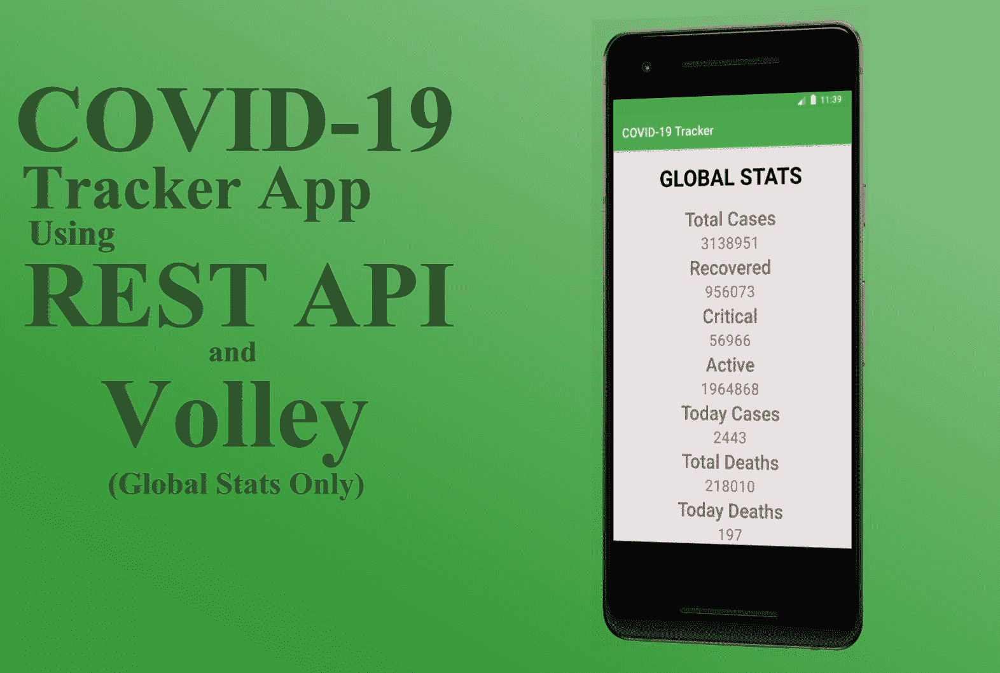
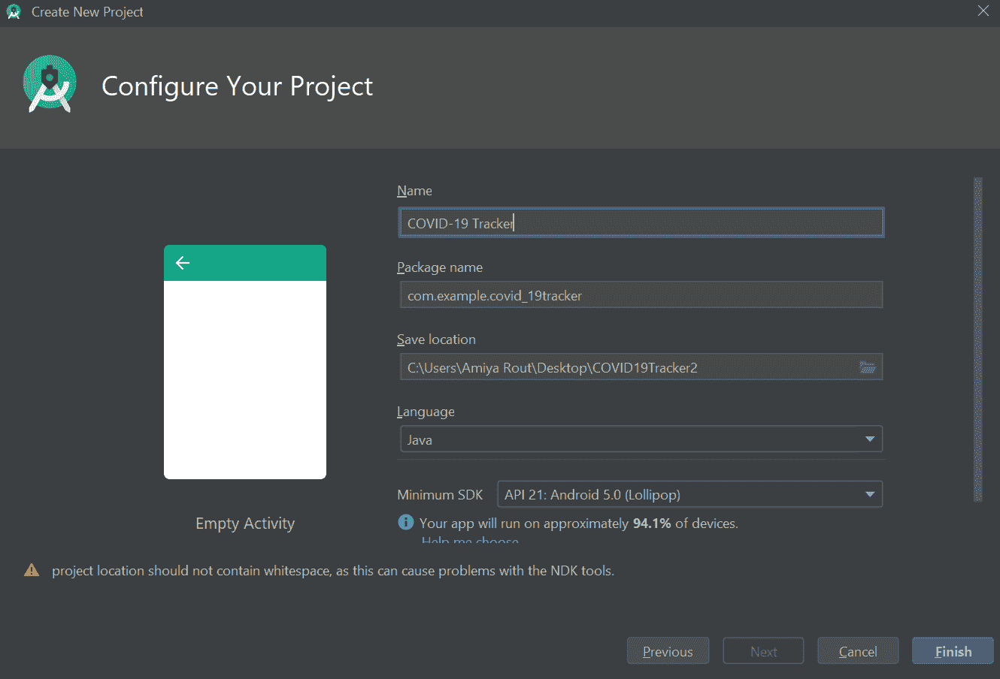
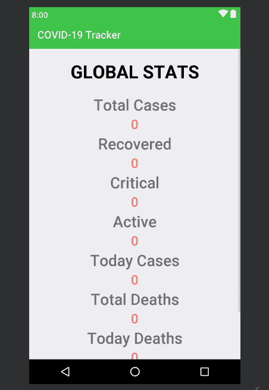
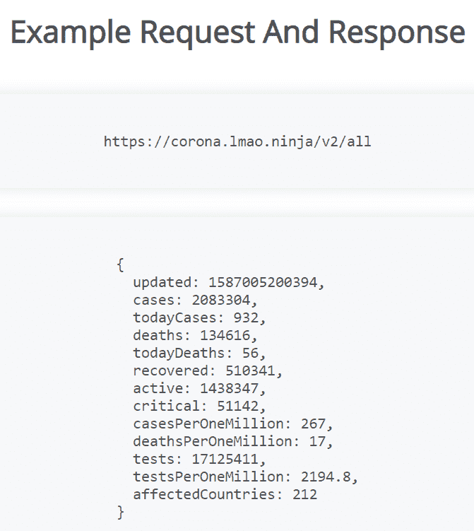
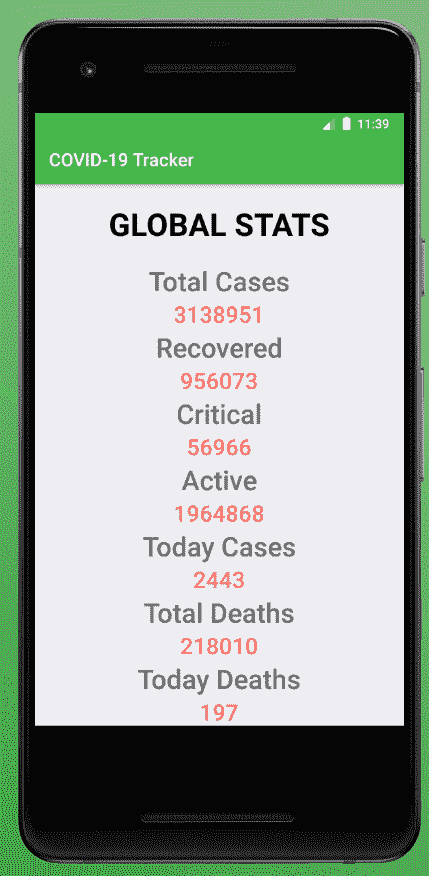

# 如何创建新冠肺炎追踪器安卓应用

> 原文:[https://www . geeksforgeeks . org/如何创建-新冠肺炎-追踪器-安卓-app/](https://www.geeksforgeeks.org/how-to-create-a-covid-19-tracker-android-app/)

**先决条件:**

*   [新手安卓应用开发基础](https://www.geeksforgeeks.org/android-app-development-fundamentals-for-beginners/)
*   [安卓工作室安装设置指南](https://www.geeksforgeeks.org/guide-to-install-and-set-up-android-studio/?ref=rp)
*   [安卓|如何在安卓工作室创建/启动新项目？](https://www.geeksforgeeks.org/android-how-to-create-start-a-new-project-in-android-studio/?ref=rp)
*   [安卓|运行你的第一个安卓应用](https://www.geeksforgeeks.org/android-running-your-first-android-app/?ref=rp)
*   [REST API(简介)](https://www.geeksforgeeks.org/rest-api-introduction/)
*   [安卓中的凌空库](https://www.geeksforgeeks.org/volley-library-in-android/)

世界正面临最严重的流行病之一，新冠肺炎的爆发，你们都知道这一点。因此，在封锁期间，让我们使用 REST API 创建一个**新冠肺炎追踪器安卓应用程序，它将只追踪**全球统计数据**。**

[](https://media.geeksforgeeks.org/wp-content/uploads/20200429114427/f83.jpg)

1.  **第一步:开启新项目**
    *   打开一个新项目，只需点击左上角的文件选项。
    *   然后点击新建，用你想要的名字打开一个新项目。
    *   现在我们将使用 Java 语言来处理空活动。保持所有其他选项不变。
    *   您可以根据自己的选择更改项目名称。
        [](https://media.geeksforgeeks.org/wp-content/uploads/20200428213705/f119.png)
    *   默认情况下会有两个文件 **activity_main.xml** 和**MainActivity.java**。
2.  **第二步:**在进入编码部分之前，你首先要做一些前置任务。
    *   转到**应用->RES->values->colors . XML**部分，为您的应用设置颜色。

        ## 

        ```java
        <?xml version="1.0" encoding="utf-8"?>
        <resources>
            <color name="colorPrimary">#42C14B</color>
            <color name="colorPrimaryDark">#3BC545</color>
            <color name="colorAccent">#05af9b</color>

            <color name="color_one">#fb7268</color>
            <color name="color_white">#ededf2</color>

        </resources>
        ```

    *   转到**梯度脚本- >构建.梯度(模块:应用)**部分，导入以下依赖项，然后单击上面弹出的“立即同步”。

        ## build . gradle(:app)

        ```java
        // Volley library
        implementation 'com.android.volley:volley:1.1.1'
        ```

    *   转到 **app- >清单- > AndroidManifests.xml** 部分，允许[互联网权限](https://www.geeksforgeeks.org/android-how-to-request-permissions-in-android-application/)。

        ## 

        ```java
        <!--Allow Internet Permission-->
        <uses-permission android:name="android.permission.INTERNET" />
        ```

3.  **第三步:设计用户界面**
    *   下面是 xml 文件的代码。

        ## activity _ main . XML

        ```java
        <?xml version="1.0" encoding="utf-8"?>
        <ScrollView
            xmlns:android="http://schemas.android.com/apk/res/android"
            xmlns:app="http://schemas.android.com/apk/res-auto"
            xmlns:tools="http://schemas.android.com/tools"
            android:layout_width="match_parent"
            android:layout_height="match_parent"
            android:background="@color/color_white"
            android:orientation="vertical"
            tools:context=".MainActivity">

            <!--Linear Layout to display all the details-->
            <LinearLayout
                android:layout_width="match_parent"
                android:layout_height="wrap_content"
                android:padding="20dp"
                android:orientation="vertical">

                <!--Text view to display Global stats-->
                <TextView
                    android:layout_width="match_parent"
                    android:layout_height="wrap_content"
                    android:text="Global Stats"
                    android:textColor="#050505"
                    android:textAllCaps="true"
                    android:textAlignment="center"
                    android:textSize="35sp"
                    android:textStyle="bold"/>

                    <!--Text view to display Total Cases-->
                    <TextView
                        android:layout_width="match_parent"
                        android:layout_height="wrap_content"
                        android:fontFamily="sans-serif-light"
                        android:layout_marginTop="20dp"
                        android:text="Total Cases"
                        android:textAlignment="center"
                        android:textStyle="bold"
                        android:textSize="30sp"/>

                    <!--Text view to display the updated number when data
                     will fetch from the API. For now default set to 0 -->
                    <TextView
                        android:layout_width="match_parent"
                        android:layout_height="wrap_content"
                        android:text="0"
                        android:id="@+id/tvCases"
                        android:textAlignment="center"
                        android:textSize="25sp"
                        android:textColor="@color/color_one"
                        android:textStyle="bold"
                        android:fontFamily="sans-serif-light" />

                <!--Text view to display Recovered Cases-->
                <TextView
                    android:layout_width="match_parent"
                    android:layout_height="wrap_content"
                    android:fontFamily="sans-serif-light"
                    android:text="Recovered"
                    android:textAlignment="center"
                    android:textStyle="bold"
                    android:textSize="30sp"/>

                <!--Text view to display the updated number when data
                 will fetch from the API. For now default set to 0 -->
                <TextView
                    android:layout_width="match_parent"
                    android:layout_height="wrap_content"
                    android:text="0"
                    android:id="@+id/tvRecovered"
                    android:textAlignment="center"
                    android:textSize="25sp"
                    android:textColor="@color/color_one"
                    android:textStyle="bold"
                    android:fontFamily="sans-serif-light" />

                <!--Text view to display Critical Cases-->
                <TextView
                    android:layout_width="match_parent"
                    android:layout_height="wrap_content"
                    android:fontFamily="sans-serif-light"
                    android:text="Critical"
                    android:textAlignment="center"
                    android:textStyle="bold"
                    android:textSize="30sp"/>

                <!--Text view to display the updated number when data
                 will fetch from the API. For now default set to 0 -->
                <TextView
                    android:layout_width="match_parent"
                    android:layout_height="wrap_content"
                    android:text="0"
                    android:id="@+id/tvCritical"
                    android:textAlignment="center"
                    android:textSize="25sp"
                    android:textColor="@color/color_one"
                    android:textStyle="bold"
                    android:fontFamily="sans-serif-light" />

                <!--Text view to display Active Cases-->
                <TextView
                    android:layout_width="match_parent"
                    android:layout_height="wrap_content"
                    android:fontFamily="sans-serif-light"
                    android:text="Active"
                    android:textAlignment="center"
                    android:textStyle="bold"
                    android:textSize="30sp"/>

                <!--Text view to display the updated number when data
                 will fetch from the API. For now default set to 0 -->
                <TextView
                    android:layout_width="match_parent"
                    android:layout_height="wrap_content"
                    android:text="0"
                    android:id="@+id/tvActive"
                    android:textAlignment="center"
                    android:textSize="25sp"
                    android:textColor="@color/color_one"
                    android:textStyle="bold"
                    android:fontFamily="sans-serif-light" />

                <!--Text view to display Today Cases-->
                <TextView
                    android:layout_width="match_parent"
                    android:layout_height="wrap_content"
                    android:fontFamily="sans-serif-light"
                    android:text="Today Cases"
                    android:textAlignment="center"
                    android:textStyle="bold"
                    android:textSize="30sp"/>

                <!--Text view to display the updated number when data
                 will fetch from the API. For now default set to 0 -->
                <TextView
                    android:layout_width="match_parent"
                    android:layout_height="wrap_content"
                    android:text="0"
                    android:id="@+id/tvTodayCases"
                    android:textAlignment="center"
                    android:textSize="25sp"
                    android:textColor="@color/color_one"
                    android:textStyle="bold"
                    android:fontFamily="sans-serif-light" />

                <!--Text view to display Total Deaths-->
                <TextView
                    android:layout_width="match_parent"
                    android:layout_height="wrap_content"
                    android:fontFamily="sans-serif-light"
                    android:text="Total Deaths"
                    android:textAlignment="center"
                    android:textStyle="bold"
                    android:textSize="30sp"/>

                <!--Text view to display the updated number when data
                 will fetch from the API. For now default set to 0 -->
                <TextView
                    android:layout_width="match_parent"
                    android:layout_height="wrap_content"
                    android:text="0"
                    android:id="@+id/tvTotalDeaths"
                    android:textAlignment="center"
                    android:textSize="25sp"
                    android:textColor="@color/color_one"
                    android:textStyle="bold"
                    android:fontFamily="sans-serif-light" />

                <!--Text view to display Today Deaths-->
                <TextView
                    android:layout_width="match_parent"
                    android:layout_height="wrap_content"
                    android:fontFamily="sans-serif-light"
                    android:text="Today Deaths"
                    android:textAlignment="center"
                    android:textStyle="bold"
                    android:textSize="30sp"/>

                <!--Text view to display the updated number when data
                 will fetch from the API. For now default set to 0 -->
                <TextView
                    android:layout_width="match_parent"
                    android:layout_height="wrap_content"
                    android:text="0"
                    android:id="@+id/tvTodayDeaths"
                    android:textAlignment="center"
                    android:textSize="25sp"
                    android:textColor="@color/color_one"
                    android:textStyle="bold"
                    android:fontFamily="sans-serif-light" />

                <!--Text view to display Affected Countries-->
                <TextView
                    android:layout_width="match_parent"
                    android:layout_height="wrap_content"
                    android:fontFamily="sans-serif-light"
                    android:text="Affected Countries"
                    android:textAlignment="center"
                    android:textStyle="bold"
                    android:textSize="30sp"/>

                <!--Text view to display the updated number when data
                 will fetch from the API. For now default set to 0 -->
                <TextView
                    android:layout_width="match_parent"
                    android:layout_height="wrap_content"
                    android:text="0"
                    android:id="@+id/tvAffectedCountries"
                    android:textAlignment="center"
                    android:textSize="25sp"
                    android:textColor="@color/color_one"
                    android:textStyle="bold"
                    android:fontFamily="sans-serif-light" />

                </LinearLayout>

        </ScrollView>
        ```

    *   **After using this code in **.xml file**, the UI will be like:**

        [](https://media.geeksforgeeks.org/wp-content/uploads/20200429115056/f211.png)

4.  **Step4: Working with Java file**
    *   打开**MainActivity.java**文件里面的类，首先创建[的对象](https://www.geeksforgeeks.org/textview-widget-in-android-using-java-with-examples/)文本视图类。

        > //创建文本视图类的对象
        > 文本查看电视病例、电视恢复、电视关键、电视活动、电视今日活动、电视今日活动、电视今日活动、电视受影响国家/地区

    *   其次，在`onCreate()`方法中，我们必须将这些对象与我们已经给出的它们各自的 id 联系起来。XML 文件。

        > //将这些对象与我们给出的它们各自的身份证明（identification）联系起来 XML .文件
        > 电视病例= findweiwbyid(r . id。电视病例)；
        > tvRecovered = findweiwbyid(r . id。tvRecovered)；
        > tvCritical = findweiwbyid(r . id。tvCritical)；
        > tvActive = findweiwbyid(r . id。tvActive)；
        > 今日电视频道= findwiewbyid(r . id。tvtoday ses)；
        > tvtotaldeals = findwewebyid(r . id。tvtotaldeals)；
        > tvtodaydahts = findwewibyid(r . id。tvtodaydahts)；
        > TV effected counters = findweiwbyid(r . id。tveffected 计数器)；

    *   在`onCreate()`方法之外创建一个`private void fetchdata()`方法并定义。
    *   在`fetchdata()`方法中，最重要的任务是如何从第三方应用编程接口获取数据并在我们的应用程序中实现它。我的要求是请通读安卓的[凌空库和](https://www.geeksforgeeks.org/volley-library-in-android/) [REST API(简介)](https://www.geeksforgeeks.org/rest-api-introduction/)两篇文章，了解以下概念。
    *   使用[截击库](https://www.geeksforgeeks.org/volley-library-in-android/)创建字符串请求，并用**https://corona.lmao.ninja/v2/all**链接分配“网址”。

        ```java
        // Create a String request using Volley Library

        String url = "https:// corona.lmao.ninja/v2/all";

        StringRequest request
            = new StringRequest(
                Request.Method.GET,
                url,
                new Response.Listener() {
                    @Override
                    public void onResponse(
                        String response)
                    {
                    }
                },
                new Response.ErrorListener() {
                    @Override
                    public void onErrorResponse(
                        VolleyError error)
                    {
                    }
                });

        RequestQueue requestQueue
            = Volley.newRequestQueue(this);
        requestQueue.add(request);
        ```

    *   Please refer this [website](https://corona.lmao.ninja/) to take a look at the requested data are in [JSON](https://www.geeksforgeeks.org/javascript-json/) format.

        [](https://media.geeksforgeeks.org/wp-content/uploads/20200428235348/f35.png)

    *   所以接下来你要做的是，在`onResponse()`方法内部创建[“JSONObject”类](https://www.geeksforgeeks.org/parse-json-java/)的对象，然后在文本视图中设置数据，这些数据在“JSON object”的帮助下以 JSON 格式提供。确保你必须在一个“尝试”区内做这些事情。**记住`getString()`内的参数必须与 JSON 格式给出的名称匹配。**

        ```java
        // Handle the JSON object and handle it inside try and catch

        try {
            // Creating object of JSONObject
            JSONObject jsonObject
                = new JSONObject(
                    response.toString());

            // Set the data in text view
            // which are available in JSON format
            // Note that the parameter
            // inside the getString() must match
            // with the name given in JSON format
            tvCases.setText(
                jsonObject.getString("cases"));
            tvRecovered.setText(
                jsonObject.getString("recovered"));
            tvCritical.setText(
                jsonObject.getString("critical"));
            tvActive.setText(
                jsonObject.getString("active"));
            tvTodayCases.setText(
                jsonObject.getString("todayCases"));
            tvTotalDeaths.setText(
                jsonObject.getString("deaths"));
            tvTodayDeaths.setText(
                jsonObject.getString("todayDeaths"));
            tvAffectedCountries.setText(
                jsonObject.getString("affectedCountries"));
        }
        catch (JSONException e) {
            e.printStackTrace();
        }
        ```

    *   在`onErrorResponse()`方法中，如果出现任何错误，您必须显示[祝酒信息](https://www.geeksforgeeks.org/android-what-is-toast-and-how-to-use-it-with-examples/)。

        ```java
        Toast.makeText(MainActivity.this, 
                       error.getMessage(), 
                       Toast.LENGTH_SHORT)
             .show();

        ```

    *   最后调用`onCreate()`方法里面的`fetchdata()`方法。

    以下是 MainActivity.java 文件的完整代码:

    ## MainActivity.java

    ```java
    package com.example.covid_19tracker;

    import androidx.appcompat.app.AppCompatActivity;

    import android.os.Bundle;
    import android.widget.TextView;
    import android.widget.Toast;

    import com.android.volley.Request;
    import com.android.volley.RequestQueue;
    import com.android.volley.Response;
    import com.android.volley.VolleyError;
    import com.android.volley.toolbox.StringRequest;
    import com.android.volley.toolbox.Volley;

    import org.json.JSONException;
    import org.json.JSONObject;

    public class MainActivity
        extends AppCompatActivity {

        // Create the object of TextView
        TextView tvCases, tvRecovered,
            tvCritical, tvActive,
            tvTodayCases, tvTotalDeaths,
            tvTodayDeaths,
            tvAffectedCountries;

        @Override
        protected void onCreate(Bundle savedInstanceState)
        {
            super.onCreate(savedInstanceState);
            setContentView(R.layout.activity_main);

            // Link those objects with their respective id's
            // that we have given in .XML file
            tvCases
                = findViewById(R.id.tvCases);
            tvRecovered
                = findViewById(R.id.tvRecovered);
            tvCritical
                = findViewById(R.id.tvCritical);
            tvActive
                = findViewById(R.id.tvActive);
            tvTodayCases
                = findViewById(R.id.tvTodayCases);
            tvTotalDeaths
                = findViewById(R.id.tvTotalDeaths);
            tvTodayDeaths
                = findViewById(R.id.tvTodayDeaths);
            tvAffectedCountries
                = findViewById(R.id.tvAffectedCountries);

            // Creating a method fetchdata()
            fetchdata();
        }

        private void fetchdata()
        {

            // Create a String request
            // using Volley Library
            String url = "https:// corona.lmao.ninja/v2/all";

            StringRequest request
                = new StringRequest(
                    Request.Method.GET,
                    url,
                    new Response.Listener<String>() {
                        @Override
                        public void onResponse(String response)
                        {

                            // Handle the JSON object and
                            // handle it inside try and catch
                            try {

                                // Creating object of JSONObject
                                JSONObject jsonObject
                                    = new JSONObject(
                                        response.toString());

                                // Set the data in text view
                                // which are available in JSON format
                                // Note that the parameter inside
                                // the getString() must match
                                // with the name given in JSON format
                                tvCases.setText(
                                    jsonObject.getString(
                                        "cases"));
                                tvRecovered.setText(
                                    jsonObject.getString(
                                        "recovered"));
                                tvCritical.setText(
                                    jsonObject.getString(
                                        "critical"));
                                tvActive.setText(
                                    jsonObject.getString(
                                        "active"));
                                tvTodayCases.setText(
                                    jsonObject.getString(
                                        "todayCases"));
                                tvTotalDeaths.setText(
                                    jsonObject.getString(
                                        "deaths"));
                                tvTodayDeaths.setText(
                                    jsonObject.getString(
                                        "todayDeaths"));
                                tvAffectedCountries.setText(
                                    jsonObject.getString(
                                        "affectedCountries"));
                            }
                            catch (JSONException e) {
                                e.printStackTrace();
                            }
                        }
                    },
                    new Response.ErrorListener() {
                        @Override
                        public void onErrorResponse(VolleyError error)
                        {
                            Toast.makeText(
                                     MainActivity.this,
                                     error.getMessage(),
                                     Toast.LENGTH_SHORT)
                                .show();
                        }
                    });

            RequestQueue requestQueue
                = Volley.newRequestQueue(this);
            requestQueue.add(request);
        }
    }
    ```

**输出:**

[](https://media.geeksforgeeks.org/wp-content/uploads/20200429115617/f52.png)