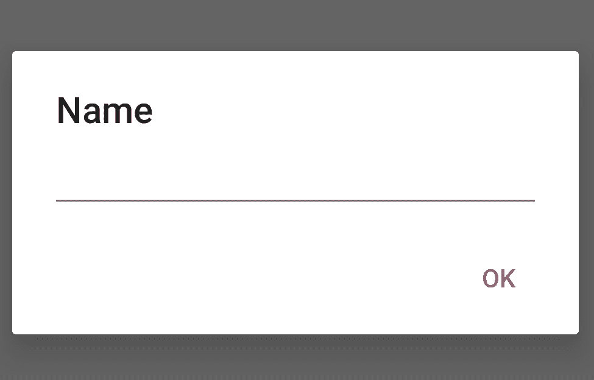

# 如何在安卓中创建自定义 AlertDialog

> 原文:[https://www . geeksforgeeks . org/如何在安卓中创建自定义 alertdialog/](https://www.geeksforgeeks.org/how-to-create-a-custom-alertdialog-in-android/)

有时在 [AlertDialog](https://www.geeksforgeeks.org/android-alert-dialog-box-and-how-to-create-it/) 中，需要得到用户的输入或者根据我们的要求进行定制。所以我们创建了自定义警报日志。这篇文章将展示如何定制警报对话框并从中获取输入。

[](https://media.geeksforgeeks.org/wp-content/uploads/20200516144050/aa14-1.png)

下面是上述方法的逐步实现:

*   **步骤 1:** 创建一个 XML 文件: **custom_layout.xml** 。在 custom_layout.xml 中添加以下代码。该代码定义 alertdialog 框尺寸，并在其中添加一个 **edittext** 。

    ```
    <?xml version="1.0" encoding="utf-8"?>
    <LinearLayout
      xmlns:android="http://schemas.android.com/apk/res/android"
      android:orientation="vertical"
      android:paddingLeft="20dp"
      android:paddingRight="20dp"
      android:layout_width="match_parent"
      android:layout_height="match_parent">

      <EditText
        android:id="@+id/editText"
        android:layout_width="match_parent"
        android:layout_height="wrap_content"/>
    </LinearLayout>
    ```

*   **第二步:**在 **activity_main.xml** 中增加一个按钮。单击该按钮将显示警报对话框。

    ```
    <?xml version="1.0" encoding="utf-8"?>
    <LinearLayout
        xmlns:android="http://schemas.android.com/apk/res/android"
        xmlns:app="http://schemas.android.com/apk/res-auto"
        xmlns:tools="http://schemas.android.com/tools"
        android:layout_width="match_parent"
        android:layout_height="match_parent"
        android:gravity="center"
        android:id="@+id/root"
        android:orientation="vertical"
        tools:context=".MainActivity">

        <Button
            android:layout_width="match_parent"
            android:layout_height="wrap_content"
            android:onClick="showAlertDialogButtonClicked"
            android:text="Show Dialog"
         />
    </LinearLayout>
    ```

*   **Step 3:**

    在您想要在此显示自定义警报对话框的活动中添加 **custom_layout.xml** ，它是在 MainActivity.java 添加的。

    ```
    public class MainActivity
        extends AppCompatActivity {

        @Override
        protected void onCreate(
            Bundle savedInstanceState)
        {
            super.onCreate(savedInstanceState);
            setContentView(R.layout.activity_main);
        }

        public void showAlertDialogButtonClicked(View view)
        {

            // Create an alert builder
            AlertDialog.Builder builder
                = new AlertDialog.Builder(this);
            builder.setTitle("Name");

            // set the custom layout
            final View customLayout
                = getLayoutInflater()
                      .inflate(
                          R.layout.custom_layout,
                          null);
            builder.setView(customLayout);

            // add a button
            builder
                .setPositiveButton(
                    "OK",
                    new DialogInterface.OnClickListener() {

                        @Override
                        public void onClick(
                            DialogInterface dialog,
                            int which)
                        {

                            // send data from the
                            // AlertDialog to the Activity
                            EditText editText
                                = customLayout
                                      .findViewById(
                                          R.id.editText);
                            sendDialogDataToActivity(
                                editText
                                    .getText()
                                    .toString());
                        }
                    });

            // create and show
            // the alert dialog
            AlertDialog dialog
                = builder.create();
            dialog.show();
        }

        // Do something with the data
        // coming from the AlertDialog
        private void sendDialogDataToActivity(String data)
        {
            Toast.makeText(this,
                           data,
                           Toast.LENGTH_SHORT)
                .show();
        }
    }
    ```

**输出:**

<video class="wp-video-shortcode" id="video-413358-1" width="500" height="550" preload="metadata" controls=""><source type="video/mp4" src="https://media.geeksforgeeks.org/wp-content/cdn-uploads/20200601161357/Custom-AlertDialog-in-Android.mp4?_=1">[https://media.geeksforgeeks.org/wp-content/cdn-uploads/20200601161357/Custom-AlertDialog-in-Android.mp4](https://media.geeksforgeeks.org/wp-content/cdn-uploads/20200601161357/Custom-AlertDialog-in-Android.mp4)</video>