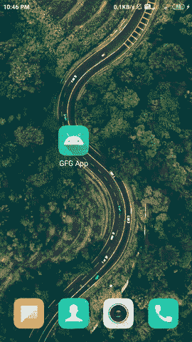

# 如何创建安卓应用的自定义介绍滑块？

> 原文:[https://www . geesforgeks . org/how-create-custom-intro-slider-of-an-Android-app/](https://www.geeksforgeeks.org/how-to-create-a-custom-intro-slider-of-an-android-app/)

许多应用程序中的 Intro Slider 主要用于教育用户了解应用程序、应用程序的功能以及我们的应用程序将向我们提供的服务。在本文中，我们将看看自定义介绍滑块在我们的应用程序中的实现。

### 我们将在本文中构建什么？

我们将建立一个简单的应用程序，其中我们将显示一个介绍滑块，我们将在我们的应用程序中显示滑块。该滑块包含一个简单的图像和两个[文本视图](https://www.geeksforgeeks.org/textview-widget-in-android-using-java-with-examples/)。下面给出了一个 GIF 示例，来了解一下我们将在本文中做什么。注意，我们将使用 **Java** 语言来实现这个项目。



### **逐步实现自定义介绍滑块**

**第一步:创建新项目**

要在安卓工作室创建新项目，请参考[如何在安卓工作室创建/启动新项目](https://www.geeksforgeeks.org/android-how-to-create-start-a-new-project-in-android-studio/)。注意选择 **Java** 作为编程语言。

**第二步:在你的 build.gradle 文件中添加毕加索的依赖关系**

因为我们将从网上下载所有图片，所以我们将使用[毕加索](https://www.geeksforgeeks.org/how-to-use-picasso-image-loader-library-in-android/amp/)从我们的应用程序中的网址下载图片。因此，为了使用来自网址的图像，我们必须在我们的[构建.梯度](https://www.geeksforgeeks.org/android-build-gradle/)文件中添加以下依赖项。

> 实现' com.squareup .毕加索:毕加索:2.71828 '

**第三步:添加互联网权限**

因为我们将从网址加载图像，所以我们必须在您的 **AndroidManifest.xml** 文件中添加互联网权限。用于添加权限。导航至**应用程序>安卓清单. xml** 文件，并添加以下权限。

**第 4 步:使用 activity_main.xml 文件**

导航到**应用程序> res >布局> activity_main.xml** 并将下面的代码添加到该文件中。下面是 **activity_main.xml** 文件的代码。

## 可扩展标记语言

```java
<?xml version="1.0" encoding="utf-8"?>
<RelativeLayout
    xmlns:android="http://schemas.android.com/apk/res/android"
    xmlns:tools="http://schemas.android.com/tools"
    android:layout_width="match_parent"
    android:layout_height="match_parent"
    android:orientation="vertical"
    android:weightSum="5"
    tools:context=".MainActivity">

    <!--view pager for displaying our slides-->
    <androidx.viewpager.widget.ViewPager
        android:id="@+id/idViewPager"
        android:layout_width="match_parent"
        android:layout_height="match_parent" />

    <LinearLayout
        android:layout_width="match_parent"
        android:layout_height="wrap_content"
        android:layout_alignParentBottom="true"
        android:background="@android:color/transparent"
        android:orientation="horizontal"
        android:weightSum="5">

        <View
            android:layout_width="0dp"
            android:layout_height="0dp"
            android:layout_weight="2" />

        <!--adding linear layout for
            creating dots view-->
        <LinearLayout
            android:id="@+id/idLLDots"
            android:layout_width="0dp"
            android:layout_height="wrap_content"
            android:layout_gravity="center_horizontal"
            android:layout_weight="1"
            android:gravity="center_horizontal"
            android:orientation="horizontal" />

        <!--button for skipping our intro slider-->
        <Button
            android:id="@+id/idBtnSkip"
            android:layout_width="0dp"
            android:layout_height="wrap_content"
            android:layout_margin="10dp"
            android:layout_weight="2"
            android:background="@color/purple_500"
            android:backgroundTint="@color/purple_500"
            android:text="Skip"
            android:textAllCaps="false"
            android:textColor="@color/white" />

    </LinearLayout>

</RelativeLayout>
```

**第五步:为我们的滑块项目**创建布局文件

现在，我们将创建一个项目，我们将显示在我们的滑块。因此，要创建新布局，请导航至**应用程序> res >布局>右键单击它>单击新建>布局资源文件**并将其命名为 **slider_layout** 并向其添加以下代码。

## 可扩展标记语言

```java
<?xml version="1.0" encoding="utf-8"?>
<RelativeLayout
    xmlns:android="http://schemas.android.com/apk/res/android"
    android:id="@+id/idRLSlider"
    android:layout_width="match_parent"
    android:layout_height="match_parent">

    <!--text view for displaying
        our heading-->
    <TextView
        android:id="@+id/idTVtitle"
        android:layout_width="match_parent"
        android:layout_height="wrap_content"
        android:layout_margin="20dp"
        android:padding="10dp"
        android:text="Slide 1"
        android:textAlignment="center"
        android:textColor="@color/white"
        android:textSize="20sp"
        android:textStyle="bold" />

    <!--Image view for displaying
        our slider image-->
    <ImageView
        android:id="@+id/idIV"
        android:layout_width="200dp"
        android:layout_height="200dp"
        android:layout_below="@id/idTVtitle"
        android:layout_centerHorizontal="true"
        android:layout_marginTop="50dp"
        android:padding="10dp"
        android:src="@mipmap/ic_launcher" />

    <!--text view for displaying our
        slider description-->
    <TextView
        android:id="@+id/idTVheading"
        android:layout_width="match_parent"
        android:layout_height="wrap_content"
        android:layout_below="@id/idIV"
        android:layout_marginStart="20dp"
        android:layout_marginTop="90dp"
        android:layout_marginEnd="20dp"
        android:padding="10dp"
        android:text="C++ data structure and ALgorithm Course"
        android:textAlignment="center"
        android:textColor="@color/white"
        android:textSize="15sp" />

</RelativeLayout>
```

**步骤 6:创建一个模态类来存储滑块项目的所有数据**

要创建新的 Modal 类，导航到**应用程序> java >你的应用程序的包名>右键单击它，然后单击新建> Java 类**，并将其命名为**slidermodel**。创建此类后，向其中添加以下代码。

## Java 语言(一种计算机语言，尤用于创建网站)

```java
public class SliderModal {

    // string variable for storing
    // title, image url and description.
    private String title;
    private String heading;
    private String imgUrl;
    private int backgroundDrawable;

    public SliderModal() {
        // empty constructor is required
        // when using firebase
    }

    // creating getter methods.
    public String getTitle() {
        return title;
    }

    public void setTitle(String title) {
        this.title = title;
    }

    public String getHeading() {
        return heading;
    }

    // creating setter methods
    public void setHeading(String heading) {
        this.heading = heading;
    }

    public String getImgUrl() {
        return imgUrl;
    }

    public void setImgUrl(String imgUrl) {
        this.imgUrl = imgUrl;
    }

    // constructor for our modal class
    public SliderModal(String title, String heading, String imgUrl, int backgroundDrawable) {
        this.title = title;
        this.heading = heading;
        this.imgUrl = imgUrl;
        this.backgroundDrawable = backgroundDrawable;
    }

    public int getBackgroundDrawable() {
        return backgroundDrawable;
    }

    public void setBackgroundDrawable(int backgroundDrawable) {
        this.backgroundDrawable = backgroundDrawable;
    }
}
```

**第 7 步:创建一个适配器类，为每个视图设置数据**

要创建一个新的适配器类，导航到**应用程序> java >你的应用程序的包名>右键单击它>新的 java 类**并将其命名为 **SliderAdapter** 并添加下面的代码。代码中添加了注释，以更详细地理解代码。

## Java 语言(一种计算机语言，尤用于创建网站)

```java
import android.content.Context;
import android.view.LayoutInflater;
import android.view.View;
import android.view.ViewGroup;
import android.widget.ImageView;
import android.widget.RelativeLayout;
import android.widget.TextView;

import androidx.annotation.NonNull;
import androidx.viewpager.widget.PagerAdapter;

import com.squareup.picasso.Picasso;

import java.util.ArrayList;

public class SliderAdapter extends PagerAdapter {

    // creating variables for layout
    // inflater, context and array list.
    LayoutInflater layoutInflater;
    Context context;
    ArrayList<SliderModal> sliderModalArrayList;

    // creating constructor.
    public SliderAdapter(Context context, ArrayList<SliderModal> sliderModalArrayList) {
        this.context = context;
        this.sliderModalArrayList = sliderModalArrayList;
    }

    @Override
    public int getCount() {
        // inside get count method returning
        // the size of our array list.
        return sliderModalArrayList.size();
    }

    @Override
    public boolean isViewFromObject(@NonNull View view, @NonNull Object object) {
        // inside isViewFrombject method we are
        // returning our Relative layout object.
        return view == (RelativeLayout) object;
    }

    @NonNull
    @Override
    public Object instantiateItem(@NonNull ViewGroup container, int position) {

        // in this method we will initialize all our layout
        // items and inflate our layout file as well.
        layoutInflater = (LayoutInflater) context.getSystemService(context.LAYOUT_INFLATER_SERVICE);

        // below line is use to inflate the
        // layout file which we created.
        View view = layoutInflater.inflate(R.layout.slider_layout, container, false);

        // initializing our views.
        ImageView imageView = view.findViewById(R.id.idIV);
        TextView titleTV = view.findViewById(R.id.idTVtitle);
        TextView headingTV = view.findViewById(R.id.idTVheading);
        RelativeLayout sliderRL = view.findViewById(R.id.idRLSlider);

        // setting data to our views.
        SliderModal modal = sliderModalArrayList.get(position);
        titleTV.setText(modal.getTitle());
        headingTV.setText(modal.getHeading());
        Picasso.get().load(modal.getImgUrl()).into(imageView);

        // below line is to set background
        // drawable to our each item
        sliderRL.setBackground(context.getResources().getDrawable(modal.getBackgroundDrawable()));

        // after setting the data to our views we
        // are adding the view to our container.
        container.addView(view);

        // at last we are
        // returning the view.
        return view;
    }

    @Override
    public void destroyItem(@NonNull ViewGroup container, int position, @NonNull Object object) {
        // this is a destroy view method
        // which is use to remove a view.
        container.removeView((RelativeLayout) object);
    }
}
```

**第 8 步:为每张幻灯片的背景创建可绘制的自定义渐变**

导航到**应用程序> res >可绘制>右键单击它>新建>可绘制资源文件**并将该文件命名为 **gradient_one** ，并在其中添加以下代码。

**gradient_one.xml**

## 可扩展标记语言

```java
<?xml version="1.0" encoding="utf-8"?>
<shape xmlns:android="http://schemas.android.com/apk/res/android"
    android:shape="rectangle">
    <gradient
        android:angle="90"
        android:endColor="@color/purple_500"
        android:startColor="#4B6CD6" />
</shape>
```

**gradient_two.xml**

## 可扩展标记语言

```java
<?xml version="1.0" encoding="utf-8"?>
<shape xmlns:android="http://schemas.android.com/apk/res/android"
    android:shape="rectangle">
    <gradient
        android:angle="90"
        android:endColor="#FF9800"
        android:startColor="#F4C22B" />
</shape>
```

**gradient_three.xml**

## 可扩展标记语言

```java
<?xml version="1.0" encoding="utf-8"?>
<shape xmlns:android="http://schemas.android.com/apk/res/android"
    android:shape="rectangle">
    <gradient
        android:angle="90"
        android:endColor="#F44336"
        android:startColor="#FD7B52" />
</shape>
```

**第九步:使用****MainActivity.java 文件**

转到**MainActivity.java**文件，参考以下代码。以下是**MainActivity.java**文件的代码。代码中添加了注释，以更详细地理解代码。

## Java 语言(一种计算机语言，尤用于创建网站)

```java
import android.os.Bundle;
import android.text.Html;
import android.widget.LinearLayout;
import android.widget.TextView;

import androidx.appcompat.app.AppCompatActivity;
import androidx.viewpager.widget.ViewPager;

import java.util.ArrayList;

public class MainActivity extends AppCompatActivity {

    // creating variables for view pager,
    // liner layout, adapter and our array list.
    private ViewPager viewPager;
    private LinearLayout dotsLL;
    SliderAdapter adapter;
    private ArrayList<SliderModal> sliderModalArrayList;
    private TextView[] dots;
    int size;

    @Override
    protected void onCreate(Bundle savedInstanceState) {
        super.onCreate(savedInstanceState);
        setContentView(R.layout.activity_main);

        // initializing all our views.
        viewPager = findViewById(R.id.idViewPager);
        dotsLL = findViewById(R.id.idLLDots);

        // in below line we are creating a new array list.
        sliderModalArrayList = new ArrayList<>();

        // on below 3 lines we are adding data to our array list.
        sliderModalArrayList.add(new SliderModal("Slide 1 ", "Slide 1 heading", "https://images.unsplash.com/photo-1610842546881-b282c580b51d?ixid=MXwxMjA3fDB8MHxlZGl0b3JpYWwtZmVlZHw5fHx8ZW58MHx8fA%3D%3D&ixlib=rb-1.2.1&auto=format&fit=crop&w=500&q=60", R.drawable.gradient_one));
        sliderModalArrayList.add(new SliderModal("Slide 2 ", "Slide 2 heading", "https://images.unsplash.com/photo-1610783131813-475d08664ef6?ixid=MXwxMjA3fDB8MHxlZGl0b3JpYWwtZmVlZHwxMnx8fGVufDB8fHw%3D&ixlib=rb-1.2.1&auto=format&fit=crop&w=500&q=60", R.drawable.gradient_two));
        sliderModalArrayList.add(new SliderModal("Slide 3 ", "Slide 3 heading", "https://images.unsplash.com/photo-1610832958506-aa56368176cf?ixid=MXwxMjA3fDB8MHxlZGl0b3JpYWwtZmVlZHwxN3x8fGVufDB8fHw%3D&ixlib=rb-1.2.1&auto=format&fit=crop&w=500&q=60", R.drawable.gradient_three));

        // below line is use to add our array list to adapter class.
        adapter = new SliderAdapter(MainActivity.this, sliderModalArrayList);

        // below line is use to set our
        // adapter to our view pager.
        viewPager.setAdapter(adapter);

        // we are storing the size of our
        // array list in a variable.
        size = sliderModalArrayList.size();

        // calling method to add dots indicator
        addDots(size, 0);

        // below line is use to call on
        // page change listener method.
        viewPager.addOnPageChangeListener(viewListner);
    }

    private void addDots(int size, int pos) {
        // inside this method we are
        // creating a new text view.
        dots = new TextView[size];

        // below line is use to remove all
        // the views from the linear layout.
        dotsLL.removeAllViews();

        // running a for loop to add
        // number of dots to our slider.
        for (int i = 0; i < size; i++) {
            // below line is use to add the
            // dots and modify its color.
            dots[i] = new TextView(this);
            dots[i].setText(Html.fromHtml("•"));
            dots[i].setTextSize(35);

            // below line is called when the dots are not selected.
            dots[i].setTextColor(getResources().getColor(R.color.black));
            dotsLL.addView(dots[i]);
        }
        if (dots.length > 0) {
            // this line is called when the dots
            // inside linear layout are selected
            dots[pos].setTextColor(getResources().getColor(R.color.purple_200));
        }
    }

    // creating a method for view pager for on page change listener.
    ViewPager.OnPageChangeListener viewListner = new ViewPager.OnPageChangeListener() {
        @Override
        public void onPageScrolled(int position, float positionOffset, int positionOffsetPixels) {

        }

        @Override
        public void onPageSelected(int position) {
            // we are calling our dots method to
            // change the position of selected dots.
            addDots(size, position);
        }

        @Override
        public void onPageScrollStateChanged(int state) {

        }
    };
}
```

现在运行您的应用程序，并查看应用程序的输出。确保您的互联网处于打开状态。

### **输出:**

<video class="wp-video-shortcode" id="video-548023-1" width="640" height="360" preload="metadata" controls=""><source type="video/mp4" src="https://media.geeksforgeeks.org/wp-content/uploads/20210124225232/Screenrecorder-2021-01-24-22-46-38-295.mp4?_=1">[https://media.geeksforgeeks.org/wp-content/uploads/20210124225232/Screenrecorder-2021-01-24-22-46-38-295.mp4](https://media.geeksforgeeks.org/wp-content/uploads/20210124225232/Screenrecorder-2021-01-24-22-46-38-295.mp4)</video>