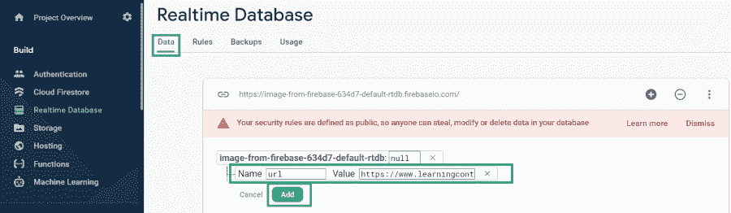

# 如何用 Firebase 实时数据库在安卓系统中创建动态视频播放器？

> 原文:[https://www . geeksforgeeks . org/如何用 firebase-real-database 创建动态安卓视频播放器/](https://www.geeksforgeeks.org/how-to-create-a-dynamic-video-player-in-android-with-firebase-realtime-database/)

大多数应用程序使用视频播放器在应用程序中显示如此多的视频。因此，为了播放视频，应用程序从其视频网址播放视频。但是如果我们想实时更新视频呢？因此，在这种情况下，我们必须更新我们的数据库，然后稍后我们必须更新我们的 APK。所以这不是一个有效的方法。在本文中，我们将看一下使用 [Firebase 实时数据库](https://www.geeksforgeeks.org/firebase-realtime-database-with-operations-in-android-with-examples/)在 Android 中实现动态视频播放器。

### 我们将在本文中构建什么？

我们将构建一个简单的应用程序，在其中我们将在一个 [ExoPlayer](https://www.geeksforgeeks.org/exoplayer-in-android-with-example/) 中播放一个视频，并且我们将从 Firebase 加载一个视频到我们的 ExoPlayer 中。与此同时，我们将能够在运行时更改我们的视频。下面给出了一个示例视频，让我们了解一下在本文中要做什么。注意，我们将使用 **Java** 语言来实现这个项目。

<video class="wp-video-shortcode" id="video-543726-1" width="640" height="360" preload="metadata" controls=""><source type="video/mp4" src="https://media.geeksforgeeks.org/wp-content/uploads/20210113104952/Screenrecorder-2021-01-13-10-47-52-980.mp4?_=1">[https://media.geeksforgeeks.org/wp-content/uploads/20210113104952/Screenrecorder-2021-01-13-10-47-52-980.mp4](https://media.geeksforgeeks.org/wp-content/uploads/20210113104952/Screenrecorder-2021-01-13-10-47-52-980.mp4)</video>

### **分步实施**

**第一步:创建新项目**

要在安卓工作室创建新项目，请参考[如何在安卓工作室创建/启动新项目](https://www.geeksforgeeks.org/android-how-to-create-start-a-new-project-in-android-studio/)。注意选择 **Java** 作为编程语言。

**第二步:将你的应用连接到 Firebase**

创建新项目后。导航到顶部栏上的工具选项。点击火焰基地。点击 Firebase 后，你可以看到截图中下面提到的右栏。


在该列中，导航到 Firebase 实时数据库。点击那个选项，你会看到两个选项:连接应用程序到 Firebase 和添加 Firebase 实时数据库到你的应用程序。单击立即连接选项，您的应用程序将连接到 Firebase。之后点击第二个选项，现在你的应用程序连接到 Firebase。


完成此过程后，您将看到下面的屏幕。


现在验证您的应用程序是否连接到 Firebase。转到您的 build.gradle 文件。导航到**应用程序>渐变脚本>build . grade le(应用程序)**文件，并确保以下依赖项已添加到您的依赖项部分。

> 实现' com . Google . firebase:firebase-数据库:19.6.0 '

添加这个依赖项后，在你的 Gradle 文件中添加 ExoPlayer 的依赖项。

**第三步:在 build.gradle 文件**中添加 ExoPlayer View 的依赖项

导航到**应用程序>渐变脚本>build . grade le(应用程序)**文件，并在其中添加以下依赖项。

> exoplayer 的依赖关系
> 
> 实现' com . Google . Android . exo player:exo player:r 2 . 4 . 0 '
> 
> //获取 exoplayer 中的核心支持。
> 
> 实现' com . Google . Android . exo player:exo player-core:r 2 . 4 . 0 '
> 
> //用于在我们的 exoplayer 中添加 dash 支持。
> 
> 实现' com . Google . Android . exo player:exo player-dash:r 2 . 4 . 0 '
> 
> //用于在 exoplayer 中添加 hls 支持。
> 
> 实现' com . Google . Android . exo player:exo player-HLS:r 2 . 4 . 0 '
> 
> //在我们的 exoplayer 中实现流畅的视频流。
> 
> 实现' com . Google . Android . exo player:exo player-smooth streaming:r 2 . 4 . 0 '
> 
> //用于生成 exoplayer 的默认 ui
> 
> 实现' com . Google . Android . exo player:exo player-ui:r 2 . 4 . 0 '

添加此依赖项后，同步您的项目。现在我们将转向 XML 部分。

**第四步:添加互联网权限**

当我们从互联网加载视频时，我们必须在清单文件中添加互联网权限。导航至**应用程序> AndroidManifest.xml** 文件，并在其中添加以下权限。

## 可扩展标记语言

```java
<!--Permissions for internet-->
<uses-permission android:name="android.permission.INTERNET" />
<uses-permission android:name="android.permission.ACCESS_NETWORK_STATE" />
```

**第 5 步:使用 activity_main.xml 文件**

转到 **activity_main.xml** 文件，参考以下代码。下面是 **activity_main.xml** 文件的代码。

## 可扩展标记语言

```java
<?xml version="1.0" encoding="utf-8"?>
<RelativeLayout
    xmlns:android="http://schemas.android.com/apk/res/android"
    xmlns:tools="http://schemas.android.com/tools"
    android:layout_width="match_parent"
    android:layout_height="match_parent"
    android:orientation="vertical"
    tools:context=".MainActivity">

    <!--Widget for exoplayer view-->
    <com.google.android.exoplayer2.ui.SimpleExoPlayerView
        android:id="@+id/idExoPlayerView"
        android:layout_width="match_parent"
        android:layout_height="500dp" />

</RelativeLayout>
```

**步骤 6:使用 MainActivity.java 文件**

转到**MainActivity.java**文件，参考以下代码。以下是**MainActivity.java**文件的代码。代码中添加了注释，以更详细地理解代码。

## Java 语言(一种计算机语言，尤用于创建网站)

```java
import android.net.Uri;
import android.os.Bundle;
import android.util.Log;
import android.widget.Toast;

import androidx.annotation.NonNull;
import androidx.appcompat.app.AppCompatActivity;

import com.google.android.exoplayer2.ExoPlayerFactory;
import com.google.android.exoplayer2.SimpleExoPlayer;
import com.google.android.exoplayer2.extractor.DefaultExtractorsFactory;
import com.google.android.exoplayer2.extractor.ExtractorsFactory;
import com.google.android.exoplayer2.source.ExtractorMediaSource;
import com.google.android.exoplayer2.source.MediaSource;
import com.google.android.exoplayer2.trackselection.AdaptiveTrackSelection;
import com.google.android.exoplayer2.trackselection.DefaultTrackSelector;
import com.google.android.exoplayer2.trackselection.TrackSelector;
import com.google.android.exoplayer2.ui.SimpleExoPlayerView;
import com.google.android.exoplayer2.upstream.BandwidthMeter;
import com.google.android.exoplayer2.upstream.DefaultBandwidthMeter;
import com.google.android.exoplayer2.upstream.DefaultHttpDataSourceFactory;
import com.google.firebase.database.DataSnapshot;
import com.google.firebase.database.DatabaseError;
import com.google.firebase.database.DatabaseReference;
import com.google.firebase.database.FirebaseDatabase;
import com.google.firebase.database.ValueEventListener;

public class MainActivity extends AppCompatActivity {

    // creating a variable for our Firebase Database.
    FirebaseDatabase firebaseDatabase;

    // creating a variable for our Database
    // Reference for Firebase.
    DatabaseReference databaseReference;

    // creating a variable for exoplayerview.
    SimpleExoPlayerView exoPlayerView;

    // creating a variable for exoplayer
    SimpleExoPlayer exoPlayer;

    @Override
    protected void onCreate(Bundle savedInstanceState) {
        super.onCreate(savedInstanceState);
        setContentView(R.layout.activity_main);
        exoPlayerView = findViewById(R.id.idExoPlayerView);

        // below line is used to get the
        // instance of our Firebase database.
        firebaseDatabase = FirebaseDatabase.getInstance();

        // below line is used to get reference for our database.
        databaseReference = firebaseDatabase.getReference("url");
        getVideoUrl();
    }

    private void getVideoUrl() {
        // calling add value event listener method
        // for getting the values from database.
        databaseReference.addValueEventListener(new ValueEventListener() {
            @Override
            public void onDataChange(@NonNull DataSnapshot snapshot) {
                // this method is call to get the
                // realtime updates in the data.
                // this method is called when the
                // data is changed in our Firebase console.
                // below line is for getting the data
                // from snapshot of our database.
                String videoUrl = snapshot.getValue(String.class);

                // after getting the value for our video url
                // we are passing that value to our
                // initialize exoplayer method to load our video
                initializeExoplayerView(videoUrl);
            }

            @Override
            public void onCancelled(@NonNull DatabaseError error) {
                // calling on cancelled method when we receive
                // any error or we are not able to get the data.
                Toast.makeText(MainActivity.this, "Fail to get video url.", Toast.LENGTH_SHORT).show();
            }
        });
    }

    private void initializeExoplayerView(String videoURL) {
        try {
            // bandwidthmeter is used for getting default bandwidth
            BandwidthMeter bandwidthMeter = new DefaultBandwidthMeter();
            // track selector is used to navigate between video using a default seeker.
            TrackSelector trackSelector = new DefaultTrackSelector(new AdaptiveTrackSelection.Factory(bandwidthMeter));

            // we are adding our track selector to exoplayer.
            exoPlayer = ExoPlayerFactory.newSimpleInstance(this, trackSelector);

            // we are parsing a video url and
            // parsing its video uri.
            Uri videouri = Uri.parse(videoURL);

            // we are creating a variable for data source
            // factory and setting its user agent as 'exoplayer_view'
            DefaultHttpDataSourceFactory dataSourceFactory = new DefaultHttpDataSourceFactory("exoplayer_video");

            // we are creating a variable for extractor
            // factory and setting it to default extractor factory.
            ExtractorsFactory extractorsFactory = new DefaultExtractorsFactory();

            // we are creating a media source with above variables
            // and passing our event handler as null,
            MediaSource mediaSource = new ExtractorMediaSource(videouri, dataSourceFactory, extractorsFactory, null, null);

            // inside our exoplayer view
            // we are setting our player
            exoPlayerView.setPlayer(exoPlayer);

            // we are preparing our exoplayer
            // with media source.
            exoPlayer.prepare(mediaSource);

            // we are setting our exoplayer
            // when it is ready.
            exoPlayer.setPlayWhenReady(true);
        } catch (Exception e) {
            // below line is used for handling our errors.
            Log.e("TAG", "Error : " + e.toString());
        }
    }
}
```

**第七步:在你的 Firebase 控制台中添加视频的网址**

用于在 Firebase 控制台中添加视频网址。在浏览器中浏览 Firebase，点击右上角的转到控制台选项，如下图所示。


点击“转到控制台”选项后，您将看到您的项目。从可用项目列表中单击您的项目名称。


点击你的项目后。点击左侧窗口中的**实时数据库**选项。


点击此选项后，您将看到右侧的屏幕。在此页面上，单击顶部栏中的规则选项。你会看到下面的屏幕。


在这个项目中，我们将我们的规则作为读写规则添加，因为我们不使用任何身份验证来验证我们的用户。因此，我们目前将其设置为 true 以测试我们的应用程序。改变规则后。点击右上角的发布按钮，您的规则将保存在那里。现在再次回到数据选项卡。现在，我们将从 Firebase 本身手动向 Firebase 添加数据。

Firebase 实时数据库内部。导航到数据选项卡。在该选项卡的数据库部分，单击“+”图标。单击“+”图标后，您将看到两个输入字段，即“名称”和“值”字段。在“名称”字段中，您必须添加视频文件的引用，在我们的例子中是“ **url** ”。在我们的值字段中，我们必须添加视频文件的网址。将该字段中的值相加后。点击添加按钮，您的数据将被添加到 Firebase 控制台。



添加视频的网址后。现在运行您的应用程序，并查看下面的应用程序输出:

### **输出:**

您可以动态更改视频的网址。

<video class="wp-video-shortcode" id="video-543726-2" width="640" height="360" preload="metadata" controls=""><source type="video/mp4" src="https://media.geeksforgeeks.org/wp-content/uploads/20210113104952/Screenrecorder-2021-01-13-10-47-52-980.mp4?_=2">[https://media.geeksforgeeks.org/wp-content/uploads/20210113104952/Screenrecorder-2021-01-13-10-47-52-980.mp4](https://media.geeksforgeeks.org/wp-content/uploads/20210113104952/Screenrecorder-2021-01-13-10-47-52-980.mp4)</video>