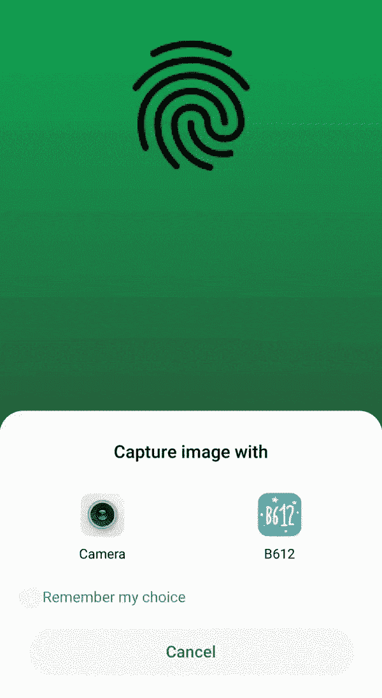
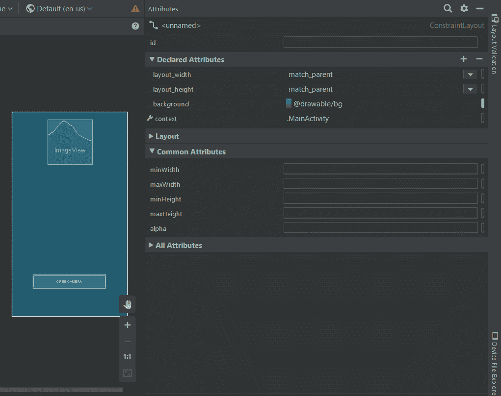
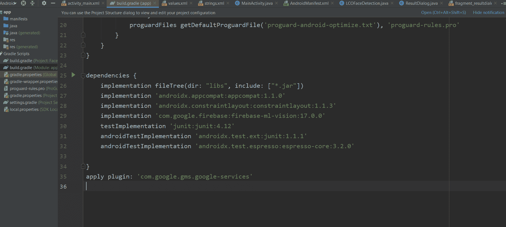
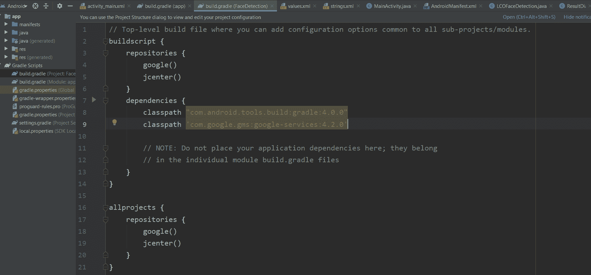
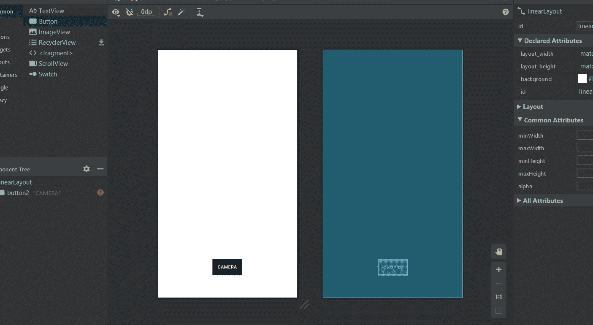

# 如何在 Firebase

上使用机器学习工具包创建人脸检测安卓应用

> 原文:[https://www . geesforgeks . org/如何创建人脸检测-安卓-应用-使用-机器学习-firebase 上的工具包/](https://www.geeksforgeeks.org/how-to-create-a-face-detection-android-app-using-machine-learning-kit-on-firebase/)

**先决条件:**

*   [Firebase 机器学习套件](https://www.geeksforgeeks.org/firebase-machine-learning-kit/)
*   [给安卓应用添加 Firebase](https://www.geeksforgeeks.org/adding-firebase-to-android-app/)

[Firebase ML KIT](https://www.geeksforgeeks.org/firebase-machine-learning-kit/) 旨在通过提供一系列可以在 iOS 和安卓应用中使用的预训练模型，让机器学习变得更加容易。让我们使用 ML Kit 的人脸检测 API 来识别照片中的人脸。在本文的最后，我们将有一个应用程序，可以识别图像中的人脸，然后显示关于这些人脸的信息，例如这个人是否在微笑，或者他们的眼睛是否闭上了美妙的图形用户界面。



### 方法

**第一步:创建新项目**

1.  在 android studio 中打开一个**新项目**，想用什么名字都可以。
2.  我们将为特定项目处理**空活动**。
3.  该特定项目所需的最低 **SDK** 为 **23** ，因此选择任何 23 或以上的 API。
4.  这个项目使用的语言是 **JAVA** 。
5.  除了上面提到的选项之外，所有选项都保持不变。
6.  点击**完成**。

**第二步:连接 Firebase 上的 ML KIT。**

1.  登录或注册[](https://console.firebase.google.com/)**。**
2.  **在 Firebase 控制台中，创建一个**新项目**或者如果你想使用一个现有的项目，那么打开它。**
3.  ****根据自己的选择命名**项目。**
4.  **转到**文档**。**
5.  **点击 Firebase ML，在左边空白处，选择“视觉”下的“**识别文字**”。**
6.  **为了更好地理解，请完成上述步骤。**
7.  **回到安卓工作室。**
8.  **转到**工具- > Firebase - >分析- >连接 Firebase - >从出现的对话框中选择您的项目- >点击连接。**(这一步[将你的安卓应用连接到 Firebase](https://www.geeksforgeeks.org/adding-firebase-to-android-app/) )**

****第三步:定制资产和梯度****

*   **要增强图形用户界面，请选择。png 格式，并将其添加到 res 文件夹中，并将其设置为 main 的背景。xml 文件，或者进入布局的设计视图，在**声明属性** *下自定义背景，设置背景颜色，如下图:***

**[](https://media.geeksforgeeks.org/wp-content/uploads/20200726124509/Screenshot3.png)**

*   **要在应用程序中包含 ML KIT 依赖项，请转到 **Gradle 脚本- > build.gradle(模块:应用程序)**并添加下面提到的实现:**

> **实现' com . Google . firebase:firebase-ml-vision:17 . 0 . 0 '**

*   **现在复制下面提到的文本，并将其粘贴到应用程序级 Gradle 的最末端，在所有括号之外，如下图所示。**

> **应用插件:‘com . Google . GMS . Google-services’**

**[](https://media.geeksforgeeks.org/wp-content/uploads/20200726125225/Screenshot7.png)**

*   **接下来，转到 **build.gradle (project)** 复制下面提到的文本，粘贴到**依赖项的类路径**中，如下图所示。**

> **类路径' com . Google . GMS:Google-services:4 . 2 . 0 '**

**[](https://media.geeksforgeeks.org/wp-content/uploads/20200726125213/Screenshot6.png)**

*   **点击**立即同步**。**

****第四步:设计 UI****

*   **下面是基本的 XML 文件的代码。添加[按钮](https://www.geeksforgeeks.org/button-in-kotlin/)打开摄像头选项。**

## **可扩展标记语言**

```
<?xml version="1.0" encoding="UTF-8"?>
<androidx.constraintlayout.widget.ConstraintLayout
    tools:context=".MainActivity"
    android:layout_height="match_parent"
    android:layout_width="match_parent"
    xmlns:tools="http://schemas.android.com/tools"
    xmlns:app="http://schemas.android.com/apk/res-auto"
    xmlns:android="http://schemas.android.com/apk/res/android">

    <Button
        android:background="#000000"
        android:layout_height="wrap_content"
        android:layout_width="wrap_content"
        app:layout_constraintStart_toStartOf="parent"
        app:layout_constraintEnd_toEndOf="parent"
        app:layout_constraintBottom_toBottomOf="parent"
        android:text=CAMERA
        android:layout_marginBottom="100dp"
        android:padding="16dp"
        android:id="@+id/camera_button"/>
</androidx.constraintlayout.widget.ConstraintLayout>
```

*   **现在的 UI 会是这样的。**

****

*   **现在转到**布局- >新建- >布局资源文件- >名称:fragment_resultdialog.xml.** 这个文件是为了自定义输出屏幕而创建的，它将显示一个名为结果对话框的对话框，其中有一个名为结果文本的文本视图，包含检测到的图像的所有属性。下面是创建的 XML 文件的 XML 文件。**

## **可扩展标记语言**

```
<?xml version="1.0" encoding="UTF-8"?>
<androidx.constraintlayout.widget.ConstraintLayout
    android:layout_height="match_parent"
    android:layout_width="match_parent"
    xmlns:tools="http://schemas.android.com/tools"
    xmlns:app="http://schemas.android.com/apk/res-auto"
    xmlns:android="http://schemas.android.com/apk/res/android">

    <ScrollView
        android:layout_width="wrap_content"
        android:layout_height="wrap_content"
        app:layout_constraintBottom_toBottomOf="parent"
        app:layout_constraintStart_toStartOf="parent"
        app:layout_constraintTop_toTopOf="parent">

        <RelativeLayout
            android:id="@+id/relativeLayout"
            android:layout_width="match_parent"
            android:layout_height="wrap_content"
            android:layout_marginStart="20dp"
            android:layout_marginEnd="20dp"
            app:layout_constraintEnd_toEndOf="parent"
            app:layout_constraintStart_toStartOf="parent"
            app:layout_constraintTop_toTopOf="parent">

            <!--text view to display the result text
                          after reading an image-->
            <TextView
                android:id="@+id/result_text_view"
                android:layout_width="match_parent"
                android:layout_height="wrap_content"
                android:gravity="center"
                android:text="LCOFaceDetection"
                android:textColor="#000000"
                android:textSize="18sp"
                app:layout_constraintEnd_toEndOf="parent"
                app:layout_constraintStart_toStartOf="parent"
                app:layout_constraintTop_toTopOf="parent"/>

            <!--a button with text 'ok' written on it-->
            <Button
                android:id="@+id/result_ok_button"
                android:layout_width="wrap_content"
                android:layout_height="wrap_content"
                android:layout_below="@id/result_text_view"
                android:layout_centerInParent="true"
                android:layout_marginTop="20dp"
                android:layout_marginBottom="5dp"
                android:background="#75DA8B"
                android:padding="16dp"
                android:text="ok"
                app:layout_constraintEnd_toEndOf="parent"
                app:layout_constraintStart_toStartOf="parent"
                app:layout_constraintTop_toBottomOf="@+id/result_text_view"/>

        </RelativeLayout>

    </ScrollView>

</androidx.constraintlayout.widget.ConstraintLayout>
```

****第五步:Firebase 应用初始化器****

*   **通过 **java - > new - > class - >创建一个新的 java 类名称:LCOFaceDetection.java->超类:Application(Android . app . Application)。**下面是 java 类的示例源代码。**

## **Java 语言(一种计算机语言，尤用于创建网站)**

```
import android.app.Application;
import com.google.firebase.FirebaseApp;

public class LCOFaceDetection extends Application {
    public final static String RESULT_TEXT = "RESULT_TEXT";
    public final static String RESULT_DIALOG = "RESULT_DIALOG";

    // initializing our firebase
    @Override
    public void onCreate()
    {
        super.onCreate();
        FirebaseApp.initializeApp(this);
    }
}
```

****第六步:打开结果对话框****

*   **创建一个新的 java 类，即**ResultDialog.java 和超类，DialogFragment** ，这是**fragment _ result dialog . XML**的 java 文件。下面是 java 文件的示例代码。**

## **Java 语言(一种计算机语言，尤用于创建网站)**

```
import android.os.Bundle;
import android.view.LayoutInflater;
import android.view.View;
import android.view.ViewGroup;
import android.widget.Button;
import android.widget.TextView;
import androidx.annotation.NonNull;
import androidx.annotation.Nullable;
import androidx.fragment.app.DialogFragment;

public class ResultDialog extends DialogFragment {
    Button okBtn;
    TextView resultTextView;

    @Nullable
    @Override
    public View
    onCreateView(@NonNull LayoutInflater inflater,
                 @Nullable ViewGroup container,
                 @Nullable Bundle savedInstanceState)
    {

        // importing View so as to inflate
        // the layout of our result dialog
        // using layout inflater.
        View view = inflater.inflate(
            R.layout.fragment_resultdialog, container,
            false);
        String resultText = "";

        // finding the elements by their id's.
        okBtn = view.findViewById(R.id.result_ok_button);
        resultTextView
            = view.findViewById(R.id.result_text_view);

        // To get the result text
        // after final face detection
        // and append it to the text view.
        Bundle bundle = getArguments();
        resultText = bundle.getString(
            LCOFaceDetection.RESULT_TEXT);
        resultTextView.setText(resultText);

        // Onclick listener so as
        // to make a dismissable button
        okBtn.setOnClickListener(
            new View.OnClickListener() {
                @Override
                public void onClick(View v)
                {
                    dismiss();
                }
            });
        return view;
    }
}
```

****第七步:打开真实设备上的摄像头并启用人脸检测****

*   **下面是**主 java 文件**的示例代码。**
*   **为此需要 **FirebaseVision** 和**firebasevisionface detector**类。**
*   **以下是您可以在人脸检测模型中配置的所有设置列表。**

<figure class="table">

| 环境 | 描述 |
| --- | --- |
| 性能模式 | 快速(默认)&#124;准确在检测人脸时，更注重速度或准确性。 |
| 检测地标 | 无地标(默认)&#124;所有地标是否尝试识别面部“地标”:眼睛、耳朵、鼻子、脸颊、嘴巴等等。 |
| 检测轮廓 | 无轮廓(默认)&#124;所有轮廓是否检测面部特征的轮廓。仅对图像中最突出的面部检测轮廓。 |
| 分类人脸 | 无分类(默认)&#124;所有分类是否将人脸分类比如“微笑”和“睁大眼睛”。 |
| 最小表面尺寸 | 浮点(默认值:0.1f)要检测的人脸相对于图像的最小尺寸。 |
| 启用面部跟踪 | false(默认)&#124; true是否给人脸分配一个标识可用于跟踪图像中的人脸。请注意，当启用轮廓检测时，只检测到一张脸，所以人脸跟踪不会产生有用的结果。出于这个原因，并加以改进检测速度，不要同时启用轮廓检测和人脸跟踪。 |

</figure>

*   **建议阅读这些类的详细分析，并在 Firebase ML 文档中处理代码以进行文本识别。**

## **Java 语言(一种计算机语言，尤用于创建网站)**

```
/*package whatever do not write package name here*/

import androidx.annotation.NonNull;
import androidx.annotation.Nullable;
import androidx.appcompat.app.AppCompatActivity;
import androidx.fragment.app.DialogFragment;
import android.content.Intent;
import android.graphics.Bitmap;
import android.os.Bundle;
import android.provider.MediaStore;
import android.view.View;
import android.widget.Button;
import android.widget.Toast;
import com.google.android.gms.tasks.OnFailureListener;
import com.google.android.gms.tasks.OnSuccessListener;
import com.google.firebase.FirebaseApp;
import com.google.firebase.ml.vision.FirebaseVision;
import com.google.firebase.ml.vision.common.FirebaseVisionImage;
import com.google.firebase.ml.vision.common.FirebaseVisionPoint;
import com.google.firebase.ml.vision.face.FirebaseVisionFace;
import com.google.firebase.ml.vision.face.FirebaseVisionFaceDetector;
import com.google.firebase.ml.vision.face.FirebaseVisionFaceDetectorOptions;
import com.google.firebase.ml.vision.face.FirebaseVisionFaceLandmark;
import java.util.List;

public class MainActivity extends AppCompatActivity {
    Button cameraButton;

    // whenever we request for our customized permission, we
    // need to declare an integer and initialize it to some
    // value .
    private final static int REQUEST_IMAGE_CAPTURE = 124;
    FirebaseVisionImage image;
    FirebaseVisionFaceDetector detector;

    @Override
    protected void onCreate(Bundle savedInstanceState)
    {
        super.onCreate(savedInstanceState);
        setContentView(R.layout.activity_main);

        // initializing our firebase in main activity
        FirebaseApp.initializeApp(this);

        // finding the elements by their id's alloted.
        cameraButton = findViewById(R.id.camera_button);

        // setting an onclick listener to the button so as
        // to request image capture using camera
        cameraButton.setOnClickListener(
            new View.OnClickListener() {
                @Override
                public void onClick(View v)
                {

                    // makin a new intent for opening camera
                    Intent intent = new Intent(
                        MediaStore.ACTION_IMAGE_CAPTURE);
                    if (intent.resolveActivity(
                            getPackageManager())
                        != null) {
                        startActivityForResult(
                            intent, REQUEST_IMAGE_CAPTURE);
                    }
                    else {
                        // if the image is not captured, set
                        // a toast to display an error image.
                        Toast
                            .makeText(
                                MainActivity.this,
                                "Something went wrong",
                                Toast.LENGTH_SHORT)
                            .show();
                    }
                }
            });
    }

    @Override
    protected void onActivityResult(int requestCode,
                                    int resultCode,
                                    @Nullable Intent data)
    {
        // after the image is captured, ML Kit provides an
        // easy way to detect faces from variety of image
        // types like Bitmap

        super.onActivityResult(requestCode, resultCode,
                               data);
        if (requestCode == REQUEST_IMAGE_CAPTURE
            && resultCode == RESULT_OK) {
            Bundle extra = data.getExtras();
            Bitmap bitmap = (Bitmap)extra.get("data");
            detectFace(bitmap);
        }
    }

    // If you want to configure your face detection model
    // according to your needs, you can do that with a
    // FirebaseVisionFaceDetectorOptions object.
    private void detectFace(Bitmap bitmap)
    {
        FirebaseVisionFaceDetectorOptions options
            = new FirebaseVisionFaceDetectorOptions
                  .Builder()
                  .setModeType(
                      FirebaseVisionFaceDetectorOptions
                          .ACCURATE_MODE)
                  .setLandmarkType(
                      FirebaseVisionFaceDetectorOptions
                          .ALL_LANDMARKS)
                  .setClassificationType(
                      FirebaseVisionFaceDetectorOptions
                          .ALL_CLASSIFICATIONS)
                  .build();

        // we need to create a FirebaseVisionImage object
        // from the above mentioned image types(bitmap in
        // this case) and pass it to the model.
        try {
            image = FirebaseVisionImage.fromBitmap(bitmap);
            detector = FirebaseVision.getInstance()
                           .getVisionFaceDetector(options);
        }
        catch (Exception e) {
            e.printStackTrace();
        }

        // It’s time to prepare our Face Detection model.
        detector.detectInImage(image)
            .addOnSuccessListener(new OnSuccessListener<List<FirebaseVisionFace> >() {
                @Override
                // adding an onSuccess Listener, i.e, in case
                // our image is successfully detected, it will
                // append it's attribute to the result
                // textview in result dialog box.
                public void onSuccess(
                    List<FirebaseVisionFace>
                        firebaseVisionFaces)
                {
                    String resultText = "";
                    int i = 1;
                    for (FirebaseVisionFace face :
                         firebaseVisionFaces) {
                        resultText
                            = resultText
                                  .concat("\nFACE NUMBER. "
                                          + i + ": ")
                                  .concat(
                                      "\nSmile: "
                                      + face.getSmilingProbability()
                                            * 100
                                      + "%")
                                  .concat(
                                      "\nleft eye open: "
                                      + face.getLeftEyeOpenProbability()
                                            * 100
                                      + "%")
                                  .concat(
                                      "\nright eye open "
                                      + face.getRightEyeOpenProbability()
                                            * 100
                                      + "%");
                        i++;
                    }

                    // if no face is detected, give a toast
                    // message.
                    if (firebaseVisionFaces.size() == 0) {
                        Toast
                            .makeText(MainActivity.this,
                                      "NO FACE DETECT",
                                      Toast.LENGTH_SHORT)
                            .show();
                    }
                    else {
                        Bundle bundle = new Bundle();
                        bundle.putString(
                            LCOFaceDetection.RESULT_TEXT,
                            resultText);
                        DialogFragment resultDialog
                            = new ResultDialog();
                        resultDialog.setArguments(bundle);
                        resultDialog.setCancelable(true);
                        resultDialog.show(
                            getSupportFragmentManager(),
                            LCOFaceDetection.RESULT_DIALOG);
                    }
                }
            }) // adding an onfailure listener as well if
            // something goes wrong.
            .addOnFailureListener(new OnFailureListener() {
                @Override
                public void onFailure(@NonNull Exception e)
                {
                    Toast
                        .makeText(
                            MainActivity.this,
                            "Oops, Something went wrong",
                            Toast.LENGTH_SHORT)
                        .show();
                }
            });
    }
}
```

### **输出**

**<video class="wp-video-shortcode" id="video-459559-1" width="640" height="360" preload="metadata" controls=""><source type="video/mp4" src="https://media.geeksforgeeks.org/wp-content/uploads/20200801151012/gfg-video.mp4?_=1">[https://media.geeksforgeeks.org/wp-content/uploads/20200801151012/gfg-video.mp4](https://media.geeksforgeeks.org/wp-content/uploads/20200801151012/gfg-video.mp4)</video>**