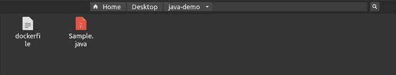
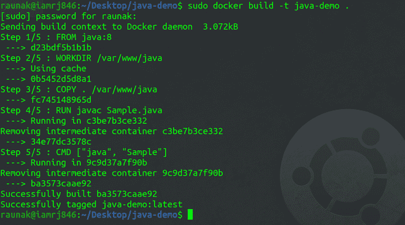
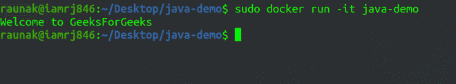

# 如何创建一个 Java Docker 容器？

> 原文:[https://www . geesforgeks . org/如何创建一个-java-docker-container/](https://www.geeksforgeeks.org/how-to-create-a-java-docker-container/)

Java 是最流行的语言之一，支持许多企业应用程序。在本地机器上运行 Java 需要安装 Java IDE、Java JDK、Java JRE，并且需要设置路径和环境变量。这似乎是一项艰巨的任务，尤其是如果你只想运行一个简单的程序。在本文中，我们将讨论如何在 Docker 容器中运行 Java。

### 步骤 1:创建一个示例 Java 应用程序

我们将创建一个简单的 Java 应用程序，其中包含一个 print 语句。参考下面的程序。请注意，您的文件名和主类名应该完全匹配。

## Java 语言(一种计算机语言，尤用于创建网站)

```
class Sample{
     public static void main(String args[]){
         System.out.println("Welcome to GeeksForGeeks");
     }
}
```

### 步骤 2:创建文档文件

看看下面的 *Dockerfile* 。

```
FROM java:8
WORKDIR /var/www/java
COPY . /var/www/java
RUN javac Sample.java
CMD ["java", "Sample"]

```

在上面的 *Dockerfile* 中，我们已经从 *DockerHub* 中提取了 Java 基础图像。我们已经设置了工作目录，并将文件复制到工作目录中。之后，我们编译了我们的 Java 应用程序并运行了可执行文件。

请注意，您的目录结构应该如下所示。



### 第三步:建立码头工人形象

现在，您可以使用 Docker 构建命令来构建 Docker 映像。

```
sudo docker build -t java-demo .

```



### 步骤 4:运行 Docker 容器

构建好 Docker 映像后，可以使用 Docker 运行命令运行 Docker 容器。

```
sudo docker run -it java-demo

```



您可以看到程序已经成功执行，并且在运行容器后已经打印了结果。