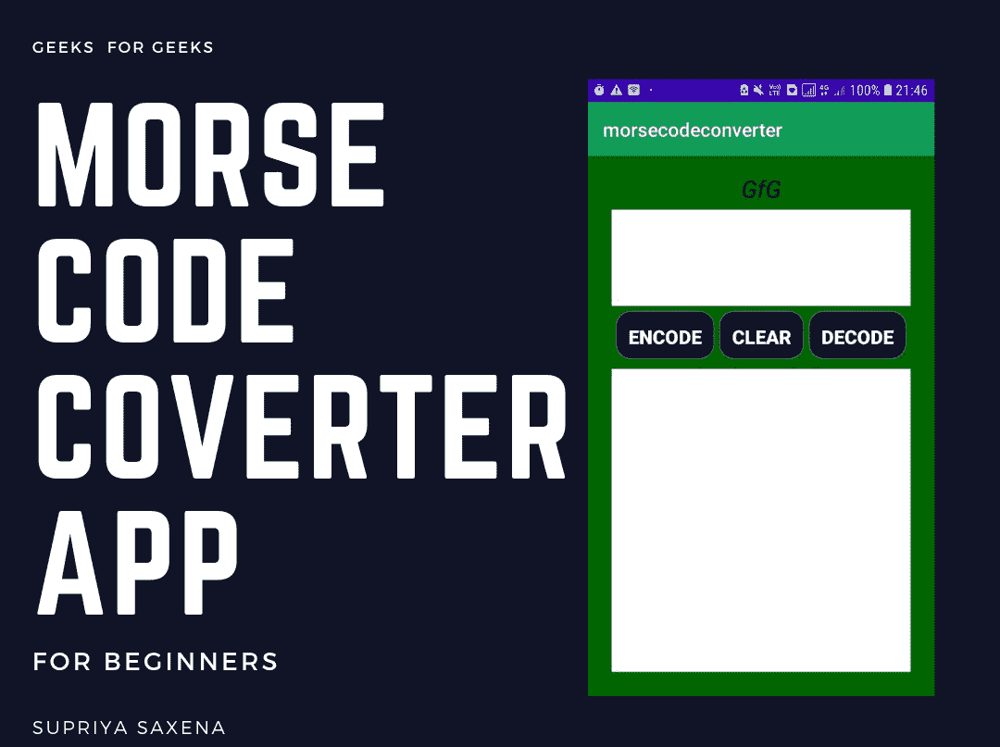

# 如何创建莫尔斯码转换器安卓 App？

> 原文:[https://www . geesforgeks . org/how-create-a-morse-code-converter-Android-app/](https://www.geeksforgeeks.org/how-to-create-a-morse-code-converter-android-app/)

**[莫尔斯电码](https://en.wikipedia.org/wiki/Morse_code)** 是一种使用点和破折号对字符和文本进行编码的方式。国际莫尔斯电码包含 26 个字母的字母表和一些非英语字母的阿拉伯数字以及一些标点符号。在莫尔斯电码中，大写字母和小写字母没有区别。莫尔斯电码的传输是用点持续时间来测量的。**莫尔斯电码转换器应用程序**是一个用于将给定语句转换为莫尔斯电码的应用程序。这是使用[安卓工作室](https://www.geeksforgeeks.org/guide-to-install-and-set-up-android-studio/)完成的。使用的语言有 **[Java](https://www.geeksforgeeks.org/java/)** 和 **[XML](https://www.geeksforgeeks.org/xml-basics/)** 。


因此，在本文中，让我们使用 Java 语言创建一个莫尔斯电码转换器[安卓](https://www.geeksforgeeks.org/android-app-development-fundamentals-for-beginners/)应用程序。该项目还涉及将莫尔斯电码转换为相关声明。这意味着编码和解码都可以使用这个安卓应用程序来完成。
T3】

#### 所需的软件工具

本项目所需的软件工具有:

1.  Android studio ide(1 . 0 . 2)
2.  应用编程接口级别为 21 的软件开发工具包(最低版本)
3.  JAVA 7 及以上版本
4.  安卓智能手机–版本 4.2.2(果冻豆及以上版本)(仅用于测试软件)

#### 方法

**第一步:创建新项目**

要在安卓工作室创建新项目，请参考[如何在安卓工作室创建/启动新项目](https://www.geeksforgeeks.org/android-how-to-create-start-a-new-project-in-android-studio/)。注意选择 **Java** 作为编程语言。

**步骤 2:创建圆形按钮**

此步骤是可选的(仅当您想要一个圆角的黑色按钮时)。在**项目**选项卡中，在屏幕的左上角，点击**应用程序**文件夹。然后，点击 **res** 文件夹。然后，右击**可绘制**文件夹，选择**新建**，然后选择**可绘制资源文件**。给这个资源文件命名。请记住，资源文件的名称只能使用小写字母。编写下面的代码为圆角黑色按钮创建一个资源文件。在按钮的 XML 代码中使用这个资源文件作为背景，可以得到圆角的黑色按钮。

## 我的按钮.xml

```java
<?xml version="1.0" encoding="utf-8"?>
<selector xmlns:android="http://schemas.android.com/apk/res/android">
    <item>
        <shape android:shape="rectangle">
            <corners android:radius="15dip" />
            <stroke android:width="1dip" android:color="#5e7974" />
            <gradient android:angle="-90" android:endColor="#091037" 
                                     android:startColor="#0C000E" />
        </shape>
    </item>
</selector> 
```

如果你想使用默认按钮或其他按钮，那么跳过这个可选步骤，不要在按钮的背景中包含资源文件。

**第三步:使用 activity_main.xml 文件**

*   打开 activity_main.xml 文件，开始编写 xml 代码。
*   在 xml 文件中创建 2 [编辑文本](https://www.geeksforgeeks.org/android-edittext-in-kotlin/)。一个用于写入输入，另一个用于显示输出。使用编辑文本是因为点击编辑文本可以选择和复制文本，这对于使用任何消息应用程序向其他人发送编码/非编码消息非常有用。
*   制作 3 个[按钮](https://www.geeksforgeeks.org/button-in-kotlin/):编码、解码、清除。
    *   **编码按钮**将输入的文本从输入的编辑文本中作为文本，然后将其编码成莫尔斯码并显示在输出的编辑文本中。
    *   **解码按钮**将从输入的编辑文本中获取莫尔斯电码作为输入，然后将其解码为字母和数字，并显示在输出的编辑文本中。
    *   **清除按钮**将清除输入和输出编辑文本。
*   给所有编辑文本和按钮标识。

完整的 xml 代码如下所示:

## activity_main.xml

```java
<?xml version="1.0" encoding="utf-8"?>
<RelativeLayout xmlns:android="http://schemas.android.com/apk/res/android"
    xmlns:tools="http://schemas.android.com/tools"
    android:layout_width="match_parent"
    android:layout_height="match_parent"
    android:background="#006600"
    android:padding="25dp"
    tools:context=".MainActivity">

    <TextView
        android:id="@+id/tvgfg"
        android:layout_width="match_parent"
        android:layout_height="wrap_content"
        android:layout_marginTop="-8dp"
        android:gravity="center"
        android:text="GfG"
        android:textAlignment="center"
        android:textColor="#000"
        android:textSize="25sp"
        android:textStyle="italic" />

    <EditText
        android:id="@+id/etinput"
        android:layout_width="match_parent"
        android:layout_height="100dp"
        android:layout_below="@+id/tvgfg"
        android:layout_marginTop="5dp"
        android:background="#ffffff"
        android:gravity="start" />

    <!--edit text to accept the input from the user-->
    <LinearLayout
        android:id="@+id/llout"
        android:layout_width="match_parent"
        android:layout_height="50dp"
        android:layout_below="@+id/etinput"
        android:layout_marginTop="5dp"
        android:gravity="center"
        android:orientation="horizontal">

        <Button
            android:id="@+id/btnencode"
            android:layout_width="wrap_content"
            android:layout_height="match_parent"
            android:layout_marginRight="5dp"
            android:background="@drawable/mybutton"
            android:padding="13dp"
            android:text="EnCode"
            android:textColor="#fff"
            android:textSize="20sp"
            android:textStyle="bold" />

        <Button
            android:id="@+id/btnclear"
            android:layout_width="wrap_content"
            android:layout_height="match_parent"
            android:layout_marginRight="5dp"
            android:background="@drawable/mybutton"
            android:padding="13dp"
            android:text="clear"
            android:textColor="#fff"
            android:textSize="20sp"
            android:textStyle="bold" />

        <Button
            android:id="@+id/btndecode"
            android:layout_width="wrap_content"
            android:layout_height="match_parent"
            android:background="@drawable/mybutton"
            android:padding="13dp"
            android:text="decode"
            android:textColor="#fff"
            android:textSize="20sp"
            android:textStyle="bold" />
    </LinearLayout>

    <!--edit text to display output to the user.
        Edit text is used since the user can copy the
        text easily if he wants to-->
    <EditText
        android:id="@+id/etoutput"
        android:layout_width="match_parent"
        android:layout_height="match_parent"
        android:layout_below="@+id/llout"
        android:layout_marginTop="10dp"
        android:background="#ffffff"
        android:gravity="start"
        android:textSize="20sp"
        android:textStyle="bold" />

</RelativeLayout>
```

**第四步:使用 MainActivity.java 文件**

*   打开 MainActivity.java 文件。
*   初始化 MainActivity 类下的变量(语法:-编辑文本输入，输出；按钮 BTN code，BTN code，BTN clore；)
*   在 OnCreate 方法下分配变量。
*   制作一个数组，并在其中存储所有的字母和数字。
*   制作另一个数组，将每个字母和数字的莫尔斯电码存储在与第一个数组中的字母和数字相对应的索引中。
*   使用下面代码中的逻辑来完成莫尔斯电码转换器应用程序。

以下是**MainActivity.java**文件的完整代码。

## MainActivity.java

```java
package com.example.morseconverter;

import android.os.Bundle;
import android.view.View;
import android.widget.Button;
import android.widget.EditText;
import androidx.appcompat.app.AppCompatActivity;

public class MainActivity extends AppCompatActivity {

  // initialize variables
  EditText etinput,
  etoutput;
  Button btnEncode,
  btnDecode,
  btnclear;

  @Override
  protected void onCreate(Bundle savedInstanceState) {
    super.onCreate(savedInstanceState);
    setContentView(R.layout.activity_main);

    // Assign variables
    etinput = findViewById(R.id.etinput);
    etoutput = findViewById(R.id.etoutput);
    btnDecode = findViewById(R.id.btndecode);
    btnEncode = findViewById(R.id.btnencode);
    btnclear = findViewById(R.id.btnclear);

    // initializing string arrays
    final String[] AlphaNumeric = new String[37];

    // string array for storing alphabets and numbers
    final String[] AlphaNumeric1 = new String[37];

    // string array for storing corresponding morse code
    // assigning alphabets to the string array Alphanumeric[]
    AlphaNumeric[0] = "A";
    AlphaNumeric[1] = "B";
    AlphaNumeric[2] = "C";
    AlphaNumeric[3] = "D";
    AlphaNumeric[4] = "E";
    AlphaNumeric[5] = "F";
    AlphaNumeric[6] = "G";
    AlphaNumeric[7] = "H";
    AlphaNumeric[8] = "I";
    AlphaNumeric[9] = "J";
    AlphaNumeric[10] = "K";
    AlphaNumeric[11] = "L";
    AlphaNumeric[12] = "M";
    AlphaNumeric[13] = "N";
    AlphaNumeric[14] = "O";
    AlphaNumeric[15] = "P";
    AlphaNumeric[16] = "Q";
    AlphaNumeric[17] = "R";
    AlphaNumeric[18] = "S";
    AlphaNumeric[19] = "T";
    AlphaNumeric[20] = "U";
    AlphaNumeric[21] = "V";
    AlphaNumeric[22] = "W";
    AlphaNumeric[23] = "X";
    AlphaNumeric[24] = "Y";
    AlphaNumeric[25] = "Z";
    AlphaNumeric[26] = "0";
    AlphaNumeric[27] = "1";
    AlphaNumeric[28] = "2";
    AlphaNumeric[29] = "3";
    AlphaNumeric[30] = "4";
    AlphaNumeric[31] = "5";
    AlphaNumeric[32] = "6";
    AlphaNumeric[33] = "7";
    AlphaNumeric[34] = "8";
    AlphaNumeric[35] = "9";
    AlphaNumeric[36] = " ";

    // assigning the corresponding morse code
    // for each letter and number to 
    // Alphanumeric1[] array
    AlphaNumeric1[0] = ".-";
    AlphaNumeric1[1] = "-...";
    AlphaNumeric1[2] = "-.-.";
    AlphaNumeric1[3] = "-..";
    AlphaNumeric1[4] = ".";
    AlphaNumeric1[5] = "..-.";
    AlphaNumeric1[6] = "--.";
    AlphaNumeric1[7] = "....";
    AlphaNumeric1[8] = "..";
    AlphaNumeric1[9] = ".---";
    AlphaNumeric1[10] = "-.-";
    AlphaNumeric1[11] = ".-..";
    AlphaNumeric1[12] = "--";
    AlphaNumeric1[13] = "-.";
    AlphaNumeric1[14] = "---";
    AlphaNumeric1[15] = ".--.";
    AlphaNumeric1[16] = "--.-";
    AlphaNumeric1[17] = ".-.";
    AlphaNumeric1[18] = "...";
    AlphaNumeric1[19] = "-";
    AlphaNumeric1[20] = "..-";
    AlphaNumeric1[21] = "...-";
    AlphaNumeric1[22] = ".--";
    AlphaNumeric1[23] = "-..-";
    AlphaNumeric1[24] = "-.--";
    AlphaNumeric1[25] = "--..";
    AlphaNumeric1[26] = "-----";
    AlphaNumeric1[27] = ".----";
    AlphaNumeric1[28] = "..---";
    AlphaNumeric1[29] = "...--";
    AlphaNumeric1[30] = "....-";
    AlphaNumeric1[31] = ".....";
    AlphaNumeric1[32] = "-....";
    AlphaNumeric1[33] = "--...";
    AlphaNumeric1[34] = "---..";
    AlphaNumeric1[35] = "----.";
    AlphaNumeric1[36] = "/";

    btnEncode.setOnClickListener(new View.OnClickListener() {@Override
      public void onClick(View v) {

        // When button encode is clicked then the
        // following lines inside this curly 
        // braces will be executed

        // to get the input as string which the user wants to encode
        String input = etinput.getText().toString();

        String output = "";

        // variable used to compute the output
        // to get the length of the input string
        int l = input.length();

        // variables used in loops
        int i, j;

        for (i = 0; i < l; i++) {

          // to extract each Token of the string at a time
          String ch = input.substring(i, i + 1);

          // the loop to check the extracted token with 
          // each letter and store the morse code in 
          // the output variable accordingly
          for (j = 0; j < 37; j++) {

            if (ch.equalsIgnoreCase(AlphaNumeric[j])) {

              // concat space is used to separate
              // the morse code of each token
              output = output.concat(AlphaNumeric1[j]).concat(" ");

            }
          }
        }

        // to display the output
        etoutput.setText(output);
      }
    });
    btnclear.setOnClickListener(new View.OnClickListener() {@Override
      public void onClick(View v) {
        // When button clear is clicked then the 
        // following lines inside this curly 
        // braces will be executed

        // to clear the etinput
        etinput.setText("");

        // to clear etoutput
        etoutput.setText("");
      }
    });
    btnDecode.setOnClickListener(new View.OnClickListener() {@Override
      public void onClick(View v) {
        // When button decode is clicked then the
        // following lines inside this curly 
        // braces will be executed

        // to get the input given by the user as string
        String input1 = etinput.getText().toString();

        // to add space to the end of the string 
        // because of the logic used in decoding
        String input = input1.concat(" ");

        // to get the length of the input string
        int l = input.length();

        // i and j are integer variables used in loops. 
        // Variable p is used as the end index of
        // substring() function
        int i, j, p = 0;

        // variable used as a starting
        // index of substring() function
        int pos = 0;

        // to store the extracted morse code 
        // for each Alphabet,number or space
        String letter = "";

        // a to store the output in it
        String output = "";

        for (i = 0; i < l; i++) {

          // a variable used to trigger the j loop only
          // when the complete morse code of a letter
          // or number is extracted    
          int flag = 0;

          // to extract each token at a time
          String ch = input.substring(i, i + 1);

          // if the extracted token is a space
          if (ch.equalsIgnoreCase(" ")) {

            // to store the value of i in p
            p = i;

            // to extract the morse code for each letter or number
            letter = input.substring(pos, p);

            // to update the value of pos so that next
            // time the morse code for the next letter 
            // or digit is extracted
            pos = p + 1;

            flag = 1;
          }
          String letter1 = letter.trim();
          // to delete extra whitespaces at 
          // both ends in case there are any
          if (flag == 1) {
            for (j = 0; j <= 36; j++) {
              if (letter1.equalsIgnoreCase(AlphaNumeric1[j])) {
                output = output.concat(AlphaNumeric[j]);
                break;
              }
            }
          }
        }
        // to display the output
        etoutput.setText(output);
      }
    });
  }
}
```

#### 输出:在模拟器上运行

<video class="wp-video-shortcode" id="video-477098-1" width="360" height="640" preload="metadata" controls=""><source type="video/mp4" src="https://media.geeksforgeeks.org/wp-content/uploads/20200829222748/Project_08-291_SD-360p.mp4?_=1">[https://media.geeksforgeeks.org/wp-content/uploads/20200829222748/Project_08-291_SD-360p.mp4](https://media.geeksforgeeks.org/wp-content/uploads/20200829222748/Project_08-291_SD-360p.mp4)</video>

**Github 链接:** [点击此处](https://github.com/ranjnioracool/morsecodeconverter1)