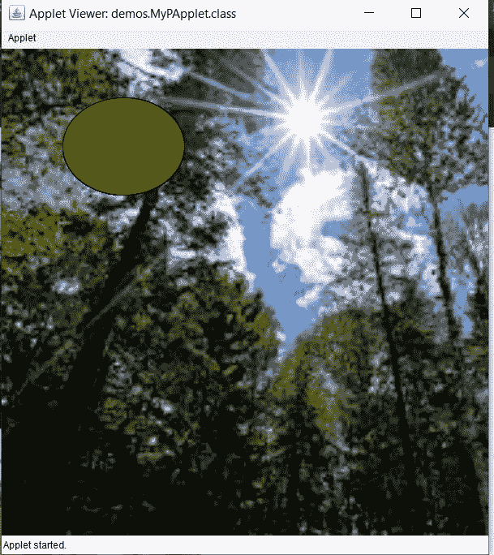
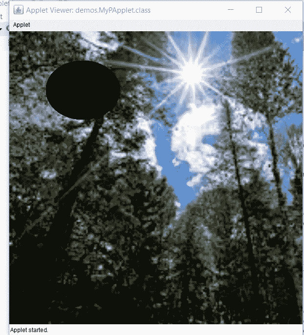

# 如何在 Eclipse 处理中创建 PApplet 项目

> 原文:[https://www . geesforgeks . org/如何在 eclipse 中创建一个 papplet-project-processing/](https://www.geeksforgeeks.org/how-to-create-a-papplet-project-in-eclipse-processing/)

[小程序](https://www.geeksforgeeks.org/java-applet-basics/)是一个小程序，不打算自己运行，而是嵌入到另一个应用程序中。小程序可以嵌入到网页中。它在网络浏览器内部运行，在客户端工作。在本文中，我们将讨论如何使用 PApplet 类在 [eclipse IDE](https://www.geeksforgeeks.org/what-will-be-the-best-java-ides-in-2020/) 中用 Java 创建一个小程序。

Java 中的[处理库](https://www.geeksforgeeks.org/introduction-to-processing-java/)有一个名为 PApplet 的类，用于制作[图形用户界面(GUI)](https://www.geeksforgeeks.org/difference-between-cli-and-gui/) 。在创建 applet 之前，让我们了解一下 Java applet 类的基础知识:

*   **PApplet 类**必须是要嵌入网页或由 Java Applet Viewer 查看的 Applet 的超类。
*   PApplet 类有两种主要方法，即**设置()**和**绘制()**方法。
*   设置方法运行一次，而绘制功能将重复运行，在画布上绘制图像。
*   处理使用主动模式渲染(即)，所有动画任务都发生在“处理动画线程”上。
*   setup()和 draw()方法由该线程处理，由事件调度线程或 EDT 触发的事件(如鼠标移动和按键)被排队，以便在 draw()方法结束时安全处理。
*   使用 PApplet 类，我们可以创建用户友好的图形用户界面应用程序，这意味着应用程序是用户交互的，它们有图标、滑块，我们可以点击、拖动、拖放和玩应用程序窗口。

**示例:**下面是一个了解如何用 java 创建 applet 的示例。在这个小程序中，我们正在画布上渲染图像。该图像可以来自互联网或本地电脑。众所周知，有两个函数需要定义，在每个函数中定义如下:

*   **setup():** 在这个功能中，我们将定义画布的大小和画布的背景。
*   **draw():** 在这个函数中，让我们定义一个可以假设为太阳的椭圆。在这个小程序中，椭圆的颜色随着太阳颜色的变化而变化。由于可能需要几个小时来实时观察，我们将在几秒钟内改变太阳的颜色。太阳的颜色以 [RGB](https://www.geeksforgeeks.org/computer-graphics-the-rgb-color-model/) 的形式表示。

> **注意:**此代码在在线 IDE 上无法工作。尝试在 Eclipse IDE 上运行。

下面是上面小程序的实现:

```
// Java program to demonstrate
// how to create an applet

import processing.core.PApplet;
import processing.core.PImage;

// Creating a class which extends
// the PApplet class
public class MyPApplet extends PApplet {

    // Defining the image
    PImage img;

    // The setup function will run once
    // and the draw function will run
    // repeatedly drawing the image
    // on the canvas.
    public void setup()
    {
        // Set the canvas width and height
        size(500, 500);

        // Set the canvas color
        background(255);

        // Set the pen color
        stroke(0);

        // Use any image from the internet
        // or PC
        // Here, the URL of the image is given
        img
            = loadImage("https:// encrypted"
                            + "-tbn0.gstatic.com/"
                            + "images?q=tbn%3AANd9"
                            + "GcRNC9SY6P7qRIXxGcK"
                            + "vM420UXuISOlev1dOpO5"
                            + "_lHpmW2mhVQh7&usqp=CAU",
                        "jpg");

        // Resize the loaded image to
        // the full height of canvas
        img.resize(0, height);

        // Display the image
        image(img, 0, 0);
    }

    // This function is executed repeatedly
    public void draw()
    {
        // Calculate color code for the sun
        int[] color = sunColorSec(second());

        // Set the colour of the sun
        fill(color[0], color[1], color[2]);

        // Draw the sun
        ellipse(width / 4, height / 5,
                width / 4, height / 5);
    }

    // Function to return the RGB
    // color of the sun at the
    // number of seconds in the minute
    public int[] sunColorSec(float seconds)
    {
        int[] rgb = new int[3];

        // Scale the brightness of the
        // yellow based on the seconds.
        // 0 seconds is black and
        // 30 seconds is bright yellow.
        float diffFrom30
            = Math.abs(30 - seconds);

        // Assigning the ratio of
        // RGB in an array
        float ratio = diffFrom30 / 30;
        rgb[0] = (int)(255 * ratio);
        rgb[1] = (int)(255 * ratio);
        rgb[2] = 0;

        // Return the RGB
        return rgb;
    }

    // Driver code
    public static void main(String[] args)
    {

        PApplet.main(
            new String[] {
                "--present",
                "MyPApplet" });
    }
}
```

**输出:**以下是运行代码时获得的输出。颜色变化如下:

[](https://media.geeksforgeeks.org/wp-content/uploads/20200512034330/up2.jpg)

[](https://media.geeksforgeeks.org/wp-content/uploads/20200512041220/up4.jpg)

[](https://media.geeksforgeeks.org/wp-content/uploads/20200512034436/up11.jpg)