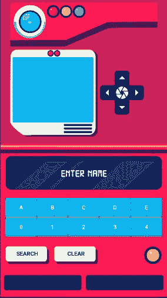
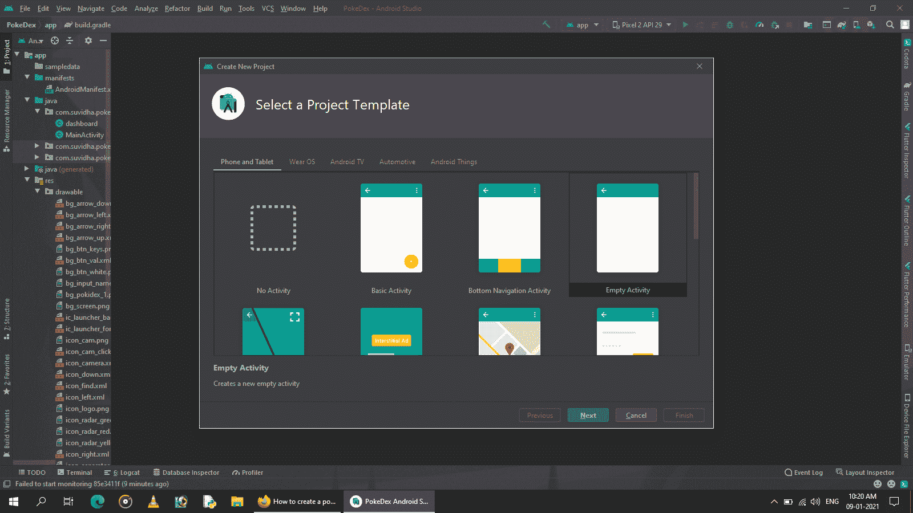
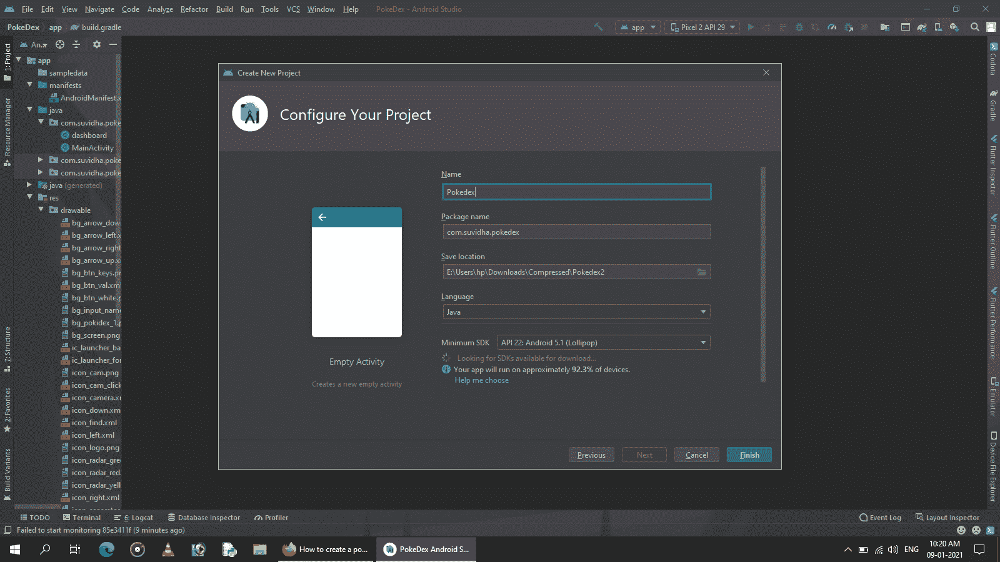
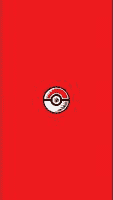

# 如何在安卓中创建 Pokedex UI？

> 原文:[https://www . geesforgeks . org/how-create-a-pokedex-ui-in-Android/](https://www.geeksforgeeks.org/how-to-create-a-pokedex-ui-in-android/)

今天，我们将制造我们童年时代都想要的最重要的小玩意，口袋妖怪。下面给出了一个示例图像，以了解我们将在本文中做什么。



我们的 Pokedex

### **分步实施**

**第一步:创建活动为空的新安卓项目**

您应该始终为项目使用有意义的名称

 

**步骤 2:使用主活动**

让我们也跟随创建闪屏的趋势。现在我们有两个文件 **activity_main.xml** 和**MainActivity.java。** 导航到 **app > res >布局> activity_main.xml** 并将下面的代码添加到该文件中。下面是**activity _ main . XML**文件的代码。

## 可扩展标记语言

```
<?xml version="1.0" encoding="utf-8"?>
<androidx.constraintlayout.widget.ConstraintLayout
    xmlns:android="http://schemas.android.com/apk/res/android"
    xmlns:app="http://schemas.android.com/apk/res-auto"
    xmlns:tools="http://schemas.android.com/tools"
    android:layout_width="match_parent"
    android:layout_height="match_parent"
    android:background="@color/red"
    tools:context=".MainActivity">

    <ImageView
        android:layout_width="108dp"
        android:layout_height="108dp"
        android:src="@drawable/icon_logo"
        app:layout_constraintBottom_toBottomOf="parent"
        app:layout_constraintLeft_toLeftOf="parent"
        app:layout_constraintRight_toRightOf="parent"
        app:layout_constraintTop_toTopOf="parent" />

</androidx.constraintlayout.widget.ConstraintLayout>
```

转到**文件，参考以下代码。以下是**MainActivity.java**文件的代码。代码中添加了注释，以更详细地理解代码。**

## **Java 语言(一种计算机语言，尤用于创建网站)**

```
import android.content.Context;
import android.content.Intent;
import android.os.Bundle;
import android.os.Handler;

import androidx.appcompat.app.AppCompatActivity;

public class MainActivity extends AppCompatActivity {

    Context context = this;

    @Override
    protected void onCreate(Bundle savedInstanceState) {
        super.onCreate(savedInstanceState);
        setContentView(R.layout.activity_main);
        Handler handler = new Handler();
        handler.postDelayed(new Runnable() {
            @Override
            public void run() {
                change();
            }
        }, 1500);
    }

    private void change() {
        startActivity(new Intent(context, dashboard.class));
        finish();
    }
}
```

****输出:****

**

闪屏** 

****第三步:创建另一个空活动****

**现在用你想要的名字创建一个新的空活动。这里我们将选择**仪表盘。**它将创建两个文件 **activity_dashboard.xml** 和**dashboard.java。****

> ****注:**本项目使用的所有图纸均可从以下链接下载链接:[**https://drive . Google . com/file/d/15c 8 nos2u _ 9dc 0 rffxs2x 8 wngpbq 06 djv/view？usp =共享**](https://drive.google.com/file/d/15c8Nos2U_9DC0rFfxS2x8WNgPBq06dJV/view?usp=sharing)**

****下面是 activity_dashboard.xml 文件的代码:****

## **可扩展标记语言**

```
<?xml version="1.0" encoding="utf-8"?>
<androidx.constraintlayout.widget.ConstraintLayout 
    xmlns:android="http://schemas.android.com/apk/res/android"
    xmlns:app="http://schemas.android.com/apk/res-auto"
    xmlns:tools="http://schemas.android.com/tools"
    android:layout_width="match_parent"
    android:layout_height="match_parent">

    <LinearLayout
        android:id="@+id/linearLayout2"
        android:layout_width="match_parent"
        android:layout_height="match_parent"
        android:orientation="vertical"
        tools:context=".dashboard">

        <LinearLayout
            android:layout_width="match_parent"
            android:layout_height="0dp"
            android:layout_weight="1"
            android:background="#CA215A"
            android:orientation="vertical">

            <LinearLayout
                android:layout_width="match_parent"
                android:layout_height="108dp"
                android:layout_marginLeft="24dp"
                android:layout_marginTop="6dp"
                android:layout_marginRight="24dp"
                android:background="@drawable/bg_pokidex_1"
                android:orientation="horizontal"
                android:padding="6dp">

                <ImageView
                    android:id="@+id/dashboard_btn_camera_start"
                    android:layout_width="84dp"
                    android:layout_height="84dp"
                    android:src="@drawable/icon_cam" />

                <ImageView
                    android:layout_width="32dp"
                    android:layout_height="32dp"
                    android:src="@drawable/icon_radar_red" />

                <ImageView
                    android:layout_width="32dp"
                    android:layout_height="32dp"
                    android:src="@drawable/icon_radar_yellow" />

                <ImageView
                    android:layout_width="32dp"
                    android:layout_height="32dp"
                    android:src="@drawable/icon_radar_green" />
            </LinearLayout>

            <LinearLayout
                android:layout_width="match_parent"
                android:layout_height="wrap_content"
                android:layout_marginTop="6dp"
                android:orientation="horizontal">

                <LinearLayout
                    android:layout_width="216dp"
                    android:layout_height="216dp"
                    android:layout_marginLeft="24dp"
                    android:background="@drawable/bg_screen"
                    android:orientation="vertical">

                    <LinearLayout
                        android:layout_width="wrap_content"
                        android:layout_height="wrap_content"
                        android:layout_gravity="center"
                        android:layout_marginTop="3dp"
                        android:orientation="horizontal">

                        <ImageView
                            android:layout_width="16dp"
                            android:layout_height="16dp"
                            android:src="@drawable/icon_radar_red" />

                        <ImageView
                            android:layout_width="16dp"
                            android:layout_height="16dp"
                            android:src="@drawable/icon_radar_red" />
                    </LinearLayout>

                    <FrameLayout
                        android:id="@+id/dashboard_fragment_camera_p"
                        android:layout_width="match_parent"
                        android:layout_height="match_parent"
                        android:layout_marginLeft="6dp"
                        android:layout_marginRight="10dp"
                        android:layout_marginBottom="34dp">
                    </FrameLayout>

                </LinearLayout>

                <androidx.constraintlayout.widget.ConstraintLayout
                    android:layout_width="108dp"
                    android:layout_height="108dp"
                    android:layout_gravity="center_vertical"
                    android:layout_marginLeft="6dp">

                    <LinearLayout
                        android:id="@+id/linearLayout"
                        android:layout_width="36dp"
                        android:layout_height="36dp"
                        android:background="@drawable/bg_arrow_up"
                        android:gravity="center"
                        app:layout_constraintEnd_toEndOf="parent"
                        app:layout_constraintStart_toStartOf="parent"
                        app:layout_constraintTop_toTopOf="parent">

                        <ImageView
                            android:layout_width="match_parent"
                            android:layout_height="match_parent"
                            android:src="@drawable/icon_up" />
                    </LinearLayout>

                    <LinearLayout
                        android:layout_width="36dp"
                        android:layout_height="36dp"
                        android:background="@drawable/bg_arrow_right"
                        app:layout_constraintBottom_toBottomOf="parent"
                        app:layout_constraintEnd_toEndOf="parent"
                        app:layout_constraintTop_toTopOf="parent">

                        <ImageView
                            android:layout_width="match_parent"
                            android:layout_height="match_parent"
                            android:src="@drawable/icon_right" />
                    </LinearLayout>

                    <LinearLayout
                        android:layout_width="36dp"
                        android:layout_height="36dp"
                        android:background="@drawable/bg_arrow_left"
                        app:layout_constraintBottom_toBottomOf="parent"
                        app:layout_constraintStart_toStartOf="parent"
                        app:layout_constraintTop_toTopOf="parent">

                        <ImageView
                            android:layout_width="match_parent"
                            android:layout_height="match_parent"
                            android:src="@drawable/icon_left" />
                    </LinearLayout>

                    <LinearLayout
                        android:layout_width="36dp"
                        android:layout_height="36dp"
                        android:background="@drawable/bg_arrow_down"
                        app:layout_constraintBottom_toBottomOf="parent"
                        app:layout_constraintEnd_toEndOf="parent"
                        app:layout_constraintStart_toStartOf="parent">

                        <ImageView
                            android:layout_width="match_parent"
                            android:layout_height="match_parent"
                            android:src="@drawable/icon_down" />
                    </LinearLayout>

                    <LinearLayout
                        android:layout_width="36dp"
                        android:layout_height="36dp"
                        android:background="@color/blue_dark"
                        app:layout_constraintBottom_toBottomOf="parent"
                        app:layout_constraintEnd_toEndOf="parent"
                        app:layout_constraintStart_toStartOf="parent"
                        app:layout_constraintTop_toTopOf="parent">

                        <ImageView
                            android:layout_width="match_parent"
                            android:layout_height="match_parent"
                            android:src="@drawable/icon_cam_click" />
                    </LinearLayout>
                </androidx.constraintlayout.widget.ConstraintLayout>

            </LinearLayout>
        </LinearLayout>

        <LinearLayout
            android:layout_width="match_parent"
            android:layout_height="0dp"
            android:layout_weight="1"
            android:background="#FE1A55"
            android:orientation="vertical"
            android:paddingTop="12dp">

            <TextView
                android:id="@+id/dashboard_tv_ssdpanel"
                android:layout_width="match_parent"
                android:layout_height="84dp"
                android:layout_marginLeft="12dp"
                android:layout_marginTop="6dp"
                android:layout_marginRight="12dp"
                android:layout_marginBottom="6dp"
                android:background="@drawable/bg_input_name"
                android:fontFamily="@font/digital7"
                android:gravity="center"
                android:hint="Enter Name"
                android:maxLength="10"
                android:paddingLeft="12dp"
                android:paddingRight="12dp"
                android:textColor="#fff"
                android:textColorHint="#e9e9e9"
                android:textSize="24dp"
                android:textStyle="bold" />

            <androidx.cardview.widget.CardView
                android:layout_width="match_parent"
                android:layout_height="wrap_content"
                android:layout_margin="12dp"
                app:cardCornerRadius="12dp">

                <GridLayout
                    android:layout_width="match_parent"
                    android:layout_height="wrap_content"
                    android:columnCount="5"
                    android:rowCount="2">

                    <LinearLayout
                        android:id="@+id/dashboard_btn_A"
                        android:layout_width="0dp"
                        android:layout_height="48dp"
                        android:layout_columnWeight="1"
                        android:background="@drawable/bg_btn_keys"
                        android:gravity="center">

                        <TextView
                            android:layout_width="wrap_content"
                            android:layout_height="wrap_content"
                            android:layout_gravity="center"
                            android:text="A"
                            android:textColor="#fff"
                            android:textStyle="bold" />
                    </LinearLayout>

                    <LinearLayout
                        android:id="@+id/dashboard_btn_B"
                        android:layout_width="0dp"
                        android:layout_height="48dp"
                        android:layout_columnWeight="1"
                        android:background="@drawable/bg_btn_keys"
                        android:gravity="center">

                        <TextView
                            android:layout_width="wrap_content"
                            android:layout_height="wrap_content"
                            android:layout_gravity="center"
                            android:text="B"
                            android:textColor="#fff"
                            android:textStyle="bold" />
                    </LinearLayout>

                    <LinearLayout
                        android:id="@+id/dashboard_btn_C"
                        android:layout_width="0dp"
                        android:layout_height="48dp"
                        android:layout_columnWeight="1"
                        android:background="@drawable/bg_btn_keys"
                        android:gravity="center">

                        <TextView
                            android:layout_width="wrap_content"
                            android:layout_height="wrap_content"
                            android:layout_gravity="center"
                            android:text="C"
                            android:textColor="#fff"
                            android:textStyle="bold" />
                    </LinearLayout>

                    <LinearLayout
                        android:id="@+id/dashboard_btn_D"
                        android:layout_width="0dp"
                        android:layout_height="48dp"
                        android:layout_columnWeight="1"
                        android:background="@drawable/bg_btn_keys"
                        android:gravity="center">

                        <TextView
                            android:layout_width="wrap_content"
                            android:layout_height="wrap_content"
                            android:layout_gravity="center"
                            android:text="D"
                            android:textColor="#fff"
                            android:textStyle="bold" />
                    </LinearLayout>

                    <LinearLayout
                        android:id="@+id/dashboard_btn_E"
                        android:layout_width="0dp"
                        android:layout_height="48dp"
                        android:layout_columnWeight="1"
                        android:background="@drawable/bg_btn_keys"
                        android:gravity="center">

                        <TextView
                            android:layout_width="wrap_content"
                            android:layout_height="wrap_content"
                            android:layout_gravity="center"
                            android:text="E"
                            android:textColor="#fff"
                            android:textStyle="bold" />
                    </LinearLayout>

                    <LinearLayout
                        android:id="@+id/dashboard_btn_0"
                        android:layout_width="0dp"
                        android:layout_height="48dp"
                        android:layout_columnWeight="1"
                        android:background="@drawable/bg_btn_keys"
                        android:gravity="center">

                        <TextView
                            android:layout_width="wrap_content"
                            android:layout_height="wrap_content"
                            android:layout_gravity="center"
                            android:text="0"
                            android:textColor="#fff"
                            android:textStyle="bold" />
                    </LinearLayout>

                    <LinearLayout
                        android:id="@+id/dashboard_btn_1"
                        android:layout_width="0dp"
                        android:layout_height="48dp"
                        android:layout_columnWeight="1"
                        android:background="@drawable/bg_btn_keys"
                        android:gravity="center">

                        <TextView
                            android:layout_width="wrap_content"
                            android:layout_height="wrap_content"
                            android:layout_gravity="center"
                            android:text="1"
                            android:textColor="#fff"
                            android:textStyle="bold" />
                    </LinearLayout>

                    <LinearLayout
                        android:id="@+id/dashboard_btn_2"
                        android:layout_width="0dp"
                        android:layout_height="48dp"
                        android:layout_columnWeight="1"
                        android:background="@drawable/bg_btn_keys"
                        android:gravity="center">

                        <TextView
                            android:layout_width="wrap_content"
                            android:layout_height="wrap_content"
                            android:layout_gravity="center"
                            android:text="2"
                            android:textColor="#fff"
                            android:textStyle="bold" />
                    </LinearLayout>

                    <LinearLayout
                        android:id="@+id/dashboard_btn_3"
                        android:layout_width="0dp"
                        android:layout_height="48dp"
                        android:layout_columnWeight="1"
                        android:background="@drawable/bg_btn_keys"
                        android:gravity="center">

                        <TextView
                            android:layout_width="wrap_content"
                            android:layout_height="wrap_content"
                            android:layout_gravity="center"
                            android:text="3"
                            android:textColor="#fff"
                            android:textStyle="bold" />
                    </LinearLayout>

                    <LinearLayout
                        android:id="@+id/dashboard_btn_4"
                        android:layout_width="0dp"
                        android:layout_height="48dp"
                        android:layout_columnWeight="1"
                        android:background="@drawable/bg_btn_keys"
                        android:gravity="center">

                        <TextView
                            android:layout_width="wrap_content"
                            android:layout_height="wrap_content"
                            android:layout_gravity="center"
                            android:text="4"
                            android:textColor="#fff"
                            android:textStyle="bold" />
                    </LinearLayout>
                </GridLayout>
            </androidx.cardview.widget.CardView>

            <androidx.constraintlayout.widget.ConstraintLayout
                android:layout_width="match_parent"
                android:layout_height="wrap_content"
                android:padding="12dp">

                <LinearLayout
                    android:id="@+id/dashboard_ll_search"
                    android:layout_width="108dp"
                    android:layout_height="44dp"
                    android:background="@drawable/bg_btn_white"
                    android:gravity="center_horizontal"
                    android:orientation="horizontal"
                    android:paddingTop="8dp"
                    app:layout_constraintBottom_toBottomOf="parent"
                    app:layout_constraintStart_toStartOf="parent"
                    app:layout_constraintTop_toTopOf="parent">

                    <TextView
                        android:layout_width="wrap_content"
                        android:layout_height="wrap_content"
                        android:text="SEARCH"
                        android:textColor="@color/blue_dark"
                        android:textStyle="bold" />
                </LinearLayout>

                <LinearLayout
                    android:id="@+id/dashboard_ll_clear"
                    android:layout_width="108dp"
                    android:layout_height="44dp"
                    android:layout_marginLeft="12dp"
                    android:background="@drawable/bg_btn_white"
                    android:gravity="center_horizontal"
                    android:orientation="horizontal"
                    android:paddingTop="8dp"
                    app:layout_constraintBottom_toBottomOf="parent"
                    app:layout_constraintStart_toEndOf="@id/dashboard_ll_search"
                    app:layout_constraintTop_toTopOf="parent">

                    <TextView
                        android:layout_width="wrap_content"
                        android:layout_height="wrap_content"
                        android:text="CLEAR"
                        android:textColor="@color/blue_dark"
                        android:textStyle="bold" />
                </LinearLayout>

                <ImageView
                    android:id="@+id/dashboard_iv_key_sign"
                    android:layout_width="44dp"
                    android:layout_height="44dp"
                    android:src="@drawable/icon_radar_yellow"
                    app:layout_constraintBottom_toBottomOf="parent"
                    app:layout_constraintEnd_toEndOf="parent"
                    app:layout_constraintTop_toTopOf="parent" />
            </androidx.constraintlayout.widget.ConstraintLayout>

            <LinearLayout
                android:layout_width="match_parent"
                android:layout_height="wrap_content"
                android:orientation="horizontal"
                android:padding="3dp">

                <Button
                    android:layout_width="0dp"
                    android:layout_height="wrap_content"
                    android:layout_margin="6dp"
                    android:layout_weight="1" />

                <Button
                    android:layout_width="0dp"
                    android:layout_height="wrap_content"
                    android:layout_margin="6dp"
                    android:layout_weight="1" />
            </LinearLayout>
        </LinearLayout>
    </LinearLayout>

    <LinearLayout
        android:layout_width="match_parent"
        android:layout_height="24dp"
        android:background="@drawable/icon_separator"
        app:layout_constraintBottom_toBottomOf="parent"
        app:layout_constraintTop_toTopOf="parent" />
</androidx.constraintlayout.widget.ConstraintLayout>
```

**对于本教程，与**dashboard.java**文件无关。**完成项目转到:**[<u>https://github.com/navdeepisno1/PokeDex</u>](https://github.com/navdeepisno1/PokeDex)**