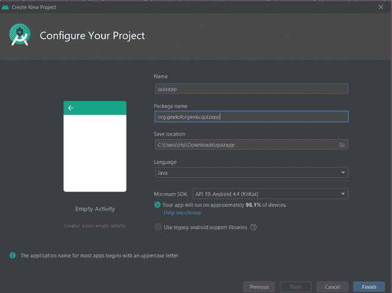

# 如何在安卓中创建问答应用？

> 原文:[https://www . geeksforgeeks . org/如何在安卓中创建问答应用/](https://www.geeksforgeeks.org/how-to-create-a-quiz-app-in-android/)

[**安卓**](https://www.geeksforgeeks.org/android-app-development-fundamentals-for-beginners/) 是一个 **操作系统**是为基本上为手机打造的。它基于 Linux Kernel 等开源  软件，由 **谷歌** 开发。安卓现在在学生中非常受欢迎，学生们现在选择安卓作为他们的项目。对于初学者来说，构建婴儿安卓应用来学习安卓非常重要。在本文中，让我们使用 [**Java**](https://www.geeksforgeeks.org/java/) 在安卓系统中创建一个简单的问答应用。一个简单的**测验应用程序**，包含一组精选的问题及其答案，并检查用户给出的答案的正确性。它使用动态编程浏览问题。


### **接近**

**第一步:创建新项目**

*   点击左侧最左上角的**文件**选项。
*   然后点击新建，打开一个**新建**项目，并命名该项目。
*   现在选择语言为 Java 的空活动。
*   将其命名为 **QuizApp** 。



**第二步:用 activity_main.xml 设计 UI**

在 **activity_main.xml** 文件中添加以下代码。这里的父布局是一个[线性布局](https://www.geeksforgeeks.org/android-linearlayout-in-kotlin/)，其方向设置为垂直。里面有一个 [**ImageView**](https://www.geeksforgeeks.org/imageview-in-kotlin/) ，一个 [**TextView**](https://www.geeksforgeeks.org/textview-in-kotlin/) ，两个**按钮**，两个**[**image button**](https://www.geeksforgeeks.org/imagebutton-in-kotlin/)。按钮和图像按钮位于水平方向的子线性布局中。图像视图用于显示图像，文本视图用于显示问题，按钮用于指示真/假，图像按钮用于导航到下一个/上一个问题。**

****在** **可绘制文件夹中添加图像:****

**以下是本项目中使用的所有可绘制文件的链接。**

*   ****花卉图像** (f1/f2/f3/f4/f5/f6/f7):参考[这个。](https://encrypted-tbn0.gstatic.com/images?q=tbn%3AANd9GcSx9pUxHRjAy5r5NtuPlaDJ78skJGwl-Wiuzw&usqp=CAU)**
*   ****下一个图标**为 **:参考[本](https://fontawesome.com/icons/angle-right?style=solid)。****
*   ****上一个图标**的 **:参考[这个](https://fontawesome.com/icons/angle-left?style=regular)。****
*   ****表情符号**:参考[这个](https://www.freepngimg.com/icon/1000525-crying-sad-emoji-icon-file-hd)。**

****activity_main.xml** 文件的完整代码如下。**

## **activity_main.xml**

```java
<?xml version="1.0" encoding="utf-8"?>
<!--Using linear layout with vertical orientation and center gravity -->
<LinearLayout xmlns:android="http://schemas.android.com/apk/res/android"
    xmlns:app="http://schemas.android.com/apk/res-auto"
    xmlns:tools="http://schemas.android.com/tools"
    android:layout_width="match_parent"
    android:background="#FFFFFF"
    android:layout_height="match_parent"
    android:orientation="vertical"
    android:gravity="center"
    tools:context=".MainActivity">

    <!--ImageView used for showing pictures along with questions-->
    <ImageView
        android:id="@+id/myimage"
        android:layout_width="wrap_content"
        android:src="@drawable/f1"
        android:layout_height="wrap_content"/>

    <!--TextView used for showing questions on screen-->
    <TextView
        android:id="@+id/answer_text_view"
        android:text="@string/a"
        android:textColor="@android:color/black"
        android:textSize="30sp"
        android:padding="10dp"
        android:layout_width="wrap_content"
        android:layout_height="wrap_content"/>

    <!--Using another LinearLayout for showing buttons
        in horizontal orientation-->
    <LinearLayout
        android:layout_width="wrap_content"
        android:layout_height="wrap_content">

        <!--TrueButton-->
        <Button
            android:id="@+id/true_button"
            android:layout_marginRight="20dp"
            android:backgroundTint="#5BD91B"
            android:layout_width="wrap_content"
            android:layout_height="wrap_content"
            android:textSize="20sp"
            android:text="@string/true_text" />

        <!--FalseButton-->
        <Button
            android:id="@+id/false_button"
            android:layout_marginLeft="20dp"
            android:layout_width="wrap_content"
            android:backgroundTint="#E33328"
            android:layout_height="wrap_content"
            android:textSize="20sp"
            android:text="@string/false_text" />

    </LinearLayout>

    <LinearLayout
        android:layout_width="wrap_content"
        android:layout_height="wrap_content">

        <!--PreviousButton-->
        <ImageButton
            android:id="@+id/prev_button"
            android:layout_width="wrap_content"
            android:layout_height="wrap_content"
            android:src="@drawable/baseline_keyboard_arrow_left_black_18dp"
            android:backgroundTint="#DFD2D1"
            android:text="@string/prev_text" />

        <!--NextButton-->
        <ImageButton
            android:id="@+id/next_button"
            android:layout_width="wrap_content"
            android:layout_height="wrap_content"
            android:backgroundTint="#DFD2D1"
            android:src="@drawable/baseline_keyboard_arrow_right_black_18dp"
            android:text="@string/next_text" />

    </LinearLayout>
</LinearLayout>
```

****在 activity_main.xml 中添加这段代码后，UI 看起来像:****

****

****第三步:与 Question.java 合作****

**要创建新的 **Java 类**右键单击一个 Java 文件或文件夹，选择**新建> Java 类**。**

****

**现在在**Question.java**中添加以下代码。这里使用 getters 和 setters 方法来检索和设置数据。方法 **是一个答案真()** 返回**答案真**就像在问题构造函数中已经传递的一样。**

## **Question.java**

```java
package org.geeksforgeeks.quizapp;

public class Question
{
    // answerResId will store question
    private int answerResId;

    // answerTrue will store correct answer
    // of the question provided
    private boolean answerTrue;

    public Question(int answerResId, boolean answerTrue)
    {
      // setting the values through
      // arguments passed in constructor
      this.answerResId = answerResId;
      this.answerTrue = answerTrue;
    }

    // returning the question passed
    public int getAnswerResId() 
    {
      return answerResId; 
    }

    // setting the question passed
    public void setAnswerResId(int answerResId)
    {
      this.answerResId = answerResId;
    }

    // returning the correct answer
    // of question
    public boolean isAnswerTrue() 
    {
      return answerTrue; 
    }

    // setting the correct
    // ans of question
    public void setAnswerTrue(boolean answerTrue)
    {
      this.answerTrue = answerTrue;
    }
}
```

#### ****第 4 步:使用 strings.xml 文件****

**在 **strings.xml** 文件中，我们必须提供题库。人们可以在这个文件中添加许多问题。**

## **strings.xml**

```java
<resources>
    <!--All the string resources come here including Questions and title -->
    <string name="app_name">GFG | HOW WELL DO YOU KNOW SIMRAN?</string>
    <string name="correct"><b>CORRECTNESS IS</b> \n
                           <b>%1$d</b> OUT OF 6</string>
    <string name="true_text">true</string>
    <string name="false_text">false</string>
    <string name="correct_answer">That\'s correct</string>
    <string name="wrong_answer">That\'s incorrect</string>
    <string name="a">Simran loves Chocolates.</string>
    <string name="b">Simran Knows Following Skills:\n \t
                     <b>Ballet</b>\n \t
                     <b>HipHop</b></string>
    <string name="c">Do You Think Simran Believes In:\n \t
                     <b>Luck!!!</b></string>
    <string name="d">Do You Think Simran Wants To Visit <b>Italy</b></string>
    <string name="e">Simran Loves Loyalty.</string>
    <string name="f">Simran Sleeps Less</string>
    <string name="next_text">next</string>
    <string name="prev_text">previous</string>

</resources>
```

****第五步:与 MainActivity.java 合作****

****onCreate()** 方法在 app 启动时首先被调用。**问题[]** 数组用问题标识和正确答案进行实例化。**setOnClickListener()**方法在每次点击**按钮/ImageButton** 时都会被调用，因此当用户点击一个按钮时，它会通过 **getId()** 方法检查其 **Id** ，并按照我们的逻辑执行动作。**updateQuestion()**通过 **TextView** 的 **settext()** 方法更新问题，并通过跟踪问题编号来更改图像。**check answer()**方法点击按钮检查原答案，并使用 [Toast](https://www.geeksforgeeks.org/android-what-is-toast-and-how-to-use-it-with-examples/) 相应显示文本。**

## **MainActivity.java**

```java
package org.geeksforgeeks.quizapp;

import android.annotation.SuppressLint;
import android.os.Build;
import android.os.Bundle;
import android.util.Log;
import android.view.View;
import android.widget.Button;
import android.widget.ImageButton;
import android.widget.ImageView;
import android.widget.TextView;
import android.widget.Toast;
import androidx.annotation.RequiresApi;
import androidx.appcompat.app.AppCompatActivity;

public class MainActivity extends AppCompatActivity
    implements View.OnClickListener {
    // setting up things
    private Button falseButton;
    private Button trueButton;
    private ImageButton nextButton;
    private ImageButton prevButton;
    private ImageView Image;
    private TextView questionTextView;
    private int correct = 0;
    // to keep current question track
    private int currentQuestionIndex = 0;

    private Question[] questionBank = new Question[] {
        // array of objects of class Question
        // providing questions from string
        // resource and the correct ans
        new Question(R.string.a, true),
        new Question(R.string.b, false),
        new Question(R.string.c, true),
        new Question(R.string.d, true),
        new Question(R.string.e, true),
        new Question(R.string.f, false),

    };

    @Override
    protected void onCreate(Bundle savedInstanceState)
    {
        super.onCreate(savedInstanceState);
        setContentView(R.layout.activity_main);
        // setting up the buttons
        // associated with id
        falseButton = findViewById(R.id.false_button);
        trueButton = findViewById(R.id.true_button);
        nextButton = findViewById(R.id.next_button);
        prevButton = findViewById(R.id.prev_button);
        // register our buttons to listen to
        // click events
        questionTextView
            = findViewById(R.id.answer_text_view);
        Image = findViewById(R.id.myimage);
        falseButton.setOnClickListener(this);
        trueButton.setOnClickListener(this);
        nextButton.setOnClickListener(this);
        prevButton.setOnClickListener(this);
    }

    @SuppressLint("SetTextI18n")
    @RequiresApi(api = Build.VERSION_CODES.LOLLIPOP)
    @Override
    public void onClick(View v)
    {
        // checking which button is
        // clicked by user
        // in this case user choose false
        switch (v.getId()) {
        case R.id.false_button:
            checkAnswer(false);
            break;

        case R.id.true_button:
            checkAnswer(true);
            break;

        case R.id.next_button:
            // go to next question
            // limiting question bank range
            if (currentQuestionIndex < 7) {
                currentQuestionIndex
                    = currentQuestionIndex + 1;
                // we are safe now!
                // last question reached
                // making buttons
                // invisible
                if (currentQuestionIndex == 6) {
                    questionTextView.setText(getString(
                        R.string.correct, correct));
                    nextButton.setVisibility(
                        View.INVISIBLE);
                    prevButton.setVisibility(
                        View.INVISIBLE);
                    trueButton.setVisibility(
                        View.INVISIBLE);
                    falseButton.setVisibility(
                        View.INVISIBLE);
                    if (correct > 3)

                        questionTextView.setText(
                            "CORRECTNESS IS " + correct
                            + " "
                            + "OUT OF 6");
                    // showing correctness
                    else
                        Image.setImageResource(
                            R.drawable.resu);
                    // if correctness<3 showing sad emoji
                }
                else {
                    updateQuestion();
                }
            }

            break;
        case R.id.prev_button:
            if (currentQuestionIndex > 0) {
                currentQuestionIndex
                    = (currentQuestionIndex - 1)
                      % questionBank.length;
                updateQuestion();
            }
        }
    }

    @RequiresApi(api = Build.VERSION_CODES.LOLLIPOP)
    private void updateQuestion()
    {
        Log.d("Current",
              "onClick: " + currentQuestionIndex);

        questionTextView.setText(
            questionBank[currentQuestionIndex]
                .getAnswerResId());
        // setting the textview with new question
        switch (currentQuestionIndex) {
        case 1:
            // setting up image for each
            // question
            Image.setImageResource(R.drawable.f2);
            break;
        case 2:
            Image.setImageResource(R.drawable.f3);
            break;
        case 3:
            Image.setImageResource(R.drawable.f4);
            break;
        case 4:
            Image.setImageResource(R.drawable.f5);
            break;
        case 5:
            Image.setImageResource(R.drawable.f6);
            break;
        case 6:
            Image.setImageResource(R.drawable.f7);
            break;
        case 7:
            Image.setImageResource(R.drawable.f1);
            break;
        }
    }
    private void checkAnswer(boolean userChooseCorrect)
    {
        boolean answerIsTrue
            = questionBank[currentQuestionIndex]
                  .isAnswerTrue();
        // getting correct ans of current question
        int toastMessageId;
        // if ans matches with the
        // button clicked

        if (userChooseCorrect == answerIsTrue) {
            toastMessageId = R.string.correct_answer;
            correct++;
        }
        else {
            // showing toast
            // message correct
            toastMessageId = R.string.wrong_answer;
        }

        Toast
            .makeText(MainActivity.this, toastMessageId,
                      Toast.LENGTH_SHORT)
            .show();
    }
}
```

#### ****输出:在仿真器上运行****

**<video class="wp-video-shortcode" id="video-473178-1" width="640" height="360" preload="metadata" controls=""><source type="video/mp4" src="https://media.geeksforgeeks.org/wp-content/uploads/20200823112349/Quiz-app.mp4?_=1">[https://media.geeksforgeeks.org/wp-content/uploads/20200823112349/Quiz-app.mp4](https://media.geeksforgeeks.org/wp-content/uploads/20200823112349/Quiz-app.mp4)</video>**

 **在安卓中完成小考应用项目–**