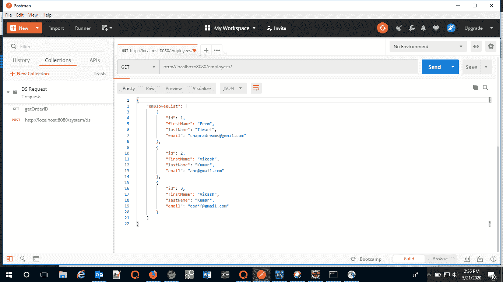
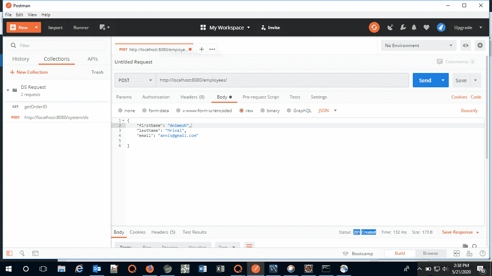
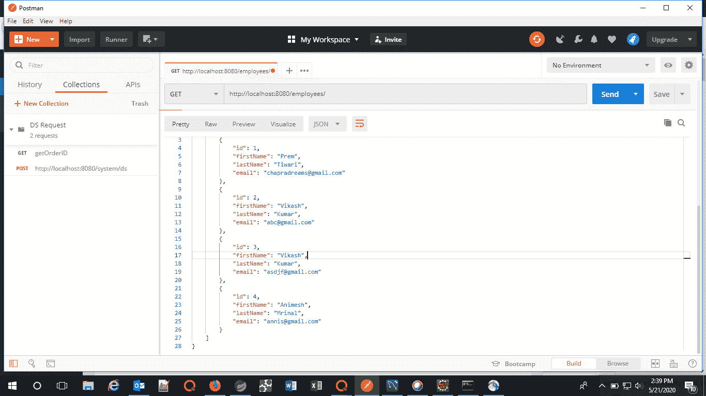

# 如何使用 Java Spring Boot

创建 REST API

> 原文:[https://www . geesforgeks . org/how-create-a-rest-API-use-Java-spring-boot/](https://www.geeksforgeeks.org/how-to-create-a-rest-api-using-java-spring-boot/)

**[【表征状态转移(REST)](https://www.geeksforgeeks.org/rest-api-introduction/)** 是一种软件架构风格，定义了一组用于创建 Web 服务的约束。符合 REST 架构风格的网络服务，称为 [RESTful 网络服务](https://www.geeksforgeeks.org/rest-api-architectural-constraints/)，提供互联网上计算机系统之间的互操作性。RESTful Web 服务允许请求系统通过使用统一的和预定义的无状态操作集来访问和操作 Web 资源的文本表示。其他类型的网络服务，如 [SOAP 网络服务](https://www.geeksforgeeks.org/difference-between-rest-api-and-soap-api/)，公开了它们自己的任意操作集。

在本文中，我们将了解如何使用[弹簧启动](https://www.geeksforgeeks.org/introduction-to-spring-boot/)创建 rest API。

**[Spring](https://www.geeksforgeeks.org/introduction-to-spring-framework/)** 被广泛用于创建可扩展的应用程序。对于 web 应用程序，Spring 提供了 Spring MVC，这是 Spring 的一个广泛使用的模块，用于创建可扩展的 web 应用程序。但是 spring 项目的主要缺点是配置非常耗时，对于新开发人员来说有点难以承受。解决办法是 [Spring Boot](https://www.geeksforgeeks.org/introduction-to-spring-boot/) 。Spring Boot 建在春天的顶端，包含了春天的所有特征。在本文中，我们将创建一个 REST API，将员工添加到员工列表中，并获取员工列表。为了做到这一点，我们首先必须在任何一个集成开发环境中创建一个简单的 Spring Boot 项目，并遵循以下步骤:

1.  首先，我们需要定义员工实体。因此，定义了以下员工类别:

    ```
    package com.example.demo;

    // Creating an entity Employee
    public class Employee {

        public Employee() {}

        // Parameterized Constructor
        // to assign the values
        // to the properties of
        // the entity
         public Employee(
            Integer id, String firstName,
            String lastName, String email)
        {

            super();

            this.id = id;

            this.firstName = firstName;

            this.lastName = lastName;

            this.email = email;

        }

           private Integer id;

           private String firstName;

           private String lastName;

           private String email;

        // Overriding the toString method
        // to find all the values
        @Override
       public String toString()
        {

            return "Employee [id="
                + id + ", firstName="
                + firstName + ", lastName="
                + lastName + ", email="
                + email + "]";

        }

        // Getters and setters of
        // the properties
        public Integer getId()
        {

             return id;
        }

        public void setId(Integer id)
        {

             this.id = id;
        }

        public String getFirstName()
        {

             return firstName;
        }

        public void setFirstName(
            String firstName)
        {

             this.firstName = firstName;
        }

        public String getLastName()
        {

             return lastName;
        }

        public void setLastName(
            String lastName)
        {

             this.lastName = lastName;
        }

        public String getEmail()
        {

             return email;
        }

        public void setEmail(String email)
        {

             this.email = email;
        }
    }
    ```

2.  现在，我们需要创建一个存储所有员工列表的存储类:

    ```
    package com.example.demo;

    import java.util.ArrayList;
    import java.util.List;

    // Class to store the list of
    // all the employees in an
    // Array List
    public class Employees {

        private List<Employee> employeeList;

        // Method to return the list
        // of employees
        public List<Employee> getEmployeeList()
        {

            if (employeeList == null) {

                employeeList
                    = new ArrayList<>();

            }

            return employeeList;

        }

        public void
        setEmployeeList(
            List<Employee> employeeList)
        {
            this.employeeList
                = employeeList;
        }
    }
    ```

3.  到目前为止，我们已经定义了实体员工并创建了存储类。现在，我们需要接触员工。因此，我们创建了一个类，我们将从其中创建一个存储类的对象来存储员工:

    ```
    package com.example.demo;

    import org.springframework
        .stereotype
        .Repository;

    // Importing the employees class to
    // use the defined properties
    // in this class
    import com.example.demo.Employees;

    @Repository

    // Class to create a list
    // of employees
    public class EmployeeDAO {

        private static Employees list
            = new Employees();

        // This static block is executed
        // before executing the main
        // block
        static
        {

            // Creating a few employees
            // and adding them to the list
            list.getEmployeeList().add(
                new Employee(
                    1,
                    "Prem",
                    "Tiwari",
                    "chapradreams@gmail.com"));

            list.getEmployeeList().add(
                new Employee(
                    2, "Vikash",
                    "Kumar",
                    "abc@gmail.com"));

            list.getEmployeeList().add(
                new Employee(
                    3, "Ritesh",
                    "Ojha",
                    "asdjf@gmail.com"));

        }

        // Method to return the list
        public Employees getAllEmployees()
        {

            return list;
        }

            // Method to add an employee
            // to the employees list
            public void
            addEmployee(Employee employee)
        {
            list.getEmployeeList()
                .add(employee);

        }
    }
    ```

4.  最后，我们需要创建一个控制器类，它是 REST API 的实际实现。根据 REST 规则，数据库中的每个新条目都必须由 POST 方法调用，来自数据库的所有请求都必须使用 GET 方法调用。相同的方法在下面的代码中实现:

    ```
    package com.example.demo;

    import java.net.URI;
    import org.springframework.beans
        .factory.annotation.Autowired;
    import org.springframework.http
        .ResponseEntity;
    import org.springframework.web.bind
        .annotation.GetMapping;
    import org.springframework.web.bind
        .annotation.PostMapping;
    import org.springframework.web.bind
        .annotation.RequestBody;
    import org.springframework.web.bind
        .annotation.RequestMapping;
    import org.springframework.web.bind
        .annotation.RestController;
    import org.springframework.web.servlet
        .support.ServletUriComponentsBuilder;

    // Import the above-defined classes
    // to use the properties of those
    // classes
    import com.example.demo.Employees;
    import com.example.demo.EmployeeDAO;
    import com.example.demo.Employee;

    // Creating the REST controller
    @RestController
    @RequestMapping(path = "/employees")
    public class EmployeeController {

        @Autowired
       private EmployeeDAO employeeDao;

            // Implementing a GET method
            // to get the list of all
            // the employees
       @GetMapping(
            path = "/",
            produces = "application/json")

        public Employees getEmployees()
        {

            return employeeDao
                .getAllEmployees();
        }

            // Create a POST method
            // to add an employee
            // to the list
       @PostMapping(
            path = "/",
            consumes = "application/json",
            produces = "application/json")

        public ResponseEntity<Object> addEmployee(
            @RequestBody Employee employee)
        {

            // Creating an ID of an employee
            // from the number of employees
            Integer id
                = employeeDao
                      .getAllEmployees()
                      .getEmployeeList()
                      .size()
                  + 1;

            employee.setId(id);

            employeeDao
                .addEmployee(employee);

            URI location
                = ServletUriComponentsBuilder
                      .fromCurrentRequest()
                      .path("/{id}")
                      .buildAndExpand(
                          employee.getId())
                      .toUri();

                   return ResponseEntity
                .created(location)
                .build();
        }
    }
    ```

5.  实现项目中的所有类后，将项目作为 **Spring Boot 应用运行。**一旦服务器开始运行，我们就可以通过浏览器或邮递员发送请求。我们可以通过进入以下网址来访问正在运行的应用程序:

    ```
    http://localhost:8080/employees/

    ```

**输出:**以下是运行上述项目时生成的输出:

1.  当执行 GET 请求时:
    [](https://media.geeksforgeeks.org/wp-content/uploads/20200521144019/GET44.png)
2.  当执行开机自检请求时:
    [](https://media.geeksforgeeks.org/wp-content/uploads/20200521144133/POST7.png)
3.  在执行开机自检请求后再次点击获取请求:
    [](https://media.geeksforgeeks.org/wp-content/uploads/20200521144219/GET_after_POST.png)