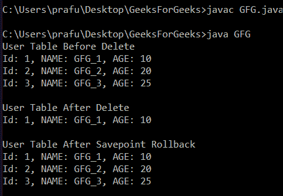

# 如何在 JDBC 创建保存点？

> 原文:[https://www . geesforgeks . org/如何在 jdbc 中创建保存点/](https://www.geeksforgeeks.org/how-to-create-a-savepoint-in-jdbc/)

一个**保存点**对象用于保存数据库的当前状态，之后可以回滚到该数据库的状态。保存点类似于 [SQL 事务](https://www.geeksforgeeks.org/sql-transactions/)，如果当前事务中出现问题，通常会回滚。Java 中连接接口的**连接.设置保存点()**方法用于创建一个对象，该对象引用事务中数据库的当前状态。以下示例显示了保存点和[回滚](https://www.geeksforgeeks.org/java-program-to-make-a-rollback/)在 [JDBC](https://www.geeksforgeeks.org/introduction-to-jdbc/) 应用程序中的用法。

**语法**

```java
connection.setSavepoint()
```

**返回:**返回一个新的**保存点**对象。

**异常:抛出 SQLException** 如果发生数据库访问错误，在参与分布式事务时调用此方法，在关闭的连接上调用此方法，或者此 connection 对象当前处于自动提交模式。**如果 JDBC 驱动程序不支持此方法，将引发 sqlffeaturenotsupportdexception**。

**例**

## Java 语言(一种计算机语言，尤用于创建网站)

```java
// Java program to demonstrate how to make a save point

import java.io.*;
import java.sql.*;

class GFG {
    public static void main(String[] args)
    {
        // db credentials
        String jdbcEndpoint
            = "jdbc:mysql://localhost:3000/GEEKSFORGEEKS";
        String userid = "GFG";
        String password = "GEEKSFORGEEKS";

        // create a connection to db
        Connection connection = DriverManager.getConnection(
            jdbcEndpoint, userid, password);

        // construct a query
        Statement deleteStmt = connection.createStatement();
        String deleteQuery
            = "DELETE FROM USER WHERE AGE > 15";

        // Disable auto commit to connection
        connection.setAutoCommit(false);

        /*    Table USER
       +--------+---------+------------+
       | USR_ID | NAME    | AGE        |
       +--------+---------+------------+
       |      1 | GFG_1      | 10           |
       |      2 | GFG_2   | 20         |
       |      3 | GFG_3   | 25           |
       +--------+---------+------------+
       */

        // Create a savepoint object before executing the
        // deleteQuery
        Savepoint beforeDeleteSavepoint
            = connection.setSavepoint();

        // Executing the deleteQuery
        ResultSet res
            = deleteStmt.executeQuery(deleteQuery);

        /*    Table USER after executing deleteQuery
       +--------+---------+------------+
       | USR_ID | NAME    | AGE        |
       +--------+---------+------------+
       |      1 | GFG_1      | 10           |
       +--------+---------+------------+
       */

        // Rollback to our beforeDeleteSavepoint
        connection.rollback(beforeDeleteSavepoint);
        connection.commit();

        /*    Table USER after rollback
        +--------+---------+------------+
        | USR_ID | NAME    | AGE        |
        +--------+---------+------------+
        |      1 | GFG_1   | 10            |
        |      2 | GFG_2   | 20          |
        |      3 | GFG_3   | 25            |
        +--------+---------+------------+
        */
    }
}
```

