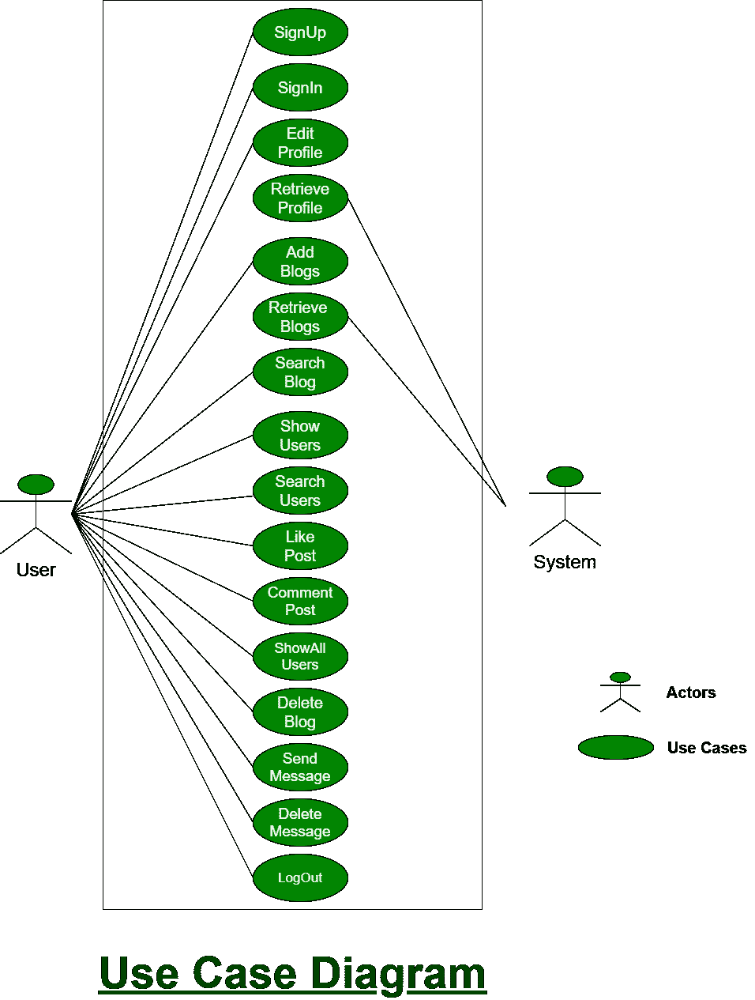

# 如何在 Android Studio 上创建社交媒体 App？

> 原文:[https://www . geeksforgeeks . org/如何创建一个社交媒体 app-on-android-studio/](https://www.geeksforgeeks.org/how-to-create-a-social-media-app-on-android-studio/)

**社交媒体**对我们来说并不是一个新名词。我们的日常生活是不完整的，或者我们可以说我们人类依靠食物、水、空气和社交媒体生存。我们的依赖程度如此之高，以至于我们倾向于在社交媒体平台上分享自己的每一点信息。同样的，**安卓工作室**也不是安卓开发者的新名词。对于初学者来说，总有一种好奇心，想知道像脸书、Instagram、Twitter、Linked In 等复杂的应用程序是如何工作的。是发达的。这些应用程序是如何工作的！！点赞、评论功能在社交媒体应用中是如何工作的！！消息传递功能是如何工作的！！还有更多。

在之前的文章“ [**成为安卓开发者的最佳途径——完整路线图**](https://www.geeksforgeeks.org/best-way-to-become-android-developer-a-complete-roadmap/) ”中，我们讨论过“**学习安卓的最佳途径是将一些基础项目开发到一些高级项目**”。所以在这篇文章中，我们将开发类似的东西。我们将开发一个社交媒体应用程序的克隆。

### 功能列表

1.  使用电子邮件和密码注册。
2.  使用他们在注册过程中使用的电子邮件和密码登录。
3.  编辑他们的个人资料数据(个人资料图片、姓名和密码)。
4.  添加各种博客。
5.  搜索特定的博客。
6.  显示所有注册用户。
7.  从所有注册用户中搜索一个用户。
8.  比如一篇博文。
9.  评论某个特定的博客。
10.  显示所有喜欢特定博客的用户。
11.  删除博客文章
12.  发送消息
13.  删除发送的消息
14.  注销他们自己并用他们的另一个 ID 登录。

### 用例图

**用例**图是 [UML(统一建模语言)](https://www.geeksforgeeks.org/unified-modeling-language-uml-introduction/)的一部分，也就是用来描述系统的功能或者系统的一部分。它们被广泛用于说明系统的功能需求及其与外部代理(**参与者**)的交互。用例基本上是表示系统可以使用的不同场景的图表。用例图为我们提供了系统或系统的一部分所做工作的高级视图，而不涉及实现细节。在下面是本项目的用例图:

### 履行

**使用的技术堆栈:**

*   **对于前端:** [XML](https://www.geeksforgeeks.org/xml-basics/)
*   **为后端:** [Java](https://www.geeksforgeeks.org/java/)
*   **ide:**[Android studio](https://www.geeksforgeeks.org/android-tutorial/#Android%20Studio)
*   **数据库使用:** [火力基地](https://www.geeksforgeeks.org/firebase-introduction/)

下面给出一个视频样本来了解一下我们在本教程中要做什么。

<video class="wp-video-shortcode" id="video-592559-1" width="640" height="360" preload="metadata" controls=""><source type="video/mp4" src="https://media.geeksforgeeks.org/wp-content/uploads/20210401175053/How-to-Build-a-Social-Media-App-from-Scratch-on-Android-Studio.mp4?_=1">[https://media.geeksforgeeks.org/wp-content/uploads/20210401175053/How-to-Build-a-Social-Media-App-from-Scratch-on-Android-Studio.mp4](https://media.geeksforgeeks.org/wp-content/uploads/20210401175053/How-to-Build-a-Social-Media-App-from-Scratch-on-Android-Studio.mp4)</video>

**本教程由以下 16 部分组成:**

**第 1 部分:** [**闪屏和认证部分**](https://www.geeksforgeeks.org/implement-splash-screen-and-authentication-in-social-media-android-app/)

*   创建[闪屏](https://www.geeksforgeeks.org/android-creating-a-splash-screen/)
*   认证部分:
    *   注册，以及
    *   注册

**第 2 部分:** [**使用底部导航**](https://www.geeksforgeeks.org/how-to-create-fragment-using-bottom-navigation-in-social-media-android-app/) 创建片段

*   我们将使用 **5** [片段](https://www.geeksforgeeks.org/introduction-fragments-android/)创建[底部导航](https://www.geeksforgeeks.org/bottom-navigation-bar-in-android/)(主页、用户、添加博客、聊天列表、个人资料)。
*   在**主页片段**中，我们将展示所有添加的博客。
*   在**用户群**、中，我们将显示所有注册用户。
*   在**添加博客页面**中，我们将添加我们的博客。
*   在**聊天列表片段**中，我们将显示一个与我们聊天的所有用户的聊天列表。
*   在**配置文件页面**中，我们将显示用户的配置文件，其中我们将显示用户的数据和用户写的博客。

**第 3 部分:** [**编辑剖面数据**](https://www.geeksforgeeks.org/implementing-edit-profile-data-functionality-in-social-media-android-app/)

*   我们将编辑我们的个人资料数据，如更改姓名、更改用户密码和更改个人资料图片。
*   更改密码是一个非常重要的功能，因为有时可能会有人知道我们的密码，在这种情况下，我们需要更改密码。
*   我们通过从图库中选择一张图片或点击相机中的一张图片来更改我们的个人资料图片。

**第 4 部分:** [**检索档案数据**](https://www.geeksforgeeks.org/implement-retrieve-profile-data-functionality-in-social-media-android-app/)

*   我们将从 Firebase 检索用户数据。
*   这是一个简单的片段，我们将从实时数据库中检索用户的数据，如姓名、电子邮件和个人资料图片，并以文本布局和图像布局显示出来。
*   未来我们还会在个人资料页面展示用户的博客。

**第 5 部分:** [**添加博客**](https://www.geeksforgeeks.org/how-to-add-blogs-in-social-media-android-app/)

*   我们将添加任何用户的博客。这里我们将在**添加博客片段**中工作，用户将添加一个带有标题、描述和与该博客相关的图像的博客。
*   如果用户没有写任何标题或描述，那么我们将显示一个错误。

**第 6 部分:** [**在首页检索博客**](https://www.geeksforgeeks.org/how-to-retrieve-blog-on-home-page-in-social-media-android-app/)

*   我们将检索用户在 **HomeFragment** 上写的博客。
*   这里我们只显示了用户数据和博客的标题、描述和图片，但是我们也将在即将到来的博客中实现喜欢和评论功能。
*   然后，我们将显示帖子活动的详细信息，用户可以在其中发表评论。
*   我们还实现了类似博客的功能。

**第 7 部分:** [**在主页搜索特定博客并注销功能**](https://www.geeksforgeeks.org/implementing-search-for-a-specific-blog-on-home-page-and-logout-functionality-in-social-media-android-app/)

*   我们将在主页上搜索一个博客。
*   如果我们的应用程序中很少有博客，那么很容易手动搜索博客。但是当我们有 1000 个博客时，搜索一个特定的博客变成了一项非常复杂和耗时的任务。
*   这就是为什么我们实现这个功能来使用提供的标题或描述搜索博客**。**
*   另外，我们在本文中实现了**注销功能**。

**第 8 部分:** [**显示所有注册用户**](https://www.geeksforgeeks.org/how-to-display-all-registered-users-in-social-media-android-app/)

*   我们将显示我们应用程序的所有注册用户。
*   我们将在**用户群**中显示用户列表。

**第 9 部分:** [**从所有注册用户中搜索一个用户**](https://www.geeksforgeeks.org/how-to-implement-search-for-a-registered-user-functionality-in-social-media-android-app/)

*   我们将在用户页面上搜索用户。
*   如果在我们的应用程序中注册的人很少，那么搜索一个人是很容易的。
*   但是，当我们有 1000 个用户在我们的应用程序中注册，然后搜索一个特定的用户成为一项非常复杂和耗时的任务时，会发生什么呢？
*   这就是为什么我们实现这个功能来使用提供的**名称或电子邮件**搜索用户。

**第十部分:** [**像博文一样**](https://www.geeksforgeeks.org/implement-like-a-blog-post-functionality-in-social-media-android-app/)

*   我们要去喜欢一个博客。我们使用两个图像来实现这个功能，一个像白色背景的按钮，另一个像蓝色背景的按钮。
*   当用户第一次点击按钮时，我们会将图像更改为背景颜色为蓝色的按钮，并增加计数。当用户再次点击，然后我们将减少计数，并改变背景白色的喜欢按钮。

**第 11 部分:** [**评论特定博客**](https://www.geeksforgeeks.org/implement-comment-on-a-particular-blog-functionality-in-social-media-android-app/)

*   我们将在博客上发表评论。
*   在这里，我们将写一个评论，然后我们将显示评论，并将更新评论计数。
*   评论功能是所有博客应用中最好的功能。它有助于与写博客的用户互动，等等。

**第 12 部分:** [**在特定博客上显示所有喜欢的用户**](https://www.geeksforgeeks.org/how-to-display-all-users-who-liked-on-a-particular-blog-in-social-media-android-app/)

*   我们将查看喜欢某个特定博客的用户列表。
*   点击总喜欢后，我们将被重定向到后喜欢的活动
*   在这种情况下，我们将使用回收视图来显示喜欢某个帖子的用户列表。
*   我们也可以从 **PostDetailActivity.class** 查看所有喜欢我们帖子的用户列表。

**第 13 部分:** [**删除一篇博文**](https://www.geeksforgeeks.org/implement-delete-a-blog-post-functionality-in-social-media-android-app/)

*   我们将删除用户写的博客。
*   博客只能由博客的所有者删除。在博客的右上角，有一个按钮。
*   点击后会弹出一个删除按钮。单击“删除”后，博客将从博客中成功删除。

**第 14 部分:** [**创建布局&在聊天中发送消息**](https://www.geeksforgeeks.org/how-to-implement-chat-functionality-in-social-media-android-app/)

*   我们将为聊天创建一个布局&在聊天中发送消息。
*   用户可以发送消息或图像。
*   用户可以使用相机或图库发送图像。
*   首先，许可请求将被要求使用图库发送图像，或者在使用相机点击图像后发送。
*   如果给予许可，那么用户可以发送图像，或者再次请求许可。

**第 15 部分:** [**删除消息**](https://www.geeksforgeeks.org/implement-delete-messages-functionality-in-social-media-android-app/)

*   我们将删除**聊天活动**中的消息。
*   我们将删除文本和图像消息。当我们点击一个文本时，一个**报警框**就会出现。
*   有两个选项可以删除该消息或取消事件。点击删除后，消息将从两侧删除。

**第 16 部分:** [**在用户档案中检索博客**](https://www.geeksforgeeks.org/how-to-retrieve-blogs-on-user-profile-in-social-media-android-app/)

*   我们将检索用户在个人资料片段上写的博客。
*   如前所述，我们已经在简介片段中添加了用户数据，如电子邮件、姓名和简介图片。
*   在这里，我们还将检索当前用户在其个人资料中撰写的博客。
*   让我们看看展示当前用户写的博客的实现。