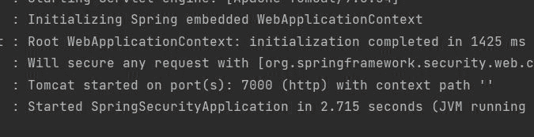

# 如何在 Spring Initializr 中创建一个 Spring Boot 项目并在 IntelliJ IDEA 中运行？

> 原文:[https://www . geeksforgeeks . org/如何创建春季启动项目春季启动并运行它-in-intellij-idea/](https://www.geeksforgeeks.org/how-to-create-a-spring-boot-project-in-spring-initializr-and-run-it-in-intellij-idea/)

Java 语言是所有编程语言中最流行的语言之一。使用 java 编程语言有几个优点，无论是出于安全目的还是构建大型分发项目。使用 Java 的优势之一是它试图借助类、继承、多态等概念将语言中的每个概念与现实世界联系起来。

java 中还有其他几个概念，增加了 java 代码和程序员之间的用户友好交互，例如泛型、访问说明符、注释等。这些特性为类以及 java 程序的方法增加了一个额外的属性。在本文中，我们将讨论如何在春季引导中更改端口号。

> **注意:**首先我们需要在我们的项目中建立 spring 应用。

[Spring Initializr](https://www.geeksforgeeks.org/spring-initializr/) 是一个基于 web 的工具，使用它我们可以很容易地生成 Spring Boot 项目的结构。它还为元数据模型中表达的项目提供了各种不同的特性。这个模型允许我们配置 JVM 支持的依赖列表。在这里，我们将使用 spring 初始化器创建应用程序的结构，并执行以下步骤。

**步骤:**

1.  转到 spring 初始化
2.  按照要求填写细节
3.  点击**生成**，下载启动项目
4.  提取压缩文件
5.  创建一个名为控制器的 java 类，并添加注释
6.  去邮差和添加网址，并提出放请求

这些步骤在下文中通过视觉辅助依次描述如下:

**第一步:**转到[春天初始化](https://start.spring.io/)


**第二步:**按要求填写详细内容。对于此应用:

```java
Project: Maven
Language: Java
Spring Boot: 2.2.8
Packaging: JAR
Java: 8
Dependencies: Spring Web
```

**第三步:**点击**生成**，下载启动项目。

**第 4 步:**提取 zip 文件。现在打开一个合适的 IDE，然后转到文件- >新建- >现有来源的项目- > Spring-boot-app，并选择 pom.xml。在提示符下单击导入更改，等待项目同步。


> **注意:**在 Maven 的导入项目窗口中，确保选择了与创建项目时选择的 JDK 相同的版本。

我们需要在 spring 应用程序的项目结构中使用 application.properties 文件来更改端口号。

**应用属性:**

```java
server.port=7000
```

**第五步:**转到***src->main->Java->com . gfg . spring . boot . app，运行主应用。***

**终端输出:**



Tomcat 正在服务器 7000 上运行。