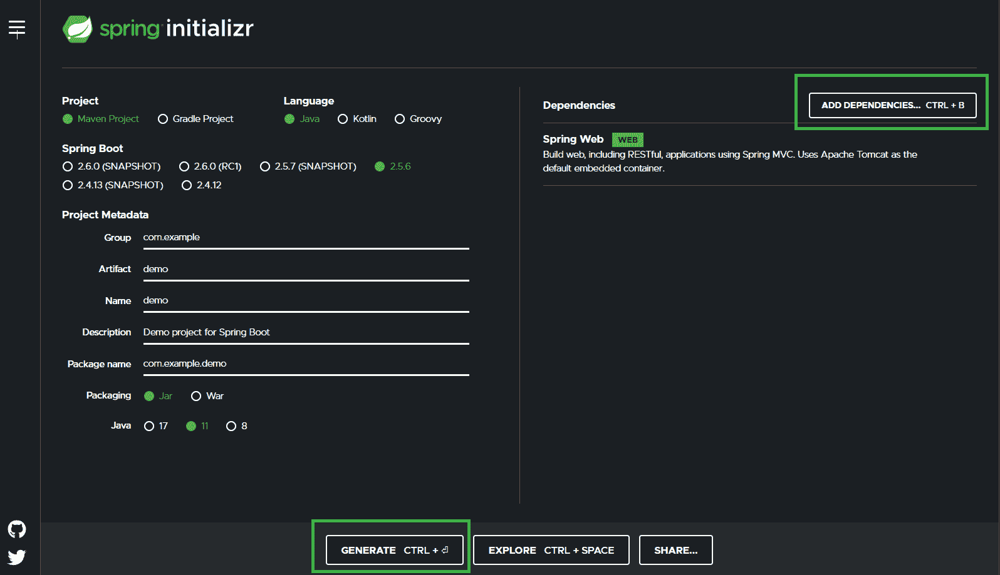
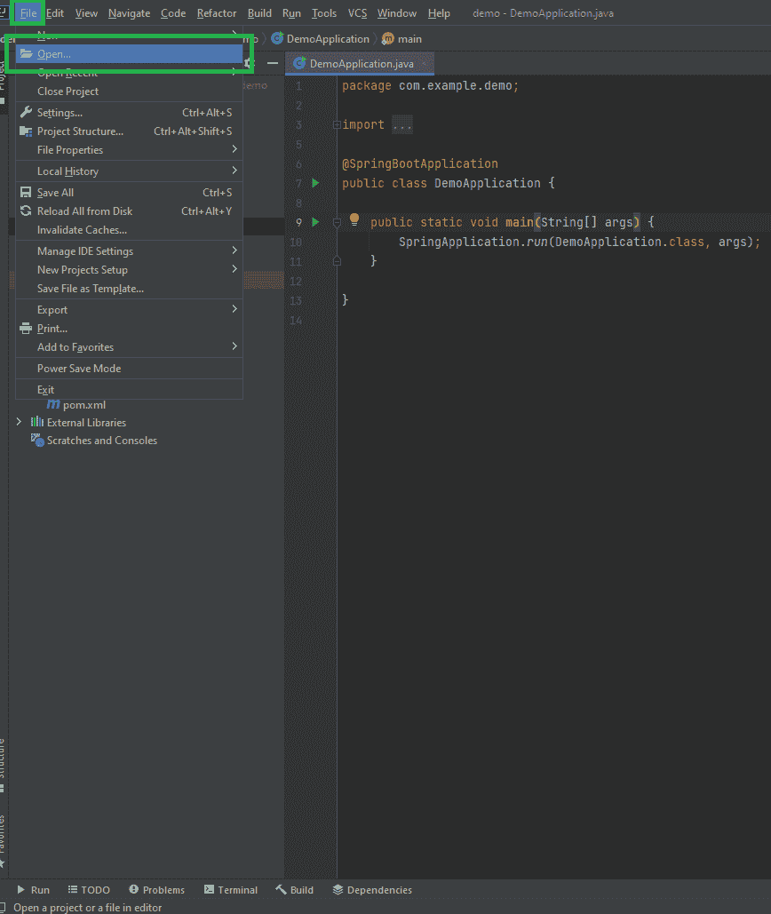
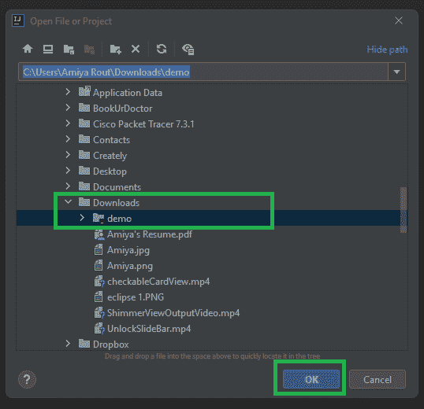
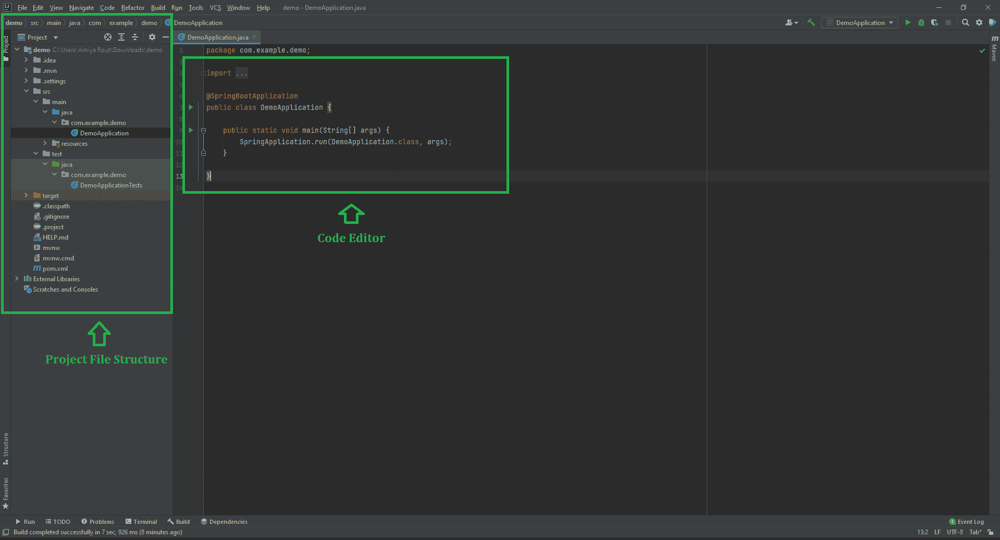

# 如何用 IntelliJ IDEA 创建 Spring Boot 项目？

> 原文:[https://www . geeksforgeeks . org/如何用 intellij-idea 创建一个春季启动项目/](https://www.geeksforgeeks.org/how-to-create-a-spring-boot-project-with-intellij-idea/)

Spring Boot 建在春天的顶端，包含了春天的所有特征。由于其快速的生产就绪环境，开发人员能够直接专注于逻辑，而不是纠结于配置和设置，因此正成为开发人员的最爱。Spring Boot 是一个基于微服务的框架，在其中制作一个生产就绪的应用程序只需要很少的时间。以下是 Spring Boot 的一些特色:

*   它允许避免春季出现的 XML 的繁重配置
*   它提供了 REST 端点的简单维护和创建
*   它包括嵌入式 Tomcat 服务器
*   部署非常容易，war 和 jar 文件可以很容易地部署在 tomcat 服务器中

更多信息请参考本文:[Spring Boot 简介](https://www.geeksforgeeks.org/introduction-to-spring-boot/)

所以在本文中，我们将解释如何在 [IntelliJ IDEA](https://www.geeksforgeeks.org/step-by-step-guide-to-install-intellij-idea/) 中创建和设置 spring boot 项目。IntelliJ 是用 Java 编写的集成开发环境(IDE)。它用于开发计算机软件。这个 IDE 是由 Jetbrains 开发的，有 Apache 2 授权社区版和商业版。

**程序:**

1.  在本地计算机上安装 IntelliJ IDEA。
2.  在 Spring Initializr 中创建 Spring Boot 项目
3.  在 IntelliJ IDEA 中导入 Spring Boot 项目
4.  选择您在上述步骤 2 中创建的项目。

**步骤 1:** 在本地机器上安装 Intellij Idea 为此[进行在系统上安装 IntelliJ IDEA 的先决条件](https://www.geeksforgeeks.org/step-by-step-guide-to-install-intellij-idea/)。

**步骤 2:** 在 Spring Initializr 中创建一个 Spring Boot 项目

[创建一个 Spring Boot 项目](https://start.spring.io/)并相应地填写所有细节，最后点击下面的**生成**按钮。这将以 zip 格式下载您的 Spring Boot 项目。现在将该文件夹提取到您的本地机器中，并在继续下一步之前完成对 [Spring Initializr](https://www.geeksforgeeks.org/spring-initializr/) 的介绍。

**第三步:**在 IntelliJ IDEA 中导入 Spring Boot 项目

成功安装 IntelliJ IDEA 后，进入**文件>打开**，如下图所示。

此后，将出现如下弹出窗口。

**第 4 步:**这里你要选择你在第 2 步中创建的项目。例如，这里我们已经创建了名为“**演示”**的春季启动项目，并将其存储在下载文件夹中，您可以看到我们可以在下载文件夹中找到相同的内容。最后点击**确定**按钮。我们在 IntelliJ IDEA 中创建了 Spring Boot 项目。请等待一段时间，下载所有需要的文件。

到目前为止，Spring Boot 项目已经创建，如下图所示媒体。左侧包含**项目文件结构**，而在中间可以看到**代码编辑器**存在。

