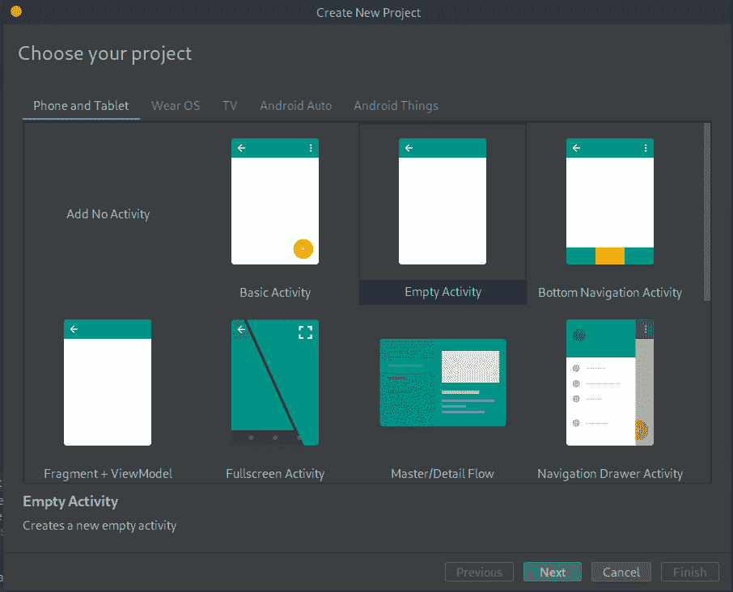
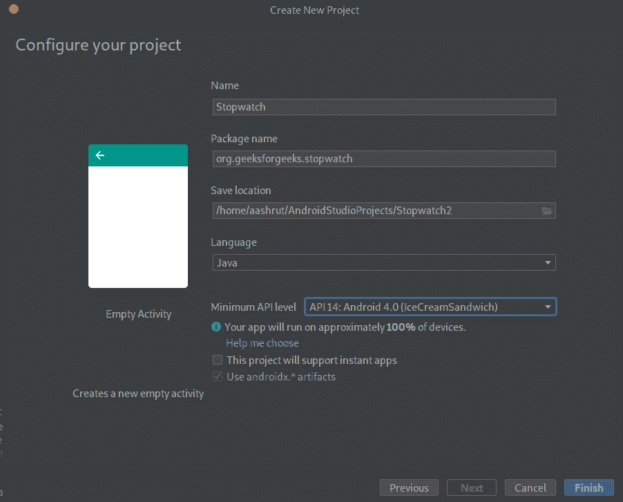
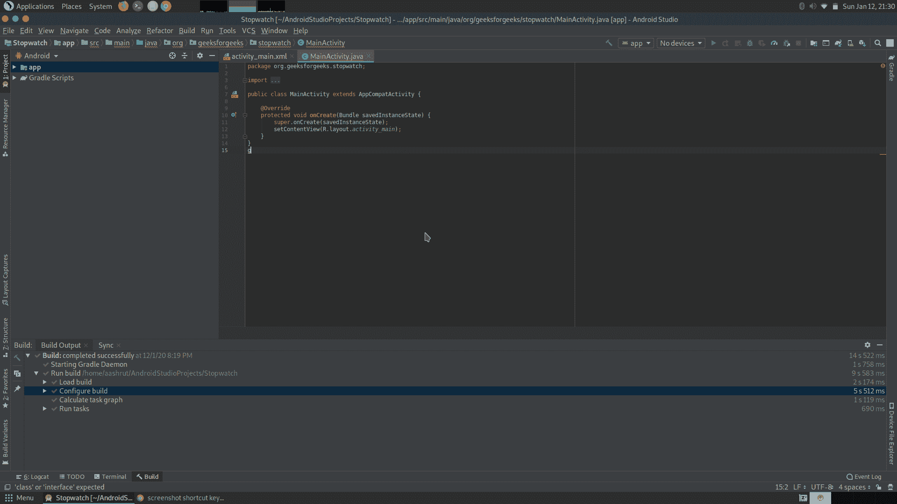
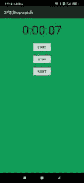

# 如何使用安卓工作室

创建秒表应用

> 原文:[https://www . geeksforgeeks . org/如何创建秒表-应用-使用-android-studio/](https://www.geeksforgeeks.org/how-to-create-a-stopwatch-app-using-android-studio/)

在本文中，创建了一个[安卓应用程序](https://www.geeksforgeeks.org/android-app-development-fundamentals-for-beginners/)来显示一个基本的秒表。

秒表的布局包括:

*   **A [TextView](https://www.geeksforgeeks.org/textview-in-kotlin/)** :显示已经过去了多少时间
*   **三个按钮:**
    1.  开始:启动秒表
    2.  停止:停止秒表
    3.  重置:将秒表重置为 00:00:00

**创建秒表的步骤:**

*   为秒表应用程序创建新项目
*   添加字符串资源
*   更新秒表布局代码
*   更新活动代码

下面是一个个详细的步骤:

1.  **为秒表应用**创建新项目
    *   Create a new Android project for an application named “Stopwatch” with a company domain of “geeksforgeeks.org”, making the package name **org.geeksforgeeks.stopwatch**.[](https://media.geeksforgeeks.org/wp-content/uploads/20200112213123/Screenshot-at-2020-01-12-21-28-45.png)

        创建新项目并选择空活动

        [](https://media.geeksforgeeks.org/wp-content/uploads/20200112213324/Screenshot-at-2020-01-12-21-30-07.png)

        配置项目

    *   最低的 SDK 应该是 API 14，这样它几乎可以在所有设备上运行。
    *   An empty activity called “StopwatchActivity” and a layout called “activity_stopwatch” will be created.[](https://media.geeksforgeeks.org/wp-content/uploads/20200112213452/Screenshot-at-2020-01-12-21-30-39.png)

        第一次打开屏幕

2.  **添加字符串资源**
    我们将在秒表布局中使用三个字符串值，每个按钮的文本值一个。这些值是字符串资源，因此需要添加到**字符串中。将以下字符串值添加到您版本的**strings . XML**:

    ## strings . XML

    ```
    <resources>
        <string name="app_name">GFG|Stopwatch</string>
        <string name="start">Start</string>
        <string name="stop">Stop</string>
        <string name="reset">Reset</string>
    </resources>
    ```** 
3.  **更新秒表布局代码**
    这里是布局的 XML。它描述了用于显示计时器的单一文本视图，以及控制秒表的三个按钮。将当前在**活动 _ 秒表中的 XML 替换为此处显示的 XML:

    ## 活动 _ 秒表。xml

    ```
    <?xml version="1.0" encoding="utf-8"?>
    <LinearLayout
        xmlns:android="http://schemas.android.com/apk/res/android"
        xmlns:app="http://schemas.android.com/apk/res-auto"
        xmlns:tools="http://schemas.android.com/tools"
        android:layout_width="match_parent"
        android:layout_height="match_parent"
        android:orientation="vertical"

        <!-- Add some background color -->
        android:background="#0F9D58"
        android:padding="16dp"
        tools:context="org.geeksforgeeks.stopwatch.StopwatchActivity">

        <TextView

            <!-- We will use text view "time_view" -->
            <!-- to display the number of seconds. -->
            android:id="@+id/time_view"
            android:layout_width="wrap_content"
            android:layout_height="wrap_content"
            android:layout_gravity="center_horizontal"

            <!-- These below attributes make the stopwatch -->
            <!-- timer nice and big. -->
            android:textAppearance="@android:style/TextAppearance.Large"
            android:textSize="56sp" />

        <Button
            <!-- This code is for the Start button.
            android:id="@+id/start_button"
            android:layout_width="wrap_content"
            android:layout_height="wrap_content"
            android:layout_gravity="center_horizontal"
            android:layout_marginTop="20dp"

            <!-- When it gets clicked, the Start button -->
            <!-- calls the onClickStart() method. -->
            android:onClick="onClickStart"
            android:text="@string/start" />
        <Button

            <!-- This code is for the Stop button. -->
            android:id="@+id/stop_button"
            android:layout_width="wrap_content"
            android:layout_height="wrap_content"
            android:layout_gravity="center_horizontal"
            android:layout_marginTop="8dp"

            <!-- When it gets clicked, the Stop button -->
            <!-- calls the onClickStop() method. -->
            android:onClick="onClickStop"
            android:text="@string/stop" />
        <Button

            <!-- This code is for Reset button. -->
            android:id="@+id/reset_button"
            android:layout_width="wrap_content"
            android:layout_height="wrap_content"
            android:layout_gravity="center_horizontal"
            android:layout_marginTop="8dp"

            <!-- When it gets clicked, the Reset button -->
            <!-- calls the onClickReset() method. -->
            android:onClick="onClickReset"
            android:text="@string/reset" />
    </LinearLayout>
    ```** 
4.  **How the activity code will work**
    The layout defines three buttons that we will use to control the stopwatch. Each button uses its onClick attribute to specify which method in the activity should run when the button is clicked. When the Start button is clicked, the **onClickStart() method** gets called, when the Stop button is clicked the **onClickStop() method** gets called, and when the Reset button is clicked the **onClickReset() method** gets called. We will use these methods to start, stop and reset the stopwatch.

    我们将使用我们将创建的名为 **runTimer()** 的方法更新秒表。 **runTimer()** 方法会每秒运行一次代码，检查秒表是否在运行，如果是，则增加秒数，并在文本视图中显示秒数。

    为了帮助我们，我们将使用两个私有变量来记录秒表的状态。我们将使用名为**秒**的 **int** 来跟踪秒表开始运行以来已经过去了多少秒，并使用名为**运行的**布尔**来记录秒表当前是否正在运行。**

    我们将从编写按钮的代码开始，然后我们将查看 **runTimer()** 方法。

    *   **为按钮**添加代码当用户点击开始按钮时，我们将**运行**变量设置为**真**，这样秒表将开始计时。当用户点击停止按钮时，我们会将**运行**设置为**假**，使 sopwatch 停止运行。如果用户点击复位按钮，我们会将**运行**设置为**假**，**秒**到 **0** ，这样秒表复位并停止运行。
    *   **runTimer()方法**接下来我们需要做的是创建 **runTimer()** 方法。此方法将获取对布局中文本视图的引用；将**秒**变量的内容格式化为小时、分钟和秒；然后在文本视图中显示结果。如果**运行**变量设置为**真**，将增加**秒**变量。
    *   **Handlers 允许你调度代码**一个**Handlers**是一个 Android 类，你可以用它来调度应该在未来某个时间点运行的代码。您也可以使用它来发布需要在不同于安卓主线程的线程上运行的代码。在我们的例子中，我们将使用**处理器**来安排秒表代码每秒运行一次。
        要使用**处理程序**，您需要将您想要调度的代码包装在 **Runnable** 对象中，然后使用**处理 post()** 和**post delay()**方法来指定您希望代码何时运行。
    *   **post()方法****post()**方法发布需要尽快运行的代码(通常是立即运行)。该方法采用一个参数，一个类型为**可运行**的对象。Androidville 中的一个 **Runnable** 对象就像普通的旧 Java 中的一个 **Runnable** :一个你想要运行的作业。你把要运行的代码放在 **Runnable 的 run()** 方法中，**处理程序**会确保代码尽快运行。
    *   **post delay()方法****post delay()**方法的工作方式类似于 **post()** 方法，只是您使用它来发布将来应该运行的代码。**后置延迟()**方法采用两个参数:一个**可运行**和一个**长**。 **Runnable** 包含您希望在其 **run()** 方法中运行的代码， **long** 指定您希望代码延迟的毫秒数。延迟后，代码将尽快运行。

    以下是**StopwatchActivity.java**的代码:

    ## StopwatchActivity.java

    ```
    package org.geeksforgeeks.stopwatch;

    import android.app.Activity;
    import android.os.Handler;
    import android.view.View;
    import android.os.Bundle;
    import java.util.Locale;
    import android.widget.TextView;

    public class StopwatchActivity extends Activity {

        // Use seconds, running and wasRunning respectively
        // to record the number of seconds passed,
        // whether the stopwatch is running and
        // whether the stopwatch was running
        // before the activity was paused.

        // Number of seconds displayed
        // on the stopwatch.
        private int seconds = 0;

        // Is the stopwatch running?
        private boolean running;

        private boolean wasRunning;

        @Override
        protected void onCreate(Bundle savedInstanceState)
        {
            super.onCreate(savedInstanceState);
            setContentView(R.layout.activity_stopwatch);
            if (savedInstanceState != null) {

                // Get the previous state of the stopwatch
                // if the activity has been
                // destroyed and recreated.
                seconds
                    = savedInstanceState
                          .getInt("seconds");
                running
                    = savedInstanceState
                          .getBoolean("running");
                wasRunning
                    = savedInstanceState
                          .getBoolean("wasRunning");
            }
            runTimer();
        }

        // Save the state of the stopwatch
        // if it's about to be destroyed.
        @Override
        public void onSaveInstanceState(
            Bundle savedInstanceState)
        {
            savedInstanceState
                .putInt("seconds", seconds);
            savedInstanceState
                .putBoolean("running", running);
            savedInstanceState
                .putBoolean("wasRunning", wasRunning);
        }

        // If the activity is paused,
        // stop the stopwatch.
        @Override
        protected void onPause()
        {
            super.onPause();
            wasRunning = running;
            running = false;
        }

        // If the activity is resumed,
        // start the stopwatch
        // again if it was running previously.
        @Override
        protected void onResume()
        {
            super.onResume();
            if (wasRunning) {
                running = true;
            }
        }

        // Start the stopwatch running
        // when the Start button is clicked.
        // Below method gets called
        // when the Start button is clicked.
        public void onClickStart(View view)
        {
            running = true;
        }

        // Stop the stopwatch running
        // when the Stop button is clicked.
        // Below method gets called
        // when the Stop button is clicked.
        public void onClickStop(View view)
        {
            running = false;
        }

        // Reset the stopwatch when
        // the Reset button is clicked.
        // Below method gets called
        // when the Reset button is clicked.
        public void onClickReset(View view)
        {
            running = false;
            seconds = 0;
        }

        // Sets the NUmber of seconds on the timer.
        // The runTimer() method uses a Handler
        // to increment the seconds and
        // update the text view.
        private void runTimer()
        {

            // Get the text view.
            final TextView timeView
                = (TextView)findViewById(
                    R.id.time_view);

            // Creates a new Handler
            final Handler handler
                = new Handler();

            // Call the post() method,
            // passing in a new Runnable.
            // The post() method processes
            // code without a delay,
            // so the code in the Runnable
            // will run almost immediately.
            handler.post(new Runnable() {
                @Override

                public void run()
                {
                    int hours = seconds / 3600;
                    int minutes = (seconds % 3600) / 60;
                    int secs = seconds % 60;

                    // Format the seconds into hours, minutes,
                    // and seconds.
                    String time
                        = String
                              .format(Locale.getDefault(),
                                      "%d:%02d:%02d", hours,
                                      minutes, secs);

                    // Set the text view text.
                    timeView.setText(time);

                    // If running is true, increment the
                    // seconds variable.
                    if (running) {
                        seconds++;
                    }

                    // Post the code again
                    // with a delay of 1 second.
                    handler.postDelayed(this, 1000);
                }
            });
        }
    }
    ```

**输出:**

[](https://media.geeksforgeeks.org/wp-content/uploads/20200113171436/Screenshot_2020-01-13-17-12-28-264_org.geeksforgeeks.stopwatch.jpg)

秒表应用程序的输出。