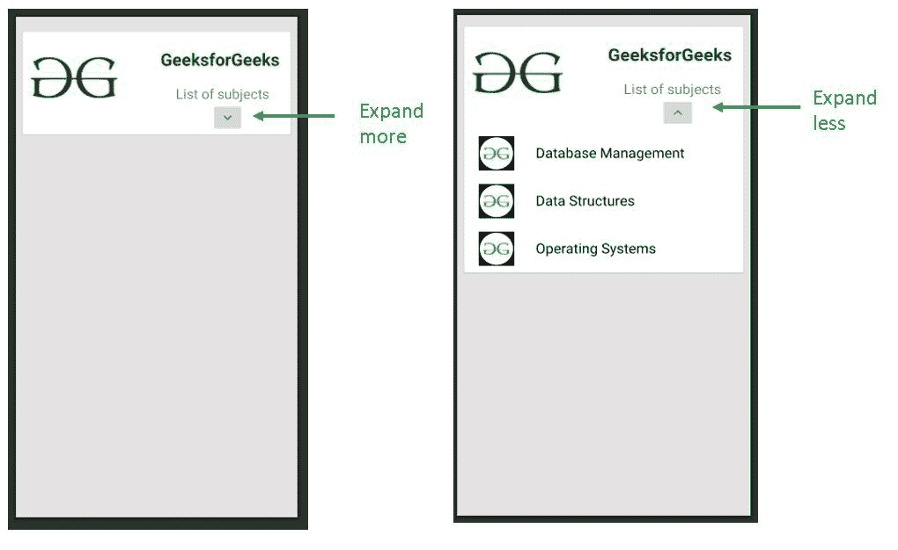
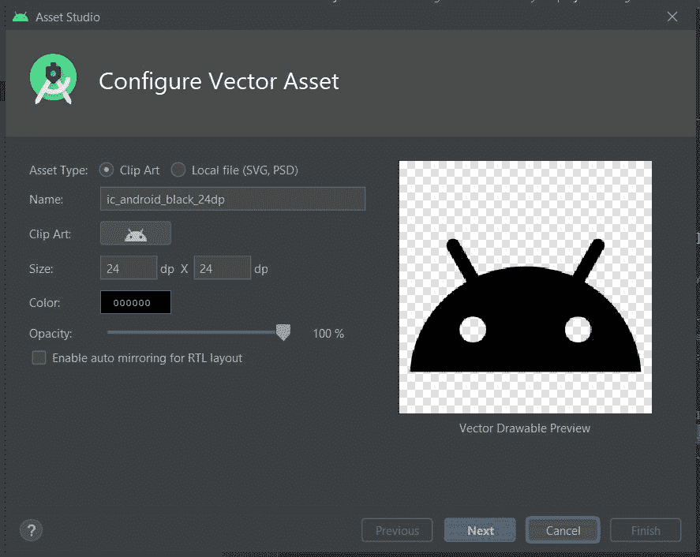
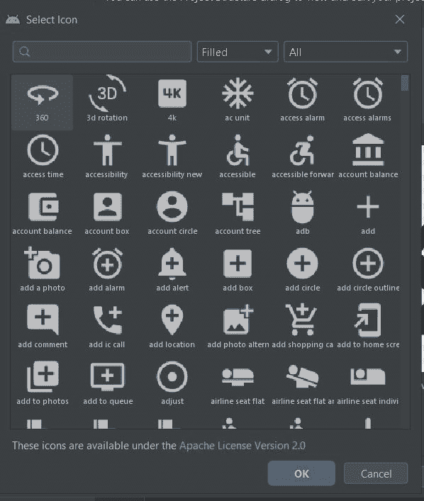

# 如何在安卓中创建可扩展的 card view

> 原文:[https://www . geeksforgeeks . org/如何创建可扩展的安卓 card view/](https://www.geeksforgeeks.org/how-to-create-an-expandable-cardview-in-android/)

**可扩展的卡片视图**提供创建扩展面板，没有太多麻烦，也不需要编写样板代码。当涉及到在屏幕上高效和系统地呈现数据或信息时，可扩展的卡片视图变得非常有用。它用于各种应用程序，例如“联系人”应用程序或“图库”应用程序。在本教程中，我们将使用 Java 在[安卓系统](https://www.geeksforgeeks.org/introduction-to-android-development/)中创建一个简单的可扩展卡片视图。


#### 方法

**第一步:在安卓工作室新建项目**

1.  单击文件，然后单击新建= >新建项目。
2.  为项目模板选择“空活动”。
3.  选择语言作为 Java。
4.  根据您的需要选择最小的软件开发工具包。

**第二步:添加卡片视图依赖关系**

为了能够使用 CardView 元素，首先必须在项目中添加它的依赖项。在 **build.gradle (Module: app)** 文件中添加以下依赖项，并点击**立即同步**以同步所做的更改。

> 实现' androidx . card view:card view:1 . 0 . 0 '

**第三步:在可绘制文件夹**中添加所有需要的可绘制资源

根据需要选择可提取的资源。在这里，在卡片视图中，使用 GeeksforGeeks 图标的两个图像和其他两个图标来指示“扩展更多”或“扩展更少”选项。以下是极客们使用的图标:


下图显示了扩展图标的使用:


这里使用的扩展图标是作为矢量资产从安卓工作室本身导入的。其步骤如下:

1.  右键单击可绘制的资源文件夹。
2.  去纽约。
3.  点击矢量资产。
4.  弹出如下框。点击剪贴画
    旁边的图标
5.  From the variety of icons shown, choose the following two icons:
    

    ```java
    ic_baseline_expand_more_24
    ic_baseline_expand_less_24

    ```

    以下文件被添加到可绘制文件夹:

    ## ic_baseline_expand_more_24

    ```java
    <vector xmlns:android="http://schemas.android.com/apk/res/android"
        android:width="24dp"
        android:height="24dp"
        android:viewportWidth="24"
        android:viewportHeight="24"
        android:tint="?attr/colorControlNormal">
    <path
        android:fillColor="@android:color/white"
        android:pathData="M16.59, 8.59L12, 13.17 7.41, 
                           8.59 6, 10l6, 6 6, -6z"/>
    </vector>
    ```

    ## ic _ 基线 _ 扩展 _ 无 _24

    ```java
    <vector xmlns:android="http://schemas.android.com/apk/res/android"
        android:width="24dp"
        android:height="24dp"
        android:viewportWidth="24"
        android:viewportHeight="24"
        android:tint="?attr/colorControlNormal">
    <path
        android:fillColor="@android:color/white"
        android:pathData="M12, 8l-6, 6 1.41, 1.41L12, 
                          10.83l4.59, 4.58L18, 14z"/>
    </vector>
    ```

**第四步:修改 XML 布局**

在 XML 文件中，创建整个布局以及您希望在展开 CardView 后显示的部分。这里的基本思想是将可扩展元素的可见性设置为**“消失”**或**“可见”**。

> **注意**:将可见性设置为“消失”而不是“不可见”，因为“消失”会完全移除该特定元素，就像它从未存在过一样。但是，“不可见”只会使元素在布局中仍然存在时消失。

在下面的布局中，展开卡片视图以显示三个主题的列表。以下是 **`activity_main.xml`** 文件的代码。

```java
<?xml version="1.0" encoding="utf-8"?>
<androidx.constraintlayout.widget.ConstraintLayout 
    xmlns:android="http://schemas.android.com/apk/res/android"
    xmlns:app="http://schemas.android.com/apk/res-auto"
    xmlns:tools="http://schemas.android.com/tools"
    android:layout_width="match_parent"
    android:layout_height="match_parent"
    android:background="#E4E3E3"
    tools:context=".MainActivity">

    <!--Base CardView-->
    <androidx.cardview.widget.CardView
        android:id="@+id/base_cardview"
        style="@style/Base.CardView"
        android:layout_width="match_parent"
        android:layout_height="wrap_content"
        android:layout_margin="10dp"
        app:layout_constraintBottom_toBottomOf="parent"
        app:layout_constraintEnd_toEndOf="parent"
        app:layout_constraintHorizontal_bias="0.473"
        app:layout_constraintStart_toStartOf="parent"
        app:layout_constraintTop_toTopOf="parent"
        app:layout_constraintVertical_bias="0.021">

        <!--This is a ConstraintLayout for the entire CardView 
                   including the expandable portion-->
        <androidx.constraintlayout.widget.ConstraintLayout
            android:layout_width="match_parent"
            android:layout_height="wrap_content"
            app:layout_constraintBottom_toBottomOf="@+id/base_cardview"
            app:layout_constraintTop_toTopOf="parent"
            app:layout_constraintVertical_bias="0.511"
            tools:layout_editor_absoluteX="-55dp">

            <!--This is a ConstraintLayout for the fixed portion
                of the CardView. The elements 
                that lie within the fixed portion of the CardView
                can be constrained to this layout.-->
            <androidx.constraintlayout.widget.ConstraintLayout
                android:id="@+id/fixed_layout"
                android:layout_width="match_parent"
                android:layout_height="150dp"
                app:layout_constraintBottom_toBottomOf="parent"
                app:layout_constraintEnd_toEndOf="parent"
                app:layout_constraintHorizontal_bias="0.0"
                app:layout_constraintStart_toStartOf="parent"
                app:layout_constraintTop_toTopOf="parent"
                app:layout_constraintVertical_bias="0.0">

                <ImageView
                    android:id="@+id/icon"
                    android:layout_width="150dp"
                    android:layout_height="150dp"
                    android:src="@drawable/icon_one"
                    app:layout_constraintBottom_toBottomOf="@+id/fixed_layout"
                    app:layout_constraintEnd_toEndOf="@+id/fixed_layout"
                    app:layout_constraintHorizontal_bias="0.0"
                    app:layout_constraintStart_toStartOf="@+id/fixed_layout"
                    app:layout_constraintTop_toTopOf="@+id/fixed_layout"
                    app:layout_constraintVertical_bias="1.0" />

                <TextView
                    android:id="@+id/heading"
                    android:layout_width="wrap_content"
                    android:layout_height="wrap_content"
                    android:text="GeeksforGeeks"
                    android:textColor="#006600"
                    android:textSize="25dp"
                    android:textStyle="bold"
                    app:layout_constraintBottom_toBottomOf="@+id/fixed_layout"
                    app:layout_constraintEnd_toEndOf="@+id/fixed_layout"
                    app:layout_constraintHorizontal_bias="0.926"
                    app:layout_constraintStart_toStartOf="@+id/fixed_layout"
                    app:layout_constraintTop_toTopOf="@+id/fixed_layout"
                    app:layout_constraintVertical_bias="0.198" />

                <TextView
                    android:id="@+id/list_of_subjects"
                    android:layout_width="wrap_content"
                    android:layout_height="wrap_content"
                    android:layout_marginTop="20dp"
                    android:layout_marginBottom="58dp"
                    android:text="List of subjects"
                    android:textSize="20dp"
                    app:layout_constraintBottom_toBottomOf="@+id/fixed_layout"
                    app:layout_constraintEnd_toEndOf="parent"
                    app:layout_constraintHorizontal_bias="0.878"
                    app:layout_constraintStart_toStartOf="parent"
                    app:layout_constraintTop_toBottomOf="@+id/heading"
                    app:layout_constraintVertical_bias="0.0" />

                <!--This is ImageButton for the expansion icon.-->
                <ImageButton
                    android:id="@+id/arrow_button"
                    android:layout_width="wrap_content"
                    android:layout_height="wrap_content"
                    android:src="@drawable/ic_baseline_expand_more_24"
                    app:layout_constraintBottom_toBottomOf="@id/fixed_layout"
                    app:layout_constraintEnd_toEndOf="parent"
                    app:layout_constraintHorizontal_bias="0.802"
                    app:layout_constraintStart_toStartOf="parent"
                    app:layout_constraintTop_toBottomOf="@+id/list_of_subjects"
                    app:layout_constraintVertical_bias="0.0" />

            </androidx.constraintlayout.widget.ConstraintLayout>

            <!--The following is the expandable portion whose 
                visibility is initially set to 'gone'.
                The parent LinearLayout contains 3 child LinearLayouts
                that hold a subject name and an icon each.-->
            <LinearLayout
                android:id="@+id/hidden_view"
                android:layout_width="match_parent"
                android:layout_height="wrap_content"
                android:orientation="vertical"
                android:visibility="gone"
                app:layout_constraintBottom_toBottomOf="parent"
                app:layout_constraintEnd_toEndOf="parent"
                app:layout_constraintStart_toStartOf="parent"
                app:layout_constraintTop_toBottomOf="@+id/fixed_layout">

                <!--Child LinearLayout 1-->
                <LinearLayout
                    android:layout_width="match_parent"
                    android:layout_height="match_parent"
                    android:orientation="horizontal">

                    <ImageView
                        android:layout_width="50dp"
                        android:layout_height="50dp"
                        android:layout_marginStart="20dp"
                        android:layout_marginTop="10dp"
                        android:layout_marginEnd="10dp"
                        android:layout_marginBottom="10dp"
                        android:src="@drawable/gfg_icon_black" />

                    <TextView
                        android:layout_width="wrap_content"
                        android:layout_height="wrap_content"
                        android:layout_marginStart="20dp"
                        android:layout_marginTop="20dp"
                        android:text="Database Management"
                        android:textColor="#000000"
                        android:textSize="20dp" />
                </LinearLayout>

                <!--Child LinearLayout 2-->
                <LinearLayout
                    android:layout_width="match_parent"
                    android:layout_height="match_parent"
                    android:orientation="horizontal">

                    <ImageView
                        android:layout_width="50dp"
                        android:layout_height="50dp"
                        android:layout_marginStart="20dp"
                        android:layout_marginTop="10dp"
                        android:layout_marginEnd="10dp"
                        android:layout_marginBottom="10dp"
                        android:src="@drawable/gfg_icon_black" />

                    <TextView
                        android:layout_width="wrap_content"
                        android:layout_height="wrap_content"
                        android:layout_marginStart="20dp"
                        android:layout_marginTop="20dp"
                        android:text="Data Structures"
                        android:textColor="#000000"
                        android:textSize="20dp" />
                </LinearLayout>

                <!--Child LinearLayout 3-->
                <LinearLayout
                    android:layout_width="match_parent"
                    android:layout_height="match_parent"
                    android:orientation="horizontal">

                    <ImageView
                        android:layout_width="50dp"
                        android:layout_height="50dp"
                        android:layout_marginStart="20dp"
                        android:layout_marginTop="10dp"
                        android:layout_marginEnd="10dp"
                        android:layout_marginBottom="10dp"
                        android:src="@drawable/gfg_icon_black" />

                    <TextView
                        android:layout_width="wrap_content"
                        android:layout_height="wrap_content"
                        android:layout_marginStart="20dp"
                        android:layout_marginTop="20dp"
                        android:text="Operating Systems"
                        android:textColor="#000000"
                        android:textSize="20dp" />
                </LinearLayout>
            </LinearLayout>

        </androidx.constraintlayout.widget.ConstraintLayout>
    </androidx.cardview.widget.CardView>

</androidx.constraintlayout.widget.ConstraintLayout>
```

**第五步:修改 Java 文件**

在 **`MainActivity.java`** 中，使用 **if-else** 语句，指定操纵可扩展元素可见性的条件。

```java
package com.example.android.expandable_cardview;

import android.os.Bundle;
import android.transition.AutoTransition;
import android.transition.TransitionManager;
import android.view.View;
import android.widget.ImageButton;
import android.widget.LinearLayout;
import androidx.appcompat.app.AppCompatActivity;
import androidx.cardview.widget.CardView;

public class MainActivity extends AppCompatActivity {

    ImageButton arrow;
    LinearLayout hiddenView;
    CardView cardView;

    @Override
    protected void onCreate(Bundle savedInstanceState) {
        super.onCreate(savedInstanceState);
        setContentView(R.layout.activity_main);

        cardView = findViewById(R.id.base_cardview);
        arrow = findViewById(R.id.arrow_button);
        hiddenView = findViewById(R.id.hidden_view);

        arrow.setOnClickListener(new View.OnClickListener() {
            @Override
            public void onClick(View view) {

                // If the CardView is already expanded, set its visibility
                //  to gone and change the expand less icon to expand more.
                if (hiddenView.getVisibility() == View.VISIBLE) {

                    // The transition of the hiddenView is carried out
                    //  by the TransitionManager class.
                    // Here we use an object of the AutoTransition 
                    // Class to create a default transition.
                    TransitionManager.beginDelayedTransition(cardView, 
                                                  new AutoTransition());
                    hiddenView.setVisibility(View.GONE);
                    arrow.setImageResource(R.drawable.ic_baseline_expand_more_24);
                }

                // If the CardView is not expanded, set its visibility 
                // to visible and change the expand more icon to expand less.
                else {

                    TransitionManager.beginDelayedTransition(cardView,
                                                new AutoTransition());
                    hiddenView.setVisibility(View.VISIBLE);
                    arrow.setImageResource(R.drawable.ic_baseline_expand_less_24);
                }
            }
        });
    }
}
```

#### 输出:在模拟器上运行

<video class="wp-video-shortcode" id="video-453306-1" width="300" height="500" preload="metadata" controls=""><source type="video/mp4" src="https://media.geeksforgeeks.org/wp-content/uploads/20200704144330/ec.mp4?_=1">[https://media.geeksforgeeks.org/wp-content/uploads/20200704144330/ec.mp4](https://media.geeksforgeeks.org/wp-content/uploads/20200704144330/ec.mp4)</video>