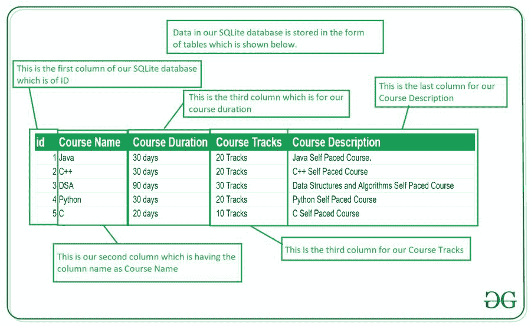
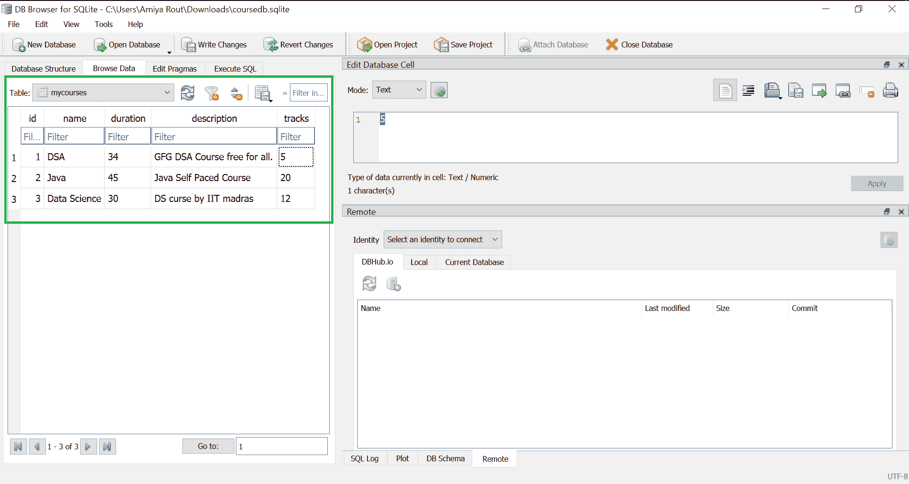
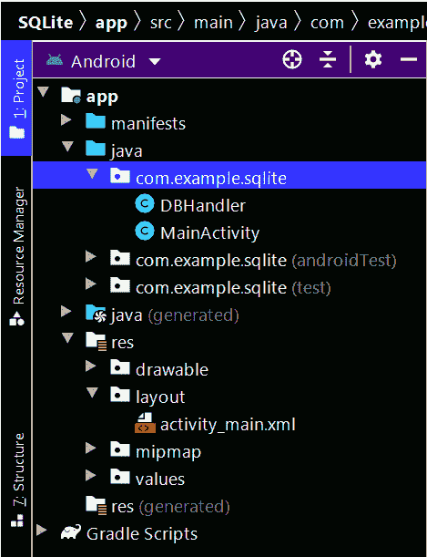

# 如何在安卓系统中创建数据并添加到 SQLite 数据库？

> 原文:[https://www . geeksforgeeks . org/如何在 android 中创建和添加数据到 sqlite 数据库/](https://www.geeksforgeeks.org/how-to-create-and-add-data-to-sqlite-database-in-android/)

[**SQLite**](https://www.geeksforgeeks.org/introduction-to-sqlite/) 是 Android 中另一个可用的数据存储，我们可以在用户的设备中存储数据，并在需要时随时使用。在本文中，我们将研究在安卓应用程序中创建一个 SQLite 数据库，并在安卓应用程序中向该数据库添加数据。这是一个由 4 篇文章组成的系列，我们将在其中用 Android 中的 **SQLite 数据库**执行基本的 **CRUD(创建、读取、更新和删除)**操作。我们将在本系列中介绍以下 4 篇文章:

1.  安卓系统中如何创建数据并添加到 SQLite 数据库？
2.  [如何在安卓系统中读取 SQLite 数据库的数据？](https://www.geeksforgeeks.org/how-to-read-data-from-sqlite-database-in-android/)
3.  [如何在安卓中更新数据到 SQLite 数据库？](https://www.geeksforgeeks.org/how-to-update-data-to-sqlite-database-in-android/)
4.  [安卓系统如何删除 SQLite 数据库中的数据？](https://www.geeksforgeeks.org/how-to-delete-data-in-sqlite-database-in-android/)

### 什么是 SQLite 数据库？

SQLite 数据库是 Android 中提供的开源数据库，用于以文本文件的形式将数据存储在用户设备内部。我们可以对这些数据执行许多操作，例如添加新数据、更新、读取和删除这些数据。SQLite 是一个离线数据库，本地存储在用户的设备中，我们不需要创建任何连接来连接到这个数据库。

### 数据是如何存储在 SQLite 数据库中的？

数据以**表**的形式存储在 SQLite 数据库中。当我们将这些数据存储在 SQLite 数据库中时，它们以类似于 excel 工作表的表格形式排列。下面是我们存储在 SQLite 数据库中的 SQLite 数据库的表示。



### SQLite 数据库中的重要方法

下面是我们将在安卓系统的 SQLite 数据库集成中使用的几个重要方法。

<figure class="table">

| 

方法

 | 

描述

 |
| --- | --- |
| getColumnNames() | This method is used to get the column name array of our SQLite table. |
| getCount（） | This method returns the number of rows where the cursor is located. |
| isClosed() | When our cursor is closed, this method returns a Boolean value. |
| getColumnCount() | This method returns the total number of columns in our table. |
| 获取列名(int 列索引) | When we pass the index of the column in it, this method returns the name of the column. |
| 获取列索引(字符串列名) | This method returns the index of our column from the column name. |
| getPosition() | This method will return the current position of our cursor in our table. |

</figure>

### 我们将在本文中构建什么？

我们将构建一个简单的应用程序，在其中我们将向 SQLite 数据库添加数据。我们将创建一个数据库，用于添加课程名称、课程描述、课程持续时间和课程轨迹。我们将把所有这些数据保存在我们的 SQLite 数据库中。下面给出一个视频样本，了解一下在本文中我们要做什么。注意，我们将使用 **Java** 语言来实现这个项目。

<video class="wp-video-shortcode" id="video-562724-1" width="640" height="360" preload="metadata" controls=""><source type="video/mp4" src="https://media.geeksforgeeks.org/wp-content/uploads/20210217101214/Screenrecorder-2021-02-17-10-10-20-513.mp4?_=1">[https://media.geeksforgeeks.org/wp-content/uploads/20210217101214/Screenrecorder-2021-02-17-10-10-20-513.mp4](https://media.geeksforgeeks.org/wp-content/uploads/20210217101214/Screenrecorder-2021-02-17-10-10-20-513.mp4)</video>

### **分步实施**

**第一步:创建新项目**

要在安卓工作室创建新项目，请参考[如何在安卓工作室创建/启动新项目](https://www.geeksforgeeks.org/android-how-to-create-start-a-new-project-in-android-studio/)。注意选择 **Java** 作为编程语言。

**第二步:在 AndroidManifest.xml 文件**中添加访问存储的权限

导航到**应用程序> AndroidManifest.xml** ，并添加以下代码。

## 可扩展标记语言

```
<uses-permission android:name="android.permission.READ_EXTERNAL_STORAGE" />
```

**步骤 3:使用 activity_main.xml 文件**

导航到**应用程序> res >布局> activity_main.xml** 并将下面的代码添加到该文件中。下面是 **activity_main.xml** 文件的代码。

## 可扩展标记语言

```
<?xml version="1.0" encoding="utf-8"?>
<LinearLayout 
    xmlns:android="http://schemas.android.com/apk/res/android"
    xmlns:tools="http://schemas.android.com/tools"
    android:layout_width="match_parent"
    android:layout_height="match_parent"
    android:orientation="vertical"
    tools:context=".MainActivity">

    <!--Edit text to enter course name-->
    <EditText
        android:id="@+id/idEdtCourseName"
        android:layout_width="match_parent"
        android:layout_height="wrap_content"
        android:layout_margin="10dp"
        android:hint="Enter course Name" />

    <!--edit text to enter course duration-->
    <EditText
        android:id="@+id/idEdtCourseDuration"
        android:layout_width="match_parent"
        android:layout_height="wrap_content"
        android:layout_margin="10dp"
        android:hint="Enter Course Duration" />

    <!--edit text to display course tracks-->
    <EditText
        android:id="@+id/idEdtCourseTracks"
        android:layout_width="match_parent"
        android:layout_height="wrap_content"
        android:layout_margin="10dp"
        android:hint="Enter Course Tracks" />

    <!--edit text for course description-->
    <EditText
        android:id="@+id/idEdtCourseDescription"
        android:layout_width="match_parent"
        android:layout_height="wrap_content"
        android:layout_margin="10dp"
        android:hint="Enter Course Description" />

    <!--button for adding new course-->
    <Button
        android:id="@+id/idBtnAddCourse"
        android:layout_width="match_parent"
        android:layout_height="wrap_content"
        android:layout_margin="10dp"
        android:text="Add Course"
        android:textAllCaps="false" />

</LinearLayout>
```

**第 4 步:创建一个新的 Java 类来执行 SQLite 操作**

导航到**应用程序> java >你的应用程序的包名>右键点击它>新建> Java 类**并将其命名为 **DBHandler** 并添加下面的代码。在代码中添加注释，以更详细地理解代码。

## Java 语言(一种计算机语言，尤用于创建网站)

```
import android.content.ContentValues;
import android.content.Context;
import android.database.sqlite.SQLiteDatabase;
import android.database.sqlite.SQLiteOpenHelper;

public class DBHandler extends SQLiteOpenHelper {

    // creating a constant variables for our database.
    // below variable is for our database name.
    private static final String DB_NAME = "coursedb";

    // below int is our database version
    private static final int DB_VERSION = 1;

    // below variable is for our table name.
    private static final String TABLE_NAME = "mycourses";

    // below variable is for our id column.
    private static final String ID_COL = "id";

    // below variable is for our course name column
    private static final String NAME_COL = "name";

    // below variable id for our course duration column.
    private static final String DURATION_COL = "duration";

    // below variable for our course description column.
    private static final String DESCRIPTION_COL = "description";

    // below variable is for our course tracks column.
    private static final String TRACKS_COL = "tracks";

    // creating a constructor for our database handler.
    public DBHandler(Context context) {
        super(context, DB_NAME, null, DB_VERSION);
    }

    // below method is for creating a database by running a sqlite query
    @Override
    public void onCreate(SQLiteDatabase db) {
        // on below line we are creating 
        // an sqlite query and we are 
        // setting our column names
        // along with their data types.
        String query = "CREATE TABLE " + TABLE_NAME + " ("
                + ID_COL + " INTEGER PRIMARY KEY AUTOINCREMENT, "
                + NAME_COL + " TEXT,"
                + DURATION_COL + " TEXT,"
                + DESCRIPTION_COL + " TEXT,"
                + TRACKS_COL + " TEXT)";

        // at last we are calling a exec sql 
        // method to execute above sql query
        db.execSQL(query);
    }

    // this method is use to add new course to our sqlite database.
    public void addNewCourse(String courseName, String courseDuration, String courseDescription, String courseTracks) {

        // on below line we are creating a variable for 
        // our sqlite database and calling writable method 
        // as we are writing data in our database.
        SQLiteDatabase db = this.getWritableDatabase();

        // on below line we are creating a 
        // variable for content values.
        ContentValues values = new ContentValues();

        // on below line we are passing all values 
        // along with its key and value pair.
        values.put(NAME_COL, courseName);
        values.put(DURATION_COL, courseDuration);
        values.put(DESCRIPTION_COL, courseDescription);
        values.put(TRACKS_COL, courseTracks);

        // after adding all values we are passing
        // content values to our table.
        db.insert(TABLE_NAME, null, values);

        // at last we are closing our
        // database after adding database.
        db.close();
    }

    @Override
    public void onUpgrade(SQLiteDatabase db, int oldVersion, int newVersion) {
        // this method is called to check if the table exists already.
        db.execSQL("DROP TABLE IF EXISTS " + TABLE_NAME);
        onCreate(db);
    }
}
```

**第五步:使用****MainActivity.java 文件**

转到**MainActivity.java**文件，参考以下代码。以下是**MainActivity.java**文件的代码。代码中添加了注释，以更详细地理解代码。

## Java 语言(一种计算机语言，尤用于创建网站)

```
import android.os.Bundle;
import android.view.View;
import android.widget.Button;
import android.widget.EditText;
import android.widget.Toast;

import androidx.appcompat.app.AppCompatActivity;

public class MainActivity extends AppCompatActivity {

    // creating variables for our edittext, button and dbhandler
    private EditText courseNameEdt, courseTracksEdt, courseDurationEdt, courseDescriptionEdt;
    private Button addCourseBtn;
    private DBHandler dbHandler;

    @Override
    protected void onCreate(Bundle savedInstanceState) {
        super.onCreate(savedInstanceState);
        setContentView(R.layout.activity_main);

        // initializing all our variables.
        courseNameEdt = findViewById(R.id.idEdtCourseName);
        courseTracksEdt = findViewById(R.id.idEdtCourseTracks);
        courseDurationEdt = findViewById(R.id.idEdtCourseDuration);
        courseDescriptionEdt = findViewById(R.id.idEdtCourseDescription);
        addCourseBtn = findViewById(R.id.idBtnAddCourse);

        // creating a new dbhandler class 
        // and passing our context to it.
        dbHandler = new DBHandler(MainActivity.this);

        // below line is to add on click listener for our add course button.
        addCourseBtn.setOnClickListener(new View.OnClickListener() {
            @Override
            public void onClick(View v) {

                // below line is to get data from all edit text fields.
                String courseName = courseNameEdt.getText().toString();
                String courseTracks = courseTracksEdt.getText().toString();
                String courseDuration = courseDurationEdt.getText().toString();
                String courseDescription = courseDescriptionEdt.getText().toString();

                // validating if the text fields are empty or not.
                if (courseName.isEmpty() && courseTracks.isEmpty() && courseDuration.isEmpty() && courseDescription.isEmpty()) {
                    Toast.makeText(MainActivity.this, "Please enter all the data..", Toast.LENGTH_SHORT).show();
                    return;
                }

                // on below line we are calling a method to add new 
                // course to sqlite data and pass all our values to it.
                dbHandler.addNewCourse(courseName, courseDuration, courseDescription, courseTracks);

                // after adding the data we are displaying a toast message.
                Toast.makeText(MainActivity.this, "Course has been added.", Toast.LENGTH_SHORT).show();
                courseNameEdt.setText("");
                courseDurationEdt.setText("");
                courseTracksEdt.setText("");
                courseDescriptionEdt.setText("");
            }
        });
    }
}
```

现在运行您的应用程序，并查看应用程序的输出。

### 输出:

<video class="wp-video-shortcode" id="video-562724-2" width="640" height="360" preload="metadata" controls=""><source type="video/mp4" src="https://media.geeksforgeeks.org/wp-content/uploads/20210217101214/Screenrecorder-2021-02-17-10-10-20-513.mp4?_=2">[https://media.geeksforgeeks.org/wp-content/uploads/20210217101214/Screenrecorder-2021-02-17-10-10-20-513.mp4](https://media.geeksforgeeks.org/wp-content/uploads/20210217101214/Screenrecorder-2021-02-17-10-10-20-513.mp4)</video>

成功执行代码后，在编辑文本中输入所需的数据。最重要的是，如果你想知道 **如何在安卓工作室查看和定位 SQLite 数据库，那么请参考这篇** [文章](https://www.geeksforgeeks.org/how-to-view-and-locate-sqlite-database-in-android-studio/) **。**并且你可以看到下面的这就是数据是如何存储在SQLite数据库中的。



**下面是执行创建和添加操作后的完整项目文件结构:**

