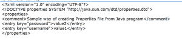
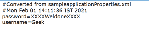

# 如何以文本和 XML 格式创建和修改 Java 程序的属性文件表单？

> 原文:[https://www . geesforgeks . org/如何创建和修改属性-文件-表单-Java-程序-文本和 xml 格式/](https://www.geeksforgeeks.org/how-to-create-and-modify-properties-file-form-java-program-in-text-and-xml-format/)

属性文件是一个面向文本的键值，一对存在于带有*的 Java 项目中的内容。属性*扩展。逐行呈现内容的键值对，通常通过记事本、写字板、EditPlus 等方式准备。，属性文件通常有助于存储重要的敏感信息，在本文中，让我们看看如何使用 Java 程序创建属性文件。

Java API 得到了 **java.util.Properties** 类，它有几个实用程序存储 **()** 方法来以 T **ext 或 XML 格式**存储属性。为了以**文本**格式存储属性，可以使用 **Store()** 方法。 **storeToXML** ()用于制作 **XML** 格式的。

store()方法采用了两个参数，如输出流和注释。

**文本格式创建:**

让我们看看如何创建一个文本格式的属性文件。当我们创建属性内容时，需要给出一个有效的文件路径位置。

## Java 语言(一种计算机语言，尤用于创建网站)

```java
import java.io.FileNotFoundException;
import java.io.FileOutputStream;
import java.io.IOException;
import java.util.Properties;

public class CreationOfTextOrientedProperties {

    public static void main(String args[])
        throws FileNotFoundException, IOException
    {

        // Creating properties files from Java program
        Properties properties = new Properties();

        // In the name of userCreated.properties, in the
        // current directory location, the file is created
        FileOutputStream fileOutputStream
            = new FileOutputStream(
                "userCreated.properties");

        // As an example, given steps how
        // to keep username and password
        properties.setProperty("username", "value1");
        properties.setProperty("password", "value2");

        // writing properties into properties file
        // from Java As we are writing text format,
        // store() method is used
        properties.store(
            fileOutputStream,
            "Sample way of creating Properties file from Java program");

        fileOutputStream.close();
    }
}
```

**输出:**


我们使用 store()以文本格式保存属性文件。作为键值对，它们被设置。即键=值。除此之外，所有的都被认为是注释，因此用#符号，注释被放置。

在许多情况下，当属性内容较少，开发人员团队经常变动，最终用户在非 IT 端时，以文本格式使用属性很有帮助。

**XML 格式创建:**

在许多情况下，需要 XML，它为存储重要的敏感信息提供了一种易于理解和高效的格式。可扩展标记语言(XML)是一种标记语言，它有一套编码文档的规则，它们可以以人类可读和机器可读的格式理解。在这里，让我们看看如何通过 Java 程序创建

## Java 语言(一种计算机语言，尤用于创建网站)

```java
import java.io.FileNotFoundException;
import java.io.FileOutputStream;
import java.io.IOException;
import java.util.Properties;

public class CreationOfXMLOrientedProperties {

    public static void main(String args[])
        throws FileNotFoundException, IOException
    {

        // Creating properties files from Java program
        Properties properties = new Properties();

        // In the name of userCreated.xml, in the current
        // directory location, the file is created
        FileOutputStream fileOutputStream
            = new FileOutputStream("userCreated.xml");

        // As an example, given steps how to keep username
        // and password
        properties.setProperty("username", "value1");
        properties.setProperty("password", "value2");

        // writing properties into properties file
        // from Java As we are writing in XML format,
        // storeToXML() method is used
        properties.storeToXML(
            fileOutputStream,
            "Sample way of creating Properties file from Java program");

        fileOutputStream.close();
    }
}
```

**输出:**



如果我们检查 XML 的输出，它有相等的入口和出口。

通过 java 程序创建的也有相同的结构。以<properties>开始，以</properties>结束。除了键值对集，文本被视为注释，因此它们在注释标签中。属性文件只有键值，这里也是在“entry”标签和“key=”中声明的，这意味着每个键值对都有单独的条目。

每当属性文件内容庞大并且包含银行交易、金融数据等敏感信息时。，最好只采用 XML 格式。

**将 XML 内容转换为只读文本模式的便捷方式**

## Java 语言(一种计算机语言，尤用于创建网站)

```java
import java.io.FileInputStream;
import java.io.FileOutputStream;
import java.io.IOException;
import java.io.InputStream;
import java.io.OutputStream;
import java.util.InvalidPropertiesFormatException;
import java.util.Properties;

public class ConvertXMLToTextOrientedProperties {
    public static void main(String[] args)
        throws InvalidPropertiesFormatException, IOException
    {
        String outputPropertiesFile
            = "sampleapplication.properties";
        String inputXmlFile
            = "sampleapplicationProperties.xml";

        // Input XML File which contains
        // necessary information
        InputStream inputStream
            = new FileInputStream(inputXmlFile);

        // Output properties File
        OutputStream outputStream
            = new FileOutputStream(outputPropertiesFile);

        Properties properties = new Properties();

        // Load XML file that has necessary information
        properties.loadFromXML(inputStream);

        // Store to properties file via this way
        properties.store(
            outputStream,
            "Converted from sampleapplicationProperties.xml");

        // For sample testing let us get username--It is
        // nothing but "Geek"

        // As it is converted to .properties file,
        // we can get the values in this way
        System.out.println(properties.get("username"));
    }
}
```

**输入文件(sampleapplicationproperties . XML)**

## 可扩展标记语言

```java
<?xml version="1.0" encoding="UTF-8"?>
<!DOCTYPE properties SYSTEM "http://java.sun.com/dtd/properties.dtd">
<properties>
<comment>Elegant way of converting sampleapplicationProperties.xml
  to Sampleapplication.properties</comment>
<entry key="username">Geek</entry>
  <entry key="password">XXXXWeldoneXXXX</entry>
</properties>
```

**生成的输出文件(sampleapplication . properties)**



我们还有 system . out . println(properties . get(“用户名”)；，它显示

“极客”作为输出。所以 loadFromXML()有助于加载 XML 文件，并通过 store()将其转换为面向文本的属性文件，并且在转换后，我们可以轻松获得属性值。

**结论:**

在本文中，我们已经看到了从 java 程序创建属性文件的方法。在你方便的时候享用它们。它们在软件项目的任何部分都是有帮助的，因为属性文件是保存敏感信息的关键文件，并且因为它们是以文本或 XML 格式的键值对，所以可以看到动态用法，并且在任何时间点，我们也可以很容易地修改它们。