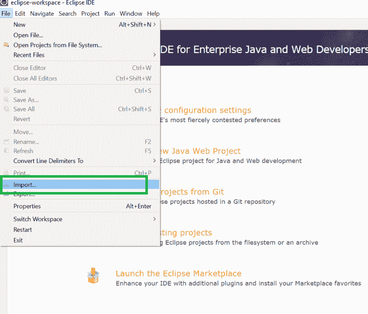
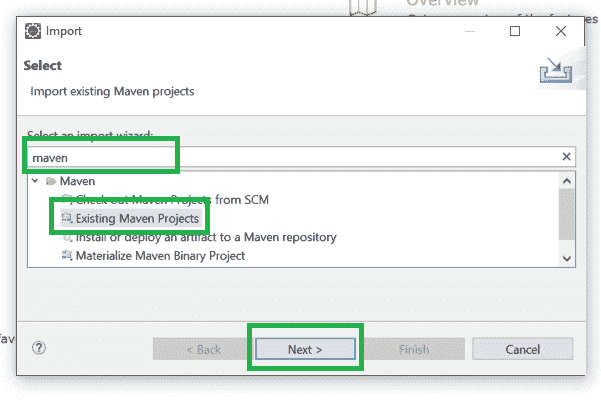
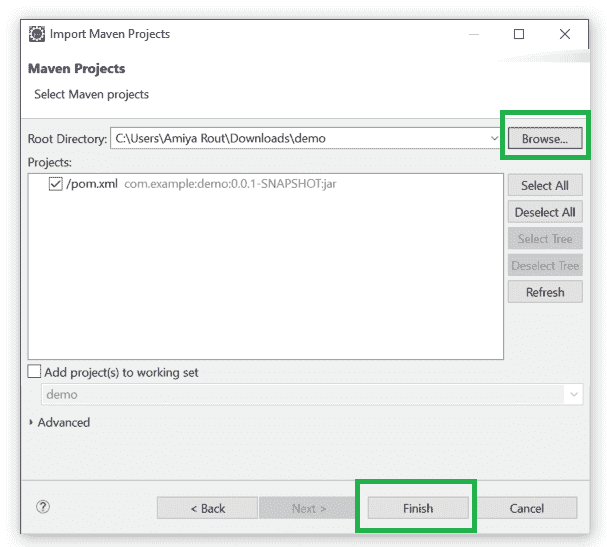
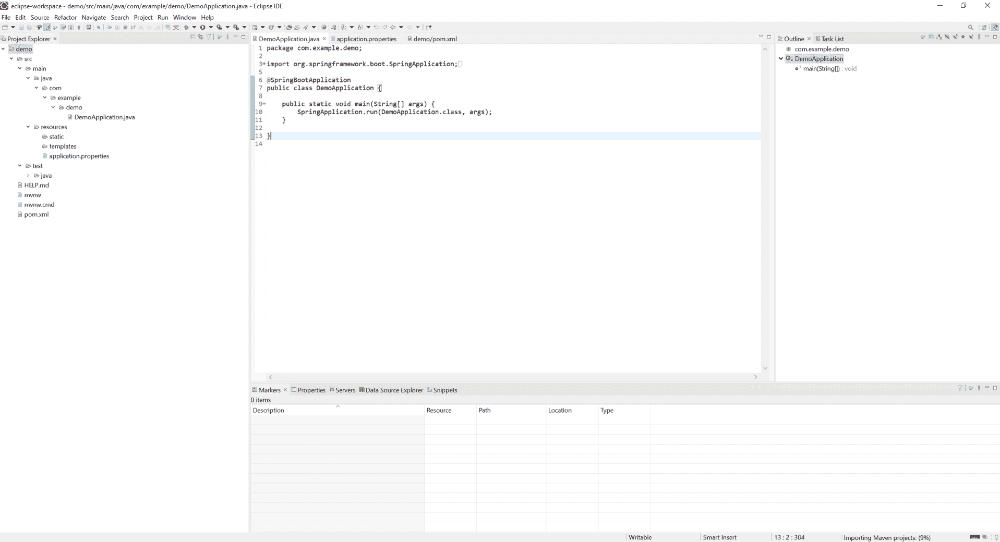

# 如何在 Eclipse IDE 中创建和设置 Spring Boot 项目？

> 原文:[https://www . geeksforgeeks . org/如何在 eclipse-ide 中创建和设置-spring-boot-project/](https://www.geeksforgeeks.org/how-to-create-and-setup-spring-boot-project-in-eclipse-ide/)

Spring Boot 建在春天的顶端，包含了春天的所有特征。由于其快速的生产就绪环境，开发人员能够直接专注于逻辑，而不是纠结于配置和设置，因此正成为开发人员的最爱。Spring Boot 是一个基于微服务的框架，在其中制作一个生产就绪的应用程序只需要很少的时间。以下是 Spring Boot 的一些特色:

*   它允许避免春季出现的 XML 的繁重配置
*   它提供了 REST 端点的简单维护和创建
*   它包括嵌入式 Tomcat 服务器
*   部署非常容易，war 和 jar 文件可以很容易地部署在 tomcat 服务器中

更多信息请参考本文:[Spring Boot 简介](https://www.geeksforgeeks.org/introduction-to-spring-boot/)

这里我们将重点关注在 **Eclipse IDE** 中创建和设置春季启动项目。Eclipse 集成开发环境以 Java **集成开发环境**而闻名，但是它有许多非常酷的集成开发环境，包括 C/C++集成开发环境、JavaScript/TypeScript 集成开发环境、PHP 集成开发环境等等。

**程序:**

1.  为企业 Java 和网络开发人员安装 Eclipse 集成开发环境
2.  在 Spring Initializr 中创建 Spring Boot 项目
3.  在 Eclipse 集成开发环境中导入 Spring Boot 项目
4.  搜索“maven”并选择“现有 Maven 项目”
5.  选择**下一步**
6.  点击**浏览**按钮，选择提取的邮编
7.  点击**完成**按钮，我们就完成了 Spring Boot 项目的创建

让我们结合视觉辅助工具详细讨论这些步骤

**步骤 1:** 为企业 Java 和 Web Developer 安装 Eclipse IDE

请参考本文如何为企业 Java 和 Web 开发安装 Eclipse IDE 并安装 Eclipse IDE。

**步骤 2:** 在 Spring Initializr 中创建一个 Spring Boot 项目

转到[这个链接](https://start.spring.io/)创建一个 Spring Boot 项目。请相应填写所有详细信息，最后点击下面的**生成**按钮。这将以 zip 格式下载您的 Spring Boot 项目。现在将该文件夹提取到您的本地计算机中。关于弹簧初始化器的更多细节，请参考本文:[弹簧初始化器](https://www.geeksforgeeks.org/spring-initializr/)

**第三步:**在 Eclipse IDE 中导入 Spring Boot 项目

进入**企业 Java Eclipse IDE 和 Web Developer >文件>导入**，如下图所示。

**第四步:**搜索“maven”，选择**已有 Maven 项目**，点击**下一步**按钮，如下图所示。

**第五步:**现在点击**浏览**按钮，选择已经生成的解压后的 zip 文件。

**第六步**。最后点击**完成**按钮，我们就完成了 Spring Boot 项目的创建

> 到目前为止，Spring Boot 项目已经创建，如下图所示媒体

