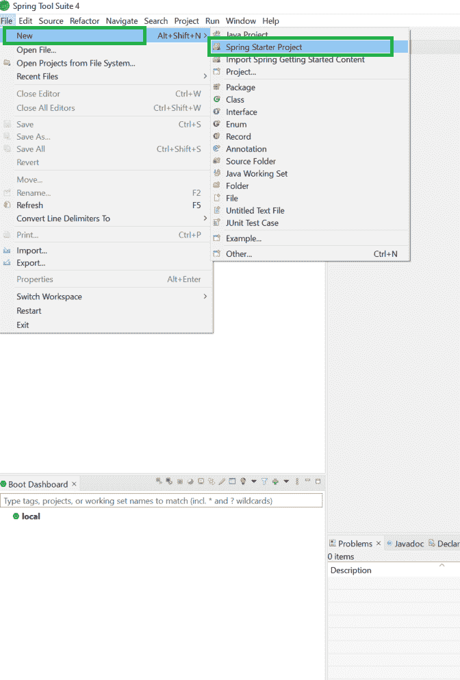
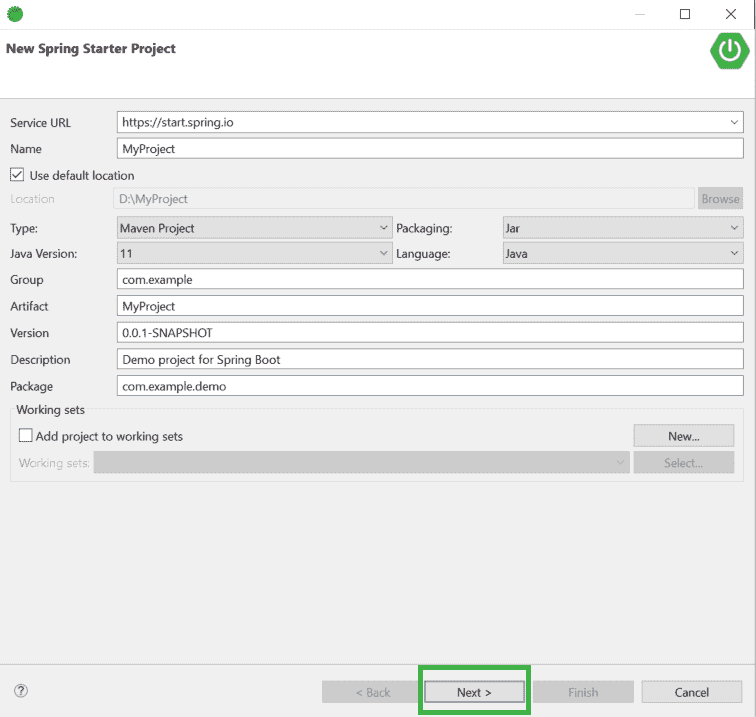
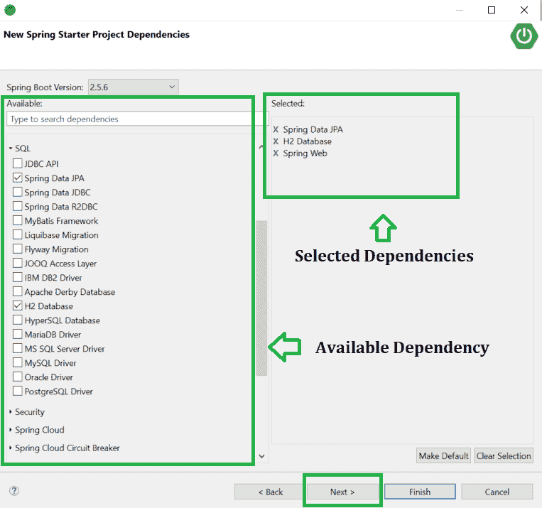
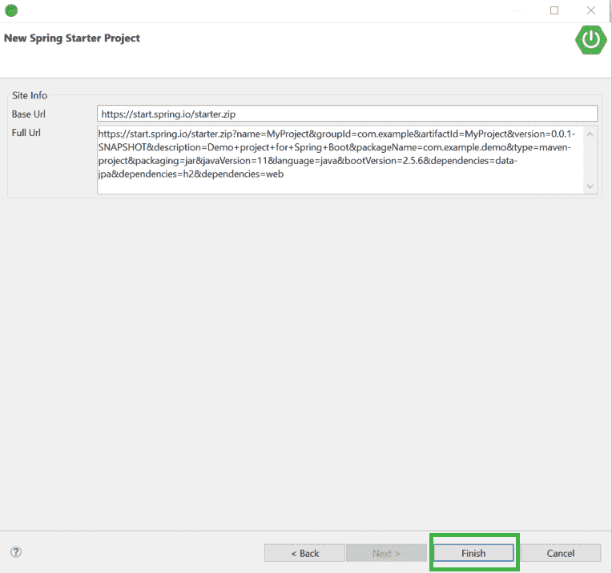
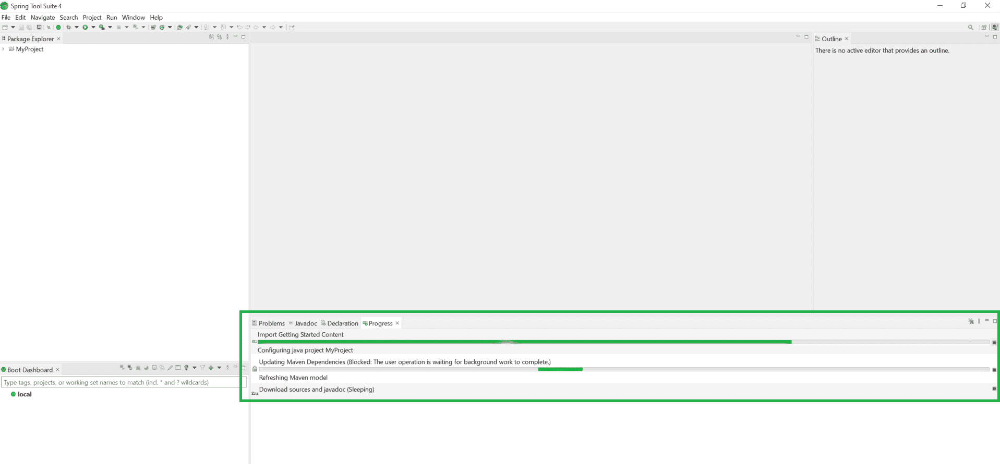
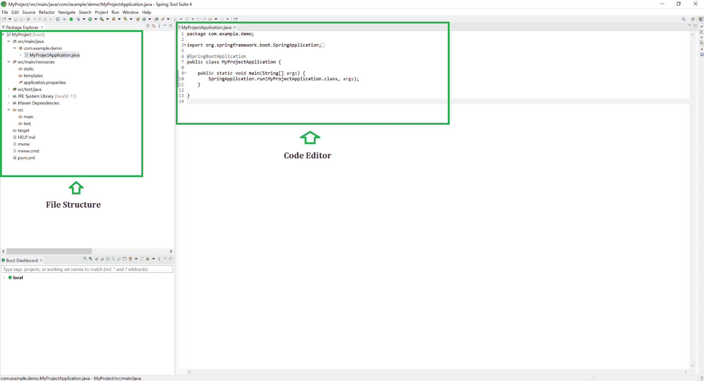

# 如何在 Spring 工具套件中创建和设置 Spring Boot 项目？

> 原文:[https://www . geesforgeks . org/如何创建和设置-春季启动-春季项目-工具套件/](https://www.geeksforgeeks.org/how-to-create-and-setup-spring-boot-project-in-spring-tool-suite/)

[Spring Boot](https://www.geeksforgeeks.org/introduction-to-spring-boot/) 建在春天的顶端，包含了春天的所有特征。由于其快速的生产就绪环境，开发人员能够直接专注于逻辑，而不是纠结于配置和设置，因此正成为开发人员的最爱。Spring Boot 是一个基于微服务的框架，在其中制作一个生产就绪的应用程序只需要很少的时间。以下是 Spring Boot 的一些特色:

*   它允许避免春季出现的 XML 的繁重配置
*   它提供了 REST 端点的简单维护和创建
*   它包括嵌入式 Tomcat 服务器
*   部署非常容易，war 和 jar 文件可以很容易地部署在 tomcat 服务器中

更多信息请参考本文:[Spring Boot 简介](https://www.geeksforgeeks.org/introduction-to-spring-boot/)

所以在本文中，我们将解释如何在 **Spring Tool Suite IDE** 中创建和设置 spring boot 项目。Spring 工具套件(STS)是一个为开发基于 Spring 的企业应用程序而定制的 java IDE。它更容易、更快、更方便。最重要的是，它基于 Eclipse 集成开发环境。STS 是免费的、开源的，并且由 VMware 提供支持。Spring Tools 4 是下一代 Spring 工具，适合最喜欢的编码环境。很大程度上是从零开始重建的，它为开发基于 Spring 的企业应用程序提供了世界级的支持，无论您更喜欢 Eclipse、Visual Studio Code 还是忒伊亚 IDE。

**程序:**

1.  安装弹簧工具套件集成开发环境
2.  创建新的 Spring 项目
3.  在弹出窗口中填写详细信息，然后按下一步。
4.  选择 Spring Boot 版本并选择依赖项，然后按下一步。
5.  点击“完成”按钮。

**步骤 1:安装弹簧工具套件(Eclipse 的弹簧工具 4)IDE**

为此用户必须具备[下载和安装 Spring Tool Suite IDE](https://spring.io/tools) 的必备知识

**第二步:**转到 ***文件>新建>春晚项目*** 如下图所示。

**第三步:**在该弹出窗口中填写如下详细信息，并进一步点击**下一步**按钮，如下图所示。

> *   **Service URL:** Default
> *   **Name:** Name of your project
> *   **Type:** Maven project
> *   **Java version:** 11 or greater
> *   **Packing:** According to your needs.
> *   **Language:** Depending on your needs.
> *   **Group:** Version A: default
> *   **Description:** According to your needs
> *   T42] Package: Name of your package

**第 4 步:**选择您需要的 **Spring Boot 版本**，并根据您的项目需求选择您的依赖项。最后点击**下一步**按钮。

**第五步:**现在只需点击**完成**按钮。

现在，请等待一段时间来下载所有必需的文件，例如您在上面的步骤 4 中选择的依赖项。

> 以下是您在 Spring 工具套件中成功创建和设置 Spring Boot 项目后的欢迎屏幕

