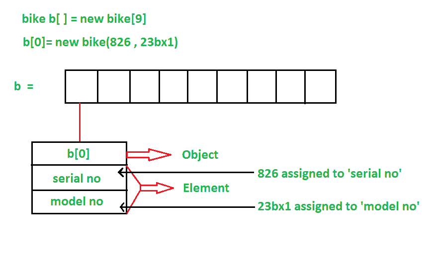

# 如何用 Java 创建对象数组？

> 原文:[https://www . geesforgeks . org/如何在 java 中创建对象数组/](https://www.geeksforgeeks.org/how-to-create-array-of-objects-in-java/)

先决条件–[在 Java 中创建对象的不同方式](https://www.geeksforgeeks.org/different-ways-create-objects-java/)

Java 编程语言是关于[类和对象](https://www.geeksforgeeks.org/classes-objects-java/)的，因为它是一种[面向对象编程语言](https://www.geeksforgeeks.org/object-oriented-programming-oops-concept-in-java/)。当我们需要一个单一的对象存储在我们的程序中时，我们用一个类型为 object 的变量来实现。但是当我们处理大量对象时，最好使用对象数组。

对象数组顾名思义，它存储一个对象数组。与传统的数组存储诸如字符串、整数、布尔等值不同，对象的*数组*存储 ***对象*** ，这意味着对象被存储为数组的元素。请注意，当我们说**对象数组**时，存储在数组中的不是对象本身，而是对象的引用。

**用 Java 创建对象数组–**

使用[对象类](https://www.geeksforgeeks.org/object-class-in-java/)创建一个对象数组，我们知道对象类是所有类的根类。

我们使用*类名*后跟方括号 *[]* 然后是对象引用名来创建对象数组。

```
Class_Name[ ] objectArrayReference;
```

或者，我们也可以将对象数组声明为:

```
Class_Name objectArrayReference[ ];
```

以上两个声明都暗示了***objectArrayReference***是一个对象数组。

例如，如果您有一个学生类，那么我们可以创建一个学生对象数组，如下所示:

```
Student[ ] studentObjects;  
Or
Student studentObjects[];
```

**实例化对象数组–**

**语法:**

```
Class_Name obj[ ]= new Class_Name[Array_Length];
```

例如，如果您有一个类 Student，并且我们想要用两个对象/对象引用来声明和实例化 Student 对象的数组，那么它将被写成:

```
Student[ ] studentObjects = new Student[2];
```

一旦像这样实例化了对象数组，那么就需要使用 new 关键字创建对象数组的各个元素。

下图显示了对象数组的结构:



**初始化对象阵列**

一旦对象数组被实例化，我们需要用值初始化它。我们不能像初始化基元类型那样初始化数组，因为它不同于基元类型数组。在对象数组中，我们必须初始化数组的每个元素，即每个对象/对象引用都需要初始化。

初始化对象数组的不同方法:

1.  通过使用构造函数
2.  通过使用单独的成员方法

**1。通过使用构造函数:**

在创建实际对象时，我们可以通过将值分别传递给[构造器](https://www.geeksforgeeks.org/constructors-in-java/)来为每个对象分配初始值。单个实际对象是用它们不同的值创建的。

下面的程序展示了如何使用构造函数初始化对象数组。

## Java 语言(一种计算机语言，尤用于创建网站)

```
// Java program to demonstrate initializing
// an array of objects using constructor

class GFG {

    public static void main(String args[])
    {

        // Declaring an array of student
        Student[] arr;

        // Allocating memory for 2 objects
        // of type student
        arr = new Student[2];

        // Initializing the first element
        // of the array
        arr[0] = new Student(1701289270, "Satyabrata");

        // Initializing the second element
        // of the array
        arr[1] = new Student(1701289219, "Omm Prasad");

        // Displaying the student data
        System.out.println(
            "Student data in student arr 0: ");
        arr[0].display();

        System.out.println(
            "Student data in student arr 1: ");
        arr[1].display();
    }
}

// Creating a student class with
// id and name as a attributes
class Student {

    public int id;
    public String name;

    // Student class constructor
    Student(int id, String name)
    {
        this.id = id;
        this.name = name;
    }

    // display() method to display
    // the student data
    public void display()
    {
        System.out.println("Student id is: " + id + " "
                           + "and Student name is: "
                           + name);
        System.out.println();
    }
}
```

**Output**

```
Student data in student arr 0: 
Student id is: 1701289270 and Student name is: Satyabrata

Student data in student arr 1: 
Student id is: 1701289219 and Student name is: Omm Prasad

```