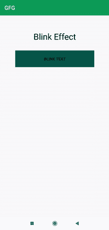

# 如何在安卓中的 TextView 上创建眨眼效果？

> 原文:[https://www . geeksforgeeks . org/如何在安卓中创建闪烁效果文本视图/](https://www.geeksforgeeks.org/how-to-create-blink-effect-on-textview-in-android/)

在本文中，我们将实现一个与 TextView 相关的非常重要的特性。这里，我们在文本视图上添加了闪烁文本功能。此功能可用于在应用程序中显示重要公告或通知。甚至我们可以添加这个功能来为用户显示重要的链接。所以在这里，我们将学习如何实现这个特性。下面给出了一个示例 GIF，以了解我们将在本文中做什么。注意，我们将使用 **Java** 语言来实现这个项目。



### **分步实施**

**第一步:创建新项目**

要在安卓工作室创建新项目，请参考[如何在安卓工作室创建/启动新项目](https://www.geeksforgeeks.org/android-how-to-create-start-a-new-project-in-android-studio/)。注意选择 **Java** 作为编程语言。

**步骤 2:使用 activity_main.xml 文件**

导航到**应用程序> res >布局> activity_main.xml** 并将下面的代码添加到该文件中。下面是 **activity_main.xml** 文件的代码。

## 可扩展标记语言

```java
<?xml version="1.0" encoding="utf-8"?>
<LinearLayout
    xmlns:android="http://schemas.android.com/apk/res/android"
    xmlns:tools="http://schemas.android.com/tools"
    android:layout_width="match_parent"
    android:layout_height="match_parent"
    android:layout_margin="20dp"
    android:orientation="vertical"
    android:padding="20dp"
    tools:context=".MainActivity">

    <TextView
        android:id="@+id/blinktext"
        android:layout_width="match_parent"
        android:layout_height="wrap_content"
        android:layout_alignParentTop="true"
        android:layout_centerHorizontal="true"
        android:layout_margin="15dp"
        android:gravity="center"
        android:text="Blink Effect"
        android:textColor="@color/black"
        android:textSize="30dp" />

    <Button
        android:id="@+id/blinkb"
        android:layout_width="match_parent"
        android:layout_height="wrap_content"
        android:layout_margin="15dp"
        android:background="@color/teal_200"
        android:padding="20dp"
        android:text="Blink Text" />

</LinearLayout>
```

**第三步:使用****MainActivity.java 文件**

转到**MainActivity.java**文件，参考以下代码。以下是**MainActivity.java**文件的代码。代码中添加了注释，以更详细地理解代码。

## Java 语言(一种计算机语言，尤用于创建网站)

```java
import android.animation.ArgbEvaluator;
import android.animation.ObjectAnimator;
import android.graphics.Color;
import android.os.Bundle;
import android.view.View;
import android.view.animation.Animation;
import android.widget.Button;
import android.widget.TextView;

import androidx.appcompat.app.AppCompatActivity;

public class MainActivity extends AppCompatActivity {

    TextView blinkt;
    Button blinkb;

    @Override
    protected void onCreate(Bundle savedInstanceState) {
        super.onCreate(savedInstanceState);
        setContentView(R.layout.activity_main);

        blinkb = findViewById(R.id.blinkb);
        blinkt = findViewById(R.id.blinktext);

        blinkb.setOnClickListener(new View.OnClickListener() {
            @Override
            public void onClick(View v) {

                // adding the color to be shown
                ObjectAnimator animator = ObjectAnimator.ofInt(blinkt, "backgroundColor", Color.BLUE, Color.RED, Color.GREEN);

                // duration of one color
                animator.setDuration(500);
                animator.setEvaluator(new ArgbEvaluator());

                // color will be show in reverse manner
                animator.setRepeatCount(Animation.REVERSE);

                // It will be repeated up to infinite time
                animator.setRepeatCount(Animation.INFINITE);
                animator.start();
            }
        });
    }
}
```

**输出:**

<video class="wp-video-shortcode" id="video-592041-1" width="640" height="360" preload="metadata" controls=""><source type="video/mp4" src="https://media.geeksforgeeks.org/wp-content/uploads/20210410223042/blinkeff.mp4?_=1">[https://media.geeksforgeeks.org/wp-content/uploads/20210410223042/blinkeff.mp4](https://media.geeksforgeeks.org/wp-content/uploads/20210410223042/blinkeff.mp4)</video>