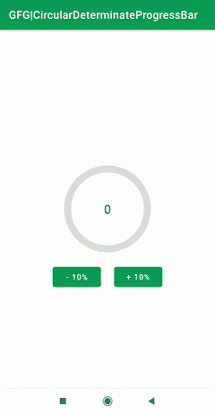
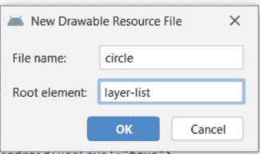

# 如何在安卓中创建循环确定进度栏？

> 原文:[https://www . geeksforgeeks . org/如何创建-循环-确定-android 中的 progress bar/](https://www.geeksforgeeks.org/how-to-create-circular-determinate-progressbar-in-android/)

在本文中，我们将演示如何在安卓工作室中创建一个圆形进度条，显示当前进度值，并且最初具有灰色背景颜色。这里进度显示在**栏**的中央。下面给出了一个 GIF 示例，来了解一下我们将在本文中做什么。注意，我们将使用 **Java** 语言来实现这个项目。



### 逐步实施

**第一步:创建新项目**

要在安卓工作室创建新项目，请参考[如何在安卓工作室创建/启动新项目](https://www.geeksforgeeks.org/android-how-to-create-start-a-new-project-in-android-studio/)。请注意，您必须选择 **Java** 作为编程语言。

**步骤 2:创建新的可绘制资源文件**

在可绘制文件夹中创建新的**可绘制资源文件**，名称为 **circle.xml** 。创建新的**可绘制资源文件**导航至 **res >可绘制**并跟随图像

如下所示:


点击**可绘制资源文件，**一个新的对话框打开，如下图所示。添加文件名，选择**根元素**作为**图层列表**，点击**确定**。



**第三步:使用 circle.xml 文件**

导航到 **res >可绘制> circle.xml** 并将下面给出的代码添加到该文件中。在这个文件中，我们将绘制一个显示进度的圆圈。为了更好地理解，代码中添加了注释。

## 可扩展标记语言

```java
<?xml version="1.0" encoding="utf-8"?>
<layer-list xmlns:android="http://schemas.android.com/apk/res/android">
    <!--Adding our first item-->
    <item>
        <!--Here ring shape is created. The important attribute
         used here is, android:useLevel="false". Attribute
         with the useLevel=true makes the ring disabled, so it must
         be false for the ring to appear with color code "#DDD"-->
        <shape
            android:shape="ring"
            android:thicknessRatio="16"
            android:useLevel="false">
            <solid android:color="#DDD" />
        </shape>
    </item>
    <!--Adding our second item-->
    <item>
        <!--Rotation degree of Ring is made from 270 to 270-->
        <rotate
            android:fromDegrees="270"
            android:toDegrees="270">
            <!--The main attribute used here is android:useLevel="true" in
             shape tag. Also gradient is added to set the startColor and
             endColor of the ring.-->
            <shape
                android:shape="ring"
                android:thicknessRatio="16"
                android:useLevel="true">
                <gradient
                    android:endColor="@color/teal_700"
                    android:startColor="@color/black"
                    android:type="sweep" />

            </shape>
        </rotate>
    </item>
</layer-list>
```

**第四步:给进度条添加样式**

导航到 **res >布局> theme.xml** 并将下面给出的代码添加到该文件中。我们在这个文件中添加了新的样式。为了清楚理解，已适当添加注释。

## 可扩展标记语言

```java
<resources xmlns:tools="http://schemas.android.com/tools">
    <!-- Base application theme. -->
    <style name="Theme.ProgressBar" parent="Theme.MaterialComponents.DayNight.DarkActionBar">
        <!-- Primary brand color. -->
        <item name="colorPrimary">@color/green</item>
        <item name="colorPrimaryVariant">@color/green</item>
        <item name="colorOnPrimary">@color/white</item>
        <!-- Secondary brand color. -->
        <item name="colorSecondary">@color/teal_200</item>
        <item name="colorSecondaryVariant">@color/teal_700</item>
        <item name="colorOnSecondary">@color/black</item>
        <!-- Status bar color. -->
        <item name="android:statusBarColor" tools:targetApi="l">?attr/colorPrimaryVariant</item>
        <!-- Customize your theme here. -->
    </style>

    <!--Here, android: indeterminateDrawable sets the picture displayed in
        the animation or the xml file of this animation and android: indeterminateOnly
           This property is set to true,the progress bar will be ignored Progress and present
           an infinite loop of animation
    -->
    <style name="CircularDeterminateProgressBar">
              <item name="android:indeterminateOnly">false </item>
        <item name="android:progressDrawable">@drawable/circle</item>
    </style>

</resources>
```

**第 5 步:使用 activity_main.xml 文件**

转到 **res >布局> activity_main.xml** 并将下面给出的代码添加到该文件中。这里我们添加了一个显示进度的**进度栏**和一个显示进度百分比的**文本视图**。还添加了两个按钮来增加或减少进度。代码中添加了必需的注释。

## 可扩展标记语言

```java
<?xml version="1.0" encoding="utf-8"?>
<androidx.constraintlayout.widget.ConstraintLayout
    xmlns:android="http://schemas.android.com/apk/res/android"
    xmlns:app="http://schemas.android.com/apk/res-auto"
    xmlns:tools="http://schemas.android.com/tools"
    android:layout_width="match_parent"
    android:layout_height="match_parent"
    tools:context=".MainActivity">

    <!--Add ProgressBar. Main Attribute used here are
        style="@style/CircularDeterminateProgressBar" that
        takes style as created in theme.xml file above and
         android:progressDrawable="@drawable/circle" that has been
        created in circle.xml file above.-->
    <ProgressBar
        android:id="@+id/progress_bar"
        style="@style/CircularDeterminateProgressBar"
        android:layout_width="200dp"
        android:layout_height="200dp"
        android:indeterminateOnly="false"
        android:progress="60"
        android:progressDrawable="@drawable/circle"
        android:rotation="-90"
        app:layout_constraintBottom_toBottomOf="parent"
        app:layout_constraintLeft_toLeftOf="parent"
        app:layout_constraintRight_toRightOf="parent"
        app:layout_constraintTop_toTopOf="parent"
        tools:progress="60" />

    <TextView
        android:id="@+id/text_view_progress"
        android:layout_width="wrap_content"
        android:layout_height="wrap_content"
        android:textAppearance="@style/TextAppearance.AppCompat.Large"
        app:layout_constraintBottom_toBottomOf="@+id/progress_bar"
        app:layout_constraintEnd_toEndOf="@+id/progress_bar"
        app:layout_constraintStart_toStartOf="@+id/progress_bar"
        app:layout_constraintTop_toTopOf="@+id/progress_bar"
        tools:text="60%" />

    <!--Increment button that will decrement the progress by 10%-->
    <Button
        android:id="@+id/button_decr"
        android:layout_width="wrap_content"
        android:layout_height="wrap_content"
        android:text="- 10%"
        app:layout_constraintStart_toStartOf="@+id/progress_bar"
        app:layout_constraintTop_toBottomOf="@+id/progress_bar" />

    <!--Increment button that will increment the progress by 10%-->
    <Button
        android:id="@+id/button_incr"
        android:layout_width="wrap_content"
        android:layout_height="wrap_content"
        android:text="+ 10%"
        app:layout_constraintEnd_toEndOf="@+id/progress_bar"
        app:layout_constraintTop_toBottomOf="@+id/progress_bar" />

</androidx.constraintlayout.widget.ConstraintLayout>
```

**步骤 6:使用 MainActivity.java 文件**

转到**MainActivity.java**文件，并将下面给出的代码添加到该文件中。ProgressBar 属性在这里实现。代码中添加了注释，以便快速清晰地理解。

## Java 语言(一种计算机语言，尤用于创建网站)

```java
import android.os.Bundle;
import android.view.View;
import android.widget.Button;
import android.widget.ProgressBar;
import android.widget.TextView;

import androidx.appcompat.app.AppCompatActivity;

public class MainActivity extends AppCompatActivity {
    private int progress = 0;
    Button buttonIncrement;
    Button buttonDecrement;
    ProgressBar progressBar;
    TextView textView;

    @Override
    protected void onCreate(Bundle savedInstanceState) {
        super.onCreate(savedInstanceState);
        setContentView(R.layout.activity_main);

        buttonDecrement = (Button) findViewById(R.id.button_decr);
        buttonIncrement = (Button) findViewById(R.id.button_incr);
        progressBar = (ProgressBar) findViewById(R.id.progress_bar);
        textView = (TextView) findViewById(R.id.text_view_progress);

        // when clicked on buttonIncrement progress in increased by 10%
        buttonIncrement.setOnClickListener(new View.OnClickListener() {
            @Override
            public void onClick(View v) {
                // if progress is less than or equal
                // to 90% then only it can be increased
                if (progress <= 90) {
                    progress += 10;
                    updateProgressBar();
                }
            }
        });

        // when clicked on buttonIncrement progress in decreased by 10%
        buttonDecrement.setOnClickListener(new View.OnClickListener() {
            @Override
            public void onClick(View v) {
                // If progress is greater than
                // 10% then only it can be decreased
                if (progress >= 10) {
                    progress -= 10;
                    updateProgressBar();
                }
            }
        });
    }

    // updateProgressBar() method sets
    // the progress of ProgressBar in text
    private void updateProgressBar() {
        progressBar.setProgress(progress);
        textView.setText(String.valueOf(progress));
    }
}
```

**输出:**

<video class="wp-video-shortcode" id="video-587309-1" width="640" height="360" preload="metadata" controls=""><source type="video/mp4" src="https://media.geeksforgeeks.org/wp-content/uploads/20210407101843/WhatsApp-Video-2021-04-07-at-9.02.59-AM.mp4?_=1">[https://media.geeksforgeeks.org/wp-content/uploads/20210407101843/WhatsApp-Video-2021-04-07-at-9.02.59-AM.mp4](https://media.geeksforgeeks.org/wp-content/uploads/20210407101843/WhatsApp-Video-2021-04-07-at-9.02.59-AM.mp4)</video>