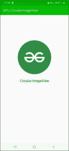

# 如何使用 CardView 在安卓系统中创建循环 ImageView？

> 原文:[https://www . geeksforgeeks . org/如何创建循环-imageview-in-Android-use-card view/](https://www.geeksforgeeks.org/how-to-create-circular-imageview-in-android-using-cardview/)

使用[图像视图](https://www.geeksforgeeks.org/imageview-in-kotlin/)可以轻松地在安卓系统中显示图像。但是，如果一个人想显示一个圆形图像呢？可以看到，很多 [安卓](https://www.geeksforgeeks.org/introduction-to-android-development/) 应用程序使用圆形图像视图来显示个人资料图像、状态、故事和许多其他事情，但是用普通的图像视图 来做这件事有点困难。本文将帮助使用 CardView 创建圆形图像。通过**卡片角半径**可以自定义图像视图的角。下面给出一个示例图片，了解一下我们将在本文 中创建。 注意，我们要用 **Java** 语言来实现这个项目。


> **注:**
> 
> 一个人可以在和另一个两种方法中执行相同的操作。请参考下面的链接。
> 
> *   [如何不使用任何库，在安卓中创建 Circular 图像视图？](https://www.geeksforgeeks.org/how-to-create-a-circular-image-view-in-android-without-using-any-library/)
> *   [如何使用 hdodenhof 库在安卓系统中创建一个圆形图像视图？](https://www.geeksforgeeks.org/how-to-create-a-circularimageview-in-android-using-hdodenhof-library/)

### **接近**

**第一步:创建新项目**

要在安卓工作室创建新项目，请参考[如何在安卓工作室创建/启动新项目](https://www.geeksforgeeks.org/android-how-to-create-start-a-new-project-in-android-studio/)。注意选择 **Java** 作为编程语言。

**第二步:向 build.gradle 文件添加依赖关系**

转到[build . grade](https://www.geeksforgeeks.org/android-build-gradle/)文件并添加该依赖项，然后点击**立即同步**按钮。

> 实现“androidx . card view:card view:1 . 0 . 0”

**步骤 3:使用 activity_main.xml 文件**

接下来进入 **activity_main.xml 文件**，代表项目的 UI。下面是**activity _ main . XML**文件的代码。代码中添加了注释，以更详细地理解代码。

> **注意:**将安卓:src = " @ drawing able/your _ image "改为你的 Image 名称

## 可扩展标记语言

```
<?xml version="1.0" encoding="utf-8"?>
<RelativeLayout 
    xmlns:android="http://schemas.android.com/apk/res/android"
    xmlns:app="http://schemas.android.com/apk/res-auto"
    xmlns:tools="http://schemas.android.com/tools"
    android:layout_width="match_parent"
    android:layout_height="match_parent"
    tools:context=".MainActivity">

    <!-- Using CardView for CircularImageView -->
    <androidx.cardview.widget.CardView
        android:id="@+id/cardView"
        android:layout_width="200dp"
        android:layout_height="200dp"
        android:layout_centerHorizontal="true"
        android:layout_marginTop="150dp"
        app:cardCornerRadius="100dp">

        <!-- add a Image image.png in your Drawable folder -->
        <ImageView
            android:id="@+id/imageView"
            android:layout_width="match_parent"
            android:layout_height="match_parent"
            android:scaleType="centerCrop"
            android:src="@drawable/circular" />

    </androidx.cardview.widget.CardView>

    <TextView
        android:id="@+id/textView"
        android:layout_width="match_parent"
        android:layout_height="wrap_content"
        android:layout_below="@id/cardView"
        android:layout_marginTop="25dp"
        android:gravity="center"
        android:text="Circular ImageView"
        android:textColor="@color/colorPrimary"
        android:textSize="20sp"
        android:textStyle="bold" />

</RelativeLayout>
```

**步骤 4:使用 MainActivity.java 文件**

最后转到 **MainActivity.kt** 文件，参考下面的代码。下面是 **MainActivity.kt** 文件的代码。我们只添加了 [吐司](https://www.geeksforgeeks.org/android-what-is-toast-and-how-to-use-it-with-examples/) 信息。当你点击图片时，它会显示一条信息。

## Java 语言(一种计算机语言，尤用于创建网站)

```
import android.os.Bundle;
import android.view.View;
import android.widget.ImageView;
import android.widget.Toast;
import androidx.appcompat.app.AppCompatActivity;

public class MainActivity extends AppCompatActivity {

    ImageView imageView;

    @Override
    protected void onCreate(Bundle savedInstanceState) {
        super.onCreate(savedInstanceState);
        setContentView(R.layout.activity_main);

        imageView = (ImageView) findViewById(R.id.imageView);
        imageView.setOnClickListener(new View.OnClickListener() {
            @Override
            public void onClick(View v) {
                Toast.makeText(MainActivity.this, "This is a Circular ImageView", Toast.LENGTH_SHORT).show();
            }
        });
    }
}
```

### 输出:

