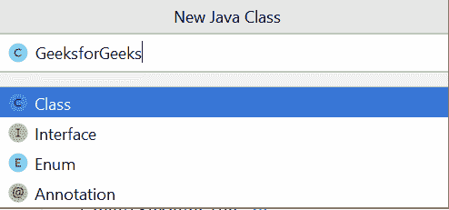
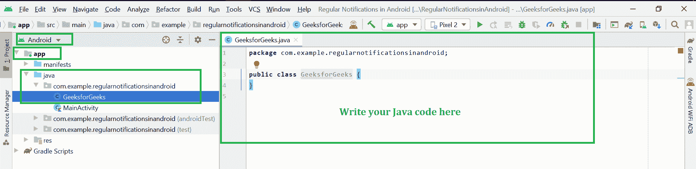
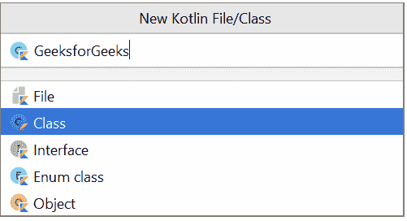
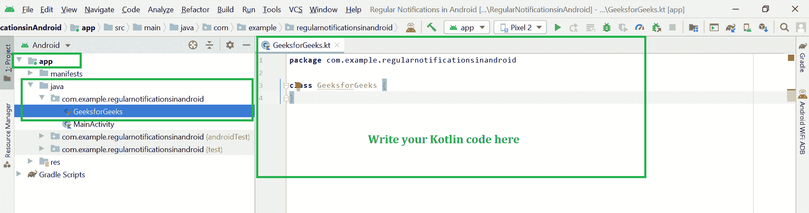

# 如何在 Android Studio 中创建类？

> 原文:[https://www . geesforgeks . org/如何在安卓工作室中创建课程/](https://www.geeksforgeeks.org/how-to-create-classes-in-android-studio/)

在安卓项目开发期间，大部分时间都需要项目中的类。例如，在 CRUD 操作的情况下，我们需要一个模型类来插入和检索数据。同样为了在我们的自定义视图中保存信息，我们需要创建一个 getter setter 类。所以基本上在安卓、  中有两种类型的类我们可以创建并且我们经常使用。

*   **创建 Java 类**
*   **创建科特林类**

因此，在本文中，我们将在 Android studio 中创建 Java 和 Kotlin 类。

### 在安卓工作室中创建 Java 类

一个[类](https://www.geeksforgeeks.org/classes-objects-java/)是一个用户定义的蓝图或原型，从它可以创建对象。它表示一种类型的所有对象共有的一组属性或方法。一般来说，java 类声明可以包含这些组件，顺序如下:

1.  **修饰符**:类可以是公共的，也可以是默认访问的(详见[本](https://www.geeksforgeeks.org/access-specifiers-for-classes-or-interfaces-in-java/))。
2.  **class 关键字:** class 关键字用于创建类。
3.  **类名:**名称应以首字母(按惯例大写)开头。
4.  **超类(如果有的话):**类的父类(超类)的名称，如果有的话，前面加关键字 extends。一个类只能扩展(子类)一个父类。
5.  **接口(如果有):**类实现的以逗号分隔的接口列表(如果有)，前面有关键字 implements。一个类可以实现多个接口。
6.  **Body:** 大括号包围的类体，{ }。

### 逐步实施

**第一步:**进入安卓工作室，在**安卓**模式下打开项目，如下图所示。

**第二步:**现在进入 **app > java >你的包名>右键>新建> Java 类**如下图所示。

**步骤 3:** 完成步骤 2 后，将出现如下弹出屏幕。在这里输入您的班级名称，选择**班级**，点击**进入**按钮。

成功完成上述步骤后，您可以在这里找到您的 Java 类。前往 **app > java >您的套餐名称>GeeksforGeeks.java。**你可以在这里编写自己的 Java 代码。

### 在安卓工作室创建柯特林类

像 Java 一样，类是具有相似属性的对象的蓝图。我们需要在创建对象之前定义一个类，使用 **class** 关键字来定义一个类。 [kotlin 类](https://www.geeksforgeeks.org/kotlin-class-and-objects/)声明由类名、类头和用花括号括起来的类体组成。

> **语法:**
> 
> //类标题
> 
> 类类名{
> 
> //类体
> 
> }
> 
> **其中:**
> 
> **类名:**每个类都有一个特定的名称
> **类头:**头由一个类的参数和构造函数组成
> **类体:**用花括号括起来，包含成员函数和其他属性

头和类体都是可选的；如果花括号之间没有任何内容，那么可以省略类体。例如:

> 类 emptyClass

### 逐步实施

**第一步:**进入安卓工作室，在**安卓**模式下打开项目，如下图所示。

**第二步:**现在进入 **app > java >你的包名>右键>新建> Kotlin 文件/类**如下图所示。

**步骤 3:** 完成步骤 2 后，将出现如下弹出屏幕。在这里输入您的班级名称，选择**班级**，点击**进入**按钮。

成功完成以上步骤后，您可以在这里找到您的科特林课程。去 **app > java >你的包名> GeeksforGeeks.kt.** 你可以在这里自己写 **Kotlin** 代码。

