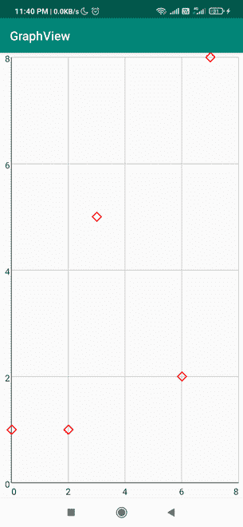

# 如何在安卓 GraphView 中创建数据点的自定义形状？

> 原文:[https://www . geeksforgeeks . org/如何创建自定义形状的数据点在 android 中的 graph view/](https://www.geeksforgeeks.org/how-to-create-custom-shapes-of-data-points-in-graphview-in-android/)

如果您正在寻找一个视图来表示一些统计数据，或者在您的应用程序中寻找一个显示图形的用户界面，那么在本文中，我们将研究创建一个折线图视图，并在我们的安卓应用程序中显示数据点的自定义形状。

### 我们将在本文中构建什么？

我们将在我们的安卓应用程序中构建一个简单的[线图视图](https://www.geeksforgeeks.org/line-graph-view-in-android-with-example/)，并且我们将在我们的应用程序中显示一些带有自定义形状的样本数据。注意，我们将使用 **Java** 语言来实现这个项目。

### **分步实施**

**第一步:创建新项目**

要在安卓工作室创建新项目，请参考[如何在安卓工作室创建/启动新项目](https://www.geeksforgeeks.org/android-how-to-create-start-a-new-project-in-android-studio/)。注意选择 **Java** 作为编程语言。

**第二步:添加依赖关系**

导航到**渐变脚本>构建.渐变(模块:应用)**，并在依赖项部分添加以下依赖项。

> 实现' com.jjoe64:graphview:4.2.2 '

**步骤 3:使用 activity_main.xml 文件**

导航到**应用程序> res >布局> activity_main.xml** 并将下面的代码添加到该文件中。下面是 **activity_main.xml** 文件的代码。

## 可扩展标记语言

```java
<?xml version="1.0" encoding="utf-8"?>
<RelativeLayout 
    xmlns:android="http://schemas.android.com/apk/res/android"
    xmlns:tools="http://schemas.android.com/tools"
    android:layout_width="match_parent"
    android:layout_height="match_parent"
    tools:context=".MainActivity">

    <com.jjoe64.graphview.GraphView
        android:id="@+id/graphview"
        android:layout_width="match_parent"
        android:layout_height="match_parent" />

</RelativeLayout>
```

**第四步:使用****MainActivity.java 文件**

转到**MainActivity.java**文件，参考以下代码。以下是**MainActivity.java**文件的代码。代码中添加了注释，以更详细地理解代码。

## Java 语言(一种计算机语言，尤用于创建网站)

```java
import android.graphics.Canvas;
import android.graphics.Color;
import android.graphics.Paint;
import android.os.Bundle;

import androidx.appcompat.app.AppCompatActivity;

import com.jjoe64.graphview.GraphView;
import com.jjoe64.graphview.series.DataPoint;
import com.jjoe64.graphview.series.DataPointInterface;
import com.jjoe64.graphview.series.PointsGraphSeries;

public class MainActivity extends AppCompatActivity {

    GraphView graphView;

    @Override
    protected void onCreate(Bundle savedInstanceState) {
        super.onCreate(savedInstanceState);
        setContentView(R.layout.activity_main);
        graphView = findViewById(R.id.graphview);

        // For creating Point Graph Series We use PointGraphSeries
        PointsGraphSeries<DataPoint> series = new PointsGraphSeries<>(getDataPoint());

        graphView.addSeries(series);

        // we use this method to define the shape that
        // will be used for data points
        // series.setShape(PointsGraphSeries.Shape.TRIANGLE);
        // we use this method to define the size of the shape
        series.setSize(50);

        // we use this method to set the color
        series.setColor(Color.RED);

        // we use this method to define the custom shape,
        // we create our own shape
        series.setCustomShape(new PointsGraphSeries.CustomShape() {
            @Override
            public void draw(Canvas canvas, Paint paint, float x, float y, DataPointInterface dataPoint) {
                paint.setStrokeWidth(5);
                // we are initialising the shape structure of dat points
                canvas.drawLine(x - 20, y, x, y - 20, paint);
                canvas.drawLine(x, y - 20, x + 20, y, paint);
                canvas.drawLine(x + 20, y, x, y + 20, paint);
                canvas.drawLine(x - 20, y, x, y + 20, paint);
            }
        });
    }

    // initialising the data points
    private DataPoint[] getDataPoint() {
        DataPoint[] dp = new DataPoint[]{
                new DataPoint(0, 1),
                new DataPoint(2, 1),
                new DataPoint(3, 5),
                new DataPoint(6, 2),
                new DataPoint(7, 8),
        };
        return dp;
    }
}
```

**输出:**

