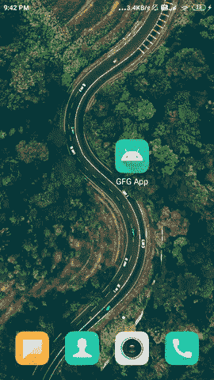

# 如何使用 Firebase Firestore 在安卓中创建动态底稿对话框？

> 原文:[https://www . geesforgeks . org/how-create-dynamic-bottom-sheet-dialog-in-Android-use-fire base-firestore/](https://www.geeksforgeeks.org/how-to-create-dynamic-bottom-sheet-dialog-in-android-using-firebase-firestore/)

[底稿对话框](https://www.geeksforgeeks.org/modal-bottom-sheet-in-android-with-examples/)是著名的物料界面组件之一，用于显示其中的数据或通知。我们可以在底部表单对话框中显示任何类型的数据或任何用户界面组件。在本文中，我们将看一下使用 **Firebase Firestore** 在安卓系统中实现**动态底单对话框**。

### 我们将在本文中构建什么？

我们将构建一个简单的应用程序，其中我们将显示一个简单的底部表单对话框，我们将从 Firebase 动态显示该底部表单中的数据。下面给出了一个 GIF 示例，来了解一下在本文中要做什么。请注意，我们将使用 **Java** 语言来实现这个项目。



### **分步实施**

**第一步:创建新项目**

要在安卓工作室创建新项目，请参考[如何在安卓工作室创建/启动新项目](https://www.geeksforgeeks.org/android-how-to-create-start-a-new-project-in-android-studio/)。注意选择 **Java** 作为编程语言。

**第二步:将你的应用连接到 Firebase**

创建新项目后。导航到顶部栏上的工具选项。点击火焰基地。点击 Firebase 后，你可以看到截图中下面提到的右栏。


在那一栏中，导航到火基云火石。点击那个选项，你会看到两个选项:连接应用到 Firebase 和添加云 Firestore 到你的应用。单击立即连接选项，您的应用程序将连接到 Firebase。之后点击第二个选项，现在你的应用程序连接到 Firebase。将您的应用程序连接到 Firebase 后，您将看到下面的屏幕。


之后，验证 Firebase Firestore 数据库的依赖项是否已经添加到我们的 Gradle 文件中。导航到该文件中的应用程序>梯度脚本。检查是否添加了以下依赖项。如果您的 build.gradle 文件中不存在以下依赖项。在依赖项部分添加以下依赖项。

> 实现' com . Google . firebase:firebase-firestore:22 . 0 . 1 '
> 
> 实现' com.squareup .毕加索:毕加索:2.71828 '

添加此依赖项后，同步您的项目，现在我们可以创建我们的应用程序了。如果你想了解更多关于连接你的应用到 Firebase。参考本文详细了解[如何给安卓 App](https://www.geeksforgeeks.org/adding-firebase-to-android-app/) 添加 Firebase。

**第 3 步:使用 AndroidManifest.xml 文件**

为了向 Firebase 添加数据，我们应该授予访问互联网的权限。要添加这些权限，请导航至**应用程序>和**。在该文件中添加以下权限。

## 可扩展标记语言

```
<!--Permissions for internet-->
<uses-permission android:name="android.permission.INTERNET" />
<uses-permission android:name="android.permission.ACCESS_NETWORK_STATE" />
```

**第 4 步:使用 activity_main.xml 文件**

因为我们没有在 **activity_main.xml** 中显示任何用户界面。所以我们没有在我们的 **activity_main.xml** 中添加任何用户界面组件，因为我们在自定义布局文件中显示数据。

**步骤 5:为我们的底稿对话框**创建一个新的布局文件

当我们在我们的底部表单对话框中显示一个图像和文本时。因此，我们将为我们的底稿对话框建立一个自定义布局。为创建一个新的布局文件四我们的底稿对话框。导航到**应用程序> res >布局>右键单击它>单击新建>布局资源文件并将其命名为 bottom_sheet_layout** 并向其添加下面的代码。

## 可扩展标记语言

```
<?xml version="1.0" encoding="utf-8"?>
<RelativeLayout 
    xmlns:android="http://schemas.android.com/apk/res/android"
    android:id="@+id/idRLBottomSheet"
    android:layout_width="match_parent"
    android:layout_height="wrap_content"
    android:background="@color/white"
    android:backgroundTint="@color/white"
    android:padding="20dp">

    <!--ImageView for displaying our image-->
    <ImageView
        android:id="@+id/idIVimage"
        android:layout_width="120dp"
        android:layout_height="120dp"
        android:layout_margin="10dp"
        android:padding="5dp" />

    <!--Text view for displaying a heading text-->
    <TextView
        android:id="@+id/idTVtext"
        android:layout_width="match_parent"
        android:layout_height="wrap_content"
        android:layout_margin="10dp"
        android:layout_toRightOf="@id/idIVimage"
        android:padding="5dp"
        android:text="Message one"
        android:textColor="@color/black"
        android:textSize="15sp"
        android:textStyle="bold" />

    <!--Text View for displaying description text-->
    <TextView
        android:id="@+id/idTVtextTwo"
        android:layout_width="match_parent"
        android:layout_height="wrap_content"
        android:layout_below="@id/idTVtext"
        android:layout_margin="10dp"
        android:layout_marginTop="10dp"
        android:layout_toEndOf="@id/idIVimage"
        android:padding="5dp"
        android:text="Message Two"
        android:textColor="@color/black"
        android:textSize="12sp" />

</RelativeLayout>
```