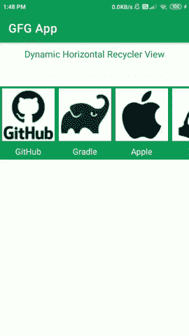
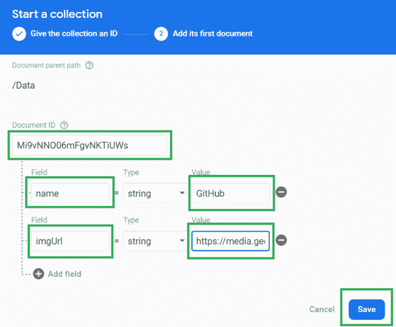
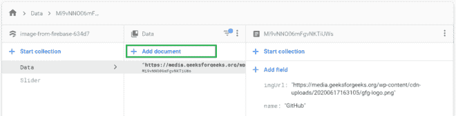

# 如何使用 Firebase Firestore 在安卓中创建动态水平回收视图？

> 原文:[https://www . geesforgeks . org/how-create-dynamic-horizontal-recycle view-in-Android-use-firebase-firestore/](https://www.geeksforgeeks.org/how-to-create-dynamic-horizontal-recyclerview-in-android-using-firebase-firestore/)

[水平回收视图](https://www.geeksforgeeks.org/android-horizontal-recyclerview-with-examples/)在许多应用程序中都可以看到。它通常用于显示大多数应用程序和网站中的类别。这种类型的回收视图出现在许多电子商务应用程序中，以指示应用程序中的类别。此回收视图也是动态的，因此管理员可以随时在该回收视图中添加或删除任何项目。所以在这篇文章中，我们将看看如何使用 [Firebase](https://www.geeksforgeeks.org/firebase-introduction/) 在安卓系统中创建一个动态的水平回收器视图。我们将使用 **Firebase Firestore** 来显示 RecyclerView 的项目。

### 我们将在本文中构建什么？

我们将构建一个简单的应用程序，其中我们将显示一个水平的回收视图，其中我们将显示计算机科学中使用的不同技术。因此，我们将在横向回收视图中展示这一惊人的计算机技术。下面给出了一个 GIF 示例，来了解一下我们将在本文中做什么。注意，我们将使用 **Java** 语言来实现这个项目。



### **分步实施**

**第一步:创建新项目**

要在安卓工作室创建新项目，请参考[如何在安卓工作室创建/启动新项目](https://www.geeksforgeeks.org/android-how-to-create-start-a-new-project-in-android-studio/)。注意选择 **Java** 作为编程语言。

**第二步:将你的应用连接到 Firebase**

创建新项目后，导航到顶部栏上的“工具”选项。点击火焰基地。点击 Firebase 后，你可以看到截图中下面提到的右栏。


在那一栏中，导航到火基云火石。点击那个选项，你会看到两个选项:连接应用到 Firebase 和添加云 Firestore 到你的应用。单击立即连接选项，您的应用程序将连接到 Firebase。之后点击第二个选项，现在你的应用程序连接到 Firebase。将您的应用程序连接到 Firebase 后，您将看到下面的屏幕。


之后，验证 Firebase Firestore 数据库的依赖项是否已经添加到我们的 Gradle 文件中。导航到该文件中的**应用程序>渐变脚本**，检查是否添加了以下依赖项。如果您的 build.gradle 文件中不存在以下依赖项。在依赖项部分添加以下依赖项。

> *实现‘com . Google . firebase:firebase-firestore:22 . 0 . 1’*

添加此依赖项后，同步您的项目，现在我们可以创建我们的应用程序了。如果你想了解更多关于连接你的应用到 Firebase。参考本文详细了解[如何给安卓 App](https://www.geeksforgeeks.org/adding-firebase-to-android-app/) 添加 Firebase。

**第 3 步:使用 AndroidManifest.xml 文件**

为了向 Firebase 添加数据，我们应该授予访问互联网的权限。要添加这些权限，请导航至 **应用程序> AndroidManifest.xml** ，并在该文件中添加以下权限。

## 可扩展标记语言

```java
<!--Permissions for internet-->
<uses-permission android:name="android.permission.INTERNET" />
<uses-permission android:name="android.permission.ACCESS_NETWORK_STATE" />
```

**第 4 步:使用 activity_main.xml 文件**

转到 **activity_main.xml** 文件，参考以下代码。下面是 **activity_main.xml** 文件的代码。

## 可扩展标记语言

```java
<?xml version="1.0" encoding="utf-8"?>
<LinearLayout 
    xmlns:android="http://schemas.android.com/apk/res/android"
    xmlns:tools="http://schemas.android.com/tools"
    android:layout_width="match_parent"
    android:layout_height="match_parent"
    android:orientation="vertical"
    tools:context=".MainActivity">

    <TextView
        android:layout_width="match_parent"
        android:layout_height="wrap_content"
        android:padding="10dp"
        android:text="Dynamic Horizontal Recycler View"
        android:textAlignment="center"
        android:textColor="@color/purple_500"
        android:textSize="15sp" />

    <androidx.recyclerview.widget.RecyclerView
        android:id="@+id/idRVItems"
        android:layout_width="match_parent"
        android:layout_height="wrap_content"
        android:layout_marginTop="40dp"
        android:background="@color/purple_500" />

</LinearLayout>
```

**第五步:现在我们将创建一个新的 Java 类来存储我们的数据**

为了从 Firebase Firestore 数据库中读取数据，我们必须创建一个 Object 类，我们将在这个类中读取数据。要创建一个对象类，导航到**应用程序> java >你的应用程序的包名>右键单击它，然后单击新建> Java 类>给你的类命名**。这里我们已经给了名称为**数据模式**并添加了下面的代码。

## Java 语言(一种计算机语言，尤用于创建网站)

```java
public class DataModal {

    // variables for storing our image and name.
    private String name;
    private String imgUrl;

    public DataModal() {
        // empty constructor required for firebase.
    }

    // constructor for our object class.
    public DataModal(String name, String imgUrl) {
        this.name = name;
        this.imgUrl = imgUrl;
    }

    // getter and setter methods
    public String getName() {
        return name;
    }

    public void setName(String name) {
        this.name = name;
    }

    public String getImgUrl() {
        return imgUrl;
    }

    public void setImgUrl(String imgUrl) {
        this.imgUrl = imgUrl;
    }
}
```

**第 6 步:现在我们将为 RecyclerView** 的项目创建一个布局文件

导航至**应用程序> res >布局>右键单击该应用程序，然后单击新建>布局资源文件**，并为该文件命名。创建该文件后，向其中添加以下代码。这里我们已经给了名称为**图像 _rv_item** 并添加了下面的代码。

## 可扩展标记语言

```java
<?xml version="1.0" encoding="utf-8"?>
<LinearLayout 
    xmlns:android="http://schemas.android.com/apk/res/android"
    android:layout_width="wrap_content"
    android:layout_height="wrap_content"
    android:layout_gravity="center"
    android:gravity="center"
    android:orientation="vertical">

    <!--Image view for displaying our image-->
    <ImageView
        android:id="@+id/idIVimage"
        android:layout_width="100dp"
        android:layout_height="100dp"
        android:layout_margin="4dp"
        android:background="@color/white"
        android:backgroundTint="@color/white"
        android:padding="3dp" />

    <!--Text view for displaying our text -->
    <TextView
        android:id="@+id/idTVtext"
        android:layout_width="wrap_content"
        android:layout_height="wrap_content"
        android:layout_margin="2dp"
        android:padding="3dp"
        android:text="Category Text"
        android:textAlignment="center"
        android:textColor="@color/white" />

</LinearLayout>
```

**第 7 步:现在我们将创建一个适配器类**

要创建一个新的适配器类，导航到**应用程序> java >你的应用程序的包名>右键单击它，然后单击新建> java 类**，将你的 Java 类命名为**数据适配器**，并在其中添加下面的代码。代码中添加了注释，以更详细地理解代码。

## Java 语言(一种计算机语言，尤用于创建网站)

```java
import android.content.Context;
import android.view.LayoutInflater;
import android.view.View;
import android.view.ViewGroup;
import android.widget.ImageView;
import android.widget.TextView;
import android.widget.Toast;

import androidx.annotation.NonNull;
import androidx.recyclerview.widget.RecyclerView;

import com.squareup.picasso.Picasso;

import java.util.ArrayList;

public class DataRVAdapter extends RecyclerView.Adapter<DataRVAdapter.ViewHolder> {
    private ArrayList<DataModal> dataModalArrayList;
    private Context context;

    // constructor class for our Adapter
    public DataRVAdapter(ArrayList<DataModal> dataModalArrayList, Context context) {
        this.dataModalArrayList = dataModalArrayList;
        this.context = context;
    }

    @NonNull
    @Override
    public DataRVAdapter.ViewHolder onCreateViewHolder(@NonNull ViewGroup parent, int viewType) {
        // passing our layout file for displaying our card item
        return new DataRVAdapter.ViewHolder(LayoutInflater.from(context).inflate(R.layout.image_rv_item, parent, false));
    }

    @Override
    public void onBindViewHolder(@NonNull DataRVAdapter.ViewHolder holder, int position) {
        // setting data to our views in Recycler view items.
        DataModal modal = dataModalArrayList.get(position);
        holder.courseNameTV.setText(modal.getName());

        // we are using Picasso to load images
        // from URL inside our image view.
        Picasso.get().load(modal.getImgUrl()).into(holder.courseIV);
        holder.itemView.setOnClickListener(new View.OnClickListener() {
            @Override
            public void onClick(View v) {
                // setting on click listener
                // for our items of recycler items.
                Toast.makeText(context, "Clicked item is " + modal.getName(), Toast.LENGTH_SHORT).show();
            }
        });
    }

    @Override
    public int getItemCount() {
        // returning the size of array list.
        return dataModalArrayList.size();
    }

    public class ViewHolder extends RecyclerView.ViewHolder {
        // creating variables for our 
        // views of recycler items.
        private TextView courseNameTV;
        private ImageView courseIV;

        public ViewHolder(@NonNull View itemView) {
            super(itemView);
            // initializing the views of recycler views.
            courseNameTV = itemView.findViewById(R.id.idTVtext);
            courseIV = itemView.findViewById(R.id.idIVimage);
        }
    }
}
```

**步骤 8:使用 MainActivity.java 文件**

转到**文件，参考以下代码。以下是**MainActivity.java**文件的代码。代码中添加了注释，以更详细地理解代码。**

## **Java 语言(一种计算机语言，尤用于创建网站)**

```java
import android.os.Bundle;
import android.widget.Toast;

import androidx.annotation.NonNull;
import androidx.appcompat.app.AppCompatActivity;
import androidx.recyclerview.widget.LinearLayoutManager;
import androidx.recyclerview.widget.RecyclerView;

import com.google.android.gms.tasks.OnFailureListener;
import com.google.android.gms.tasks.OnSuccessListener;
import com.google.firebase.firestore.DocumentSnapshot;
import com.google.firebase.firestore.FirebaseFirestore;
import com.google.firebase.firestore.QuerySnapshot;

import java.util.ArrayList;
import java.util.List;

public class MainActivity extends AppCompatActivity {

    private RecyclerView courseRV;
    private ArrayList<DataModal> dataModalArrayList;
    private DataRVAdapter dataRVAdapter;
    private FirebaseFirestore db;

    @Override
    protected void onCreate(Bundle savedInstanceState) {
        super.onCreate(savedInstanceState);
        setContentView(R.layout.activity_main);

        // initializing our variables.
        courseRV = findViewById(R.id.idRVItems);

        // initializing our variable for firebase 
        // firestore and getting its instance.
        db = FirebaseFirestore.getInstance();

        // creating our new array list
        dataModalArrayList = new ArrayList<>();
        courseRV.setHasFixedSize(true);

        // adding horizontal layout manager for our recycler view.
        courseRV.setLayoutManager(new LinearLayoutManager(this, LinearLayoutManager.HORIZONTAL, false));

        // adding our array list to our recycler view adapter class.
        dataRVAdapter = new DataRVAdapter(dataModalArrayList, this);

        // setting adapter to our recycler view.
        courseRV.setAdapter(dataRVAdapter);

        loadrecyclerViewData();
    }

    private void loadrecyclerViewData() {

        db.collection("Data").get()
                .addOnSuccessListener(new OnSuccessListener<QuerySnapshot>() {
                    @Override
                    public void onSuccess(QuerySnapshot queryDocumentSnapshots) {
                        // after getting the data we are calling on success method
                        // and inside this method we are checking if the received 
                        // query snapshot is empty or not.
                        if (!queryDocumentSnapshots.isEmpty()) {
                            // if the snapshot is not empty we are hiding our
                            // progress bar and adding our data in a list.
                            List<DocumentSnapshot> list = queryDocumentSnapshots.getDocuments();
                            for (DocumentSnapshot d : list) {
                                // after getting this list we are passing that 
                                // list to our object class.
                                DataModal dataModal = d.toObject(DataModal.class);

                                // and we will pass this object class
                                // inside our arraylist which we have
                                // created for recycler view.
                                dataModalArrayList.add(dataModal);
                            }
                            // after adding the data to recycler view.
                            // we are calling recycler view notifyDataSetChanged
                            // method to notify that data has been changed in recycler view.
                            dataRVAdapter.notifyDataSetChanged();
                        } else {
                            // if the snapshot is empty we are 
                            // displaying a toast message.
                            Toast.makeText(MainActivity.this, "No data found in Database", Toast.LENGTH_SHORT).show();
                        }
                    }
                }).addOnFailureListener(new OnFailureListener() {
            @Override
            public void onFailure(@NonNull Exception e) {
                // if we do not get any data or any error we are displaying 
                // a toast message that we do not get any data
                Toast.makeText(MainActivity.this, "Fail to get the data.", Toast.LENGTH_SHORT).show();
            }
        });
    }
}
```

****第 9 步:现在将数据添加到你的 Firebase 控制台****

**在你的浏览器中搜索 Firebase，然后转到那个网站，你会看到下面的屏幕。**

****

**单击“转到控制台”选项后。点击您的项目，如下所示。**

****

**点击你的项目后，你会看到下面的屏幕。点击这个项目后，你会看到下面的屏幕。**

****

**点击创建数据库选项后，您将看到下面的屏幕。**

****

**在此屏幕中，我们必须选择“在测试模式下启动”选项。我们使用测试模式，因为我们没有在我们的应用程序中设置身份验证。所以我们在测试模式下选择开始。选择测试模式后，点击下一步选项，您将看到下面的屏幕。**

****

**在这个屏幕中，我们只需要点击启用按钮来启用我们的 Firebase Firestore 数据库。完成这个过程后，我们必须在 Firebase 控制台中添加数据。用于向我们的 Firebase 控制台添加数据。**

**你要点击**开始采集**选项，并给出采集名称为**数据**。创建集合后，您必须单击**自动添加**选项来创建第一个文档。然后创建两个字段，一个为“**名称**”，一个为“ **imgUrl** ”，并为它们输入相应的值。请注意，在 imgUrl 字段的值中指定**图像网址链接**。点击**保存**按钮。您在**数据**中的第一张图像已经添加。**

****

**同样，点击“**添加文档**”按钮添加更多图像。**

****

**添加这些图像后，运行您的应用程序，您将在下面的屏幕上看到输出。**

### ****输出:****

**<video class="wp-video-shortcode" id="video-542622-1" width="640" height="360" preload="metadata" controls=""><source type="video/mp4" src="https://media.geeksforgeeks.org/wp-content/uploads/20210111135124/Screenrecorder-2021-01-11-13-48-56-864.mp4?_=1">[https://media.geeksforgeeks.org/wp-content/uploads/20210111135124/Screenrecorder-2021-01-11-13-48-56-864.mp4](https://media.geeksforgeeks.org/wp-content/uploads/20210111135124/Screenrecorder-2021-01-11-13-48-56-864.mp4)</video>**