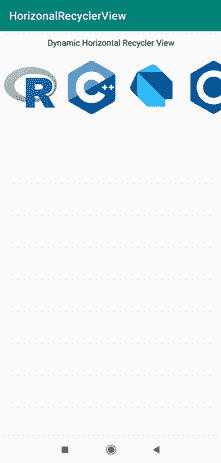
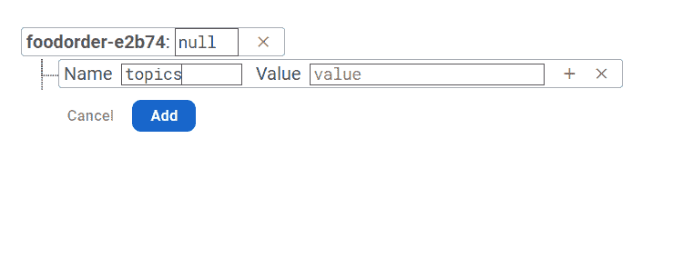
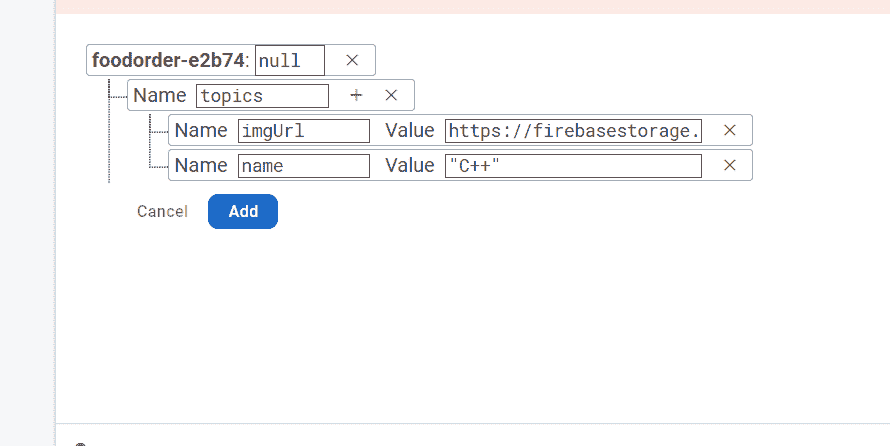
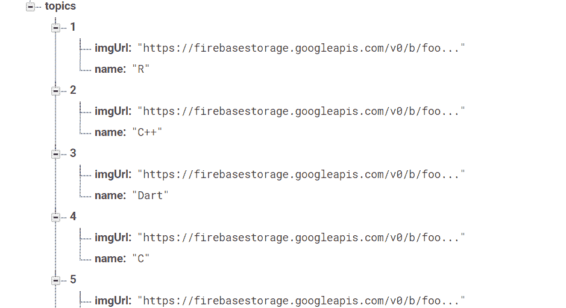

# 如何使用 Firebase 实时数据库在安卓系统中创建动态水平回收视图？

> 原文:[https://www . geesforgeks . org/如何创建-动态-水平-回收-安卓中的视图-使用-firebase-实时-数据库/](https://www.geeksforgeeks.org/how-to-create-dynamic-horizontal-recyclerview-in-android-using-firebase-realtime-database/)

[水平回收查看](https://www.geeksforgeeks.org/android-horizontal-recyclerview-with-examples/)在很多应用中都可以看到。它通常用于显示大多数应用程序和网站中的类别。这种类型的回收视图主要出现在许多电子商务应用程序中，以指示应用程序中的类别。正如我们已经在亚马逊购物应用中看到的。所以在这篇文章中，我们将看看如何使用 Firebase Firestore 在安卓系统中创建[动态水平回收器视图。但是在本文中，我们将使用](https://www.geeksforgeeks.org/how-to-create-dynamic-horizontal-recyclerview-in-android-using-firebase-firestore/) [**Firebase 实时数据库**](https://www.geeksforgeeks.org/firebase-realtime-database-with-operations-in-android-with-examples/) 来显示回收视图的项目。

### 我们将在本文中构建什么？

我们将构建一个简单的应用程序，其中我们将显示一个水平的回收视图，其中我们将显示计算机科学中使用的不同语言，如 C++。因此，我们将在横向回收视图中展示这一惊人的计算机技术。下面给出了一个示例 GIF，以了解我们将在本文中做什么。注意，我们将使用 **Java** 语言来实现这个项目。



### 逐步实施

**第一步:创建新项目**

要在安卓工作室创建新项目，请参考[如何在安卓工作室创建/启动新项目](https://www.geeksforgeeks.org/android-how-to-create-start-a-new-project-in-android-studio/)。注意选择 **Java** 作为编程语言。

**第二步:将你的应用连接到 Firebase**

参见[在安卓应用中添加 Firebase](https://www.geeksforgeeks.org/adding-firebase-to-android-app/)。您可以从这里阅读关于[火基地实时数据库](https://www.geeksforgeeks.org/firebase-realtime-database-with-operations-in-android-with-examples/)。

**第 3 步:使用 AndroidManifest.xml 文件**

为了向 Firebase 添加数据，我们应该授予访问互联网的权限。要添加这些权限，请导航至**应用程序> AndroidManifest.xml** ，并在该文件中添加以下权限。

**第 4 步:使用 activity_main.xml 文件**

导航到**应用程序> res >布局> activity_main.xml** 并将下面的代码添加到该文件中。下面是 **activity_main.xml** 文件的代码。

## 可扩展标记语言

```
<?xml version="1.0" encoding="utf-8"?>
<LinearLayout
    xmlns:android="http://schemas.android.com/apk/res/android"
    xmlns:tools="http://schemas.android.com/tools"
    android:layout_width="match_parent"
    android:layout_height="match_parent"
    android:orientation="vertical"
    tools:context=".MainActivity">

    <TextView
        android:layout_width="match_parent"
        android:layout_height="wrap_content"
        android:padding="10dp"
        android:text="Dynamic Horizontal Recycler View"
        android:textAlignment="center"
        android:textColor="#000"
        android:textSize="15sp" />

    <androidx.recyclerview.widget.RecyclerView
        android:id="@+id/idRVItems"
        android:layout_width="match_parent"
        android:layout_height="wrap_content"
        android:layout_marginTop="5dp"
        android:background="#fff" />

</LinearLayout>
```

**第五步:现在我们将为我们的回收视图**创建一个布局文件

导航到**应用程序> res >布局>右键单击它**并单击**新建>布局资源文件**并给该文件命名。创建该文件后，向其中添加以下代码。这里我们给了名称 **content.xml** 并添加了下面的代码。

## 可扩展标记语言

```
<?xml version="1.0" encoding="utf-8"?>
<LinearLayout 
    xmlns:android="http://schemas.android.com/apk/res/android"
    android:layout_width="wrap_content"
    android:layout_height="wrap_content"
    android:layout_gravity="center"
    android:gravity="center"
    android:orientation="vertical">

    <!--Image view for displaying our image-->
    <ImageView
        android:id="@+id/idIVimage"
        android:layout_width="100dp"
        android:layout_height="100dp"
        android:layout_margin="4dp"
        android:background="#fff"
        android:backgroundTint="#fff"
        android:padding="3dp" />

    <!--Text view for displaying our text -->
    <TextView
        android:id="@+id/idTVtext"
        android:layout_width="wrap_content"
        android:layout_height="wrap_content"
        android:layout_margin="2dp"
        android:padding="3dp"
        android:text="Category Text"
        android:textAlignment="center"
        android:textColor="#fff" />

</LinearLayout>
```

**第 6 步:** **现在我们将创建一个新的 Java 类来存储我们的数据**

为了从 Firebase Firestore 数据库中读取数据，我们必须创建一个 Object 类，我们将在这个类中读取数据。要创建一个对象类，导航到**应用程序> java >你的应用程序的包名>右键点击它，然后点击新建> Java 类**并给你的类命名。这里我们已经给了名称为**卡片模型**并添加了下面的代码。

## Java 语言(一种计算机语言，尤用于创建网站)

```
public class CardModel {

    // variables for storing 
    // our image and name.
    private String name;
    private String imgUrl;

    public CardModel() {
        // empty constructor
        // required for firebase.
    }

    // constructor for our object class.
    public CardModel(String name, String imgUrl) {
        this.name = name;
        this.imgUrl = imgUrl;
    }

    // getter and setter methods
    public String getName() {
        return name;
    }

    public void setName(String name) {
        this.name = name;
    }

    public String getImgUrl() {
        return imgUrl;
    }

    public void setImgUrl(String imgUrl) {
        this.imgUrl = imgUrl;
    }
}
```

**第 7 步:现在我们将创建一个适配器类**

要创建一个新的适配器类，导航到**应用程序> java >你的应用程序的包名>右键单击它，然后单击新建> java 类**，将你的 Java 类命名为**适配器卡**，并添加下面的代码。代码中添加了注释，以更详细地理解代码。

## Java 语言(一种计算机语言，尤用于创建网站)

```
import android.content.Context;
import android.view.LayoutInflater;
import android.view.View;
import android.view.ViewGroup;
import android.widget.ImageView;
import android.widget.TextView;
import android.widget.Toast;

import androidx.annotation.NonNull;
import androidx.recyclerview.widget.RecyclerView;

import com.squareup.picasso.Picasso;

import java.util.ArrayList;

public class AdapterCard extends RecyclerView.Adapter<AdapterCard.ViewHolder> {
    private ArrayList<CardModel> dataModalArrayList;
    private Context context;

    // constructor class for our Adapter
    public AdapterCard(ArrayList<CardModel> dataModalArrayList, Context context) {
        this.dataModalArrayList = dataModalArrayList;
        this.context = context;
    }

    @NonNull
    @Override
    public AdapterCard.ViewHolder onCreateViewHolder(@NonNull ViewGroup parent, int viewType) {
        // passing our layout file for displaying our card item
        return new AdapterCard.ViewHolder(LayoutInflater.from(context).inflate(R.layout.content, parent, false));
    }

    @Override
    public void onBindViewHolder(@NonNull AdapterCard.ViewHolder holder, int position) {
        // setting data to our views in Recycler view items.
        final CardModel modal = dataModalArrayList.get(position);
        holder.courseNameTV.setText(modal.getName());

        // we are using Picasso to load images
        // from URL inside our image view.
        Picasso.with(holder.courseIV.getContext()).load(modal.getImgUrl()).into(holder.courseIV);
        holder.itemView.setOnClickListener(new View.OnClickListener() {
            @Override
            public void onClick(View v) {
                // setting on click listener
                // for our items of recycler items.
                Toast.makeText(context, "Clicked item is " + modal.getName(), Toast.LENGTH_SHORT).show();
            }
        });
    }

    @Override
    public int getItemCount() {
        // returning the size of array list.
        return dataModalArrayList.size();
    }

    public class ViewHolder extends RecyclerView.ViewHolder {
        // creating variables for our
        // views of recycler items.
        private TextView courseNameTV;
        private ImageView courseIV;

        public ViewHolder(@NonNull View itemView) {
            super(itemView);
            // initializing the views of recycler views.
            courseNameTV = itemView.findViewById(R.id.idTVtext);
            courseIV = itemView.findViewById(R.id.idIVimage);
        }
    }
}
```

**步骤 8:使用 MainActivity.java 文件**

转到**MainActivity.java**文件，参考以下代码。以下是**MainActivity.java**文件的代码。代码中添加了注释，以更详细地理解代码。

## Java 语言(一种计算机语言，尤用于创建网站)

```
import android.os.Bundle;

import androidx.annotation.NonNull;
import androidx.appcompat.app.AppCompatActivity;
import androidx.recyclerview.widget.LinearLayoutManager;
import androidx.recyclerview.widget.RecyclerView;

import com.google.firebase.database.DataSnapshot;
import com.google.firebase.database.DatabaseError;
import com.google.firebase.database.DatabaseReference;
import com.google.firebase.database.FirebaseDatabase;
import com.google.firebase.database.ValueEventListener;

import java.util.ArrayList;

public class MainActivity extends AppCompatActivity {

    private RecyclerView courseRV;
    private ArrayList<CardModel> dataModalArrayList;
    private AdapterCard dataRVAdapter;
    private DatabaseReference db;

    @Override
    protected void onCreate(Bundle savedInstanceState) {
        super.onCreate(savedInstanceState);
        setContentView(R.layout.activity_main);

        // initializing our variables.
        courseRV = findViewById(R.id.idRVItems);

        // initializing our variable for firebase
        // firestore and getting its instance.
        db = FirebaseDatabase.getInstance().getReference();

        // creating our new array list
        dataModalArrayList = new ArrayList<>();
        courseRV.setHasFixedSize(true);

        // adding horizontal layout manager for our recycler view.
        courseRV.setLayoutManager(new LinearLayoutManager(this, LinearLayoutManager.HORIZONTAL, false));

        // adding our array list to our recycler view adapter class.
        dataRVAdapter = new AdapterCard(dataModalArrayList, this);

        // setting adapter to our recycler view.
        courseRV.setAdapter(dataRVAdapter);

        loadrecyclerViewData();
    }

    private void loadrecyclerViewData() {
        DatabaseReference reference = FirebaseDatabase.getInstance().getReference("topics");
        reference.addValueEventListener(new ValueEventListener() {
            @Override
            public void onDataChange(@NonNull DataSnapshot dataSnapshot) {
                dataModalArrayList.clear();
                for (DataSnapshot dataSnapshot1 : dataSnapshot.getChildren()) {
                    CardModel modelCourses1 = dataSnapshot1.getValue(CardModel.class);
                    dataModalArrayList.add(modelCourses1);
                    dataRVAdapter = new AdapterCard(dataModalArrayList, MainActivity.this);
                    courseRV.setAdapter(dataRVAdapter);
                }
            }

            @Override
            public void onCancelled(@NonNull DatabaseError databaseError) {

            }
        });
    }
}
```

### **这里我们将展示如何将数据添加到 Firebase**

转到 **firebase 控制台>打开您的项目**，点击左侧面板中的**实时数据库**。

**第一步:首先我们将创建一个名称主题的节点**



**第二步:** **然后我们将在数据库中添加我们的物品节点，名称和图片链接**



**第三步:这里可以看到我们已经添加了所有的项目**



现在运行 app，看到下面代码的输出。

### **输出:**

<video class="wp-video-shortcode" id="video-562113-1" width="640" height="360" preload="metadata" controls=""><source type="video/mp4" src="https://media.geeksforgeeks.org/wp-content/uploads/20210218113925/WhatsApp-Video-2021-02-18-at-11.29.20-AM.mp4?_=1">[https://media.geeksforgeeks.org/wp-content/uploads/20210218113925/WhatsApp-Video-2021-02-18-at-11.29.20-AM.mp4](https://media.geeksforgeeks.org/wp-content/uploads/20210218113925/WhatsApp-Video-2021-02-18-at-11.29.20-AM.mp4)</video>