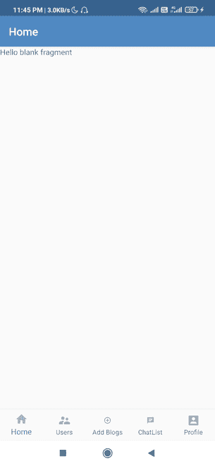
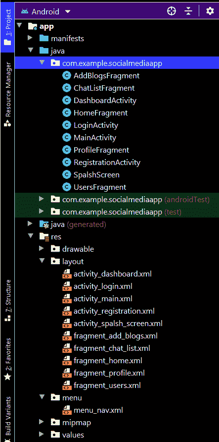

# 如何在社交媒体安卓 App 中使用底部导航创建片段？

> 原文:[https://www . geesforgeks . org/how-create-fragment-use-bottom-navigation-in-social-media-Android-app/](https://www.geeksforgeeks.org/how-to-create-fragment-using-bottom-navigation-in-social-media-android-app/)

这是**“在安卓工作室构建社交媒体应用”**教程的**第 2 部分**，我们将在本文中介绍以下功能:

*   我们将使用 **5** [片段](https://www.geeksforgeeks.org/introduction-fragments-android/)创建[底部导航](https://www.geeksforgeeks.org/bottom-navigation-bar-in-android/)(主页、用户、添加博客、聊天列表、个人资料)。
*   在**主页片段**中，我们将展示所有添加的博客。
*   在**用户群**、中，我们将显示所有注册用户。
*   在**添加博客页面**中，我们将添加我们的博客。
*   在**聊天列表片段**中，我们将显示与我们聊天的所有用户的聊天列表。
*   在**配置文件页面**中，我们将显示用户的配置文件，其中我们将显示用户的数据和用户写的博客。

### **分步实施**

**步骤 1:** 首先我们将在 res 文件夹内创建一个菜单目录。参考本文[如何在安卓工作室](https://www.geeksforgeeks.org/how-to-create-menu-folder-menu-file-in-android-studio/)创建菜单文件夹&菜单文件。并将菜单文件命名为 **menu_nav.xml** ，用于创建底部导航的布局。下面是**菜单 _nav.xml** 文件的代码。

## 可扩展标记语言

```
<?xml version="1.0" encoding="utf-8"?>
<menu xmlns:android="http://schemas.android.com/apk/res/android">
    <item
        android:id="@+id/nav_home"
        android:icon="@drawable/ic_home"
        android:title="Home" />
    <item
        android:id="@+id/nav_users"
        android:icon="@drawable/ic_users"
        android:title="Users" />
    <item
        android:id="@+id/nav_addblogs"
        android:icon="@drawable/ic_add"
        android:title="Add Blogs" />

    <item
        android:id="@+id/nav_chat"
        android:icon="@drawable/ic_chat"
        android:title="ChatList" />
    <item
        android:id="@+id/nav_profile"
        android:icon="@drawable/ic_account"
        android:title="Profile" />

</menu>
```

**第二步:添加依赖项进行构建. gradle(模块:app)**

导航至**渐变脚本>构建。gradle(Module: app)** 并在 dependencies 部分添加下面的 dependency。

> 实现' com . Google . Android . material:material:1 . 2 . 0 '

**步骤 3:使用 activity_dashboard.xml 文件**

该页面将是用户登录后我们应用程序中的第一个活动。导航到**应用程序> res >布局> activity_dashboard.xml** 并将下面的代码添加到该文件中。下面是 **activity_dashboard.xml** 文件的代码。

## 可扩展标记语言

```
<?xml version="1.0" encoding="utf-8"?>
<LinearLayout
    xmlns:android="http://schemas.android.com/apk/res/android"
    xmlns:app="http://schemas.android.com/apk/res-auto"
    xmlns:tools="http://schemas.android.com/tools"
    android:layout_width="match_parent"
    android:layout_height="match_parent"
    android:gravity="center"
    android:orientation="vertical"
    tools:context=".DashboardActivity">

    <FrameLayout
        android:id="@+id/content"
        android:layout_width="match_parent"
        android:layout_height="0dp"
        android:layout_weight="1"></FrameLayout>

    <com.google.android.material.bottomnavigation.BottomNavigationView
        android:id="@+id/navigation"
        android:layout_width="match_parent"
        android:layout_height="wrap_content"
        android:layout_gravity="bottom"
        android:background="?android:attr/windowBackground"
        app:labelVisibilityMode="labeled"
        app:menu="@menu/menu_nav">

    </com.google.android.material.bottomnavigation.BottomNavigationView>

</LinearLayout>
```

**第四步:新建 5 个空白碎片**

转到**应用程序(右键)>新建>片段>片段(空白)**并将片段命名为**主片段、配置文件片段、用户片段、聊天列表片段和添加博客片段**。

**步骤 5:** **处理 DashboardActivity.java 文件**

在这个文件中，我们只是根据选择的导航项目显示片段。然后我们将展示各自的片段。

```
HomeFragment fragment=new HomeFragment();
        FragmentTransaction fragmentTransaction=getSupportFragmentManager().beginTransaction();
        fragmentTransaction.replace(R.id.content,fragment,"");
        fragmentTransaction.commit();
```

转到**DashboardActivity.java**文件，参考以下代码。以下是**DashboardActivity.java**文件的代码。

## Java 语言(一种计算机语言，尤用于创建网站)

```
package com.example.socialmediaapp;

import android.os.Bundle;
import android.view.MenuItem;

import androidx.annotation.NonNull;
import androidx.appcompat.app.ActionBar;
import androidx.appcompat.app.AppCompatActivity;
import androidx.fragment.app.FragmentTransaction;

import com.google.android.material.bottomnavigation.BottomNavigationView;
import com.google.firebase.auth.FirebaseAuth;
import com.google.firebase.auth.FirebaseUser;

public class DashboardActivity extends AppCompatActivity {

    private FirebaseAuth firebaseAuth;
    FirebaseUser firebaseUser;
    String myuid;
    ActionBar actionBar;
    BottomNavigationView navigationView;

    @Override
    protected void onCreate(Bundle savedInstanceState) {
        super.onCreate(savedInstanceState);
        setContentView(R.layout.activity_dashboard);
        actionBar = getSupportActionBar();
        actionBar.setTitle("Profile Activity");
        firebaseAuth = FirebaseAuth.getInstance();

        navigationView = findViewById(R.id.navigation);
        navigationView.setOnNavigationItemSelectedListener(selectedListener);
        actionBar.setTitle("Home");

        // When we open the application first
        // time the fragment should be shown to the user
        // in this case it is home fragment
        HomeFragment fragment = new HomeFragment();
        FragmentTransaction fragmentTransaction = getSupportFragmentManager().beginTransaction();
        fragmentTransaction.replace(R.id.content, fragment, "");
        fragmentTransaction.commit();
    }

    private BottomNavigationView.OnNavigationItemSelectedListener selectedListener = new BottomNavigationView.OnNavigationItemSelectedListener() {
        @Override
        public boolean onNavigationItemSelected(@NonNull MenuItem menuItem) {
            switch (menuItem.getItemId()) {

                case R.id.nav_home:
                    actionBar.setTitle("Home");
                    HomeFragment fragment = new HomeFragment();
                    FragmentTransaction fragmentTransaction = getSupportFragmentManager().beginTransaction();
                    fragmentTransaction.replace(R.id.content, fragment, "");
                    fragmentTransaction.commit();
                    return true;

                case R.id.nav_profile:
                    actionBar.setTitle("Profile");
                    ProfileFragment fragment1 = new ProfileFragment();
                    FragmentTransaction fragmentTransaction1 = getSupportFragmentManager().beginTransaction();
                    fragmentTransaction1.replace(R.id.content, fragment1);
                    fragmentTransaction1.commit();
                    return true;

                case R.id.nav_users:
                    actionBar.setTitle("Users");
                    UsersFragment fragment2 = new UsersFragment();
                    FragmentTransaction fragmentTransaction2 = getSupportFragmentManager().beginTransaction();
                    fragmentTransaction2.replace(R.id.content, fragment2, "");
                    fragmentTransaction2.commit();
                    return true;

                case R.id.nav_chat:
                    actionBar.setTitle("Chats");
                    ChatListFragment listFragment = new ChatListFragment();
                    FragmentTransaction fragmentTransaction3 = getSupportFragmentManager().beginTransaction();
                    fragmentTransaction3.replace(R.id.content, listFragment, "");
                    fragmentTransaction3.commit();
                    return true;

                case R.id.nav_addblogs:
                    actionBar.setTitle("Add Blogs");
                    AddBlogsFragment fragment4 = new AddBlogsFragment();
                    FragmentTransaction fragmentTransaction4 = getSupportFragmentManager().beginTransaction();
                    fragmentTransaction4.replace(R.id.content, fragment4, "");
                    fragmentTransaction4.commit();
                    return true;
            }
            return false;
        }
    };
}
```

**输出:**



**本文使用的所有可绘制文件请参考此链接:**[https://drive . Google . com/drive/folders/1M _ knOH _ ugcuwsp5nkyzed 4 DRP-Honzbe？usp =共享](https://drive.google.com/drive/folders/1M_knOH_ugCuwSP5nkYzeD4dRp-Honzbe?usp=sharing)

**以下是执行这些操作后的文件结构:**

