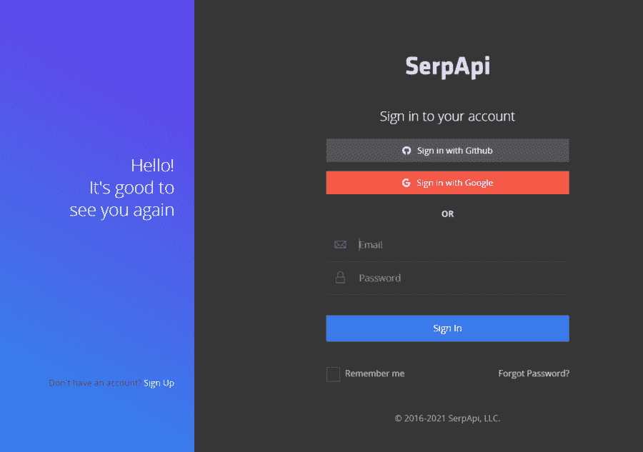
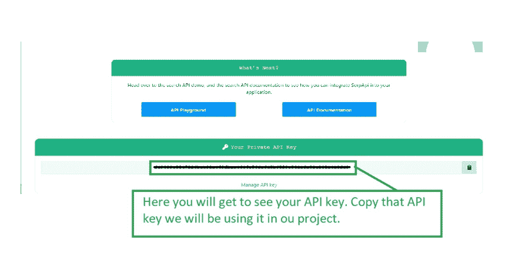

# 如何在安卓中创建谷歌镜头应用？

> 原文:[https://www . geesforgeks . org/如何创建-谷歌-镜头-安卓应用/](https://www.geeksforgeeks.org/how-to-create-google-lens-application-in-android/)

我们已经看到了新的谷歌镜头应用程序，其中我们可以捕捉任何产品的图像，从该图像中，我们可以看到该产品的搜索结果，我们将在我们的应用程序中显示。

### 我们将在本文中构建什么？

我们将构建一个简单的应用程序，在其中我们将从我们的设备摄像头捕捉图像，然后，我们将点击[按钮](https://www.geeksforgeeks.org/button-in-kotlin/)以获得该产品的结果。下面给出一个视频样本，了解一下 在本文中我们要做什么 。注意，我们将使用 **Java** 语言来实现这个项目。

<video class="wp-video-shortcode" id="video-566215-1" width="640" height="360" preload="metadata" controls=""><source type="video/mp4" src="https://media.geeksforgeeks.org/wp-content/uploads/20210222182622/Screenrecorder-2021-02-22-18-23-33-434.mp4?_=1">[https://media.geeksforgeeks.org/wp-content/uploads/20210222182622/Screenrecorder-2021-02-22-18-23-33-434.mp4](https://media.geeksforgeeks.org/wp-content/uploads/20210222182622/Screenrecorder-2021-02-22-18-23-33-434.mp4)</video>

### **分步实施**

**第一步:创建新项目**

要在安卓工作室创建新项目，请参考[如何在安卓工作室创建/启动新项目](https://www.geeksforgeeks.org/android-how-to-create-start-a-new-project-in-android-studio/)。注意选择 **Java** 作为编程语言。

**第二步:将你的应用连接到 Firebase**

在 Android Studio 中创建新项目后，将您的应用程序连接到 Firebase。用于将您的应用程序连接到 firebase。导航到顶部栏上的工具。之后点击 Firebase。右侧将打开一个新窗口。在该窗口中，单击 Firebase ML，然后单击在安卓系统中使用 Firebase ML 工具包。你可以在下面的截图中看到这个选项。


点击此选项后，您将看到下面的屏幕。在此屏幕上，单击连接到 Firebase 选项，将您的应用程序连接到 Firebase。你会看到下面的屏幕。


单击连接选项将您的应用程序连接到 Firebase，并将以下依赖项添加到您的 [build.gradle](https://www.geeksforgeeks.org/android-build-gradle/) 文件中。

**第三步:添加语言翻译的依赖项，建立. gradle 文件**

导航到**应用程序>梯度脚本>构建.梯度**文件，并添加以下代码。代码中添加了注释，以便更详细地了解。

> // firebase 依赖项。
> 
> 实现' com . Google . firebase:firebase-core:15 . 0 . 2 '
> 
> 实现' com . Google . firebase:firebase-ml-vision:24 . 0 . 3 '
> 
> 实现' com . Google . firebase:firebase-ml-vision-image-label-model:20 . 0 . 1 '
> 
> //下方线用于截击库
> 
> 实现‘com . Android .凌空:凌空:1 . 1 . 1’
> 
> //下面一行用于图像加载库
> 
> 实现' com.squareup .毕加索:毕加索:2.71828 '

**第四步:在你的安卓应用和安卓清单文件**中添加访问互联网和元数据的权限

导航到**应用程序> AndroidManifest.xml** 文件，并在其中添加以下代码。代码中添加了注释，以便更详细地了解。

## 可扩展标记语言

```
<!-- below line is use to add camera feature in our app -->
<uses-feature
  android:name="android.hardware.camera"
  android:required="true" />
<!-- permission for internet -->
<uses-permission android:name="android.permission.INTERNET" />
```

在您的应用程序标签中添加下面的行。

## 可扩展标记语言

```
<meta-data
  android:name="com.google.firebase.ml.vision.DEPENDENCIES"
  android:value="label" />
```

以下是 **AndroidManifest.xml** 文件的完整代码:

## 可扩展标记语言

```
<?xml version="1.0" encoding="utf-8"?>
<manifest xmlns:android="http://schemas.android.com/apk/res/android"
    package="com.example.googlelens">

    <!-- below line is use to add camera feature in our app -->
    <uses-feature
        android:name="android.hardware.camera"
        android:required="true" />
    <!-- permission for internet -->
    <uses-permission android:name="android.permission.INTERNET" />

    <application
        android:allowBackup="true"
        android:icon="@mipmap/ic_launcher"
        android:label="@string/app_name"
        android:roundIcon="@mipmap/ic_launcher_round"
        android:supportsRtl="true"
        android:theme="@style/Theme.GoogleLens">
        <activity android:name=".MainActivity">
            <intent-filter>
                <action android:name="android.intent.action.MAIN" />

                <category android:name="android.intent.category.LAUNCHER" />
            </intent-filter>
        </activity>

        <meta-data
            android:name="com.google.firebase.ml.vision.DEPENDENCIES"
            android:value="label" />

    </application>

</manifest>
```

**第五步:使用 activity_main.xml 文件**

导航到 **app > res >布局> activity_main.xml** 并将下面的代码添加到该文件中。下面是**activity _ main . XML**文件的代码。

## 可扩展标记语言

```
<?xml version="1.0" encoding="utf-8"?>
<RelativeLayout 
    xmlns:android="http://schemas.android.com/apk/res/android"
    xmlns:tools="http://schemas.android.com/tools"
    android:layout_width="match_parent"
    android:layout_height="match_parent"
    tools:context=".MainActivity">

    <!--image view for displaying our image-->
    <ImageView
        android:id="@+id/image"
        android:layout_width="match_parent"
        android:layout_height="300dp"
        android:layout_alignParentTop="true"
        android:layout_centerHorizontal="true"
        android:layout_marginTop="10dp"
        android:scaleType="centerCrop" />

    <LinearLayout
        android:id="@+id/idLLButtons"
        android:layout_width="match_parent"
        android:layout_height="wrap_content"
        android:layout_below="@id/image"
        android:orientation="horizontal">

        <!--button for capturing our image-->
        <Button
            android:id="@+id/snapbtn"
            android:layout_width="0dp"
            android:layout_height="wrap_content"
            android:layout_gravity="center"
            android:layout_margin="5dp"
            android:layout_marginTop="30dp"
            android:layout_weight="1"
            android:lines="2"
            android:text="Snap"
            android:textAllCaps="false"
            android:textSize="18sp"
            android:textStyle="bold" />

        <!--button for detecting the objects-->
        <Button
            android:id="@+id/idBtnSearchResuts"
            android:layout_width="0dp"
            android:layout_height="wrap_content"
            android:layout_gravity="center"
            android:layout_margin="5dp"
            android:layout_marginTop="30dp"
            android:layout_weight="1"
            android:lines="2"
            android:text="Get Search Ressults"
            android:textAllCaps="false"
            android:textSize="18sp"
            android:textStyle="bold" />

    </LinearLayout>

    <!--recycler view for displaying the list of result-->
    <androidx.recyclerview.widget.RecyclerView
        android:id="@+id/idRVSearchResults"
        android:layout_width="match_parent"
        android:layout_height="wrap_content"
        android:layout_below="@id/idLLButtons" />

</RelativeLayout>
```

**第 6 步:创建一个模态类来存储我们的数据**

导航到**应用程序> java >你的应用程序的包名>右键单击它>新建> Java 类**并将你的类命名为**数据模式**，并在其中添加下面的代码。在代码中添加注释，以更详细地理解代码。

## Java 语言(一种计算机语言，尤用于创建网站)

```
public class DataModal {

    // title for our search result.
    private String title;

    // link of our search result.
    private String link;

    // display link for our search result.
    private String displayed_link;

    // snippet for our search result.
    private String snippet;

    // constructor class.
    public DataModal(String title, String link, String displayed_link, String snippet) {
        this.title = title;
        this.link = link;
        this.displayed_link = displayed_link;
        this.snippet = snippet;
    }

    // getter and setter methods.
    public String getTitle() {
        return title;
    }

    public void setTitle(String title) {
        this.title = title;
    }

    public String getLink() {
        return link;
    }

    public void setLink(String link) {
        this.link = link;
    }

    public String getDisplayed_link() {
        return displayed_link;
    }

    public void setDisplayed_link(String displayed_link) {
        this.displayed_link = displayed_link;
    }

    public String getSnippet() {
        return snippet;
    }

    public void setSnippet(String snippet) {
        this.snippet = snippet;
    }
}
```

**第 7 步:创建一个布局文件来显示我们的回收视图项目**

导航至 **app > res >布局>右键点击>新建>布局资源文件**并将其命名为 **search_result_rv_item** 并添加以下代码。

## 可扩展标记语言

```
<?xml version="1.0" encoding="utf-8"?>
<androidx.cardview.widget.CardView
    xmlns:android="http://schemas.android.com/apk/res/android"
    xmlns:app="http://schemas.android.com/apk/res-auto"
    android:layout_width="match_parent"
    android:layout_height="wrap_content"
    android:layout_margin="5dp"
    android:elevation="8dp"
    app:cardCornerRadius="8dp">

    <LinearLayout
        android:layout_width="match_parent"
        android:layout_height="wrap_content"
        android:orientation="vertical">

        <!--text view for our title-->
        <TextView
            android:id="@+id/idTVTitle"
            android:layout_width="match_parent"
            android:layout_height="wrap_content"
            android:padding="4dp"
            android:text="Title"
            android:textColor="@android:color/holo_blue_dark"
            android:textSize="15sp" />

        <!--text view for our snippet-->
        <TextView
            android:id="@+id/idTVSnippet"
            android:layout_width="match_parent"
            android:layout_height="wrap_content"
            android:padding="4dp"
            android:text="Snippet"
            android:textAllCaps="false"
            android:textColor="@android:color/darker_gray"
            android:textSize="12sp" />

        <!--text view for our description-->
        <TextView
            android:id="@+id/idTVDescription"
            android:layout_width="match_parent"
            android:layout_height="wrap_content"
            android:padding="3dp"
            android:text="Description"
            android:textColor="@android:color/darker_gray"
            android:textSize="12sp" />

    </LinearLayout>

</androidx.cardview.widget.CardView>
```

**第 8 步:为我们的回收视图**创建一个适配器类

导航到**应用程序> java >你的应用程序的包名>右键单击它>新建> Java 类**并将其命名为**search resultsrvaadapter**并添加下面的代码。

## Java 语言(一种计算机语言，尤用于创建网站)

```
import android.content.Context;
import android.content.Intent;
import android.net.Uri;
import android.view.LayoutInflater;
import android.view.View;
import android.view.ViewGroup;
import android.widget.TextView;

import androidx.annotation.NonNull;
import androidx.recyclerview.widget.RecyclerView;

import java.util.ArrayList;

public class SearchResultsRVAdapter extends RecyclerView.Adapter<SearchResultsRVAdapter.ViewHolder> {

    // arraylist for storing our data and context
    private ArrayList<DataModal> dataModalArrayList;
    private Context context;

    // constructor for our variables.
    public SearchResultsRVAdapter(ArrayList<DataModal> dataModalArrayList, Context context) {
        this.dataModalArrayList = dataModalArrayList;
        this.context = context;
    }

    @NonNull
    @Override
    public ViewHolder onCreateViewHolder(@NonNull ViewGroup parent, int viewType) {
        // inside on create view holder method we are inflating our layout file which we created.
        View view = LayoutInflater.from(parent.getContext()).inflate(R.layout.search_result_rv_item, parent, false);
        return new ViewHolder(view);
    }

    @Override
    public void onBindViewHolder(@NonNull ViewHolder holder, int position) {
        // inside on bind view holder method we are setting
        // data to each item of recycler view.
        DataModal modal = dataModalArrayList.get(position);
        holder.titleTV.setText(modal.getTitle());
        holder.snippetTV.setText(modal.getDisplayed_link());
        holder.descTV.setText(modal.getSnippet());
        holder.itemView.setOnClickListener(new View.OnClickListener() {
            @Override
            public void onClick(View v) {
                // opening a link in your browser.
                Intent i = new Intent(Intent.ACTION_VIEW);
                i.setData(Uri.parse(modal.getLink()));
                context.startActivity(i);
            }
        });
    }

    @Override
    public int getItemCount() {
        // returning the size of array list.
        return dataModalArrayList.size();
    }

    public class ViewHolder extends RecyclerView.ViewHolder {
        // creating variables for our text view.
        private TextView titleTV, descTV, snippetTV;

        public ViewHolder(@NonNull View itemView) {
            super(itemView);
            // initializing our views with their ids.
            titleTV = itemView.findViewById(R.id.idTVTitle);
            descTV = itemView.findViewById(R.id.idTVDescription);
            snippetTV = itemView.findViewById(R.id.idTVSnippet);

        }
    }
}
```

**第九步:生成你的 API 密钥**

去网站[https://serpapi.com/search-api](https://serpapi.com/search-api)用你的谷歌账号创建你的账号。这是一个类似的过程，因为你注册极客的极客。生成应用编程接口密钥时，请确保选择免费试用选项并继续。进入上面显示的网站后，您将看到下面的屏幕。只需使用您的凭据登录，然后继续。



继续操作后，您只需导航至**我的账户>仪表盘选项**即可打开以下屏幕。在此屏幕上，您将看到您的应用编程接口密钥。



**步骤 10:使用****MainActivity.java 文件**

转到**MainActivity.java**文件，参考以下代码。以下是**MainActivity.java**文件的代码。代码中添加了注释，以更详细地理解代码。

## Java 语言(一种计算机语言，尤用于创建网站)

```
import android.content.Intent;
import android.graphics.Bitmap;
import android.os.Bundle;
import android.provider.MediaStore;
import android.view.View;
import android.widget.Button;
import android.widget.ImageView;
import android.widget.Toast;

import androidx.annotation.NonNull;
import androidx.appcompat.app.AppCompatActivity;
import androidx.recyclerview.widget.LinearLayoutManager;
import androidx.recyclerview.widget.RecyclerView;

import com.android.volley.Request;
import com.android.volley.RequestQueue;
import com.android.volley.Response;
import com.android.volley.VolleyError;
import com.android.volley.toolbox.JsonObjectRequest;
import com.android.volley.toolbox.Volley;
import com.google.android.gms.tasks.OnFailureListener;
import com.google.android.gms.tasks.OnSuccessListener;
import com.google.firebase.ml.vision.FirebaseVision;
import com.google.firebase.ml.vision.common.FirebaseVisionImage;
import com.google.firebase.ml.vision.label.FirebaseVisionImageLabel;
import com.google.firebase.ml.vision.label.FirebaseVisionImageLabeler;

import org.json.JSONArray;
import org.json.JSONException;
import org.json.JSONObject;

import java.util.ArrayList;
import java.util.List;

public class MainActivity extends AppCompatActivity {

    static final int REQUEST_IMAGE_CAPTURE = 1;

    // variables for our image view, image bitmap, 
    // buttons, recycler view, adapter and array list.
    private ImageView img;
    private Button snap, searchResultsBtn;
    private Bitmap imageBitmap;
    private RecyclerView resultRV;
    private SearchResultsRVAdapter searchResultsRVAdapter;
    private ArrayList<DataModal> dataModalArrayList;
    private String title, link, displayed_link, snippet;

    @Override
    protected void onCreate(Bundle savedInstanceState) {
        super.onCreate(savedInstanceState);
        setContentView(R.layout.activity_main);

        // initializing all our variables for views
        img = (ImageView) findViewById(R.id.image);
        snap = (Button) findViewById(R.id.snapbtn);
        searchResultsBtn = findViewById(R.id.idBtnSearchResuts);
        resultRV = findViewById(R.id.idRVSearchResults);

        // initializing our array list
        dataModalArrayList = new ArrayList<>();

        // initializing our adapter class.
        searchResultsRVAdapter = new SearchResultsRVAdapter(dataModalArrayList, MainActivity.this);

        // layout manager for our recycler view.
        LinearLayoutManager manager = new LinearLayoutManager(MainActivity.this, LinearLayoutManager.HORIZONTAL, false);

        // on below line we are setting layout manager 
        // and adapter to our recycler view.
        resultRV.setLayoutManager(manager);
        resultRV.setAdapter(searchResultsRVAdapter);

        // adding on click listener for our snap button.
        snap.setOnClickListener(new View.OnClickListener() {
            @Override
            public void onClick(View v) {
                // calling a method to capture an image.
                dispatchTakePictureIntent();
            }
        });

        // adding on click listener for our button to search data.
        searchResultsBtn.setOnClickListener(new View.OnClickListener() {
            @Override
            public void onClick(View v) {
                // calling a method to get search results.
                getResults();
            }
        });
    }

    private void getResults() {
        // inside the label image method we are calling a firebase vision image
        // and passing our image bitmap to it.
        FirebaseVisionImage image = FirebaseVisionImage.fromBitmap(imageBitmap);

        // on below line we are creating a labeler for our image bitmap and 
        // creating a variable for our firebase vision image labeler.
        FirebaseVisionImageLabeler labeler = FirebaseVision.getInstance().getOnDeviceImageLabeler();

        // calling a method to process an image and adding on success listener method to it.
        labeler.processImage(image).addOnSuccessListener(new OnSuccessListener<List<FirebaseVisionImageLabel>>() {
            @Override
            public void onSuccess(List<FirebaseVisionImageLabel> firebaseVisionImageLabels) {
                String searchQuery = firebaseVisionImageLabels.get(0).getText();
                searchData(searchQuery);
            }
        }).addOnFailureListener(new OnFailureListener() {
            @Override
            public void onFailure(@NonNull Exception e) {
                // displaying error message.
                Toast.makeText(MainActivity.this, "Fail to detect image..", Toast.LENGTH_SHORT).show();
            }
        });
    }

    private void searchData(String searchQuery) {
        String apiKey = "Enter your API key here";
        String url = "https://serpapi.com/search.json?q=" + searchQuery.trim() + "&location=Delhi,India&hl=en&gl=us&google_domain=google.com&api_key=" + apiKey;

        // creating a new variable for our request queue
        RequestQueue queue = Volley.newRequestQueue(MainActivity.this);
        JsonObjectRequest jsonObjectRequest = new JsonObjectRequest(Request.Method.GET, url, null, new Response.Listener<JSONObject>() {
            @Override
            public void onResponse(JSONObject response) {
                try {
                    // on below line we are extracting data from our json.
                    JSONArray organicResultsArray = response.getJSONArray("organic_results");
                    for (int i = 0; i < organicResultsArray.length(); i++) {
                        JSONObject organicObj = organicResultsArray.getJSONObject(i);
                        if (organicObj.has("title")) {
                            title = organicObj.getString("title");
                        }
                        if (organicObj.has("link")) {
                            link = organicObj.getString("link");
                        }
                        if (organicObj.has("displayed_link")) {
                            displayed_link = organicObj.getString("displayed_link");
                        }
                        if (organicObj.has("snippet")) {
                            snippet = organicObj.getString("snippet");
                        }
                        // on below line we are adding data to our array list.
                        dataModalArrayList.add(new DataModal(title, link, displayed_link, snippet));
                    }
                    // notifying our adapter class 
                    // on data change in array list.
                    searchResultsRVAdapter.notifyDataSetChanged();
                } catch (JSONException e) {
                    e.printStackTrace();
                }
            }
        }, new Response.ErrorListener() {
            @Override
            public void onErrorResponse(VolleyError error) {
                // displaying error message.
                Toast.makeText(MainActivity.this, "No Result found for the search query..", Toast.LENGTH_SHORT).show();
            }
        });
        // adding json object request to our queue.
        queue.add(jsonObjectRequest);
    }

    // method to capture image.
    private void dispatchTakePictureIntent() {
        // inside this method we are calling an implicit intent to capture an image.
        Intent takePictureIntent = new Intent(MediaStore.ACTION_IMAGE_CAPTURE);
        if (takePictureIntent.resolveActivity(getPackageManager()) != null) {
            // calling a start activity for result when image is captured.
            startActivityForResult(takePictureIntent, REQUEST_IMAGE_CAPTURE);
        }
    }

    @Override
    protected void onActivityResult(int requestCode, int resultCode, Intent data) {
        super.onActivityResult(requestCode, resultCode, data);
        // inside on activity result method we are 
        // setting our image to our image view from bitmap.
        if (requestCode == REQUEST_IMAGE_CAPTURE && resultCode == RESULT_OK) {
            Bundle extras = data.getExtras();
            imageBitmap = (Bitmap) extras.get("data");
            // on below line we are setting our
            // bitmap to our image view.
            img.setImageBitmap(imageBitmap);
        }
    }
}
```

现在运行您的应用程序，并查看应用程序的输出。确保在运行应用程序之前更改您的**应用编程接口键**。

### **输出:**

<video class="wp-video-shortcode" id="video-566215-2" width="640" height="360" preload="metadata" controls=""><source type="video/mp4" src="https://media.geeksforgeeks.org/wp-content/uploads/20210222182622/Screenrecorder-2021-02-22-18-23-33-434.mp4?_=2">[https://media.geeksforgeeks.org/wp-content/uploads/20210222182622/Screenrecorder-2021-02-22-18-23-33-434.mp4](https://media.geeksforgeeks.org/wp-content/uploads/20210222182622/Screenrecorder-2021-02-22-18-23-33-434.mp4)</video>