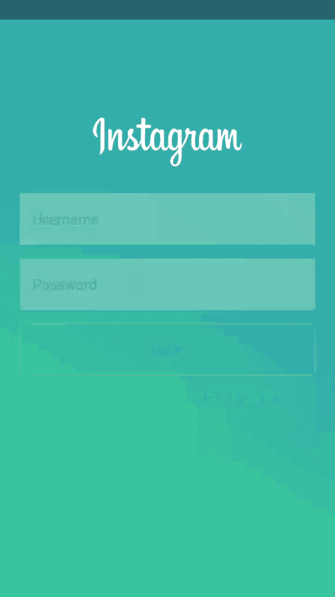

# 如何在安卓系统中使用 Spark Library 创建像 Instagram 这样的渐变动画？

> 原文:[https://www . geesforgeks . org/how-create-grade-animatics-like-insta gram-using-spark-library-in-Android/](https://www.geeksforgeeks.org/how-to-create-gradient-animations-like-instagram-using-spark-library-in-android/)

在本文中，我们将实现 Spark 库。这里我们将展示一个动画，它将线性地改变活动的颜色。该功能可以简单地用于显示动画，并且当用户加载活动时，或者也可以用于在闪屏上显示动画。让我们看看这个特性的实现。下面给出了一个 GIF 示例，来了解一下我们将在本文中做什么。注意，我们将使用 **Java** 语言来实现这个项目。



### **分步实施**

**第一步:创建新项目**

要在安卓工作室创建新项目，请参考[如何在安卓工作室创建/启动新项目](https://www.geeksforgeeks.org/android-how-to-create-start-a-new-project-in-android-studio/)。注意选择 **Java** 作为编程语言。

**第二步:添加依赖关系**

导航到**渐变脚本>构建.渐变(模块:应用)**，并在依赖项部分添加以下依赖项。

> 实现' io . github . Tony:spark:0 . 1 . 0-alpha '

**步骤 3:使用 activity_main.xml 文件**

导航到**应用程序> res >布局> activity_main.xml** 并将下面的代码添加到该文件中。下面是 **activity_main.xml** 文件的代码。

## 可扩展标记语言

```java
<?xml version="1.0" encoding="utf-8"?>
<RelativeLayout
    xmlns:android="http://schemas.android.com/apk/res/android"
    xmlns:tools="http://schemas.android.com/tools"
    android:id="@+id/relativel"
    android:layout_width="match_parent"
    android:layout_height="match_parent"
    tools:context=".MainActivity">
</RelativeLayout>
```

**第四步:使用****MainActivity.java 文件**

转到**MainActivity.java**文件，参考以下代码。以下是**MainActivity.java**文件的代码。代码中添加了注释，以更详细地理解代码。

## Java 语言(一种计算机语言，尤用于创建网站)

```java
package com.example.drawable;

import android.os.Bundle;
import android.widget.RelativeLayout;

import androidx.appcompat.app.AppCompatActivity;

import io.github.tonnyl.spark.Spark;

public class MainActivity extends AppCompatActivity {

    Spark spark;
    RelativeLayout layout;

    @Override
    protected void onCreate(Bundle savedInstanceState) {
        super.onCreate(savedInstanceState);
        setContentView(R.layout.activity_main);
        layout = findViewById(R.id.relativel);

        spark = new Spark.Builder()
                .setView(layout)   // set the layout of main screen
                .setDuration(5000) // set duration
                .setAnimList(Spark.ANIM_BLUE_PURPLE)  // set the color to change
                .build();  // build the layout
    }

    @Override
    protected void onResume() {
        super.onResume();
        spark.startAnimation(); // start animation on resume
    }

    @Override
    protected void onPause() {
        super.onPause();
        spark.stopAnimation(); // stop animation on pause
    }
}
```

**输出:**

<video class="wp-video-shortcode" id="video-613916-1" width="640" height="360" preload="metadata" controls=""><source type="video/mp4" src="https://media.geeksforgeeks.org/wp-content/uploads/20210517151042/spark.mp4?_=1">[https://media.geeksforgeeks.org/wp-content/uploads/20210517151042/spark.mp4](https://media.geeksforgeeks.org/wp-content/uploads/20210517151042/spark.mp4)</video>