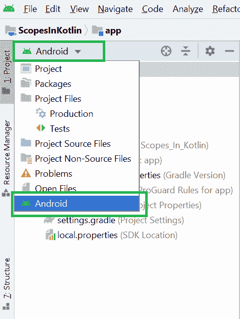
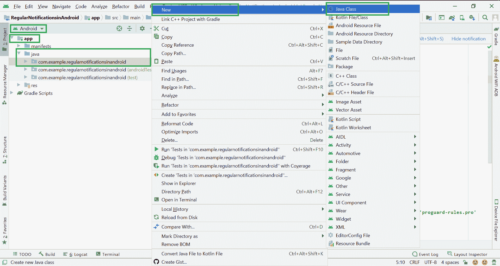
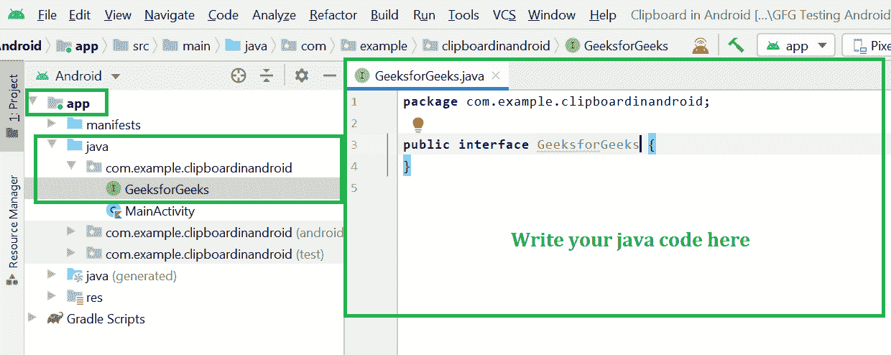
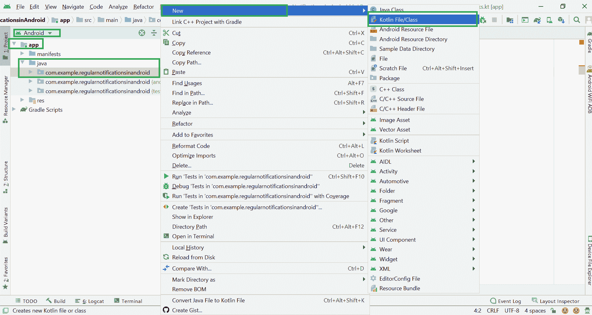
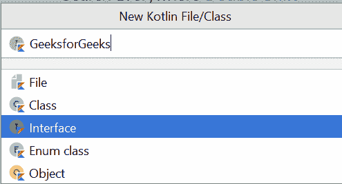

# 如何在安卓工作室创建界面？

> 原文:[https://www . geeksforgeeks . org/如何在 android-studio 中创建界面/](https://www.geeksforgeeks.org/how-to-create-interfaces-in-android-studio/)

**接口**是常量、方法(抽象、静态和默认)和嵌套类型的集合。接口的所有方法都需要在类中定义。界面就像一个类。interface 关键字用于声明接口。

> 公共接口 AdapterCallBackListener {
> 
> void onRowClick(字符串搜索文本)；
> 
> }
> 
> public interface interactive conf fragments listener[
> 
> 请参见 on fragment interaction()；
> 
> }

所以基本上在安卓中有两种类型的界面我们可以创建并且我们经常使用。

*   **创建 Java 接口**
*   **创建科特林界面**

因此，在本文中，我们将在 Android studio 中创建 Java 和 Kotlin 接口。

### 在安卓工作室创建 Java 接口

像类一样，一个[接口](https://www.geeksforgeeks.org/interfaces-in-java/)可以有方法和变量，但是接口中声明的方法默认是抽象的(只有方法签名，没有主体)。

*   接口指定类必须做什么，而不是如何做。它是班级的蓝图。
*   接口是关于功能的，比如玩家可以是一个接口，任何实现玩家的类都必须能够(或者必须实现)移动()。所以它指定了类必须实现的一组方法。
*   如果一个类实现了一个接口，并且没有为接口中指定的所有函数提供方法体，那么这个类必须被声明为抽象的。
*   一个 Java 库的例子是[比较器接口](https://www.geeksforgeeks.org/comparator-interface-java/)。如果一个类实现了这个接口，那么它可以用来对集合进行排序。

> **语法:**
> 
> 界面<interface_name>{ 0</interface_name>
> 
> //声明常量字段
> 
> //声明抽象的方法
> 
> //默认情况下。
> 
> }

要声明一个接口，使用**接口** 关键字。它用于提供全面的抽象。这意味着接口中的所有方法都是用空体声明的，并且是公共的，所有字段都是公共的，默认情况下是静态的、和 final。实现接口的类必须实现接口中声明的所有方法。要实现界面使用 **实现** 关键字。

### 逐步实施

**第一步:**进入安卓工作室，在**安卓**模式下打开项目，如下图所示。

**第二步:**现在进入 **app > java >你的包名>右键>新建> Java 类**如下图所示。

**步骤 3:** 完成步骤 2 后，将出现如下弹出屏幕。在这里输入您的界面名称，选择**界面**，点击**进入**按钮。

成功完成上述步骤后，您可以在这里找到您的 Java 接口。前往 **app > java >您的套餐名称>GeeksforGeeks.java。**你可以在这里编写自己的 Java 代码。

### 在安卓工作室创建柯特林界面

[接口](https://www.geeksforgeeks.org/kotlin-interfaces/)是 Kotlin 提供的自定义类型，不能直接实例化。相反，这些定义了实现类型必须遵循的行为形式。使用接口，您可以定义一组属性和方法，具体类型必须遵循和实现这些属性和方法。Kotlin 中的接口定义以 interface 关键字开始，后面是接口名称，后面是花括号，接口成员位于花括号内。不同的是，成员没有自己的定义。这些定义将由符合要求的类型提供。

> **示例:**
> 
> 车辆接口()
> 
> {
> 
> 有趣的开始()
> 
> 趣味站()
> 
> }

### 逐步实施

**第一步:**进入安卓工作室，在**安卓**模式下打开项目，如下图所示。

**第二步:**现在进入 **app > java >你的包名>右键>新建> Kotlin 文件/类**如下图所示。

**步骤 3:** 完成步骤 2 后，将出现如下弹出屏幕。在这里输入你的班级名称，选择**界面**，点击**进入**按钮。

成功完成以上步骤后，您可以在这里找到您的科特林课程。去 **app > java >你的包名> GeeksforGeeks.kt.** 你可以在这里自己写 **Kotlin** 代码。

