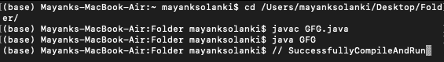
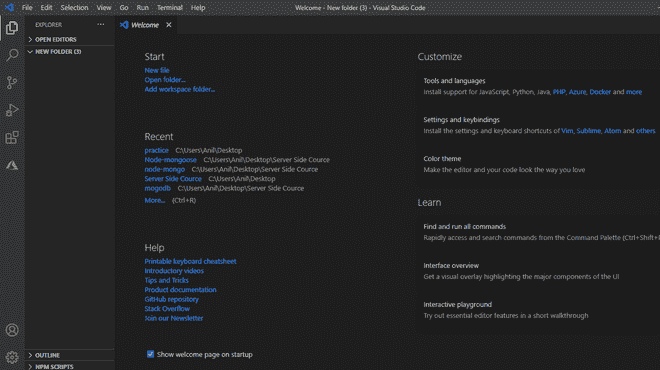
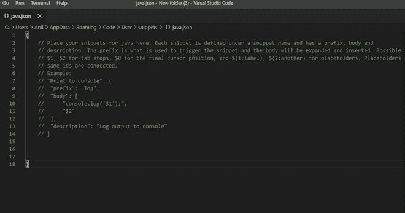
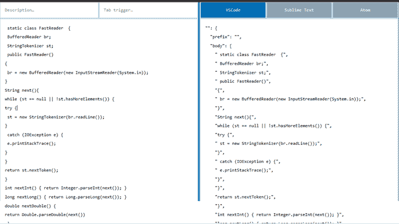
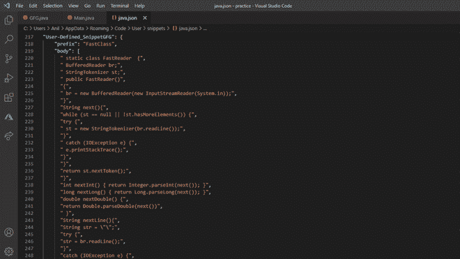
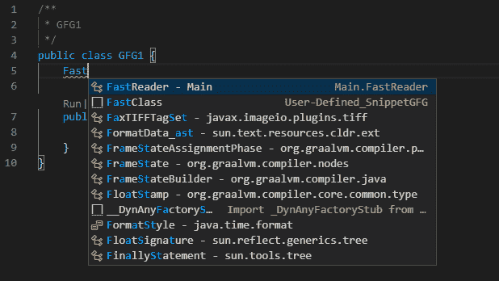

# 什么是代码片段，如何在竞争编程的 VSCode 中创建 Java 代码片段？

> 原文:[https://www . geesforgeks . org/如何创建 Java-in-snippets-in-vs code-for-competitive-programming/](https://www.geeksforgeeks.org/how-to-create-java-snippets-in-vscode-for-competitive-programming/)

代码片段是指一小部分可重复使用的源代码、机器代码或文本，借助于代码片段，我们可以在程序中一次又一次地使用长代码。代码片段是一个快速编写程序的好工具。打字速度对于竞争性编程非常重要。一般来说，java 中有两个用于执行输入/输出操作的类。

*   **扫描仪等级**
*   缓冲器类

[**【扫描仪类】**](https://www.geeksforgeeks.org/scanner-class-in-java/) 是 java.util 包中的一个类，用于获取 int、double 等原语类型的输入。、和字符串。这是在 Java 程序中读取输入的最简单的方法，尽管如果您想要一种用于时间受限的场景的输入法，比如在竞争性编程中，效率不是很高。Scanner 类使用了内置的解析操作，这使得它对于竞争性编程来说速度很慢。

[**缓冲存储类**](https://www.geeksforgeeks.org/java-io-bufferedreader-class-java/) **:** 从字符输入流中读取文本，缓冲字符以提供字符、数组和行的高效读取。这个类在执行输入/输出操作方面比 Scanner 类快得多，但需要大量输入)

> **buffere reader I**比 Scanner 类效率更高，速度更快，但是与 Scanner 类操作相比，这个类的初始化和执行操作的语法要复杂得多。

**片段的组成部分**:每个片段包含四个组成部分

1.  **片段的名称**:不同片段中唯一的片段名称
2.  **前缀**:在程序中生成当前片段的关键字
3.  **主体**:我们绑定到代码片段的实际代码包含在主体中。
4.  **描述:**关于片段的信息包含在片段中。

**代码片段的格式:**在使用 [](https://www.geeksforgeeks.org/json-data-types/) JSON [](https://www.geeksforgeeks.org/json-data-types/)格式的 java.json 文件中实现的特定代码片段。

## java 描述语言

```
"Name_of_the_snippet ":
{                    
  "prefix": "prefix_of_the_snippet",          
  "body": [
          // Actual code of the snippet
          ],
  "description": "description_about_the_snippet"  
}
```

**程序:**涉及的步骤如下:

1.  在新的 java 文件中创建和实现用户定义的类。
2.  现在，创建这个类的一个片段

**实现:**对于用户定义的类。通过在我们的类(使用[bufferedeeder](https://www.geeksforgeeks.org/java-io-bufferedreader-class-java/)和 [StringTokenizer](https://www.geeksforgeeks.org/stringtokenizer-class-java-example-set-1-constructors/) )中将 bufferedeeder 的所有输入/输出方法实现为用户定义的:该方法利用了 bufferedeeder 和 [StringTokenizer](https://www.geeksforgeeks.org/stringtokenizer-class-java-example-set-1-constructors/) 的时间优势和用户定义方法的优势，减少了输入，因此输入速度更快。这种方法以 1.23 秒的时间被接受，非常推荐使用这种方法，因为它容易记住，并且足够快，可以满足竞争性编码中大多数问题的需要。

## Java 语言(一种计算机语言，尤用于创建网站)

```
// Java Program to create Java snippets
// in VSCode for Competitive Programming

/* Code for user defined class */

// Importing generic java libraries
import java.util.*;
import java.util.Map.Entry;
import java.io.*;
import java.util.regex.Pattern;

public class GFG {

    static class FastReader  {
        BufferedReader br;
        StringTokenizer st;

        public FastReader()
        {
            br = new BufferedReader(
                new InputStreamReader(System.in));
        }

        String next()
        {
            while (st == null || !st.hasMoreElements()) {
                try {
                    st = new StringTokenizer(br.readLine());
                }
                catch (IOException e) {
                    e.printStackTrace();
                }
            }
            return st.nextToken();
        }

        int nextInt() { return Integer.parseInt(next()); }

        long nextLong() { return Long.parseLong(next()); }

        double nextDouble()
        {
            return Double.parseDouble(next());
        }

        String nextLine()
        {
            String str = "";
            try {
                str = br.readLine();
            }
            catch (IOException e) {
                e.printStackTrace();
            }
            return str;
        }
    }

    public static void main(String[] args)
    {
        FastReader scan=new FastReader();
    }
}
```

**输出:**



**步骤 2:在 VSCode 中创建用户定义类的片段**

VSCode 是一个文本编辑器，为开发操作和版本控制系统提供支持。它为用户提供了构建简单代码的工具。可以从[visualstudio.com](https://code.visualstudio.com/)下载安装。现在跳到程序的第二步。

*   在要创建的文件夹中打开 VS。
*   在用户代码片段后搜索 java.js 的设置。
*   搜索 SnippetGenerator。
*   将代码片段粘贴到 java.json 文件中并进行检查。

为了更好地理解，下面用可视化表示详细显示了步骤:

**2.1:** 在我们想要创建片段**的文件夹中打开 VScode。**



**2.2:** 点击设置按钮，在用户代码片段后，在文本框中搜索 java.js。文件如下所示。



**2.3:** 现在搜索[代码片段生成器](https://snippet-generator.app/?description=&tabtrigger=&snippet=import+java.util.*%3B%0Aclass+Main%7B%0Apublic+static+void+main%28String+args%5B%5D%29%7B%0ASystem.out.println%28%22This+is+the+snippet+for+the+java%22%0A%7D%0A%7D&mode=vscode)这个工具将 java 代码转换成代码片段。从这个工具中复制 JSON 的片段。



**2.4:** 将 java.json 文件中的片段粘贴到程序目录中。

## java 描述语言

```
{
"User-Defined_SnippetGFG": {   //Name of the snippet
    "prefix": "FastClass",    //keyword to generate
    "body": [   //code implemented in the snippet
      " static class FastReader  {",
      " BufferedReader br;",
      " StringTokenizer st;",
      " public FastReader()",
      "{",
      " br = new BufferedReader(new InputStreamReader(System.in));",
      "}",
      "String next(){",
      "while (st == null || !st.hasMoreElements()) {",
      "try {",
      " st = new StringTokenizer(br.readLine());",
      "}",
      " catch (IOException e) {",
      " e.printStackTrace();",
      "}",
      "}",
      "return st.nextToken();",
      "}",
      "int nextInt() { return Integer.parseInt(next()); }",
      "long nextLong() { return Long.parseLong(next()); }",
      "double nextDouble() {",
      "return Double.parseDouble(next())",
      " }",
      "String nextLine(){",
      "String str = \"\";",
      "try {",
      "str = br.readLine();",
      "}",
      "catch (IOException e) {",
      "e.printStackTrace();",
      "}",
      "return str;",
      "}",
      "}",
      "",
      " "
    ],
    "description": ""
  }

}
```

**输出:** java.json 文件



**2.5:检查片段:** FastClass 是启动片段的关键字。



**2.6。GFG1.java 文件**

