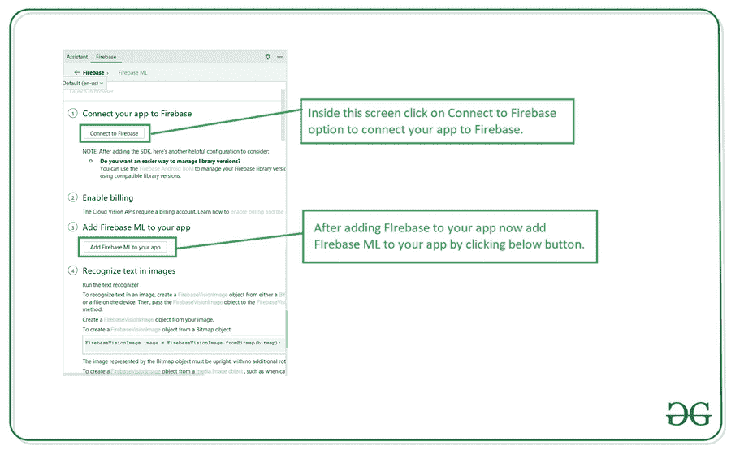

# 如何使用 Firebase ML 工具包在安卓中创建语言检测器？

> 原文:[https://www . geeksforgeeks . org/如何使用 firebase-ml-kit 创建安卓语言检测器/](https://www.geeksforgeeks.org/how-to-create-language-detector-in-android-using-firebase-ml-kit/)

我们已经看到许多应用程序在其应用程序中提供不同的语言支持，我们还看到许多 ML 应用程序，在这些应用程序中，我们将看到我们可以检测用户输入的文本的语言。在本文中，我们将创建一个应用程序，在其中我们将检测我们的安卓应用程序中输入的文本的语言。所以为了检测这段文字的语言。我们将使用 **Firebase ML 工具包**，它将检测文本的语言并显示适当的语言代码。

### 我们将在本文中构建什么？

我们将构建一个简单的应用程序，其中我们将显示一个 [EditText](https://www.geeksforgeeks.org/edittext-widget-in-android-using-java-with-examples/) 字段，在该字段中，我们必须添加任何语言的文本和一个用于检测该文本语言的按钮。添加文本后，我们将点击检测语言按钮，我们的文本的语言被检测，我们将看到我们的语言的代码。下面给出了一个示例视频，让我们了解一下在本文中要做什么。注意，我们将使用 **Java** 语言来实现这个项目。

<video class="wp-video-shortcode" id="video-558993-1" width="640" height="360" preload="metadata" controls=""><source type="video/mp4" src="https://media.geeksforgeeks.org/wp-content/uploads/20210211133235/Screenrecorder-2021-02-11-13-27-35-627.mp4?_=1">[https://media.geeksforgeeks.org/wp-content/uploads/20210211133235/Screenrecorder-2021-02-11-13-27-35-627.mp4](https://media.geeksforgeeks.org/wp-content/uploads/20210211133235/Screenrecorder-2021-02-11-13-27-35-627.mp4)</video>

### **分步实施**

**第一步:创建新项目**

要在安卓工作室创建新项目，请参考[如何在安卓工作室创建/启动新项目](https://www.geeksforgeeks.org/android-how-to-create-start-a-new-project-in-android-studio/)。注意选择 **Java** 作为编程语言。

**第二步:将你的应用连接到 Firebase**

在 Android Studio 中创建新项目后，将您的应用程序连接到 Firebase。用于将您的应用程序连接到 firebase。导航到顶部栏上的工具。之后点击 Firebase。右侧将打开一个新窗口。在该窗口中，单击 Firebase ML，然后单击在安卓系统中使用 Firebase ML 工具包。你可以看到截图下面的选项。


点击此选项后，您将看到下面的屏幕。在此屏幕上，单击连接到 Firebase 选项，将您的应用程序连接到 Firebase。你会看到下面的屏幕。



单击连接选项将您的应用程序连接到 Firebase，并将以下依赖项添加到您的 build.gradle 文件中。

**第三步:添加语言检测的依赖项，构建. gradle 文件**

导航到**应用程序>梯度脚本>构建.梯度**文件，并添加以下代码。代码中添加了注释，以便更详细地了解。

> firebase 核心的依赖关系。
> 
> 实现' com . Google . firebase:firebase-core:15 . 0 . 2 '
> 
> //下面两个依赖项用于语言检测
> 
> 实现' com . Google . firebase:firebase-ml-自然语言:22.0.0 '
> 
> 实现' com . Google . firebase:firebase-ml-自然语言-语言-id-model:20.0.7 '

**第四步:在你的安卓应用**中添加上网权限

导航到**应用程序> AndroidManifest.xml** 文件，并在其中添加以下代码。代码中添加了注释，以便更详细地了解。

## 可扩展标记语言

```
<!--permission for internet-->
<uses-permission android:name="android.permission.INTERNET"/>
```

**第 5 步:使用 activity_main.xml 文件**

导航到**应用程序> res >布局> activity_main.xml** 并将下面的代码添加到该文件中。下面是 **activity_main.xml** 文件的代码。

## 可扩展标记语言

```
<?xml version="1.0" encoding="utf-8"?>
<RelativeLayout
    xmlns:android="http://schemas.android.com/apk/res/android"
    xmlns:tools="http://schemas.android.com/tools"
    android:layout_width="match_parent"
    android:layout_height="match_parent"
    tools:context=".MainActivity">

    <!--edit text to enter your input-->
    <EditText
        android:id="@+id/idEdtLanguage"
        android:layout_width="match_parent"
        android:layout_height="wrap_content"
        android:layout_centerHorizontal="true"
        android:layout_marginTop="50dp"
        android:hint="Enter your name"
        android:padding="4dp"
        android:textColor="@color/black"
        android:textSize="20sp" />

    <!--button to detect language of the input text-->
    <Button
        android:id="@+id/idBtnDetectLanguage"
        android:layout_width="wrap_content"
        android:layout_height="wrap_content"
        android:layout_below="@id/idTVDetectedLanguageCode"
        android:layout_centerInParent="true"
        android:text="Detect language" />

    <!--text view to display the code of entered text-->
    <TextView
        android:id="@+id/idTVDetectedLanguageCode"
        android:layout_width="match_parent"
        android:layout_height="wrap_content"
        android:layout_below="@id/idEdtLanguage"
        android:layout_centerHorizontal="true"
        android:layout_margin="20dp"
        android:gravity="center_horizontal"
        android:text="Language code"
        android:textAlignment="center"
        android:textSize="20sp" />

</RelativeLayout>
```

**第 6 步:使用****MainActivity.java 文件**

转到**MainActivity.java**文件，参考以下代码。以下是**MainActivity.java**文件的代码。代码中添加了注释，以更详细地理解代码。

## Java 语言(一种计算机语言，尤用于创建网站)

```
import android.os.Bundle;
import android.view.View;
import android.widget.Button;
import android.widget.EditText;
import android.widget.TextView;
import android.widget.Toast;

import androidx.annotation.NonNull;
import androidx.appcompat.app.AppCompatActivity;

import com.google.android.gms.tasks.OnFailureListener;
import com.google.android.gms.tasks.OnSuccessListener;
import com.google.firebase.ml.naturallanguage.FirebaseNaturalLanguage;
import com.google.firebase.ml.naturallanguage.languageid.FirebaseLanguageIdentification;

public class MainActivity extends AppCompatActivity {

    // creating variables for our image view,
    // text view and two buttons.
    private EditText edtLanguage;
    private TextView languageCodeTV;
    private Button detectLanguageBtn;

    @Override
    protected void onCreate(Bundle savedInstanceState) {
        super.onCreate(savedInstanceState);
        setContentView(R.layout.activity_main);

        // on below line we are initializing our variables.
        edtLanguage = findViewById(R.id.idEdtLanguage);
        languageCodeTV = findViewById(R.id.idTVDetectedLanguageCode);
        detectLanguageBtn = findViewById(R.id.idBtnDetectLanguage);

        // adding on click listener for button
        detectLanguageBtn.setOnClickListener(new View.OnClickListener() {
            @Override
            public void onClick(View v) {
                // getting string from our edit text.
                String edt_string = edtLanguage.getText().toString();
                // calling method to detect language.
                detectLanguage(edt_string);
            }
        });
    }

    private void detectLanguage(String string) {
        // initializing our firebase language detection.
        FirebaseLanguageIdentification languageIdentifier = FirebaseNaturalLanguage.getInstance().getLanguageIdentification();

        // adding method to detect language using identify language method.
        languageIdentifier.identifyLanguage(string).addOnSuccessListener(new OnSuccessListener<String>() {
            @Override
            public void onSuccess(String s) {
                // below line we are setting our
                // language code to our text view.
                languageCodeTV.setText(s);
            }
        }).addOnFailureListener(new OnFailureListener() {
            @Override
            public void onFailure(@NonNull Exception e) {
                // handling error method and displaying a toast message.
                Toast.makeText(MainActivity.this, "Fail to detect language : \n" + e, Toast.LENGTH_SHORT).show();
            }
        });
    }
}
```

现在运行您的应用程序，并查看应用程序的输出:

### **输出:**

<video class="wp-video-shortcode" id="video-558993-2" width="640" height="360" preload="metadata" controls=""><source type="video/mp4" src="https://media.geeksforgeeks.org/wp-content/uploads/20210211133235/Screenrecorder-2021-02-11-13-27-35-627.mp4?_=2">[https://media.geeksforgeeks.org/wp-content/uploads/20210211133235/Screenrecorder-2021-02-11-13-27-35-627.mp4](https://media.geeksforgeeks.org/wp-content/uploads/20210211133235/Screenrecorder-2021-02-11-13-27-35-627.mp4)</video>