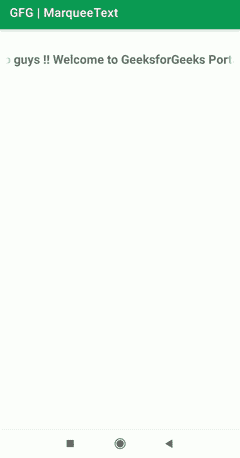

# 如何在安卓中创建字幕文本？

> 原文:[https://www . geesforgeks . org/如何在安卓中创建字幕文本/](https://www.geeksforgeeks.org/how-to-create-marquee-text-in-android/)

在本文中，我们将在**安卓工作室**中创建字幕文本。字幕是水平或垂直显示的滚动文本。它用来显示一些重要的通知或标题。这使得应用用户界面更具吸引力。请注意，我们将使用 **Java** 作为编程语言。下面给出了一个示例 GIF，以了解我们将在本文中做什么。



### 逐步实施

**第一步:创建新项目**

要在安卓工作室创建新项目，请参考[如何在安卓工作室创建/启动新项目](https://www.geeksforgeeks.org/android-how-to-create-start-a-new-project-in-android-studio/)。请注意，您必须选择 **Java** 作为编程语言。

**步骤 2:使用 activity_main.xml 文件**

导航到**应用程序> res >布局> activity_main.xml** 并将下面的代码添加到该文件中。[文本视图](https://www.geeksforgeeks.org/working-with-the-textview-in-android/)用于添加我们想要在屏幕上显示的文本。这里我们使用了**Android:ellipsize = " marquee "**给我们的文本添加了一个字幕，并且**Android:single line = " true "**让我们的文本只显示一行。另外，我们使用了**Android:marqueerepeatllimit =“marquee _ forever”**这样 marquee 会无限重复，我这里使用的还有一个属性是**Android:scroll horizontal =“true”**这样文字会水平滚动。

## 可扩展标记语言

```java
<?xml version="1.0" encoding="utf-8"?>
<RelativeLayout 
    xmlns:android="http://schemas.android.com/apk/res/android"
    xmlns:tools="http://schemas.android.com/tools"
    android:layout_width="match_parent"
    android:layout_height="match_parent"
    tools:context=".MainActivity">

    <!--
    Textview is used here to add the text which we want to display on the screen.Here important attributes are:
    i)   android:singleLine="true"... so that our text will show only in one line
    ii)  android:ellipsize="marquee"... to add marquee to our text
    iii) android:marqueeRepeatLimit="marquee_forever"...so that marquee will repeat infinitely
    iv)  android:scrollHorizontally="true"... so that text will scroll horizontally
    -->
    <TextView
        android:id="@+id/marqueeText"
        android:layout_width="match_parent"
        android:layout_height="wrap_content"
        android:layout_marginTop="25sp"
        android:ellipsize="marquee"
        android:marqueeRepeatLimit="marquee_forever"
        android:padding="10dp"
        android:scrollHorizontally="true"
        android:singleLine="true"
        android:text="Hello guys !! Welcome to GeeksforGeeks Portal !!"
        android:textSize="20sp"
        android:textStyle="bold" />

</RelativeLayout>
```

**步骤 3:使用 MainActivity.java 文件**

去**MainActivity.java**班。我们已经调用了 setSelected()方法，并将布尔值作为 true 传递，这样我们的选框就可以开始了。下面是**MainActivity.java**文件的代码。

## Java 语言(一种计算机语言，尤用于创建网站)

```java
import android.os.Bundle;
import android.widget.TextView;

import androidx.appcompat.app.AppCompatActivity;

public class MainActivity extends AppCompatActivity {

    TextView txtMarquee;

    @Override
    protected void onCreate(Bundle savedInstanceState) {
        super.onCreate(savedInstanceState);
        setContentView(R.layout.activity_main);

        // casting of textview
        txtMarquee = (TextView) findViewById(R.id.marqueeText);

        // Now we will call setSelected() method
        // and pass boolean value as true
        txtMarquee.setSelected(true);
    }
}
```

**第 4 步:使用 colors.xml 文件**

导航到**应用程序>RES>values>colors . XML .**您可以为应用程序添加任意数量的颜色。你只需要给出一个颜色代码，并输入颜色名称。在这个应用中，我们保持了应用栏颜色为绿色，颜色代码为**“# 0f9d 58”。**

## 可扩展标记语言

```java
<?xml version="1.0" encoding="utf-8"?>
<resources>
    <color name="Green">#0F9D58</color>
    <color name="purple_500">#FF6200EE</color>
    <color name="purple_700">#FF3700B3</color>
    <color name="teal_200">#FF03DAC5</color>
    <color name="teal_700">#FF018786</color>
    <color name="black">#FF000000</color>
    <color name="white">#FFFFFFFF</color>
</resources>
```

**第 5 步:使用主题. xml**

导航到**应用程序> res >值> themes.xml** 并选择您选择的主题。我们使用了 **parent=“主题”。material components . day night . dark action bar "**也就是昼夜主题搭配暗黑 [ActionBar](https://www.geeksforgeeks.org/actionbar-in-android-with-example/) 。可以添加 **parent=“主题”。AppCompat . light . dark action bar "**用深色动作栏和 **parent="Theme "获得浅色主题。AppCompat . light . Darkactionbar "**用于带有深色动作栏的浅色主题。

## 可扩展标记语言

```java
<resources xmlns:tools="http://schemas.android.com/tools">
    <!-- Base application theme. -->
    <style name="Theme.MarqueeText"
        parent="Theme.MaterialComponents.DayNight.DarkActionBar">
        <!-- Primary brand color. -->
        <item name="colorPrimary">@color/Green</item>
        <item name="colorPrimaryVariant">@color/Green</item>
        <item name="colorOnPrimary">@color/white</item>
        <!-- Secondary brand color. -->
        <item name="colorSecondary">@color/teal_200</item>
        <item name="colorSecondaryVariant">@color/teal_700</item>
        <item name="colorOnSecondary">@color/black</item>
        <!-- Status bar color. -->
        <item name="android:statusBarColor" tools:targetApi="l">?attr/colorPrimaryVariant</item>
        <!-- Customize your theme here. -->
    </style>
</resources>
```

**第 6 步:使用字符串. xml**

导航至**应用程序> res >值> strings.xml.** 您可以在此添加应用程序栏标题**。**我们设置了**“GFG |马克特文本”**作为标题。

## 可扩展标记语言

```java
<resources>
    <string name="app_name">GFG | MarqueeText</string>
</resources>
```

**输出:**

<video class="wp-video-shortcode" id="video-580935-1" width="640" height="360" preload="metadata" controls=""><source type="video/mp4" src="https://media.geeksforgeeks.org/wp-content/uploads/20210324194126/Screenrecorder-2021-03-24-17-51-23-254.mp4?_=1">[https://media.geeksforgeeks.org/wp-content/uploads/20210324194126/Screenrecorder-2021-03-24-17-51-23-254.mp4](https://media.geeksforgeeks.org/wp-content/uploads/20210324194126/Screenrecorder-2021-03-24-17-51-23-254.mp4)</video>