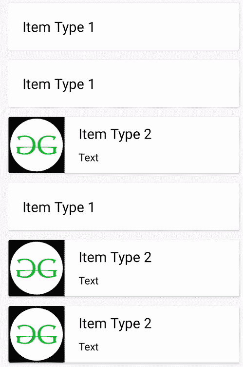

# 如何在安卓中创建多视图类型的回收视图？

> 原文:[https://www . geeksforgeeks . org/如何在安卓中创建多视图类型的 recycle view/](https://www.geeksforgeeks.org/how-to-create-recyclerview-with-multiple-viewtype-in-android/)

[回收视图](https://www.geeksforgeeks.org/android-recyclerview/)是[安卓应用开发](https://www.geeksforgeeks.org/android-app-development-fundamentals-for-beginners/)中用户界面非常关键的一部分。在显示一长串项目时，优化内存消耗尤为重要。RecylerView 可扩展自定义的项目列表。该列表可以具有所有相似的布局，也可以具有多个不同的布局。在这里，开发了这样一个具有多种视图类型的回收视图。下面是一个带有多个视图的安卓回收视图的例子。


### 方法

**第一步:添加所需的依赖项**
[在 Android Studio](https://www.geeksforgeeks.org/android-how-to-create-start-a-new-project-in-android-studio/) 中创建新项目，并在**[build . grad le(:app)](https://www.geeksforgeeks.org/android-build-gradle/)**中的 Gradle Scripts 部分添加以下依赖项:

> 实现“androidx . recycle view:recycle view:1 . 1 . 0”
> 实现“androidx . card view:card view:1 . 0 . 0”

要获得更多最新版本的依赖项，请单击此处的。虽然第一个依赖项是强制性的，但第二个依赖项是可选的，这取决于用户界面的要求。点击**立即同步**并继续。

**第二步:在 activity_main.xml** 中实现 RecyclerView

创建一个包含主回收视图的布局。这里是在 **activity_main.xml** 文件中创建的。给定的布局只包含一个欢迎文本视图和一个回收视图，但是它可以根据需求进行定制。 **activity_main.xml** 的代码如下。

## activity_main.xml

```
<?xml version="1.0" encoding="utf-8"?>
<androidx.constraintlayout.widget.ConstraintLayout 
    xmlns:android="http://schemas.android.com/apk/res/android"
    xmlns:app="http://schemas.android.com/apk/res-auto"
    xmlns:tools="http://schemas.android.com/tools"
    android:layout_width="match_parent"
    android:layout_height="match_parent"
    tools:context=".MainActivity">

    <!--Welcome text-->
    <TextView
        android:id="@+id/heading"
        android:layout_width="wrap_content"
        android:layout_height="wrap_content"
        android:text="Welcome to GFG!"
        android:textColor="#006600"
        android:textSize="20dp"
        app:layout_constraintBottom_toBottomOf="parent"
        app:layout_constraintEnd_toEndOf="parent"
        app:layout_constraintStart_toStartOf="parent"
        app:layout_constraintTop_toTopOf="parent"
        app:layout_constraintVertical_bias="0.058"></TextView>

    <!-- Main RecyclerView-->
    <androidx.recyclerview.widget.RecyclerView
        android:id="@+id/recyclerView"
        android:layout_width="match_parent"
        android:layout_height="wrap_content"
        android:layout_marginTop="15dp"
        android:layout_marginStart="15dp"
        app:layout_constraintBottom_toBottomOf="parent"
        app:layout_constraintEnd_toEndOf="parent"
        app:layout_constraintStart_toStartOf="parent"
        app:layout_constraintTop_toBottomOf="@+id/heading"
        app:layout_constraintVertical_bias="0.061"
        android:paddingBottom="100dp"/>

</androidx.constraintlayout.widget.ConstraintLayout>
```

**第三步:添加需要的可绘制文件**

在继续下一步之前，确保所有必要的可绘制资源都添加到**可绘制资源目录**下。在本教程中，仅使用了以下图标:


**步骤 4:创建所有项目布局**

确定所有不同的布局，回收视图需要保存这些布局，并在布局资源目录下的单独的 XML 文件中实现它们。这里，已经创建了两个不同的布局。第一个在 **layout_one.xml** 中实现，第二个在**layout _ two . XML**中实现第一个布局只包含一个包装在 CardView 中的 [TextView](https://www.geeksforgeeks.org/textview-in-kotlin/) 。下面是它的实现。

## layout_one.xml

```
<?xml version="1.0" encoding="utf-8"?>
<LinearLayout
    xmlns:android="http://schemas.android.com/apk/res/android"
    xmlns:app="http://schemas.android.com/apk/res-auto"
    xmlns:tools="http://schemas.android.com/tools"
    android:layout_width="match_parent"
    android:layout_height="wrap_content"
    android:orientation="vertical">

    <!--parent CardView-->
    <androidx.cardview.widget.CardView
        android:id="@+id/cardview_one"
        android:layout_width="match_parent"
        android:layout_height="wrap_content"
        android:layout_marginTop="4dp"
        android:layout_marginEnd="16dp"
        app:layout_constraintEnd_toEndOf="parent"
        app:layout_constraintTop_toTopOf="parent"
        android:elevation="5dp">

        <!--LinearLayout inside the CardView-->
        <!--This layout is accessed to create
            toasts when this item is clicked-->
        <LinearLayout
            android:id="@+id/linearlayout"
            android:layout_width="match_parent"
            android:layout_height="match_parent"
            android:orientation="horizontal">

            <!--This layout only holds a TextView
                inside a CardView-->
            <TextView
                android:id="@+id/text"
                android:layout_width="wrap_content"
                android:layout_height="wrap_content"
                android:textColor="#000000"
                android:textSize="20dp"
                android:layout_margin="20dp"/>

        </LinearLayout>
    </androidx.cardview.widget.CardView>

    <!-- This is extra space given to maintain a 
         gap between two consecutive CardViews-->
    <Space
        android:layout_width="match_parent"
        android:layout_height="10dp"/>

</LinearLayout>
```