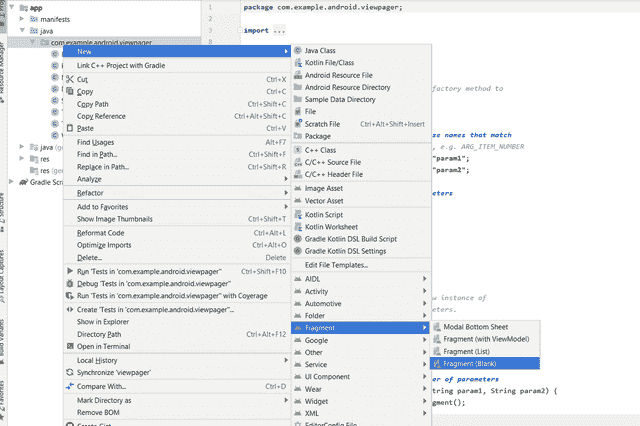

# 如何在安卓应用中创建滑动导航

> 原文:[https://www . geesforgeks . org/如何创建-滑动-安卓导航-app/](https://www.geeksforgeeks.org/how-to-create-swipe-navigation-in-an-android-app/)

说起[安卓 app](https://www.geeksforgeeks.org/top-programming-languages-for-android-app-development/)，首先想到的就是综艺。有太多种类的安卓应用为用户提供了漂亮的动态用户界面。其中一个功能是在我们的安卓应用程序中使用左右滑动来导航，而不是点击按钮。它不仅看起来更简单和优雅，而且为用户提供了方便的访问。有许多应用程序使用这种滑动功能来滑动应用程序中的不同活动。例如，流行的聊天应用 Snapchat 使用它来浏览镜头、聊天和故事。在这里，我们将学习如何在我们自己的安卓应用程序中实现滑动视图。

我们可以通过使用两个特性来实现这一点:

1.  **[片段](https://www.geeksforgeeks.org/introduction-fragments-android/)** 一个片段只是一个活动的一部分。我们可以让一个片段占据屏幕的一部分或整个屏幕。或者我们可以同时展示多个片段，组成一个完整的屏幕。在一个活动中，我们也可以互相交换不同的片段。
2.  **[viewpage](https://developer.android.com/reference/androidx/viewpager/widget/ViewPager)**viewpage 是 Java 中的一个类，与 Fragments 结合使用。主要用于设计应用的 UI。

**它是如何工作的？**
首先我们需要使用**设置适配器()**方法在可视寻呼机上设置一个**适配器**。我们设置的适配器叫做 **FragmentPagerAdapter** ，它是 Java 中的一个抽象类。因此，我们创建了自己的**样本片段页面适配器**，它从**片段页面适配器**延伸出来，并在屏幕上显示我们的片段。当我们在设备中启动应用程序时，可视寻呼机会询问 SampleFragmentPagerAdapter 要刷过多少页。适配器的 **getCount()** 方法将这个答案返回给可视寻呼机。然后，可视寻呼机请求位于第 0 个位置的片段，适配器返回该特定片段，然后由可视寻呼机在我们的屏幕上显示。当我们向左滑动时，可视寻呼机向适配器询问第一个位置的片段，类似地，它会显示在屏幕上，并继续下去。

**逐步实现:**
我们将创建三个片段，也就是用户可以刷过的三个屏幕。然后我们将这些片段添加到我们的**片段页面适配器**中，最后将其设置在可视页面上。
*注意:要运行这些代码，需要在 Android Studio 中复制粘贴，因为它不会在 IDE 上运行！*

*   **步骤 1:创建片段:**
    要创建片段，请点击**app**>**Java**>**com . example . Android***(右键)* > **新建** > **片段** > **片段(空白)**

    [](https://media.geeksforgeeks.org/wp-content/cdn-uploads/20200601113941/1s.png)

    我们可以创建任意多的片段，但是由于我们将只显示三个屏幕，因此我们将创建三个片段。
    现在我们将打开我们的碎片并在那里复制这个代码:

    ## Java 语言(一种计算机语言，尤用于创建网站)

    ```java
    package com.example.android.gfg;

    import android.os.Bundle;
    import android.support.v4.app.Fragment;
    import android.view.LayoutInflater;
    import android.view.View;
    import android.view.ViewGroup;

    public class Fragment1 extends Fragment {

        @Override
        public View onCreateView(
            LayoutInflater inflater,
            ViewGroup container,
            Bundle savedInstanceState)
        {
            return inflater
                .inflate(
                    R.layout.fragment_1,
                    container, false);
        }
    }
    ```

    说明:

    *   我们正在用 BuildTools 版本***23 . 0 . 2***导入 **v4** 片段。如果我们在导入时出错，我们必须确保我们的构建工具和软件开发工具包版本与我们导入的库相对应。
    *   我们把我们的片段命名为片段 1。
    *   Fragment1 显示我们现在将要制作的布局片段 _1.xml。
*   **步骤 2:为片段创建布局:**
    每个片段需要显示一个布局。我们可以随意设计这个布局。下面是我们如何实现这个布局的代码:

    ## 可扩展标记语言

    ```java
    <LinearLayout
        xmlns:android="http://schemas.android.com/apk/res/android"
        android:layout_width="match_parent"
        android:layout_height="match_parent"
        android:orientation="vertical"
        android:padding="16dp">

        <ImageView
            android:layout_width="wrap_content"
            android:layout_height="wrap_content"
            android:src="@drawable/gfg"/>

        <TextView
            android:layout_width="wrap_content"
            android:layout_height="wrap_content"
            android:text="With the idea of imparting programming knowledge, Mr. Sandeep Jain, an IIT Roorkee alumnus started a dream, GeeksforGeeks. Whether programming excites you or you feel stifled, wondering how to prepare for interview questions or how to ace data structures and algorithms, GeeksforGeeks is a one-stop solution. "
            android:textSize="20sp"
            android:textColor="#81c784"/>
    </LinearLayout>
    ```

    这看起来像:

    [](https://media.geeksforgeeks.org/wp-content/cdn-uploads/20200601113939/2s.jpg)

    同样，我们将再创建两个片段，并为每个片段创建各自的布局。

*   **Step 3: Creating our FragmentPageAdapter:** 
    Now that we have all our three Fragments and three layouts are associated with each one of them, we will now build our **FragmentPageAdapter** and call it **SimpleFragmentPageAdapter**. This can be done by first creating a new Java Class and naming it as SimpleFragmentPageAdapter. Here’s the code it will contain:

    ## Java 语言(一种计算机语言，尤用于创建网站)

    ```java
    package com.example.android.gfg;

    import android.support.v4.app.Fragment;
    import android.support.v4.app.FragmentManager;
    import android.support.v4.app.FragmentPagerAdapter;

    public class SimpleFragmentPagerAdapter
        extends FragmentPagerAdapter {

        public SimpleFragmentPagerAdapter(
            FragmentManager fm)
        {
            super(fm);
        }

        @Override
        public Fragment getItem(int position)
        {
            if (position == 0) {
                return new Fragment1();
            }
            else if (position == 1) {
                return new Fragment2();
            }
            else {
                return new Fragmnet3();
            }
        }

        @Override
        public int getCount()
        {
            return 3;
        }
    }
    ```

    说明:

    *   **getItem()** 方法返回指定位置的片段。所以首先是碎片 1，向左滑动后，我们会得到相同顺序的其他碎片。
    *   **getCount()** 方法返回要显示的碎片数量，在本例中是三个。
*   **第三步:创建 MainActivity.Java 和 activity_main.xml :**
    现在我们已经准备好了一切，最后一步只是制作我们的 MainActivity.Java 和 activity_main.xml 文件。它们可能因我们制作的应用程序而有很大差异，但在这种情况下，文件非常简单，如下所示:

    ## activity_main.xml

    ```java
    <?xml version="1.0" encoding="utf-8"?>

    <LinearLayout
        xmlns:android="http://schemas.android.com/apk/res/android"
        xmlns:tools="http://schemas.android.com/tools"
        android:layout_width="match_parent"
        android:layout_height="match_parent"
        android:orientation="vertical"
        tools:context="com.example.android.viewpager.MainActivity">

        <android.support.v4.view.ViewPager
            android:id="@+id/viewpager"
            android:layout_width="match_parent"
            android:layout_height="match_parent" />

    </LinearLayout>
    ```

    ## MainActivity.Java

    ```java
    package com.example.android.gfg;

    import android.os.Bundle;
    import android.support.v4.view.ViewPager;
    import android.support.v7.app.AppCompatActivity;

    public class MainActivity
        extends AppCompatActivity {

        @Override
        protected void onCreate(
            Bundle savedInstanceState)
        {
            super.onCreate(savedInstanceState);

            // Set the content of the activity
            // to use the activity_main.xml
            // layout file
            setContentView(R.layout.activity_main);

            // Find the view pager that will
            // allow the user to swipe
            // between fragments
            ViewPager viewPager
                = (ViewPager)findViewById(
                    R.id.viewpager);

            // Create an adapter that
            // knows which fragment should
            // be shown on each page
            SimpleFragmentPagerAdapter
                adapter
                = new SimpleFragmentPagerAdapter(
                    getSupportFragmentManager());

            // Set the adapter onto
            // the view pager
            viewPager.setAdapter(adapter);
        }
    }
    ```

    输出:

    <video class="wp-video-shortcode" id="video-413561-1" width="320" height="540" preload="metadata" controls=""><source type="video/mp4" src="https://media.geeksforgeeks.org/wp-content/uploads/20200516210454/15.mp4?_=1">[https://media.geeksforgeeks.org/wp-content/uploads/20200516210454/15.mp4](https://media.geeksforgeeks.org/wp-content/uploads/20200516210454/15.mp4)</video>