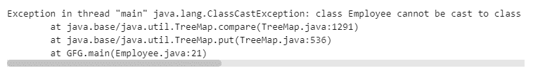

# 如何在 Java 中使用可比接口创建树形图对象？

> 原文:[https://www . geesforgeks . org/如何使用 java 中的可比接口创建树图对象/](https://www.geeksforgeeks.org/how-to-create-treemap-objects-using-comparable-interface-in-java/)

[可比较接口](https://www.geeksforgeeks.org/comparable-vs-comparator-in-java/)在 java.lang 包中找到，该包用于仅基于单个属性对用户定义类的对象进行排序。这个界面包含一个单一的方法[比较对象。](https://www.geeksforgeeks.org/java-lang-string-compareto/)用于将**当前对象与指定对象进行比较，可用于对自定义类、包装类**、**和字符串对象进行排序。**

****语法:****

```java
compareTo(Object o) ;
```

****参数:**与当前对象进行比较的指定对象。**

****返回类型:**整数值**

*   **正整数-如果当前对象大于指定对象。**
*   **负整数-如果当前对象小于指定对象。**
*   **零-如果当前对象等于指定对象。**

****Java 中可比接口的使用****

**[树形图](https://www.geeksforgeeks.org/treemap-in-java/)在 Java 中，元素是以键值对的形式存储的，键值对是根据键进行排序的。当关键字是字符串类或[包装器](https://www.geeksforgeeks.org/wrapper-classes-java/)类时，它默认实现可比接口，并按排序顺序存储元素。然而，如果有人想要生成特定用户定义类型(即用户定义类)的所需键，我们需要实现 Comparable 接口，以便根据属性以特定顺序对对象进行排序。**

****实现:**不使用可比接口。**

## **Java 语言(一种计算机语言，尤用于创建网站)**

```java
// Creating TreeMap objects using
// Comparable interface in Java

// Importing all generic java utility and input
import java.io.*;
import java.util.*;

// Class - User defined named Employee
public class Employee {

    // Attributes of object of class
    int id;
    String name;

    // Parameterized constructor for user-defined class
    public Employee(int id, String name)
    {
        // This keyword refers to current object in a
        // constructor
        this.id = id;
        this.name = name;
    }
}

// Main class
class GFG {

    // Main driver method
    public static void main(String[] args) throws Exception
    {
        // Declaring and initializing a TreeMap
        TreeMap<Employee, String> tm = new TreeMap<>();

        // Employee object1
        // custom input
        Employee e1 = new Employee(1, "Pathak");

        // Employee object2
        // custom input
        Employee e2 = new Employee(2, "Anshu");

        // Put method associating specific key-value in Map
        tm.put(e1, "First");
        tm.put(e2, "Second");

        // Iterating over Map using for-each loop
        // Map with employee Key
        for (Map.Entry<Employee, String> e :
             tm.entrySet()) {

            // Print key-value pairs of TreeMap
            System.out.println(e.getKey().id + " "
                               + e.getValue());
        }
    }
}
```

****输出:错误****

****

**上面的代码抛出了异常，因为没有实现可比较的接口，因此它不能根据键以正确的顺序对映射元素进行排序。所以，为了处理这个异常**

****实现:**使用可比接口。**

## **Java 语言(一种计算机语言，尤用于创建网站)**

```java
// Creating TreeMap objects using
// Comparable interface in Java

// Importing all generic java utility and input
import java.io.*;
import java.util.*;

// User-defined class named Employee
// implementing comparable
public class Employee implements Comparable<Employee> {

    // Attributes of object of class
    int id;
    String name;

    // Parameterized constructor for user-defined class
    public Employee(int id, String name)
    {
        // This keyword refers to
        // current object in a constructor
        this.id = id;
        this.name = name;
    }

    // Comparable interface
    public int compareTo(Employee e)
    {
        // Two instance of class can be compared
        int diff = this.id - e.id;

        // Note: Two equal employee Id will return 0
        return diff;
    }
}

// Main class
class GFG {

    // Main driver method
    public static void main(String[] args)
    {
        // Declaring and initializing a TreeMap
        TreeMap<Employee, String> tm = new TreeMap<>();

        // Employee object1 (custom input)
        Employee e1 = new Employee(1, "Pathak");

        // Employee object2 (custom input)
        Employee e2 = new Employee(2, "Anshu");

        // Put method associating specific key-value in Map
        tm.put(e1, "First");
        tm.put(e2, "Second");

        // Iterating over Map using for-each loop
        // Map with employee key
        for (Map.Entry<Employee, String> e :
             tm.entrySet()) {

            // Print key-value pairs of TreeMap
            System.out.println(e.getKey().id + " "
                               + e.getKey().name + " "
                               + e.getValue());
        }
    }
}
```

****Output**

```java
1 Pathak First
2 Anshu Second
```**