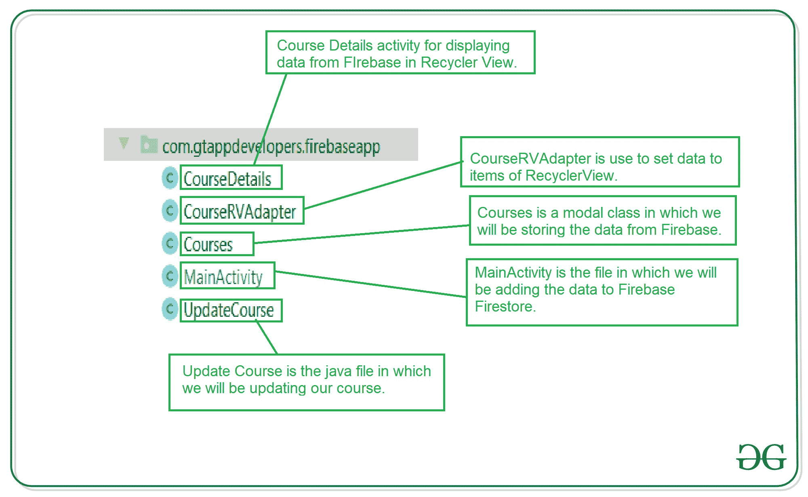
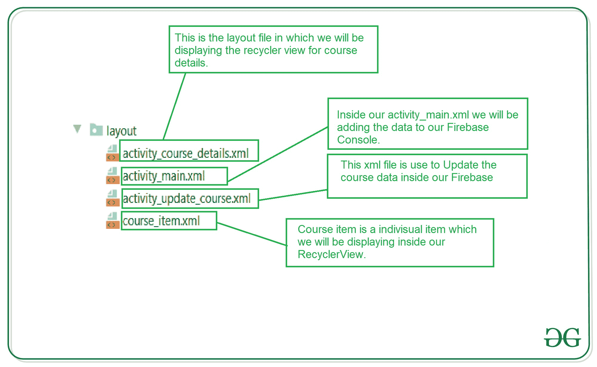

# 如何在安卓中删除 Firebase Firestore 的数据？

> 原文:[https://www . geeksforgeeks . org/如何从 firebase-firestore-in-android 中删除数据/](https://www.geeksforgeeks.org/how-to-delete-data-from-firebase-firestore-in-android/)

在之前的文章中，我们已经在安卓 Firebase Firestore 中看到了如何[添加数据](https://www.geeksforgeeks.org/create-and-add-data-to-firebase-firestore-in-android/)[读取数据](https://www.geeksforgeeks.org/how-to-read-data-from-firebase-firestore-in-android/)[更新数据](https://www.geeksforgeeks.org/how-to-update-data-in-firebase-firestore-in-android/)。现在我们将看到**如何在 Firebase Firestore** 中删除这些添加的数据。因此，我们将在 Android Firebase 中实现这种删除数据的方法。

**本文我们要构建什么？**

我们将在更新数据的更新屏幕中添加一个简单的按钮，在该屏幕中，我们将添加一个删除课程的新按钮。删除后，该课程将从我们的数据库中删除。

### **分步实施**

**第一步:新建删除 activity_update_course.xml 文件内数据的按钮**

因为我们在上一篇文章中创建了新的更新课程活动。所以我们将简单地给它添加一个新按钮。将以下代码片段添加到**activity _ update _ course . XML**文件中。

## 可扩展标记语言

```
<!--Button for deleting our course-->
<Button
  android:id="@+id/idBtnDeleteCourse"
  android:layout_width="0dp"
  android:layout_height="wrap_content"
  android:layout_margin="10dp"
  android:layout_weight="1"
  android:text="Delete Course"
  android:textAllCaps="false" />
```

以下是**activity _ update _ course . XML**文件的更新代码。

## 可扩展标记语言

```
<?xml version="1.0" encoding="utf-8"?>
<LinearLayout
    xmlns:android="http://schemas.android.com/apk/res/android"
    xmlns:tools="http://schemas.android.com/tools"
    android:layout_width="match_parent"
    android:layout_height="match_parent"
    android:orientation="vertical"
    tools:context=".UpdateCourse">

    <!--Edittext for getting course Name-->
    <EditText
        android:id="@+id/idEdtCourseName"
        android:layout_width="match_parent"
        android:layout_height="wrap_content"
        android:layout_marginStart="10dp"
        android:layout_marginTop="20dp"
        android:layout_marginEnd="10dp"
        android:hint="Course Name"
        android:importantForAutofill="no"
        android:inputType="text" />

    <!--Edittext for getting course Duration-->
    <EditText
        android:id="@+id/idEdtCourseDuration"
        android:layout_width="match_parent"
        android:layout_height="wrap_content"
        android:layout_marginStart="10dp"
        android:layout_marginTop="20dp"
        android:layout_marginEnd="10dp"
        android:hint="Course Duration in min"
        android:importantForAutofill="no"
        android:inputType="time" />

    <!--Edittext for getting course Description-->
    <EditText
        android:id="@+id/idEdtCourseDescription"
        android:layout_width="match_parent"
        android:layout_height="wrap_content"
        android:layout_marginStart="10dp"
        android:layout_marginTop="20dp"
        android:layout_marginEnd="10dp"
        android:hint="Course Description"
        android:importantForAutofill="no"
        android:inputType="text" />

    <LinearLayout
        android:layout_width="match_parent"
        android:layout_height="wrap_content"
        android:orientation="horizontal"
        android:weightSum="2">

        <!--Button for updating your course to Firebase-->
        <Button
            android:id="@+id/idBtnUpdateCourse"
            android:layout_width="0dp"
            android:layout_height="wrap_content"
            android:layout_margin="10dp"
            android:layout_weight="1"
            android:text="Update Course"
            android:textAllCaps="false" />

        <!--Button for deleting our course-->
        <Button
            android:id="@+id/idBtnDeleteCourse"
            android:layout_width="0dp"
            android:layout_height="wrap_content"
            android:layout_margin="10dp"
            android:layout_weight="1"
            android:text="Delete Course"
            android:textAllCaps="false" />

    </LinearLayout>

</LinearLayout>
```

**第二步:现在我们必须在 UpdateCourses.java 文件** **中初始化这个按钮，并在其中添加 onClickListner**

转到**UpdateCourses.java**文件，添加以下代码片段。

## Java 语言(一种计算机语言，尤用于创建网站)

```
// adding on click listener for delete button
deleteBtn.setOnClickListener(new View.OnClickListener() {
            @Override
            public void onClick(View v) {
                // calling method to delete the course.
                deleteCourse(courses);
        }
  });

private void deleteCourse(Courses courses) {
        // below line is for getting the collection
        // where we are storing our courses.
        db.collection("Courses").
                // after that we are getting the document
                // which we have to delete.
                document(courses.getId()).

                // after passing the document id we are calling
                // delete method to delete this document.
                delete().
                        // after deleting call on complete listener
                        // method to delete this data.
                        addOnCompleteListener(new OnCompleteListener<Void>() {
                    @Override
                    public void onComplete(@NonNull Task<Void> task) {
                        // inside on complete method we are checking
                        // if the task is success or not.
                        if (task.isSuccessful()) {
                            // this method is called when the task is success
                            // after deleting we are starting our MainActivity.
                            Toast.makeText(UpdateCourse.this, "Course has been deleted from Database.", Toast.LENGTH_SHORT).show();
                            Intent i = new Intent(UpdateCourse.this, MainActivity.class);
                            startActivity(i);
                        } else {
                            // if the delete operation is failed
                            // we are displaying a toast message.
                            Toast.makeText(UpdateCourse.this, "Fail to delete the course. ", Toast.LENGTH_SHORT).show();
                        }
                 }
         });
 }
```

以下是**UpdateCourses.java**文件的更新代码。

## Java 语言(一种计算机语言，尤用于创建网站)

```
import android.content.Intent;
import android.os.Bundle;
import android.text.TextUtils;
import android.view.View;
import android.widget.Button;
import android.widget.EditText;
import android.widget.Toast;

import androidx.annotation.NonNull;
import androidx.appcompat.app.AppCompatActivity;

import com.google.android.gms.tasks.OnCompleteListener;
import com.google.android.gms.tasks.OnFailureListener;
import com.google.android.gms.tasks.OnSuccessListener;
import com.google.android.gms.tasks.Task;
import com.google.firebase.firestore.FirebaseFirestore;

public class UpdateCourse extends AppCompatActivity {

    // creating variables for our edit text
    private EditText courseNameEdt, courseDurationEdt, courseDescriptionEdt;

    // creating a strings for storing our values from Edittext fields.
    private String courseName, courseDuration, courseDescription;

    // creating a variable for firebasefirestore.
    private FirebaseFirestore db;

    @Override
    protected void onCreate(Bundle savedInstanceState) {
        super.onCreate(savedInstanceState);
        setContentView(R.layout.activity_update_course);
        Courses courses = (Courses) getIntent().getSerializableExtra("course");

        // getting our instance from Firebase Firestore.
        db = FirebaseFirestore.getInstance();

        // initializing our edittext and buttons
        courseNameEdt = findViewById(R.id.idEdtCourseName);
        courseDescriptionEdt = findViewById(R.id.idEdtCourseDescription);
        courseDurationEdt = findViewById(R.id.idEdtCourseDuration);

        // creating variable for button
        Button updateCOurseBtn = findViewById(R.id.idBtnUpdateCourse);
        Button deleteBtn = findViewById(R.id.idBtnDeleteCourse);

        courseNameEdt.setText(courses.getCourseName());
        courseDescriptionEdt.setText(courses.getCourseDescription());
        courseDurationEdt.setText(courses.getCourseDuration());

        // adding on click listener for delete button
        deleteBtn.setOnClickListener(new View.OnClickListener() {
            @Override
            public void onClick(View v) {
                // calling method to delete the course.
                deleteCourse(courses);
            }
        });

        updateCOurseBtn.setOnClickListener(new View.OnClickListener() {
            @Override
            public void onClick(View v) {
                courseName = courseNameEdt.getText().toString();
                courseDescription = courseDescriptionEdt.getText().toString();
                courseDuration = courseDurationEdt.getText().toString();

                // validating the text fields if empty or not.
                if (TextUtils.isEmpty(courseName)) {
                    courseNameEdt.setError("Please enter Course Name");
                } else if (TextUtils.isEmpty(courseDescription)) {
                    courseDescriptionEdt.setError("Please enter Course Description");
                } else if (TextUtils.isEmpty(courseDuration)) {
                    courseDurationEdt.setError("Please enter Course Duration");
                } else {
                    // calling a method to update our course.
                    // we are passing our object class, course name,
                    // course description and course duration from our edittext field.
                    updateCourses(courses, courseName, courseDescription, courseDuration);
                }
            }
        });
    }

    private void deleteCourse(Courses courses) {
        // below line is for getting the collection
        // where we are storing our courses.
        db.collection("Courses").
                // after that we are getting the document
                // which we have to delete.
                document(courses.getId()).

                // after passing the document id we are calling
                // delete method to delete this document.
                delete().
                        // after deleting call on complete listener
                        // method to delete this data.
                        addOnCompleteListener(new OnCompleteListener<Void>() {
                    @Override
                    public void onComplete(@NonNull Task<Void> task) {
                        // inside on complete method we are checking
                        // if the task is success or not.
                        if (task.isSuccessful()) {
                            // this method is called when the task is success
                            // after deleting we are starting our MainActivity.
                            Toast.makeText(UpdateCourse.this, "Course has been deleted from Database.", Toast.LENGTH_SHORT).show();
                            Intent i = new Intent(UpdateCourse.this, MainActivity.class);
                            startActivity(i);
                        } else {
                            // if the delete operation is failed
                            // we are displaying a toast message.
                            Toast.makeText(UpdateCourse.this, "Fail to delete the course. ", Toast.LENGTH_SHORT).show();
                        }
                    }
                });
    }

    private void updateCourses(Courses courses, String courseName, String courseDescription, String courseDuration) {
        // inside this method we are passing our updated values
        // inside our object class and later on we
        // will pass our whole object to firebase Firestore.
        Courses updatedCourse = new Courses(courseName, courseDescription, courseDuration);

        // after passing data to object class we are
        // sending it to firebase with specific document id.
        // below line is use to get the collection of our Firebase Firestore.
        db.collection("Courses").
                // below line is use toset the id of
                // document where we have to perform
                // update operation.
                document(courses.getId()).

                // after setting our document id we are
                // passing our whole object class to it.
                set(updatedCourse).

                // after passing our object class we are
                // calling a method for on success listener.
                addOnSuccessListener(new OnSuccessListener<Void>() {
                    @Override
                    public void onSuccess(Void aVoid) {
                        // on successful completion of this process
                        // we are displaying the toast message.
                        Toast.makeText(UpdateCourse.this, "Course has been updated..", Toast.LENGTH_SHORT).show();
                    }
                }).addOnFailureListener(new OnFailureListener() {
            // inside on failure method we are
            // displaying a failure message.
            @Override
            public void onFailure(@NonNull Exception e) {
                Toast.makeText(UpdateCourse.this, "Fail to update the data..", Toast.LENGTH_SHORT).show();
            }
        });
    }
}
```

**输出:**

<video class="wp-video-shortcode" id="video-542422-1" width="640" height="360" preload="metadata" controls=""><source type="video/mp4" src="https://media.geeksforgeeks.org/wp-content/uploads/20210115214934/Screenrecorder-2021-01-15-21-41-08-100.mp4?_=1">[https://media.geeksforgeeks.org/wp-content/uploads/20210115214934/Screenrecorder-2021-01-15-21-41-08-100.mp4](https://media.geeksforgeeks.org/wp-content/uploads/20210115214934/Screenrecorder-2021-01-15-21-41-08-100.mp4)</video>

### 最终项目文件结构

**以下是 Java 文件的文件结构:**



**以下是 XML 文件的文件结构:**

