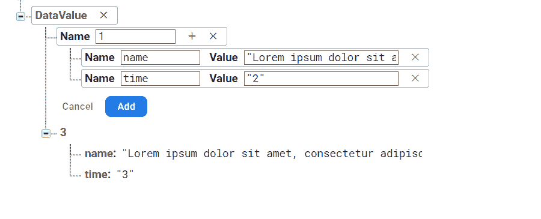
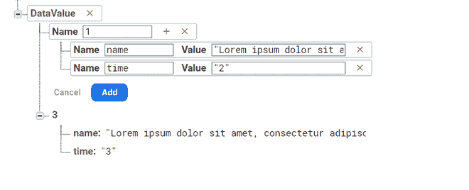

# 如何在安卓中删除 Firebase 实时数据库的数据？

> 原文:[https://www . geeksforgeeks . org/如何从 firebase-实时数据库中删除数据安卓/](https://www.geeksforgeeks.org/how-to-delete-data-from-firebase-realtime-database-in-android/)

在本文中，我们将看到如何删除我们的 Firebase 实时数据库中添加的数据。因此，我们将在 Android Firebase 中实现这种删除数据的方法。

### **本文我们要构建什么？**

当用户长时间点击[回收视图](https://www.geeksforgeeks.org/android-recyclerview/)的项目时，我们将显示一个简单的[报警框](https://www.geeksforgeeks.org/implement-different-types-of-alertbox-using-alerter-library-in-android/)。它将有两个选择。(删除并取消)。当用户点击删除时，它将简单地删除该值。可以参考[如何在安卓](https://www.geeksforgeeks.org/how-to-save-data-to-the-firebase-realtime-database-in-android/)中保存数据到 Firebase 实时数据库，了解如何在 Firebase 中保存数据。

> **注意**:可以使用 **Hashmap** 在 firebase 中保存数据。

此外，您还可以直接在 firebase 中添加数据，如下所示



### **分步实施**

**第一步:创建新项目**

要在安卓工作室创建新项目，请参考[如何在安卓工作室创建/启动新项目](https://www.geeksforgeeks.org/android-how-to-create-start-a-new-project-in-android-studio/)。注意选择 **Java** 作为编程语言。

**步骤 2:使用 activity_main.xml 文件**

导航到**应用程序> res >布局> activity_main.xml** 并将下面的代码添加到该文件中。下面是 **activity_main.xml** 文件的代码。

## 可扩展标记语言

```
<?xml version="1.0" encoding="utf-8"?>
<LinearLayout
    xmlns:android="http://schemas.android.com/apk/res/android"
    android:orientation="vertical"
    android:layout_width="match_parent"
    android:layout_height="wrap_content">

    <TextView
        android:layout_width="match_parent"
        android:layout_height="wrap_content"
        android:id="@+id/name"
        android:textSize="22sp"
        android:text="Loreum"
        android:textStyle="bold"/>

</LinearLayout>
```

**步骤 3:使用 DModel.java 文件**

转到**DModel.java**文件，参考以下代码。以下是**DModel.java**文件的代码。

## Java 语言(一种计算机语言，尤用于创建网站)

```
package com.anni.uploaddataexcelsheet;

public class DModel {
    public DModel() {
    }

    public String getTime() {
        return time;
    }

    public DModel(String time, String name) {
        this.time = time;
        this.name = name;
    }

    public void setTime(String time) {
        this.time = time;
    }

    String time;
    public DModel(String name) {
        this.name = name;
    }

    public String getName() {
        return name;
    }

    public void setName(String name) {
        this.name = name;
    }

    String name;
}
```

**步骤 4:** **处理 DAdapter.java 文件**

转到**DAdapter.java**文件，参考以下代码。以下是**DAdapter.java**文件的代码

## Java 语言(一种计算机语言，尤用于创建网站)

```
package com.anni.uploaddataexcelsheet;

import android.app.AlertDialog;
import android.content.Context;
import android.content.DialogInterface;
import android.view.LayoutInflater;
import android.view.View;
import android.view.ViewGroup;
import android.widget.TextView;

import androidx.annotation.NonNull;
import androidx.recyclerview.widget.RecyclerView;

import com.google.firebase.auth.FirebaseAuth;
import com.google.firebase.database.DataSnapshot;
import com.google.firebase.database.DatabaseError;
import com.google.firebase.database.DatabaseReference;
import com.google.firebase.database.FirebaseDatabase;
import com.google.firebase.database.Query;
import com.google.firebase.database.ValueEventListener;

import java.util.List;

public class DAdapter extends RecyclerView.Adapter {

    List<DModel> notifications;

    public DAdapter(List<DModel> notifications, Context context) {
        this.notifications = notifications;
        this.context = context;
    }

    Context context;

    @NonNull
    @Override
    public RecyclerView.ViewHolder onCreateViewHolder(@NonNull ViewGroup parent, int viewType) {
        View view= LayoutInflater.from(parent.getContext()).inflate(R.layout.row_delete,parent,false);
        return new MyHolder(view);
    }

    @Override
    public void onBindViewHolder(@NonNull final RecyclerView.ViewHolder holder, final int position) {

          // get the item value by positions
        String text=notifications.get(position).getName();
        final String time=notifications.get(position).getTime();
        ((MyHolder)holder).notification.setText(text);

          // click on item to be deleted
        ((MyHolder)holder).notification.setOnClickListener(new View.OnClickListener() {
            @Override
            public void onClick(View v) {
                CharSequence options[]=new CharSequence[]{
                          // select any from the value
                        "Delete",
                        "Cancel",
                };
                AlertDialog.Builder builder=new AlertDialog.Builder(holder.itemView.getContext());
                builder.setTitle("Delete Content");
                builder.setItems(options, new DialogInterface.OnClickListener() {
                    @Override
                    public void onClick(DialogInterface dialog, int which) {
                          // if delete option is choosed
                          // then call delete function
                        if(which==0) {
                            delete(position,time);
                        }

                    }
                });
                builder.show();
            }
        });

    }

    private void delete(int position, String time) {
          // creating a variable for our Database
        // Reference for Firebase.
        DatabaseReference dbref= FirebaseDatabase.getInstance().getReference().child("DataValue");
      // we are use add listerner
      // for event listener method
      // which is called with query.  
      Query query=dbref.child(time);
        query.addListenerForSingleValueEvent(new ValueEventListener() {
            @Override
            public void onDataChange(@NonNull DataSnapshot dataSnapshot) {
                // remove the value at reference
                dataSnapshot.getRef().removeValue();
            }

            @Override
            public void onCancelled(@NonNull DatabaseError databaseError) {

            }
        });
    }

    @Override
    public int getItemCount() {
        return notifications.size();
    }
    class MyHolder extends RecyclerView.ViewHolder{

        TextView notification;
        public MyHolder(@NonNull View itemView) {
            super(itemView);
            notification=itemView.findViewById(R.id.name);
        }
    }
}
```

**步骤 6:使用 MainActivity.java 文件**

转到**MainActivity.java**文件，参考以下代码。以下是**MainActivity.java**文件的代码

## Java 语言(一种计算机语言，尤用于创建网站)

```
import androidx.annotation.NonNull;
import androidx.appcompat.app.AppCompatActivity;
import androidx.recyclerview.widget.LinearLayoutManager;
import androidx.recyclerview.widget.RecyclerView;

import android.os.Bundle;

import com.google.firebase.database.DataSnapshot;
import com.google.firebase.database.DatabaseError;
import com.google.firebase.database.DatabaseReference;
import com.google.firebase.database.FirebaseDatabase;
import com.google.firebase.database.ValueEventListener;

import java.util.ArrayList;
import java.util.List;

public class DeleteData extends AppCompatActivity {
    List<DModel> notifications;
    DAdapter adapterNotification;

    RecyclerView recyclerView;
    @Override
    protected void onCreate(Bundle savedInstanceState) {
        super.onCreate(savedInstanceState);
        setContentView(R.layout.activity_delete_data);

        // Initialise layout
        recyclerView=findViewById(R.id.recyclerview);
        LinearLayoutManager linearLayoutManager=new LinearLayoutManager(DeleteData.this);

        // reverse tha layout
        linearLayoutManager.setReverseLayout(true);
        recyclerView.setHasFixedSize(true);
        recyclerView.setLayoutManager(linearLayoutManager);
        notifications=new ArrayList<>();

         // creating a variable for our Database
        // Reference for Firebase.
        DatabaseReference reference= FirebaseDatabase.getInstance().getReference("DataValue");

      // we are using add value event listener method
      // which is called with database reference.
      reference.addValueEventListener(new ValueEventListener() {
            @Override
            public void onDataChange(@NonNull DataSnapshot dataSnapshot) {
                // clear the data
                notifications.clear();
                for (DataSnapshot dataSnapshot1:dataSnapshot.getChildren()) {
                    DModel modelNotification = dataSnapshot1.getValue(DModel.class);
                    notifications.add(modelNotification);
                    adapterNotification = new DAdapter(notifications,DeleteData.this);
                    // set the adapter
                    recyclerView.setAdapter(adapterNotification);
                    adapterNotification.notifyDataSetChanged();
                }
            }

            @Override
            public void onCancelled(@NonNull DatabaseError databaseError) {

            }
        });
    }
}
```

**数据库结构**



**输出:**

<video class="wp-video-shortcode" id="video-618858-1" width="640" height="360" preload="metadata" controls=""><source type="video/mp4" src="https://media.geeksforgeeks.org/wp-content/uploads/20210421000648/deleted.mp4?_=1">[https://media.geeksforgeeks.org/wp-content/uploads/20210421000648/deleted.mp4](https://media.geeksforgeeks.org/wp-content/uploads/20210421000648/deleted.mp4)</video>